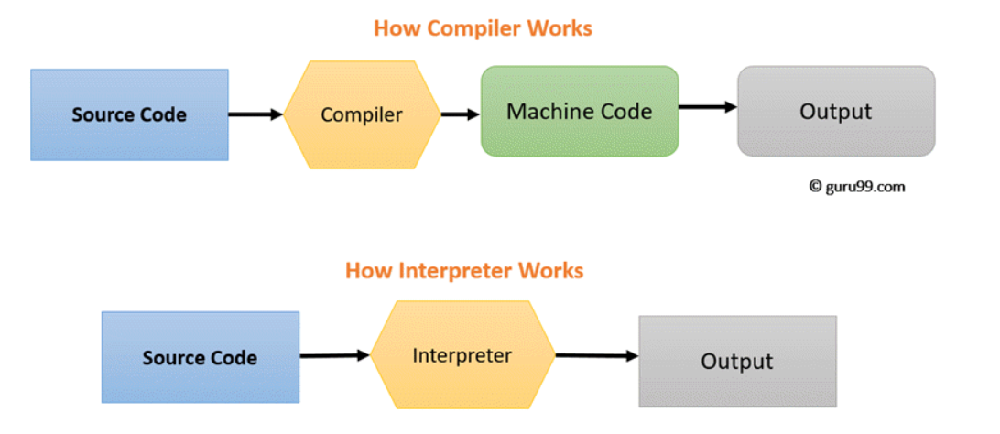

### Javascript

어제 공부했던 변수를 이어서 객체와 copy by value와 copy by reference에 대한 공부를 했다.

#### 객체

객체는 key와 value로 이루어진 자료형으로 자바스크립트에서 primitive 자료형을 제외한 함수, 배열과 같은 모든 자료형이 객체로 이루어져있다고 할 수 있다.

```javascript
const obj = { name: "Youngjun Choi" }
```

객체는 어떠한 데이터와 관련된 상태(property)와 행동(method) 으로 구성되어있다. 객체는 원시형 데이터들에 비해 크기가 크기 때문에 메모리 cell에 직접 저장되어있는 것이 아니라 Heap에 저장되어있고 객체를 저장한 변수에는 저장되어있는 주소가 저장되어 있다. 그렇기에 앞서 공부했던 자료형들과 다르게 작동한다.



[출처:https://charming-kyu.tistory.com/19]

#### Copy by value

```javascript
let a = "a"
let b = a //b=1
b = "b" //b=3,a=1
```

a의 값을 b가 복사한 후에 b의 값을 변경했을 때, a는 영향을 받지 않는다.

그 이유는 a에는 "a"라는 값 자체가 메모리 셀에 저장되었고, 값이 복사되어 b에 할당되었기 때문이다.

#### Copy by Reference

```javascript
let a = { firstName: "Youngjun", lastName: "Choi" } //a는 오브젝트의 주소값을 저장
let b = a //b에 오브젝트의 주소값을 복사
b.lastName = "Park" //b={firstName:"Youngjun",lastName:"Park"}, a={firstName:"Youngjun",lastName:"Park"}
```

위와 달리 object의 주소값을 저장하던 a의 값을 복사한 후에 b의 값을 변경했을 때, 다른 결과를 나타낸다.

b의 값을 변경했지만 같은 주소의 오브젝트를 가리키고 있던 a의 값 또한 변했다.

이러한 Object의 특성을 제대로 이해하고 보니 리액트에서의 useState와 같은 상태를 다룰 때 "왜 리랜더링을 위해서 오브젝트나 배열을 새로 할당해주어야 하는지"를 제대로 이해할 수 있었다. 상태 내의 값을 바꿀 경우, 주소값을 동일하게 저장하고 있어 브라우저입장에서는 상태가 바뀐 줄 알 수 없기 때문이었다.

그냥 이렇게 해야하는게 아니라 왜 해야하는지 조금씩 납득이 되어가고 더 깊이 이해할 수 있었다.
