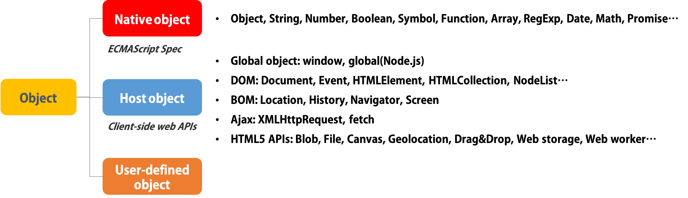
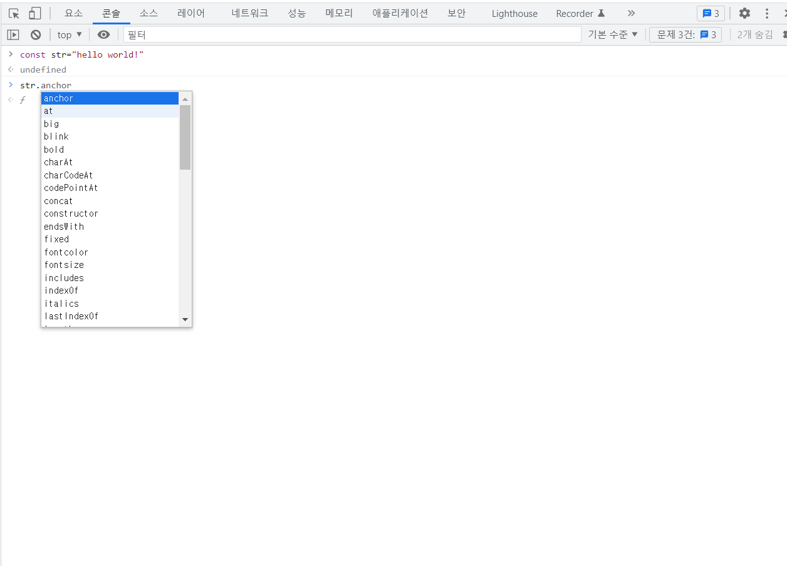

객체에는 크게 세 가지로 나뉠 수 있다. 위 그림의 사용자가 정의한 <b>사용자 정의 객체</b>, 브라우저나 node 객체인 <b>Host 객체</b>, 그리고 오늘 정리해볼 <b>Built-in 객체</b> 이다. 빌트인 객체는 자바스크립트 자체적인 객체로 클래스 레벨의 객체를 이용해 객체를 직접 만들지 않고, 바로 사용할 수 있다.

## 1) Wrapper 객체

앞서 정리해온 원시형 자료형들 (문자열, 숫자, 불리언 등) 을 사용할 때, 변수에 "."을 붙이면 자동으로 자료형이 사용할 수 있는 메소드가 뜨는걸 볼 수 있다. 원시형 자료형을 선언해도 객체처럼 불러올 수 있는 이유에는, 바로 "."을 사용하면 변수의 자료형에 맞는 wrapper 객체가 감싸지기 때문이다.


사진에서 간단하게 str이란 변수를 누르고 "."을 누르면 String wrapper 객체의 다양한 메소드를 사용할 수 있음을 볼 수 있다.

## 2. Global 객체

전역 객체라고 불리는 "globalThis"는 Host에 따라 달라진다. 브라우저의 경우는 window를 지칭하고 node의 경우에 module을 가리킨다. 이러한 전역객체가 가지고 있는 메소드는 변수 선언 없이 바로 함수를 사용할 수 있다.

```javascript
isFinite(Infinity) //True
parseInt("12,43") //12 (문자열을 숫자로 바꿔줘)
```

## 3. Boolean 객체

```javascript
const Truthy = new Boolean(true)
consol.log(Truthy) //Boolean {true}
```

위 코드처럼 객체로 변수를 만들 수 있지만 객체는 원시형 자료형들에 비해 메모리를 많이 차지하기 때문에 그냥 사용하는 게 더 효율이 좋다.

## 4. Number 객체

```javascript
const num = 1234.5678
console.log(Number.isNaN(num)) //false
console.log(num.toFixed(3)) //1234.568 (소숫점아래 세자리까지 반올림 표현)
console.log(num.toLocaleString("en-US")) //1,234.568 (미국기준 단위 표기로 표현)
```

유용해 보였던 메소드 세가지를 정리해 보았다.

1.  isNaN: 'Not a Number'가 맞는 지 확인할 수 있다.
2.  toFixed(소숫점 아래 자릿수): 소수를 표현할 때 원하는 자릿수까지 반올림
3.  toLocaleString: 원하는 지역의 단위 표기법으로 숫자 표기

## 5. Math 객체

```javascript
Math.abs(-100) //100
Math.ceil(3.5) //4
Math.floor(3.5) //3
Math.round(3.5) //4
Math.trunc(1.543) //1
Math.max(4, 5, 6, 7, 8) //8
Math.min(4, 5, 6, 7, 8) //4
Math.sqrt(25) //5
Math.random() //0.23028324902271824
```

자바스크립트를 배우면서 가장 많이 썼던 빌트인 객체라 하면 Math 객체라고 할 것 같다. 위의 코드에 사용된 메소드를 정리하면 다음과 같다.

1. Math.abs(num) : 절댓값
2. Math.ceil(num) : 올림
3. Math.floor(num) : 내림
4. Math.round(num) : 반올림
5. Math.trunc(num) : 정수만 표현
6. Math.max(num1,num2, ...) : 전달 받은 여러 숫자 중 최댓값
7. Math.min(num1,num2, ...) : 전달 받은 여러 숫자 중 최솟값
8. Math.sqrt(num): 제곱근
9. Math.random(): 0과 1사이의 랜덤한 값

Math.random의 경우 0과 1사이의 랜덤한 값을 반환하기 때문에 원하는 영역의 값을 반환하고 싶다면 다음과 같이 사용 가능하다.

```javascript
function getRandomNum(min, max) {
  return Math.random() * (max - min) + min
}
```

## 6. String 객체

```javascript
const text = "Good night"
console.log(text.charAt(4)) //""
console.log(text.indexOf("l")) //-1
console.log(text.indexOf("o")) //1
console.log(text.lastIndexOf("o")) //2
console.log(text.includes("ight")) //true
console.log(text.startsWith("go")) //false
console.log(text.endsWith("ght")) //true
console.log(text.toUpperCase()) //"GOOD NIGHT"
console.log(text.toLowerCase()) //"good night"
console.log(text.substring(0, 3)) //"Goo"
console.log(text.slice(2, 6)) //"od n"
console.log(text.trim()) //undefined
const text2 = "      hi     "
console.log(text2.trim()) //"hi"
console.log(text.split(" ")) //["Good","night"]
```

string 객체의 메소드는 코딩테스트를 공부하고 정규표현식을 공부하면서 조금씩 익숙해지고 있는 것 같다. 유용한 메소드들을 정리해보면 다음과 같다.

1. text.charAt(idx): index에 해당하는 문자열
2. text.indexOf(char): 처음부터 문자열에서 원하는 문자를 찾고 인덱스 반환, 없으면 -1
3. text.lastIndexOf(char): 마지막부터 문자열에서 원하는 문자찾고 인덱스 반환, 없으면 -1
4. text.includes(str): 문자열에서 str을 포함하는지 True/False
5. text.startsWith(str): 문자열이 str로 시작하는지 True/False
6. text.endsWith("ght"): 문자열이 str로 끝나는지 True/False
7. text.toUpperCase(): 문자열을 대문자로
8. text.toLowerCase(): 문자열을 소문자로
9. text.substring(start,end):인덱스에 맞게 start부터 end-1까지 부분 문자열
10. text.slice(2,6):인덱스에 맞게 start부터 end-1까지 부분 문자열을 잘라
11. text.trim(): 문자열 내 빈 문자열을 제거하는데 문자열 사이의 " "는 제거하지 않아
12. text.split(base): base를 기준으로 문자열을 잘라 배열로 반환

## 7. Date 객체

```javascript
const date = new Date() //Mon Sep 17 2022 03:04:41 GMT+0900 (한국 표준시)
new Date("Feb 5,2011") //Sat Feb 05 2011 00:00:00 GMT+0900 (한국 표준시)
new Date("2011-2-5") //Sat Feb 05 2011 00:00:00 GMT+0900 (한국 표준시)
Date.now() //1663524375771
console.log(date.getFullYear()) //2022
console.log(date.getMonth()) //8
console.log(date.getDate()) //17
console.log(date.getDay()) //6
console.log(date.toString()) //Sat Sep 17 2022 03:07:40 GMT+0900 (한국 표준시)
console.log(date.toLocaleString("en-US")) //9/17/2022, 3:07:40 AM
```

Date 객체에서 주로 사용했던 method는 Date.now()로, 컴포넌트나 객체의 값에 id로 전달할 때 자주 사용했다. Date 객체는 자체적으로 시간을 반환하고 객체에 알맞은 문자열의 시간을 넣으면, 그에 해당하는 시간을 반환한다. 유용한 메소드는 다음과 같이 정리된다.

1.  Date.now(): 현재 시간을 1970년 1월 1일부터 UTC 기준으로 ms단위로 보여준다.

2.  date.getFullYear: 년도
3.  date.getMonth: 0부터 1월로, 11은 12월까지 나타내
4.  date.getDate(): 1일부터 31일까지
5.  date.getDay(): 0부터 일요일로, 6은 토요일
6.  date.toString(): 날짜를 문자열로 반환
7.  date.toLocaleString(location): 지역에 맞게 날짜를 문자열로 반환

toLocaleString같은 경우 사용자가 다른 지역에 있을 경우 유용하게 쓸 수 있을 거라 생각이 되었다.

### 마치며

너무 편하게 써왔지만 왜 원시형 변수에 "."을 찍고 함수를 사용할 수 있는지 고민을 안 했었다. 이제 왜를 알게 되어서 사용할 때 더 깊이 이해하고 사용할 수 있을 것 같다.
