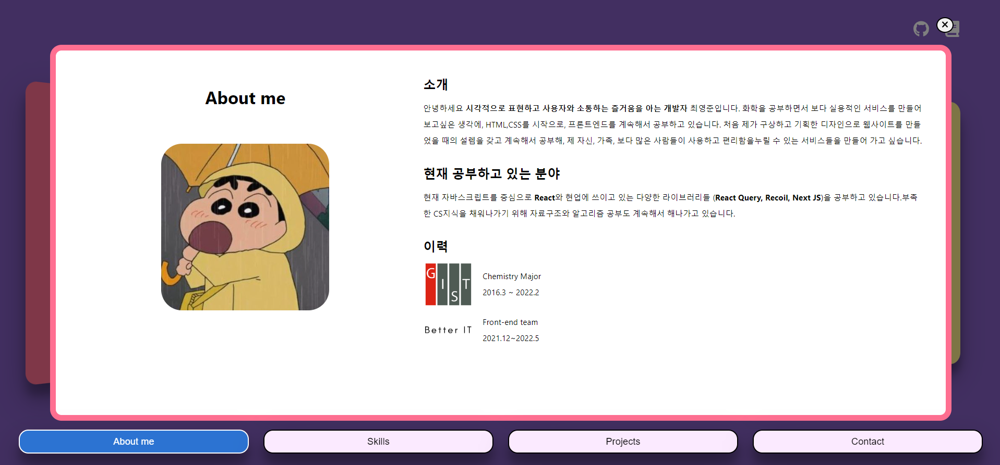
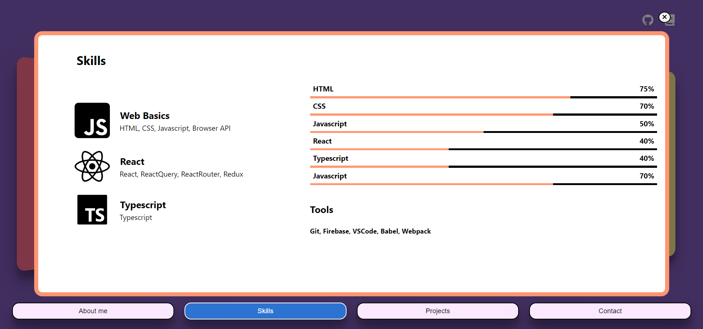
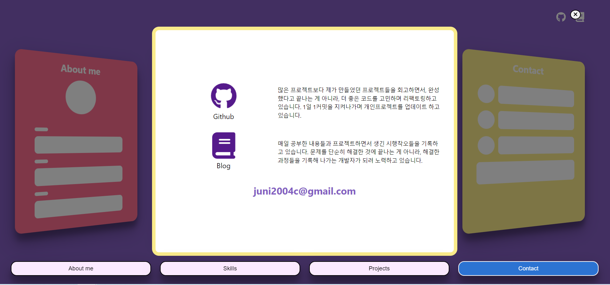

## 1) Navbar & Card 와 상태 연결

어제 했던 기획에 이어 추가적으로 상태와 상태에 따른 버튼 로직을 연결해주었다. 간단하게 main에 selectedSection이란 상태를 만들고 setSelectedSection으로 클릭된 버튼이나 카드에 따라 상태를 변경 해주는 로직이다.

```javascript
function Main(props) {
  const [selectedSection, setSelectedSection] = useState(null);
  const onClick = (event) => {
    const {
      dataset: { section },
    } = event.currentTarget;
    console.log(section);
    setSelectedSection(section);
  };
  return (
    <MainLayout>
      <Header></Header>
      <List>
        <SectionBox data-section={'About me'} onClick={onClick}>
          <AboutPreview></AboutPreview>
        </SectionBox>
        <SectionBox data-section='Skills' onClick={onClick}>
          <SkillsPreview />
        </SectionBox>
        <SectionBox data-section='Projects' onClick={onClick}>
          <ProjectsPreview></ProjectsPreview>
        </SectionBox>
        <SectionBox data-section='Contact' onClick={onClick}>
          <ContactPreview></ContactPreview>
        </SectionBox>
      </List>
      <Navbar selected={selectedSection} setSelected={setSelectedSection} />
    </MainLayout>
  );
}

export default Main;
```

간단하게 추가한 로직이지만 조금 의문이 들었던 점은 Javascript로만 개발할 때는 **부모 component 하나에 이벤트 위임**을 해서 자식 tag에 dataset의 값을 받아오는 식으로 연결이 가능했는데, react에서는 불가능했다.

그래서 우선은 일일이 SectionBox component에게 이벤트핸들러를 전달해주고, 각 component의 data-set을 받아와서 상태를 업데이트 해주었다.

동일한 로직이 Navbar의 버튼들에도 적용하기 위해 prop으로 각각 전달해주었다. 이때 NavButton에도 일일이 전달해주고 싶지 않아 컴포넌트 밖에 전달해줄 정보를 담은 배열을 만들고 mapping으로 component를 만들어 코드 중복을 줄였다. 리액트 함수형 component는 렌더링 되면서 처음부터 다시 함수 내부를 실행하기 때문에 새로 업데이트가 필요없을 것 같아, 배열을 컴포넌트 밖에 만들어 두었다.

```javascript
const buttons = ['About me', 'Skills', 'Projects', 'Contact'];

function Navbar({ selected, setSelected }) {
  console.log(selected);
  return (
    <NavbarLayout>
      {buttons.map((button) => (
        <NavButton
          key={button}
          name={button}
          selected={button === selected}
          setSelected={setSelected}
        ></NavButton>
      ))}
    </NavbarLayout>
  );
}

export default Navbar;
```

## 2. About me, SKills, Contact 스타일링과 애니메이션

애니메이션은 react 애니메이션 라이브러리인 <b>Framer Motion</b>을 이용해서 연결해주었다. Overlay component가 click 이벤트에 따라 없어졌다가 생겼다 해야하기 때문에 AnimatePresence를 이용해서 연결했다.

```javascript
const overlayVariant = {
  invisible: {
    opacity: 0,
    transition: {
      duration: 1,
    },
  },
  visible: {
    opacity: 1,
  },
  exit: {
    opacity: 0,
  },
};

function Overlay({ selected, setSelected }) {
  const onClick = () => setSelected(null);
  return (
    <OverlayLayout
      // onClick={onClick}
      variants={overlayVariant}
      initial='invisible'
      animate='visible'
      exit='exit'
    >
      <ExitBtn onClick={onClick}>
        <i className='fa-solid fa-xmark'></i>
      </ExitBtn>
      {selected === 'About me' && <About></About>}
      {selected === 'Skills' && <Skills></Skills>}
    </OverlayLayout>
  );
}

export default Overlay;
```

About me 페이지를 만들면서 이미지를 불러올 수 없어서 조금 애먹었지만 [indol.log](https://velog.io/@ingdol2/React-image-%EA%B2%BD%EB%A1%9C-%EC%84%A4%EC%A0%95%ED%95%98%EA%B8%B0) 님블로그를 참고해서 해결할 수 있었다.

알고보니 img폴더를 root폴더에 두고 있어서 경로 설정자체가 잘못 되어있었다. Create-React-App에서 경로를 불러올 때는 **src폴더에 있을 때는 import로**, **public 폴더는 서버에서 불러올 수 있기 때문에 import없이 주소를 직접 사용**이 가능하다고 한다. Webpack을 공부하면서 배웠었던 부분인데 다시 공부가 필요하다고 느꼈다.

작업을 하면서 간단하게 스타일링을 할 수 있을 것 같았는데 생각보다 오래걸려, 리액트보다 Styled Component를 더 많이 쓴 것 같다는 아쉬움이 남는다.

내일은 프로젝트를 작업하면서 직접 라이브러리를 사용하지 않고 슬라이더를 만들어보고, Home 페이지도 연결하면서 React에 대해서 더 공부해볼 예정이다.




