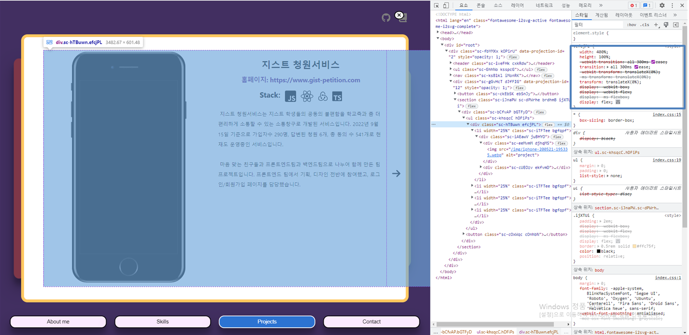
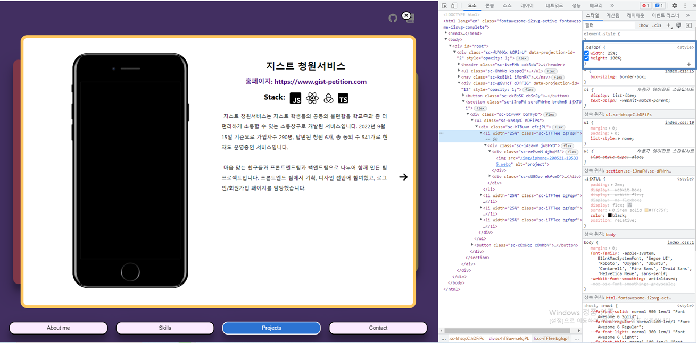
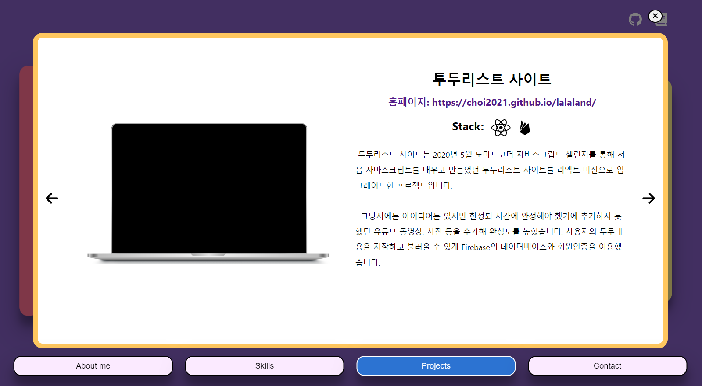
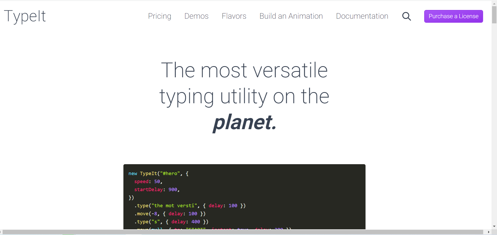
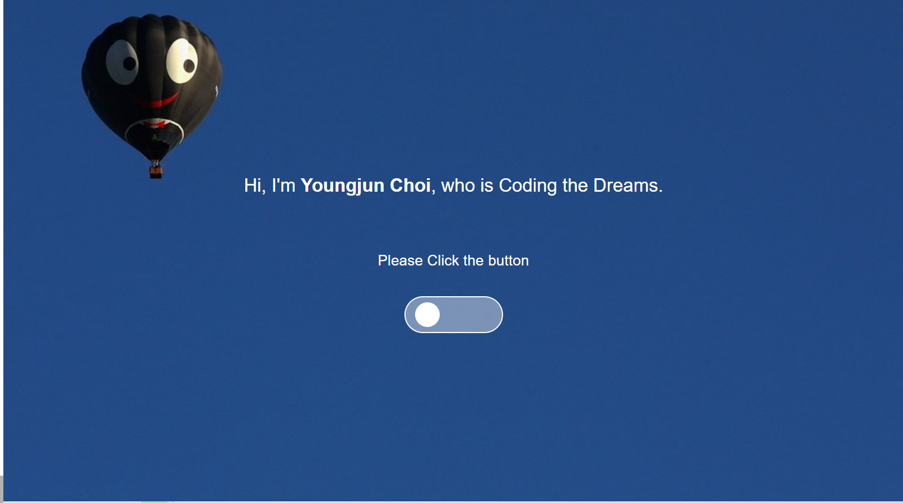

어제에 이어 포트폴리오 Main화면을 완성했다. 4가지 섹션중에서 Projects만 남았었고, Home화면만 추가해주면 기획했던 모든 부분을 완성하기에 오늘 안에 최대한 마무리 해보려 했다.

## 1) Projects 페이지 제작

Projects는 슬라이더를 통해 프로젝트에 대한 설명과 사진을 보여주게 디자인했었다. 슬라이더 기능을 위해서는 총 3가지 로직이 필요했다.

1. useEffect를 통해서 local의 json의 내용들을 불러와 전체 프로젝트에 넣어주기
2. 받아온 전체 프로젝트를 SliderItem에 mapping하기
3. 현재 보여주고 있는 프로젝트를 상태로 저장하고 왼쪽 오른쪽 버튼에 따라 업데이트 해주기

### 1.1 Local json 불러오기

Local의 json파일의 데이터를 불러오는 것은 크게 어렵지 않았다. 하지만 데이터 자체를 컴포넌트에 전달해줄 때, 이미지의 주소나 텍스트 내용들을 내가 생각한 형식에 맞게 전달하는데 시간이 오래 걸렸다.

이미지 주소 문제는 어제 src파일로 img폴더를 옮겨 해결했다고 생각했었지만, 이미지의 주소 값을 json으로 불러와 prop으로 전달해주면서 import로 이미지를 전달하던 방식을 사용할 수 없었다. 그래서 **public으로 img폴더를 옮겨** 해결했다. 이 부분은 블로그( [chacha912.log](https://velog.io/@rimo09/React-Create-react-app-%ED%94%84%EB%A1%9C%EC%A0%9D%ED%8A%B8%EC%97%90%EC%84%9C-%EC%9D%B4%EB%AF%B8%EC%A7%80-%EA%B2%BD%EB%A1%9C%EB%A5%BC-%EC%84%A4%EC%A0%95%ED%95%98%EB%8A%94-4%EA%B0%80%EC%A7%80-%EB%B0%A9%EB%B2%95) )를 다시 보면서 수정했다.

코드 중복을 줄이기 위해 **SliderItem** 컴포넌트를 만들어서 json으로 불러온 projects 배열을 mapping하는 방법으로 코드를 구성했다. prop으로 데이터만 잘 전달해주면 될 것 같았지만 **description**부분이 줄바꿈도 깨지고 원래 형식이 지켜지지 않았다.`(백틱)으로 문자열을 json에 저장하면 줄바꿈이 유지될 것 같아 시도해봤지만 json자체에 에러가 발생했고, 따옴표 밖에 사용할 수 없었다. 한줄로 description에 적절하게 **"\\n" (줄바꿈)**을 넣어서 구분해주었다.

줄바꿈하고 나면 형식이 지켜져서 나올 거라 생각했지만 p태그로 감싸져 있어서 형식이 지켜지지 않아 **`<pre>`태그**로 바꾸었더니 내가 생각했던 대로 전달된 것을 볼 수 있었다.

```jsx

//projects.json
{
  "projects": [
    {
      "id": 0,
      "src": "/img/iphone-200521-195335.webp",
      "title": "지스트 청원서비스",
      "url": "https://www.gist-petition.com",
      "stacks": ["react", "typescript", "redux", "javascript"],
      "description": " 지스트 청원서비스는~
    },
   ...
}

//SliderItem
function SliderItem({ src, title, url, stacks, description, length }) {
  return (
    <SliderLayout width={`${100 / length}%`}>
      <SliderContainer>
        <PreviewBox>
          
        </PreviewBox>
        <TextBox>
          <h1>{title}</h1>
          <a href={url}>홈페이지: {url}</a>
          <IconList>
            <h3>Stack: </h3>
            {stacks.find((item) => item == 'javascript') && (
              <i className='fa-brands fa-square-js'></i>
            )}
            {stacks.find((item) => item == 'react') && (
              <i className='fa-brands fa-react'></i>
            )}
            {stacks.find((item) => item == 'redux') && <SiRedux />}
            {stacks.find((item) => item == 'typescript') && <SiTypescript />}
            {stacks.find((item) => item == 'firebase') && <SiFirebase />}
          </IconList>
          <pre>{description}</pre>
        </TextBox>
      </SliderContainer>
    </SliderLayout>
  );
}

export default SliderItem;
```

## 1.2 슬라이더 제작

슬라이더를 **framer motion**을 이용하면 크게 어려움 없이 만들 수 있었지만 리액트로 만들어본 적이 없어서, 자체적으로 만들어보았다. 처음에 json으로 받아온 프로젝트 배열의 아이템 중 현재 보여주고 있는 상태, **Showing의 id** 와 같은 프로젝트만 불러와 보여주게 코드를 구성했다. 자연스럽게 버튼에 showing의 값을 올리고 내리면서 보여 줄 프로젝트를 업데이트 할 수는 있었지만 보여주고 있는 프로젝트 외에는 렌더링 트리에 없기 때문에 애니메이션을 적용할 수 없겠다는 생각이 들어 수정이 필요했다.

애니메이션을 위해서는 우선 배열을 전부 mapping해준 후에 css로 안 보이게 수정해 주어야 했다. 이를 위해서 전체 컨테이너의 다음과 같은 계산이 필요했다.

1. 프로젝트 배열의 길이를 n으로 두면, SliderContainer의 길이는 (`100*n%`) 으로 둔다.

2. 프로젝트 컴포넌트의 길이는 sliderContainer의 길이/n (`100/n%`) 으로 둔다.

3. SliderContainer을 컴포넌트 길이 만큼 프로젝트 번호에 따라 (`-100/n%*프로젝트id`) 좌우로 이동시킨다.

부모 컨테이너의 크기를 이어서 받으면 좀 더 반응형에도 유리할 것 같아 %단위로 스타일링을 했다.

[SliderContainer계산된 스타일링 화면]


[SliderItem의 계산된 스타일링 화면]


styled-components는 props를 편리하게 전달할 수 있기 때문에 보여주고 있는 project의 id와 와 SliderItem의 길이를 전달해 간단하게 애니메이션이 가능했다.

```jsx
const SliderContainer = styled.div`
  width: ${props => props.length};
  height: 100%;
  transition: all 300ms ease;
  transform: ${props => `translateX(${props.showing * -props.unit}%)`};
  display: flex;
`

function Projects(props) {
  const [projects, setProjects] = useState([])
  const [showing, setShowing] = useState(0)
  useEffect(() => {
    setProjects(projectsJson.projects)
  }, [])
  const setNextItem = () => {
    setShowing(prev => (prev + 1 === projects.length ? prev : prev + 1))
  }
  const setPrevItem = () => {
    setShowing(prev => (prev - 1 < 0 ? 0 : prev - 1))
  }
  return (
    <ProjectsLayout>
      <Slider>
        {showing != 0 && (
          <LeftArr onClick={setPrevItem}>
            <i className="fa-solid fa-arrow-left"></i>
          </LeftArr>
        )}
        <SliderList>
          <SliderContainer
            showing={showing}
            unit={100 / projects.length}
            length={`${projects.length * 100}%`}
          >
            {projects &&
              projects.map(project => {
                return (
                  <SliderItem
                    key={project.title}
                    {...project}
                    length={projects.length}
                  ></SliderItem>
                )
              })}
          </SliderContainer>
        </SliderList>
        {showing !== projects.length - 1 && (
          <RightArr onClick={setNextItem}>
            <i className="fa-solid fa-arrow-right"></i>
          </RightArr>
        )}
      </Slider>
    </ProjectsLayout>
  )
}

export default Projects
```

​

리액트로 슬라이더를 만들어본 적은 없지만, 자바스크립트로 투두리스트 사이트를 만들면서 해본적이 있어 보다 쉽게 만들 수 있었다. 역시 경험의 중요성...

[완성된 프로젝트페이지 화면]



## 2) Home 페이지

Home 페이지 디자인은 Typeit을 이용해 심플하게 문장을 보여주고, 버튼을 보여주고 클릭시 Main페이지로 페이지 이동하게 구성해보았다.

### 2.1 Typeit 이용하기

[TypeIt 공식사이트](https://www.typeitjs.com/)


TypeIt은 텍스트 애니메이션 자바스크립트 라이브러리로 이번 프로젝트를 하면서 처음 사용해보았지만 문서 정리가 잘 되어 있어서, 상당히 쉽게 사용이 가능했다. 먼저 라이브러리를 yarn을 이용해 다운을 받은 이후에 다음과 같은 컴포넌트를 만들어서 사용하면 끝이었다.

```javascript
<TypeIt
  getBeforeInit={instance => {
    instance
      .options({ speed: 80 })
      .type(`Hi, `)
      .pause(500)
      .type(`I'm <Strong>Youngjun Choi</strong>`)
      .pause(1000)
      .type(`, who is Front-end developer.`)
      .pause(2000)
      .delete(20, { speed: 500 })
      .pause(500)
      .type(`Coding the Dreams.`)
      .pause(1000)
      .type(`</br></br><span class="btn"> Please Click the button</span>`)
      .exec(() => {
        setTimeout(() => {
          setIsDone(true)
        }, 1000)
      })
    // Remember to return it!
    return instance
  }}
/>
```

1. type( ) : 기본적으로 span 태그 안에 어떤 문장을 적을 건지, strong, br태그와 같이 다양한 태그들에 클래스, id들을 전달해 줄 수 있다.

2. pause ( ) : 현재 커서에서 몇ms동안 멈출건지 정할 수 있다.

3. delete ( ) : 현재커서에서 어디까지 제거 할지 전달할 수 있다.

4. exec ( ) : 콜백 함수를 전달해 수행한다.

타이핑이 끝난 이후에 버튼이 보여지면 좋겠다고 생각해서 콜백함수를 전달해서 isDone의 상태를 업데이트하는 방식으로 코드를 구성했다.

### 2.2 핸드폰 잠금 형식의 버튼 만들기

Framer-motion을 공부하면서 핸드폰 잠금 방식의 버튼을 이용하면 재밌겠다 생각해 추가하게 되었다. 코드는 너무 간단히 motion 컴포넌트에 layout을 전달한 후에 부모 컴포넌트의 justify-content만 변경하면 간단하게 구현할 수 있었다. 클릭된 버튼으로 main페이지로 이동할 수 있게 useNavigate를 버튼에 onClick 이벤트 핸들러에 전달했다.

```jsx
const Button = styled(motion.button)`
  display: flex;
  justify-content: ${props => props.on};
  align-items: center;
`

function Home(props) {
  const [isDone, setIsDone] = useState(false)
  const [isOn, setIsOn] = useState(false)
  const navigate = useNavigate()
  const onClick = () => {
    setIsOn(true)
    setTimeout(() => {
      navigate("/main")
    }, 1500)
  }
  return (
    <HomeLayout
      variants={pageVariant}
      initial="invisible"
      animate="visible"
      exit="exit"
    >
      ...
      {isDone && (
        <Button on={isOn ? "flex-end" : "flex-start"} onClick={onClick}>
          <motion.div layout></motion.div>
        </Button>
      )}
    </HomeLayout>
  )
}
```

[Home 페이지]



### 2.3 화면 전환 애니메이션 추가

화면이 자연스럽게 넘어가는 효과를 위해서 Framer-motion을 이용해서 App.jsx에 AnimatePresence를 추가한 후, 각 페이지 전체 container Component에 variant를 전달했다.

```jsx
//app.jsx
function App() {
  return (
    <AnimatePresence>
      <Routes >
        <Route path='/' element={<Home></Home>}></Route>
        <Route path='/main' element={<Main></Main>}></Route>
      </Routes>
    </AnimatePresence>
  );
}

export default App;

//home.jsx

function Home(props) {
	...
  return (
    <HomeLayout
      variants={pageVariant}
      initial='invisible'
      animate='visible'
      exit='exit'
    >
    ...
    </HomeLayout>
  );
}

export default Home;

//main.jsx

function Main(props) {
	...
  return (
    <MainLayout
      variants={pageVariant}
      initial='invisible'
      animate='visible'
      exit='exit'
    >
    ...
    </MainLayout>
  );
}

export default Main;


```

하지만 내 생각대로 애니메이션이 적용되지 않았고, 이를 해결하기 위해 https://www.youtube.com/watch?v=pTinipkJBcs 영상을 참고했다.

영상에서 설명은 페이지 이동시 AnimatePresence가 작동하려면 이동하는 페이지의 url을 전달해서 전 component와 다른 component라고 알려 주어야 한다고 한다. **uselocation**을 이용해서 key로 useloaction.pathName을, location에는 선언한 useLoaction을 그대로 전달해서 해결할 수 있었다.

```jsx
function App() {
  const location = useLocation()
  return (
    <AnimatePresence>
      <Routes key={location.pathname} location={location}>
        <Route path="/" element={<Home></Home>}></Route>
        <Route path="/main" element={<Main></Main>}></Route>
      </Routes>
    </AnimatePresence>
  )
}

export default App
```

### 마치며

우선 기획하고 디자인했던 부분들은 다 완성했지만, 디자인에는 수정이 조금 더 필요해 보인다. 계속해서 관심을 가지고 업데이트해야 할 것 같다는 생각과 배포를 할 때 Gatsby를 공부하고 적용해보면 좋겠다는 생각이 들었다.
