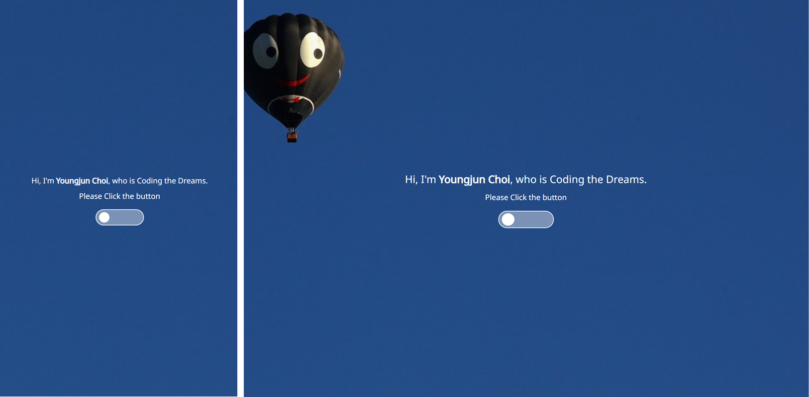
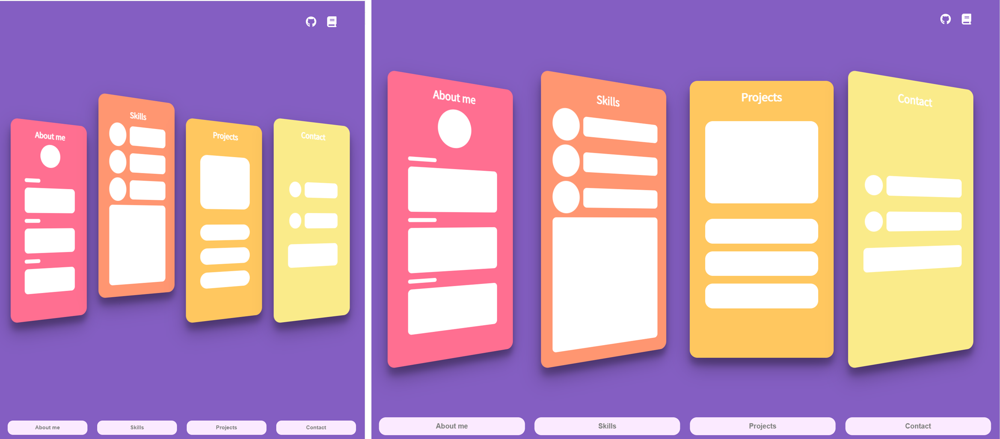
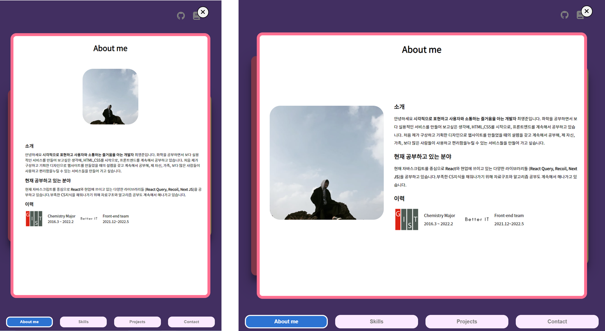
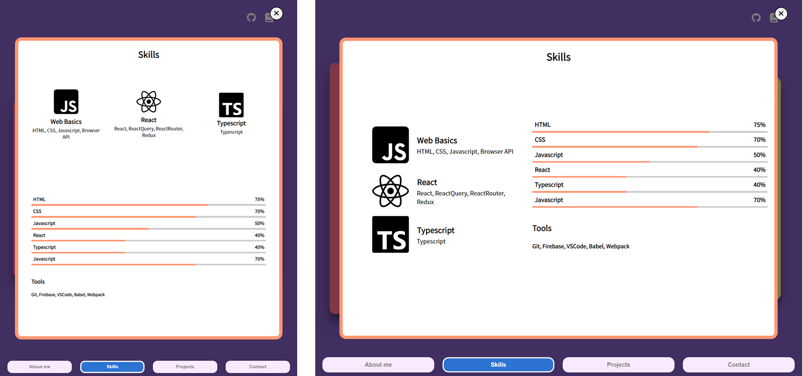
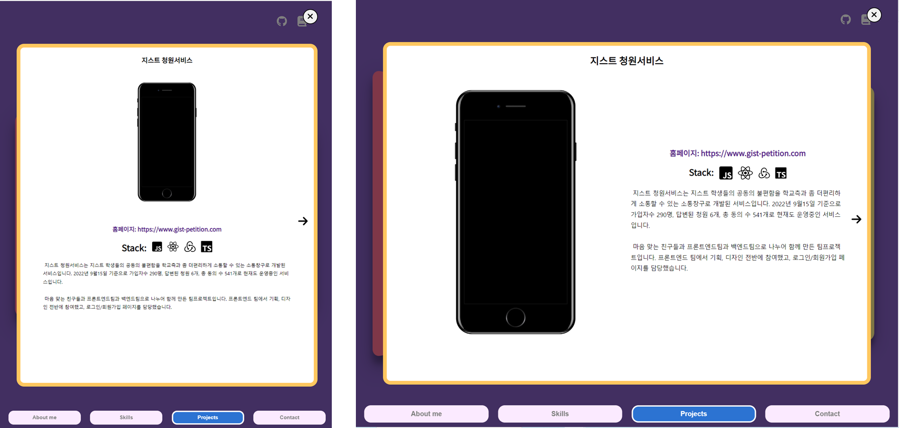

대부분의 기능은 어제 완료했기에 전체적으로 돌아보면서 반응형 적용과 성능 최적화에 포커스를 두고 작업했다.

## 1) 반응형 적용

항상 반응형으로 만들 때 느끼는 점이지만 처음 기획을 할 때, 모바일 버전을 고려하지 않으면 브라우저 버전에서 생각했던 기능을 아예 빼버려야 할 때도 생긴다. 이번에 만들 때는, 처음부터 모바일 버전을 많이 생각하고 기획해서 조금 더 편하게 모바일 버전을 만들 수 있었다.

전체적으로 모바일 기준을 788px으로 맞춰서 반응형을 주었고 좀 더 세부적으로 나눌 필요가 있을 때는 1000px을 추가적으로 기준으로 잡았다.

### 1.1 Home

Home 페이지는 간단하게 버튼의 크기와 폰트 사이즈만 줄여주었다.

[Home 페이지 모바일 버전(좌) 데스크탑 버전(우)]

### 1.2 Main 페이지

메인 페이지는 전체적으로 손을 봐야 할 부분이 많았다. preview 박스들의 크기들을 조정하고, navbar의 폰트사이즈도 줄였다. 특히 preview 박스들의 애니메이션을 고민했는데 원래는 아예 세로로 flex 축을 바꿀려 했지만 그렇게 하기보다 축을 유지하고, 커서를 올리면 책을 뽑듯이 해당 preview박스만 살짝 올라가게 설정했다.

[main 페이지 모바일 버전(좌) 데스크탑 버전(우)]

### 1.3 Section

각 섹션들은 모바일 버전을 생각하고 leftBox와 rightBox을 flex박스안에 넣어두었어서, 간단하게 flex 축을 세로로 바꿔 반응형을 적용했다.

[About me 모바일 버전(좌) 데스크탑 버전(우)]

[Skills 모바일 버전(좌) 데스크탑 버전(우)]

[Projects 모바일 버전(좌) 데스크탑 버전(우)]

[Contact 모바일 버전(좌) 데스크탑 버전(우)]

반응형을 적용하면서 어색하거나 조금 안 맞는 스타일링들은 다시 수정해나갔다.

### 2) 성능 최적화

성능을 위해서, 불필요하게 다시 랜더링되는 부분을 체크했다. Overlay의 취소 버튼, header와 navbar, 그리고 projects의 각 item들이 불 필요하게 re-rendering되는 것을 확인했고 memo를 이용해서 성능을 최적화했다. 정적인 페이지라 useCallback이나 특별히 더 렌더링할 부분이 없어서 간단하게 작업했다.

### 3) 배포

배포는 Gatsby를 공부하기 전에 우선 netlify를 이용해서 배포해두기로 했다. netlify에 배포하기 위해서 먼저 npm run build로 build 폴더를 만든 후에 netlify deploy를 이용해 간단하게 배포했다.

### 마치며

디자인, 추가 내용들, 사진들, 데모 영상 등 아직 수정해 나가야 할 게 많아 보이지만 그래도 기한 내에 어느 정도 구성을 마쳐서 다행이었다. 원티드 이벤트에 기다리던 원티드 프론트엔드 온보딩 코스가 떠서 내일부터는 준비해나갈 생각이다. 계속 달리자.
