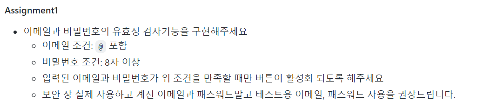
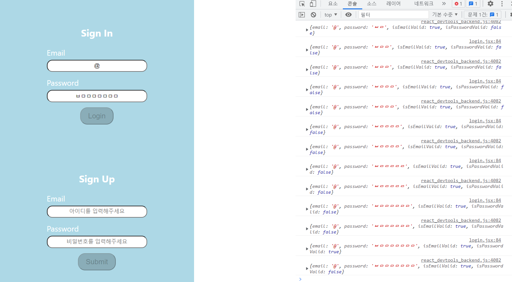
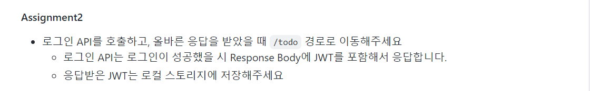
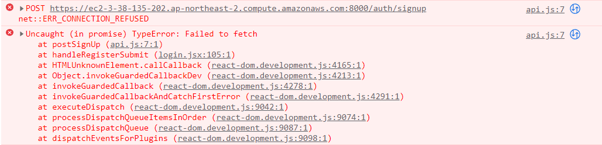

기다리던 프론트엔드 원티드 프리온보딩이 열렸다. 이번주는 프리온보딩 사전과제를 수행하면서 겪은 시행착오에 대해서 정리해 보려한다.

## Assignment 1)

과제 첫번째는 다음과 같은 조건이다.



로그인/ 회원가입을 페이지를 만들고 유효성 검사를 진행하는데 간단하게 이메일은 @을, 비밀번호는 8자 이상이면 되는 조건이라 간단하게 할 줄 알았지만 예상치 못한 곳에서 에러를 만났다...

```javascript
const [loginInfo, setLoginInfo] = useState({
  email: "",
  password: "",
  isEmailValid: false,
  isPasswordValid: false,
})

const regex = /.{8}/g

const handleLoginChange = e => {
  const { name, value } = e.currentTarget
  setLoginInfo(prev => {
    return {
      ...prev,
      [name]: value,
      isEmailValid: name == "email" ? value.includes("@") : prev.isEmailValid,
      isPasswordValid:
        name == "password" ? regex.test(value) : prev.isPasswordValid,
    }
  })
}
```

위와 같이 로그인과 관련된 상태를 만들어서 내부에 4가지 내용을 담았다. 여기서 이해가 안된 부분은 마지막 비밀번호 유효성 검사 부분이었다. 유효성 검사에서 8자이상이 되어도 계속해서 False가 나왔다. setState의 비동기성 때문에 생긴 문제라 하기에는 함수형으로 업데이트 해주기에 문제점으로 보이지 않았고, 자세히 보기위해서 콘솔에 입력해보았다니 다음과 같은 결과가 나왔다.



true랑 false가 동시에 나오는 이해가 안되는 상황이었다... 우선은 다음 과제를 위해서 정규표현식을 사용하지 않고 비밀번호로 받은 문자열의 길이가 8이상인지 체크하는 것으로 바꿨다.

## Assignment 2)

두 번째 과제는 다음과 같은 조건이다.



원티드에서 제공하는 API를 이용해 로그인과 회원가입 로직을 연결시키는 부분이었다. 3시간 정도 검색하고 확인해도 이유를 찾을 수 없이 에러가 났다. 분명 내가 잘못된 정보를 주거나 했다면 4xx번대 에러가 나와야하는데 그것도 없이 그냥 거절당했다...

찾아보니 서버 자체가 구동하지 않거나 주소가 아예 잘못된 경우 이런 에러가 나타날 수 있다고 하는데 원티드에서 잘못된 주소를 준건지... 우선은 내일 다시 시도해 보기로 했다.


