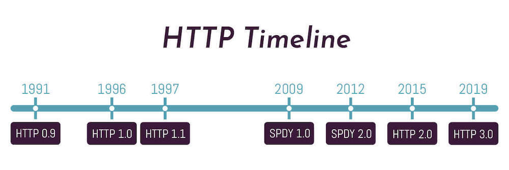

어제 온보딩 과제를 하면서 API들 사용할 때, 각 메소드들을 이해하지 않고 사용하고 있다는 점이 많이 느껴져 [**캡틴판교**님의 블로그](https://joshua1988.github.io/web-development/http-part1/) 와 [드림코딩의 Node.js 강의](https://academy.dream-coding.com/courses/node) 참고해서 한번 정리해보려 한다.

## HTTP 프로토콜이란

HTTP 프로토콜은 HyperText Transfer Protocol의 약자로 클라이언트와 서버가 서로 통신하는데 필요한 규약/약속을 의미한다. request와 response의 protocol로, client가 request(요청)를 서버에 보내게 되면 서버는 요청에 맞는 response(응답)을 보내는 과정을 의미한다.


위의 그림을 조금 더 세부적으로 나누어 설명하면 다음과 같이 정리할 수 있다.

1. TCP Connection: 클라이언트와 서버가 데이터를 보내기 전에 서로 연결설정을 하는 과정을 의미한다.
2. Request: 클라이언트에서 원하는 내용(url,method,header)를 담아서 서버에 요청한다.
3. Response: 서버에서는 받은 요청에 대해 응답(status Code, 파일들)을 담아서 클라이언트에게 보낸다.
4. TCP Connection 해제: 모든 요청과 응답이 끝나면 TCP connection을 해제한다.

## HTTP 프로토콜의 특징

HTTP 프로토콜은 stateless한 프로토콜로 요청과 다음 요청과의 연관성을 가지지 않는다는 의미를 가진다. 이번에 요청을 해야 다음요청을 할 수 있는 방식이 아니라, 각각이 다른 요청으로 별개로 처리됨을 의미한다.

## HTTPS와 HTTP의 역사

HTTPS는 HyperText Transfer Protocol Secure의 약자로 HTTP에 암호화가 추가된 방식을 의미한다. HTTP 자체는 암호화가 되지 않기 때문에 도중에 제 3자가 개입해서 통신내용을 읽을 수 있는 보안의 문제가 있었다. 이부분을 해결하기 위해 HTTPS가 나오게 되었고 암호화가 되어 보안관계가 있는 client와 server는 내용을 읽을 수 있지만 제 3자는 읽을 수 없게 되어있다.

구글에 접속한 내 브라우저 창의 주소를 옆을 보면 자물쇠모양을 볼 수 있는데, HTTPS로 접속했다는 의미를 가진다.

HTTP는 현재도 계속해서 개발되고 있는 분야로, 현재 HTTP v3가 개발 진행 중에 있다고 한다.

[사진 출처: 뽀블로그 티스토리](https://bbo-blog.tistory.com/87?category=1004651)


HTTP v1은 text based로 사람이 읽을 수 있었고, 헤더가 압축이 되지않아 용량이 큰 문제가 있었고, 한번에 하나의 파일만 전송이 가능한 문제들이 있었다. 이를 해결한 게 HTTP v2로 binary based로 사람이 읽을 수 없어 보안이 강화되었고, header의 압축을 통해 용량을 줄일 수 있었고, 여러개의 파일을 전송할 수 있는 muliplexing이 가능하다고 한다. 현재 전세계에서 50%가 넘게 사용하고 있는 게 HTTP v2라고 한다.

## Status Code

Status code는 클라이언트와 서버간에 요청과 응답을 주고 받을 때 번호로 소통하는 방식으로 각 번호마다의 의미를 가지고 있다. 프론트엔드를 공부하면서 API를 사용하고 예외처리들을 할 때 많이 사용되었던 부분이라 왜 이런 번호가 왔는지 이해가 되었다.

### 1xx

100번대 status 코드는 요청에 대해서 진행상태를 알려준다.

1. 100 continue: 지금까지 응답이 잘 처리되었음
2. 102 processing: 현재 요청을 처리중

### 2xx

200번대 status 코드는 요청에 대해서 성공했음을 알려준다.

1. 200 OK: 요청이 성공했음을 의미
2. 201 created: 요청한 데이터를 만들었음을 의미
3. 204 no content: 요청이 성공했고 응답으로 보내줄 데이터는 없음을 의미

말 자체로는 조금 모호했지만 간단한 상황을 보면, 200은 Get과 같이 요청한 내용들을 받아올 때, 201은 Post와 같이 새로운 데이터를 만들 때, 204는 Delete와 같이 데이터를 삭제할 때의 응답으로 이해할 수 있었다.

### 3xx

300번대 status 코드는 리다이렉션을 의미한다.

1. 301 moved permanently: 요청 데이터가 영구적으로 이동했음을 의미
2. 302 found: 요청 데이터가 임시적으로 이동했음을 의미
3. 303 see other: get요청에 대해서 302와 같이 데이터가 임시적으로 이동했음을 의미

4. 307 Temporary Redirect: 요청한 메소드에 대해서 데이터가 임시 이동했음을 의미
5. 308 Permanent Redirect: 요청한 메소드에 대해서 데이터가 영구 이동했음을 의미

300번대는 아직 한번도 받아본 적이 없어서 조금 생소했다.

### 4xx

1. 400 Bad Request: api나 query 등 client의 요청이 잘못된 경우를 의미
2. 401 Unauthorized: 로그인의 비밀번호가 틀린 경우와 같이 authentication credentials이 없는 요청에 대한 에러를 의미
3. 403 Forbidden: 로그인은 했지만 관리자 권한이 필요한 요청과 같이 권한이 없는 것에 대한 에러를 의미
4. 404 Not found: 원하는 url의 페이지가 없음을 의미
5. 405 Method not allowed: 해당 method를 사용할 수 없음을 의미
6. 409 Conflict: 이미 존재하는 데이터와 충돌한 에러를 의미

아마 내가 가장 자주 마주칠 status code가 아닐까, 400번대의 의미를 보고나니 단순한 에러가 아니었고 내가 어떤 부분을 잘못 요청했는지 알려주고 있었음을 알 수 있었다.

### 5xx

1. 500 Internal Server Error: 서버에 문제가 있어서 보낸 요청을 수행할 수 없음을 의미
2. 502 Bad gateway: 서버와 클라이언트 사이 중간에서 어떻게 처리해야할 지 모를 때를 의미
3. 503 Service unavailable: 서버를 이용할 수 없음을 이용

## Request Method

url은 uniform resource locator의 약자로, 우리가 원하는 리소스의 위치를 의미한다. 아래 그림의 url을 분리해서 의미를 해석하면 다음과 같다.

1. https:// : scheme으로 프로토콜의 종류를 의미

2. www.example.com: domain 주소

3. :80: 포트번호를 의미(브라우저에서 생략 가능)

4. /path/to/myfile.html: 원하는 파일의 경로

5. ?key1=value1&key2=value2: query로 원하는 세부 정보를 의미


url을 이용해서 요청을 보낼때 어떤 action을 해달라고 할지를 보내는게 바로 **Method**이다. Method에도 다양한 종류가 존재하는데 그중에서 가장 대표적인 4가지만 정리하고자한다.

### 1. Get

get은 **url의 자료를 받아오기 원할 때** 사용하며, 성공시 200 OK status code를, 실패시에는 401 Unauthorized, 403 Forbidden, 404 Not found와 같은 에러를 받을 수 있다.

사용 예

```javascript
async getTodos(username) {
    const query = username ? `?username=${username}` : '';
    const response = await fetch(`${this.baseUrl}/todos${query}`, {
      method: 'GET',
    });
    const data = await response.json();
    if (response.status !== 200) {
      throw new Error(data.message);
    }
    return data;
  }
```

### 2. POST

post는 url 위치에 함께 보내는 body나 form data를 함께 전달해 **데이터를 생성할 때 사용**하며, 성공시 201 Created를 실패시에 401 Unauthorized, 403 Forbidden, 404 Not found, 409 Confilct와 같은 에러를 받을 수 있다.

사용 예)

```javascript
 async postTodo(text) {
    const todo = {
      name: 'Choi',
      username: 'choi',
      text,
    };
    const response = await fetch(`${this.baseUrl}/todos`, {
      method: 'POST',
      headers: {
        'Content-Type': 'application/json', // fetch 사용시 꼭 담아주기
      },
      body: JSON.stringify(tweet), // body에 담을때는 꼭 JSON으로 직렬화하기
    });
    const data = await response.json();
    return data;
  }
```

### 3. PUT

put은 url 위치의 **데이터를 수정할 때 사용**하며, 성공시 200 OK을, 실패시 403 Forbidden, 404 Not found, 405 Method not allowed와 같은 에러를 받을 수 있다.

사용 예)

```javascript
 async updateTodo(todoId, text) {
    const response = await fetch(`${this.baseUrl}/todo/${tweetId}`, {
      method: 'PUT',
      headers: {
        'Content-Type': 'application/json',
      },
      body: JSON.stringify({ text }),
    });
    const data = await response.json();
    if (response.status !== 200) {
      throw new Error(data.message);
    }
    return data;
  }
```

### 4. DELETE

delete는 url위치의 **데이터를 삭제할 때 사용**하며, 성공시 204 No content를, 실패시 403 Forbidden, 404 Not found, 405 Method not allowed와 같은 에러를 받을 수 있다.

사용 예)

```javascript
async deleteTodo(tweetId) {
    const response = fetch(`${this.baseUrl}/todos/${tweetId}`, {
      method: 'DELETE',
      headers: {
        'Content-Type': 'application/json',
      },
    });
    if (response.status !== 204) {
      throw new Error();
    }
  }
```

위 4가지를 함께 CRUD(Create,Read,Update,Delete)라고도 부르는 대표적인 요청으로 꼭 기억하고 있어야할 부분이다. 이외에도 HEAD나 PATCH와 같은 Method가 있지만 나올 때마다 조금씩 정리해 나가려한다.

[참조]
- [캡틴판교님 블로그 HTTP 통신과정](https://joshua1988.github.io/web-development/http-part1/)
