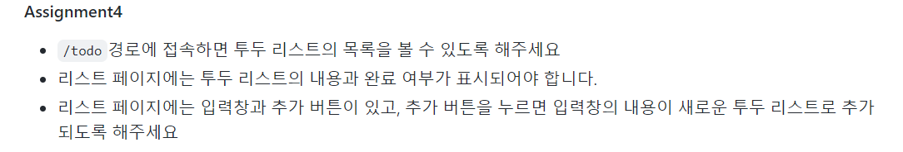
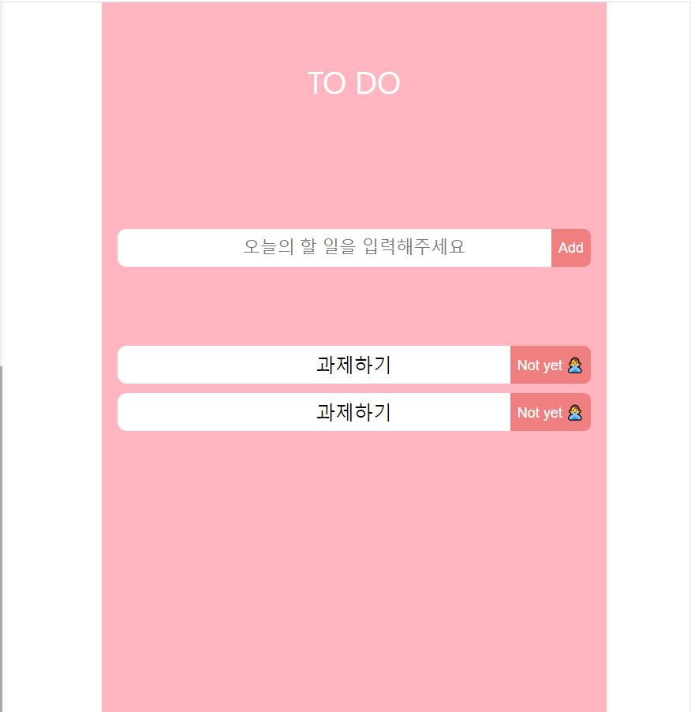
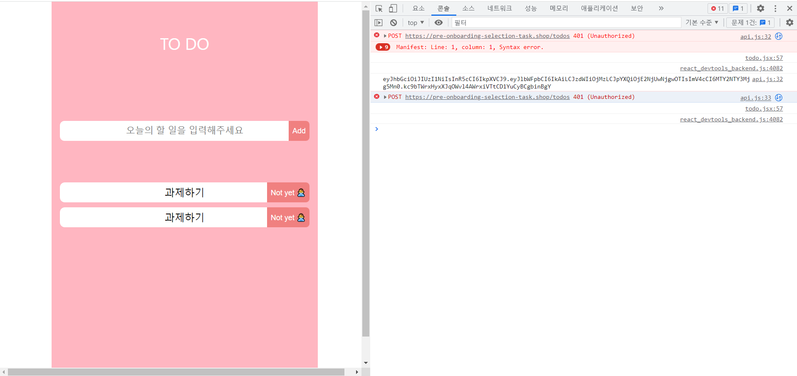
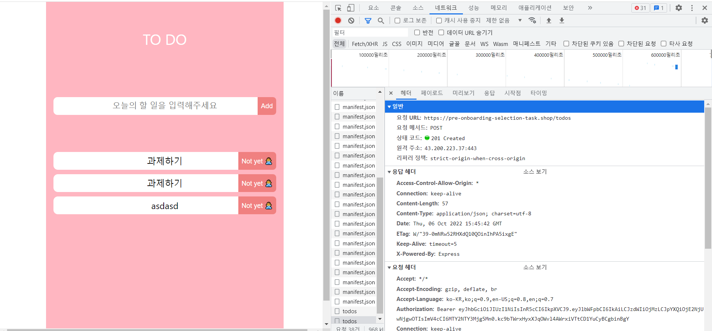
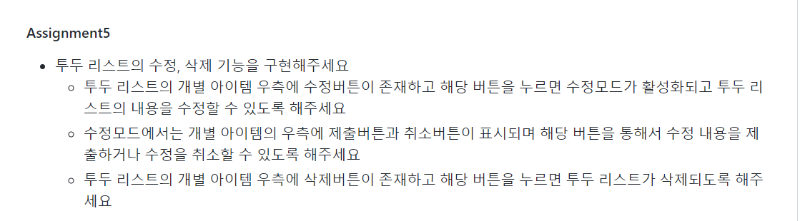
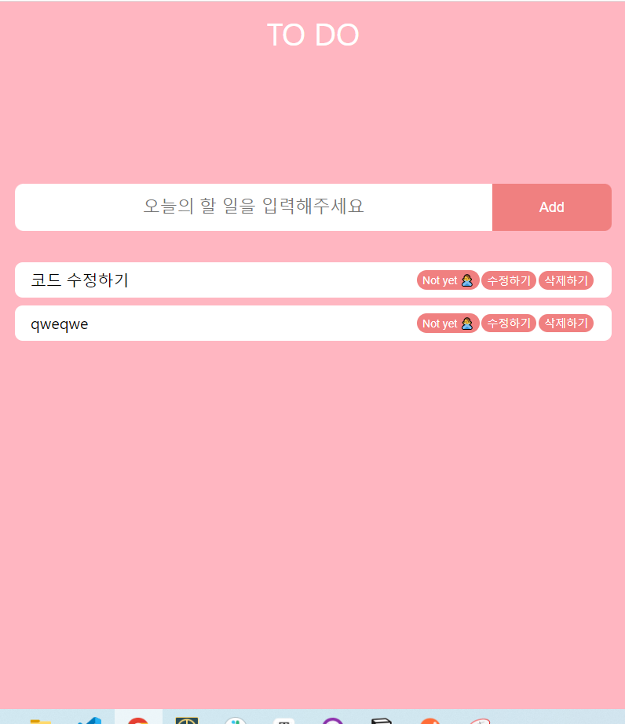
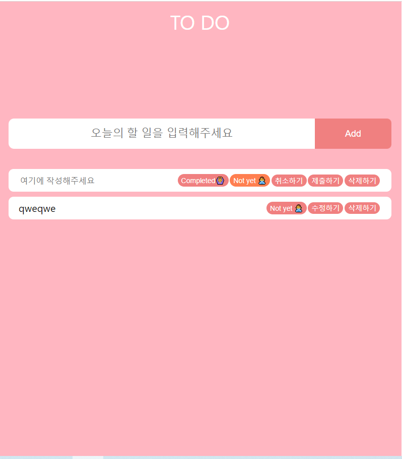
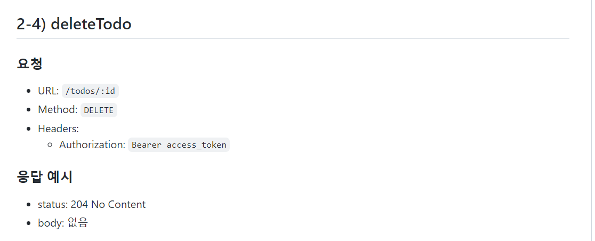
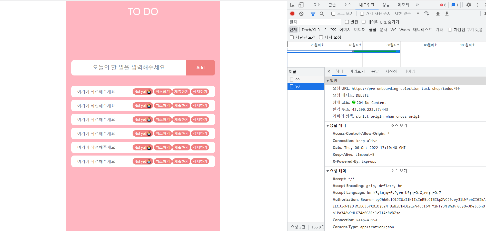
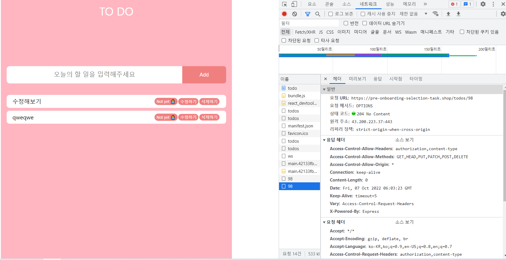

어제에 이어서 과제를 이어서 해나갔다. 4번째와 5번째는 Todo list를 만드는 것으로 많이 해봐서 쉬울 줄 알았지만 API로 todo를 CRUD하기 때문에 조금 달라 찾아보는데 시간이 걸렸다.

## Assignment 4)

네 번째 과제의 내용은 다음과 같다.



과제를 스타일링과 API를 연결하는 두 가지 일로 분리해서 작업했다.

### 1. 스타일링

스타일링을 위해서 우선 의미없지만 API요청으로 받을 투두와 동일한 형식의 state를 만든 후에, TodoItem이라는 component에 prop으로 전달 해주는 형식으로 투두리스트를 구성했다. TodoItem는 다섯 번째 과제 내용 중에 수정 버튼과 제출 취소 버튼이 필요하지만 우선 간단하게 투두 내용과 완료 여부만 보여주게 구성했다.

```jsx
//Todo.jsx
function Todo() {
  const inputRef = useRef();
  const [todos, setTodos] = useState([
    {
      id: 1,
      todo: '과제하기',
      isCompleted: false,
      userId: 1,
    },
    {
      id: 2,
      todo: '과제하기',
      isCompleted: false,
      userId: 1,
    },
  ]);

  return (
    <TodoLayout>
      <header>TO DO</header>
      <TodoForm onSubmit={onSubmit}>
        <input
          ref={inputRef}
          type='text'
          id='todoInput'
          placeholder='오늘의 할 일을 입력해주세요'
        />
        <button>Add</button>
      </TodoForm>
      <TodoList>
        {todos.map((todo) => (
          <TodoItem key={todo.id} {...todo}></TodoItem>
        ))}
      </TodoList>
    </TodoLayout>
  );
}

export default Todo;

//TodoItem.jsx
function TodoItem({ todo, isCompleted, userId }) {
  return (
    <TodoLayout>
      <span>{todo}</span>
      <button>{isCompleted ? 'Completed🙆‍♀️' : 'Not yet 🙅‍♂️'}</button>
    </TodoLayout>
  );
}

export default TodoItem;

```

아래 사진은 스타일링을 완료한 모습이다.



### 2. API 연결하기

API는 createTodo와 getTodos 두 가지를 연결해야 했다. 두 API를 연결하기 위한 형식으로 Authorization이란 부분이 header에 포함되어야 했는데, 오늘 HTTP를 공부했지만 처음 보는 부분이라 [사이월드님의 블로그](https://cyworld.tistory.com/1163)에 올라온 코드를 참고해서 작성했다. API 문서에 Authorization: Bearer access_token이라고 되어있었는데 그냥 토큰을 전달하는 식으로 코드를 짰어서 401 unauthorized 에러가 계속해서 떴다.



```javascript
export function postCreateTodo(todo) {
  return fetch(`${BASE_URL}/todos`, {
    method: "POST",
    headers: {
      "Content-Type": "application/json",
      Authorization: "Bearer " + localStorage.getItem("access_token"),
    },
    body: JSON.stringify({
      todo,
    }),
  })
}
```

bearer이란 부분이 생소했는데 알아보니 헤더의 Authorization에는 `<type> <cretential> `형식으로 들어가야 하는데 type에 Bearer로 쓰는게 Scheme,관례와 같다고 한다. ([참고한 블로그](www.ssemi.net/what-is-the-bearer-authentication/))

그래서 Bearer를 그대로 입력한 후에 로컬스토리지에 저장되어 있는 토큰을 전달해주면 API 요청에 성공할 수 있었다.



```javascript
export function postCreateTodo(todo) {
  return fetch(`${BASE_URL}/todos`, {
    method: "POST",
    headers: {
      "Content-Type": "application/json",
      Authorization: `Bearer ${localStorage.getItem("access_token")}`,
    },
    body: JSON.stringify({
      todo,
    }),
  })
}

export function getTodos() {
  return fetch(`${BASE_URL}/todos`, {
    method: "GET",
    headers: {
      "Content-Type": "application/json",
      Authorization: `Bearer ${localStorage.getItem("access_token")}`,
    },
  })
}
```

어제 작업할 때 app.jsx 에서 token을 state로 갖고 있게 했는데 굳이 그럴 필요 없이 useEffect에서 간단하게 토큰 유무만 체크해도 redirection이 가능했다.

```jsx
function App() {
  const navigate = useNavigate()
  useEffect(() => {
    const token = localStorage.getItem("access_token")
    if (token) {
      navigate("/todo")
    } else {
      navigate("/")
    }
  }, [])
  return (
    <Routes>
      <Route path="/" element={<Login></Login>}></Route>
      <Route path="/todo" element={<Todo></Todo>}></Route>
    </Routes>
  )
}

export default App
```

## Assignment 5)

다섯 번째 과제 내용은 다음과 같다.



네 번째와 마찬가지로 스타일링 수정과 API연결로 나눠서 일을 생각했다. 다른 점이 있었다면 이전에는 API 연결에 필요한 형식을 맞추는 데 어려움이 있었다면 이번에는 스타일링을 수정하는데 어려움이 있었다. 투두 리스트를 처음에 구성할 때 완료여부랑 투두 내용만 보여주면 되었다가, 수정버튼, 수정모드에서 제출과 취소버튼이 추가 되면서 구성을 바꾸는데에 오래걸렸다.

### 1. 스타일링 수정

처음 과제를 이해할 때는 완료여부를 클릭으로 상태를 바꿔주기만 하면 되는 줄 이해해서, 누르기만하면 바뀌게 했지만 다시 과제를 읽어보면서 수정모드에서 바꿀 수 있게 해야했다. 어떻게 구성을 바꿔야할까 고민하다가 수정모드에서 item 내부에 input과 함께 complete와 not yet 두가지 버튼을 모두 보여주고 선택할 수 있게 하는 형식으로 수정하게 되었다.





```jsx
function TodoItem({
  todoItem: { isCompleted, userId, id, todo },
  todoItem,
  onDelete,
  onUpdate,
}) {
  const inputRef = useRef();
  const [onModifyMode, setOnModifyMode] = useState(false);
  const [updated, setUpdated] = useState(todoItem);

...

  return (
    <TodoLayout>
      <LeftBox>
        {!onModifyMode && <div>{todo}</div>}
        {onModifyMode && (
          <input placeholder='여기에 작성해주세요' ref={inputRef}></input>
        )}
      </LeftBox>

      <RightBox>
        {!onModifyMode && (
          <>
            <TodoBtn>{isCompleted ? 'Completed🙆‍♀️' : 'Not yet 🙅‍♂️'}</TodoBtn>
            <TodoBtn name='modify' onClick={onClick}>
              수정하기
            </TodoBtn>
          </>
        )}
        {onModifyMode && (
          <div>
            <CompleteBtn
              name='complete'
              clicked={updated.isCompleted}
              onClick={handleCompleteUpdate}
            >
              Completed🙆‍♀️
            </CompleteBtn>
            <CompleteBtn
              name='not yet'
              clicked={!updated.isCompleted}
              onClick={handleCompleteUpdate}
            >
              Not yet 🙅‍♂️
            </CompleteBtn>
          </div>
        )}
        {onModifyMode && (
          <>
            <TodoBtn name='cancel' onClick={onClick}>
              취소하기
            </TodoBtn>
            <TodoBtn name='submit' onClick={handleSubmit}>
              제출하기
            </TodoBtn>
          </>
        )}
        <TodoBtn onClick={handleDelete}>삭제하기</TodoBtn>
      </RightBox>
    </TodoLayout>
  );
}

export default TodoItem;

```

input에 현재 이미 작성되어있던 내용을 담아줄까 고민도 했지만 디테일은 내일 한번 더 고민하면 좋지 않을까 싶어 우선은 그대로 두었다. 수정모드에서 complete여부에 따른 클릭된 모습을 보여주기 위해서 버튼의 배경색을 달리하는 효과를 넣어서 좀 더 직관적으로 이해가 잘 되게 스타일링 했다.

### 2. API 연결하기

​ api를 연결하면서 todo 자체의 상태도 업데이트 해야하기 때문에 둘을 app.jsx에서 같이 처리해야했다. API 연결 작업도 두가지로 나눠서 작업했다.

#### 2.1 삭제 기능추가

삭제와 업데이트 중에서 상대적으로 삭제하는 기능은 쉽게 구성할 수 있었다. API 요구사항이 해당하는 todo의 id만 전달하면 되었기 때문에 간단하게 삭제버튼이 눌러지면 해당 item의 id를 전달하고 todo에서는 filter로 해당 id와 같은 요소를 삭제하고, api로 동일한 id를 전달해 서버에서 삭제해주었다.



```tsx
//TodoItem.jsx
function TodoItem({
  todoItem: { isCompleted, userId, id, todo },
  todoItem,
  onDelete,
  onUpdate,
}) {
 	...
  const handleDelete = () => {
    onDelete(id);
  };


  return (
    <TodoLayout>
      ...
        {onModifyMode && (
          <>
            <TodoBtn name='cancel' onClick={onClick}>
              취소하기
            </TodoBtn>
            <TodoBtn name='submit' onClick={handleSubmit}>
              제출하기
            </TodoBtn>
          </>
        )}
        <TodoBtn onClick={handleDelete}>삭제하기</TodoBtn>
      </RightBox>
    </TodoLayout>
  );
}

//todo.js

function Todo() {
  const inputRef = useRef();
  const [todos, setTodos] = useState([]);

    ...

  const onDelete = (id) => {
    setTodos((prev) => prev.filter((todo) => todo.id != id));
    deleteTodo(id);
  };

  return (
    <TodoLayout>
      <header>TO DO</header>
      <TodoContent>
        <TodoForm onSubmit={onSubmit}>
          <input
            ref={inputRef}
            type='text'
            id='todoInput'
            placeholder='오늘의 할 일을 입력해주세요'
          />
          <button>Add</button>
        </TodoForm>
        <TodoList>
          {todos.map((item) => (
            <TodoItem
              key={item.id}
              todoItem={item}
              onUpdate={onUpdate}
              onDelete={onDelete}
            ></TodoItem>
          ))}
        </TodoList>
      </TodoContent>
    </TodoLayout>
  );
}

export default Todo;


//api.js
export function deleteTodo(id) {
  return fetch(`${BASE_URL}/todos/${id}`, {
    method: 'DELETE',
    headers: {
      Authorization: `Bearer ${localStorage.getItem('access_token')}`,
    },
  });
}

```

이미 네 번째 과제를 하면서 필요한 헤더나 구성을 이해하고 있어서 상대적으로 쉽게 처리해 204 No content 응답을 받았다.



#### 2.2 수정기능 추가하기

수정기능을 처리할때, 한번에 complete의 수정된 부분과 input의 내용을 전달하려고 시도했다가 어려움을 겪었다. 수정모드를 on/off하는 버튼은 수정하기와 취소하기 두가지 버튼이 존재하고, 직접 수정하는데 필요한 input의 내용과, complete여부까지, 모두 다 한번에 처리하려니 복잡해지는 게 문제점이었다.

그래서 하나의 함수로 다 하기보다 우선은 일을 분할해서 세가지 step으로 보기로 했고, api에서 body에 id, todo, isCompleted를 모두 전달해야 하기 때문에 수정된 todoItem의 상태를 통째로 전달하는 방식으로 TodoItem 내부에 updated 상태를 추가했다.

1. 수정하기와 취소하기 버튼: onModifyMode를 true와 false로 바꿔줄 수 있게 연결하고 취소하기는 input을 비게만드는 로직을 추가한다.
2. 완료여부 버튼: 완료여부 두가지 버튼은 버튼 클릭시 updated 상태의 isCompleted를 수정하는 로직을 추가한다.
3. 제출 버튼: 현재 input에 있는 값을 updated상태의 todo값으로 업데이트하고, updated 전체를 전달한다.

update를 위해서 todos에서 전달한 updated 오브젝트의 id와 같은 값의 todo만 mapping 하고 api에서는 obj를 통째로 전달해서 필요한 값만 내부에서 전달하는 형식으로 코드를 구성했다.

```jsx
//TodoItem.jsx

function TodoItem({
  todoItem: { isCompleted, userId, id, todo },
  todoItem,
  onDelete,
  onUpdate,
}) {
  const inputRef = useRef();
  const [onModifyMode, setOnModifyMode] = useState(false);
  const [updated, setUpdated] = useState(todoItem);

  const onClick = (e) => {
    const { name } = e.currentTarget;
    if (name === 'cancel') {
      inputRef.current.value = ``;
    }
    setOnModifyMode((prev) => !prev);
  };

	...

  const handleCompleteUpdate = (e) => {
    const { name } = e.currentTarget;
    if (name === 'complete') {
      setUpdated((prev) => {
        return { ...prev, isCompleted: true };
      });
    } else {
      setUpdated((prev) => {
        return { ...prev, isCompleted: false };
      });
    }
  };

  const handleSubmit = () => {
    onUpdate({ ...updated, todo: inputRef.current.value });
    inputRef.current.value = ``;
    setOnModifyMode((prev) => !prev);
  };

  return (
    <TodoLayout>
      <LeftBox>
        {!onModifyMode && <div>{todo}</div>}
        {onModifyMode && (
          <input placeholder='여기에 작성해주세요' ref={inputRef}></input>
        )}
      </LeftBox>

      <RightBox>
        {!onModifyMode && (
          <>
            <TodoBtn>{isCompleted ? 'Completed🙆‍♀️' : 'Not yet 🙅‍♂️'}</TodoBtn>
            <TodoBtn name='modify' onClick={onClick}>
              수정하기
            </TodoBtn>
          </>
        )}
        {onModifyMode && (
          <div>
            <CompleteBtn
              name='complete'
              clicked={updated.isCompleted}
              onClick={handleCompleteUpdate}
            >
              Completed🙆‍♀️
            </CompleteBtn>
            <CompleteBtn
              name='not yet'
              clicked={!updated.isCompleted}
              onClick={handleCompleteUpdate}
            >
              Not yet 🙅‍♂️
            </CompleteBtn>
          </div>
        )}
        {onModifyMode && (
          <>
            <TodoBtn name='cancel' onClick={onClick}>
              취소하기
            </TodoBtn>
            <TodoBtn name='submit' onClick={handleSubmit}>
              제출하기
            </TodoBtn>
          </>
        )}
        <TodoBtn onClick={handleDelete}>삭제하기</TodoBtn>
      </RightBox>
    </TodoLayout>
  );
}

export default TodoItem;

//Todo.jsx

function Todo() {
  const [todos, setTodos] = useState([]);

    ...

  const onSubmit = (e) => {
    e.preventDefault();
    const value = inputRef.current.value;
    if (!value) {
      return;
    }
    postCreateTodo(value)
      .then((res) => res.json())
      .then((data) => setTodos((prev) => [...prev, data]));
    inputRef.current.value = '';
  };

    ...

  const onUpdate = (todo) => {
    setTodos((prev) =>
      prev.map((item) => {
        if (item.id === todo.id) {
          return todo;
        }
        return item;
      })
    );
    updateTodos(todo);
  };

  return (
    <TodoLayout>
      <header>TO DO</header>
      <TodoContent>
        <TodoForm onSubmit={onSubmit}>
          <input
            ref={inputRef}
            type='text'
            id='todoInput'
            placeholder='오늘의 할 일을 입력해주세요'
          />
          <button>Add</button>
        </TodoForm>
        <TodoList>
          {todos.map((item) => (
            <TodoItem
              key={item.id}
              todoItem={item}
              onUpdate={onUpdate}
              onDelete={onDelete}
            ></TodoItem>
          ))}
        </TodoList>
      </TodoContent>
    </TodoLayout>
  );
}

export default Todo;


//api.js

export function updateTodos(obj) {
  const { todo, isCompleted } = obj;
  return fetch(`${BASE_URL}/todos/${obj.id}`, {
    method: 'PUT',
    headers: {
      'Content-Type': 'application/json',
      Authorization: `Bearer ${localStorage.getItem('access_token')}`,
    },
    body: JSON.stringify({
      todo,
      isCompleted,
    }),
  });
```

결과는 204 No content로 성공한 결과를 보여주었다. 그리고 userId를 따로 저장해두고 함께 전달해야하나 걱정했지만 토큰만 전달하면 서버에서 이미 알고 있기 때문에 추가적으로 저장할 필요가 없다는 점도 알게 되었다.



여기까지 총 5가지 과제 내용을 모두 성공적으로 했지만 예외 처리를 할 부분과 회원가입/로그인 페이지의 코드 분리 등 아직 리팩토링이 필요하다고 생각되었다.
