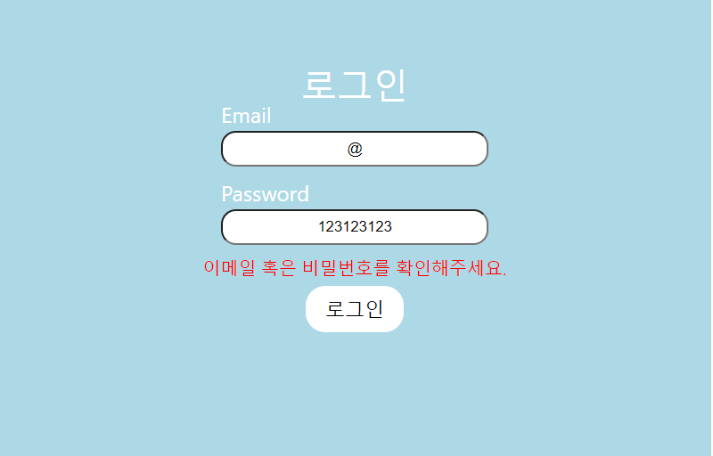
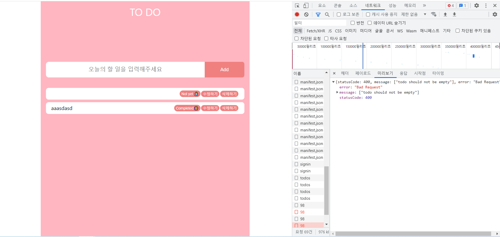
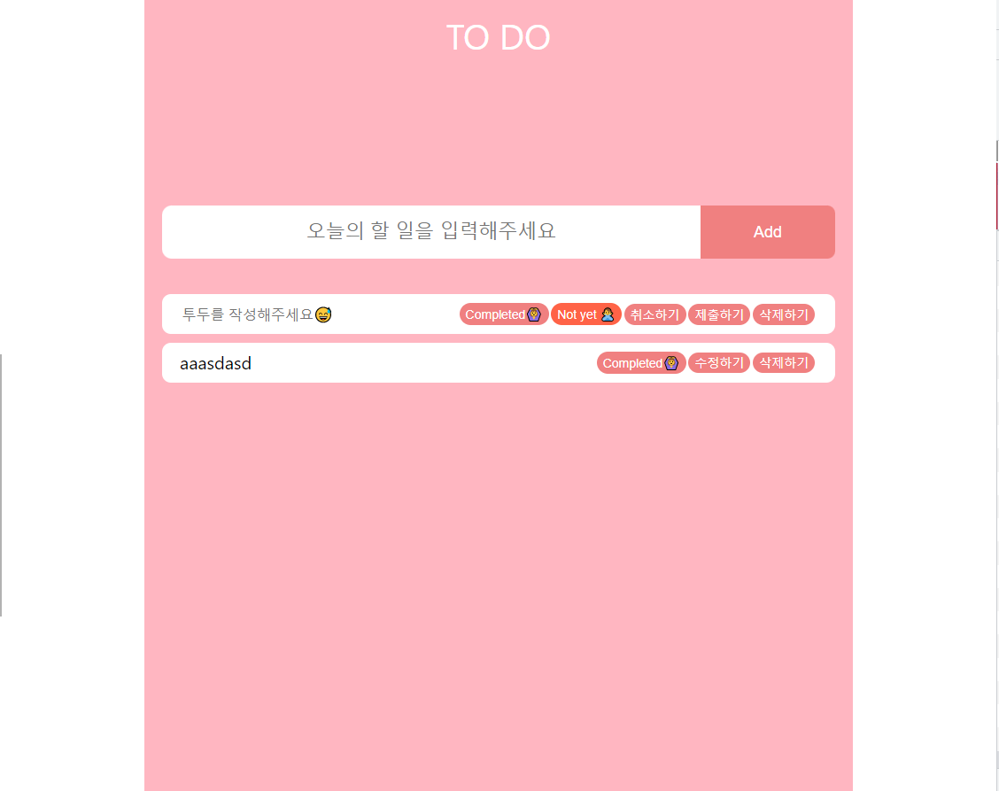
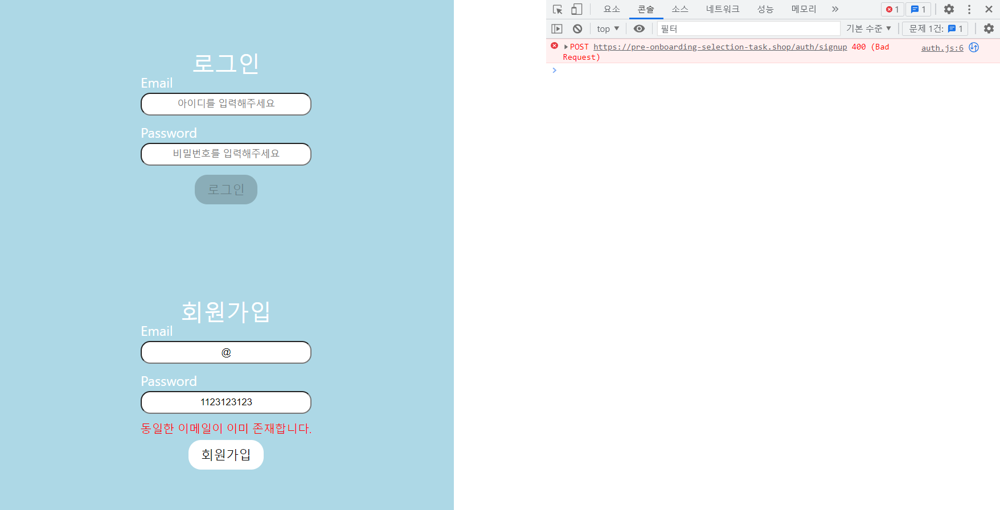
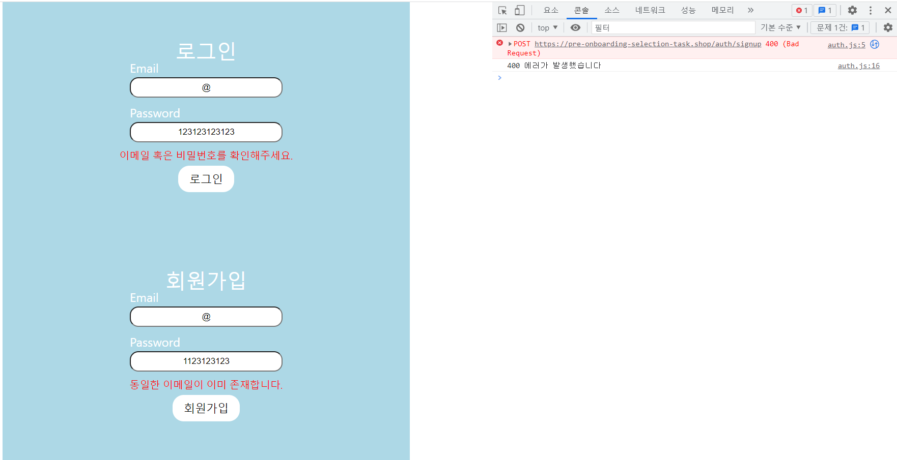

남은 리팩토링할 부분들은 axios와 api 예외사항으로 둘다 http 통신과 연관되어있다는 공통점이 있어서 함께 처리해보려 했다.

## 1. API 예외사항

과제에서 요구하는 부분이 많지 않아 크게 어려움은 없었지만 작성 중에 마주쳤던 에러 사항들에 대해 정리하면 다음과 같다.

| 컴포넌트 | Status code      | 내용                             |
| :------: | ---------------- | -------------------------------- |
| 회원가입 | 400 Bad Request  | 동일한 이메일이 이미 존재합니다. |
|  로그인  | 401 Unauthorized | Unauthorized                     |
|  로그인  | 404 Not found    | 해당 사용자가 존재하지 않습니다. |
|   todo   | 400 Bad Request  | todo should not be empty         |

#### 1.1 회원가입

400 Bad Request 에러의 경우 "동일한 이메일이 이미 존재합니다"라는 메세지를 함께 받아오기 때문에 그대로 메시지 상태에 받아와 UI로 보여주는 방법으로 처리했다.

#### 1.2 로그인

​ 401 Unauthorized 에러는 이메일은 존재하지만 비밀번호가 해당 이메일과 맞지 않을 때 주는 에러이다. 백엔드에서 받은 메시지는 "Unauthorized"로 오기 때문에 사용자 입장에서는 이해하기 어려울 것이라 생각해 **"이메일 혹은 비밀번호를 확인해주세요."**로 바꾸어서 보여주게 설정했다.

404 Not found의 경우 "해당 사용자가 존재하지 않습니다"로 메시지가 오기 때문에 그대로 메시지 상태로 담아 UI로 보여주었다.

```jsx
const exceptionTest = (data, setMessage, process) => {
  if (data.statusCode >= 400) {
    if (data.statusCode == 401) {
      //추가한 예외처리 부분
      setMessage(prev => {
        return {
          ...prev,
          message: "이메일 혹은 비밀번호를 확인해주세요.",
          success: false,
        }
      })
      return
    }
    setMessage(prev => {
      return {
        ...prev,
        message: data.message,
        success: false,
      }
    })
    return
  }
  if (process == "login") {
    navigate("/todo")
    localStorage.setItem("access_token", data.access_token)
  }
  setMessage(prev => {
    return {
      ...prev,
      message: `${"login" ? "로그인" : "회원가입"}에 성공했습니다`,
      success: true,
    }
  })
}
```



#### 1.3 Todo

todo의 경우, input에 작성된 내용으로 수정하는 기능을 추가했는데 api 연결 과정에서 빈칸으로 보내고 마주하게 된 에러였다. 에러 status코드는 400 Bad request로 message는 "todo should not be empty"로 반환되는 것을 확인할 수 있었다.



에러 처리를 위해서 고민했을 때 빈 내용을 보낼 수 없게 하기 위해서 input창이 비어있는지 확인하는 상태를 추가했고 비어 있다면 placeholder로 알려 주는 로직을 추가함으로, 에러를 처리했다.

```jsx
function TodoItem({
  todoItem: { isCompleted, userId, id, todo },
  todoItem,
  onDelete,
  onUpdate,
}) {

  const [isBlank, setIsBlank] = useState(false);

	...

  const handleSubmit = () => {
    const todo = inputRef.current.value;
    if (!todo) {
      setIsBlank(true);
      return;
    }
    onUpdate({ ...updated, todo });
    inputRef.current.value = ``;
    setOnModifyMode((prev) => !prev);
  };

  return (
    <S.TodoLayout>
      <S.LeftBox>
        {onModifyMode ? (
          <input
            placeholder={
              isBlank ? '내용이 비어있습니다.😅' : '여기에 작성해주세요😀'
            }
            ref={inputRef}
          ></input>
        ) : (
          <div>{todo}</div>
        )}
      </S.LeftBox>

    	...
    </S.TodoLayout>
  );
}

export default TodoItem;

```



Todo 자체의 input창에서도 똑같은 에러가 나타날 수 있으니 제출을 못하게 막기보다는 isBlank상태를 추가해 사용자에게 알려 주는 방향으로 하는 게 더 좋은 방법이라 생각되어 todo에서도 같은 방법으로 수정해주었다.

```jsx
unction Todo() {
  const inputRef = useRef();
  const [todos, setTodos] = useState([]);
  const [isBlank, setIsBlank] = useState(false);

  const onSubmit = (e) => {
    e.preventDefault();
    const value = inputRef.current.value;
    if (!value) {
      setIsBlank(true);
      return;
    }
    postCreateTodo(value).then((data) => setTodos((prev) => [...prev, data]));
    inputRef.current.value = '';
    setIsBlank(false);
  };

 		...

  return (
    <S.TodoLayout>
      <header>TO DO</header>
      <S.TodoContent>
        <S.TodoForm onSubmit={onSubmit}>
          <input
            ref={inputRef}
            type='text'
            id='todoInput'
            placeholder={
              isBlank
                ? '내용이 비어있습니다.😅'
                : '오늘의 투두를 작성해주세요😀'
            }
          />
          <button>Add</button>
        </S.TodoForm>
   			...
      </S.TodoContent>
    </S.TodoLayout>
  );
}

export default Todo;

```

## 2. API 분리와 Fetch 에러처리

#### 2.1 API 분리

​ api.js에 회원가입과 로그인 api들과 todo의 api들 모두 담겨 있는 것보다 기능에 따라 분리할 필요가 있어 보여 api들을 분리 시켰다.

```
api/
  auth.js
  todo.js
```

#### 2.2 Fetch 에러처리

​ Server의 API를 사용할 때 모두 fetch를 이용하고 try-catch 구문을 이용해서 에러를 잡아보려 했다. 하지만 fetch자체적으로 HTTP 오류 상태를 수신해도 cath로 에러가 잡히지 않는다는 mdn 문서 내용을 보게되었다.[참고 문서](https://developer.mozilla.org/ko/docs/Web/API/Fetch_API/Using_Fetch)

```javascript
export async function postSignUp(data) {
  const { email, password } = data
  try {
    const res = await fetch(`${BASE_URL}/auth/signup`, {
      method: "POST",
      headers: {
        "Content-Type": "application/json",
      },
      body: JSON.stringify({
        email,
        password,
      }),
    })
    return await res.json()
  } catch (error) {
    console.log(error)
  }
}
```



fetch로 사용할 때는 대신 response의 ok 프로퍼티가 false로 설정되기 때문에 에러를 전달하기 위해서는 try-catch보다는 ok 프로퍼티로 먼저 수정해 줄 필요가 있었다. 바꾸고 나서 콘솔창에 에러 발생에 대해 나오는 걸 확인할 수 있었다. fetch의 이러한 특징 때문에 에러를 발생 시키고 에러에 따라 다른 작업을 해야 한다면 우선 respones.ok를 확인 후 throw error를 던진 후에 try-catch구문을 이용해서 에러를 처리해주면 좀 더 깔끔하게 에러 처리가 가능할 것 같다고 생각되었다.

```javascript
export async function postSignUp(data) {
  const { email, password } = data
  const res = await fetch(`${BASE_URL}/auth/signup`, {
    method: "POST",
    headers: {
      "Content-Type": "application/json",
    },
    body: JSON.stringify({
      email,
      password,
    }),
  })
  if (!res.ok) {
    console.log(`${res.status} 에러가 발생했습니다`)
  }
  return await res.json()
}
```



어떻게 던진 에러를 처리할 지는 내일 좀 더 에러 핸들링에 대해 공부한 후에 적용해보기로 생각했다.
