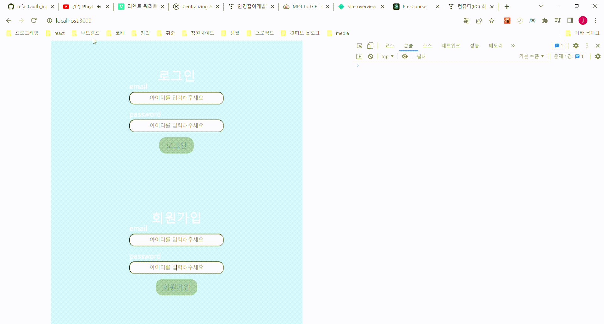
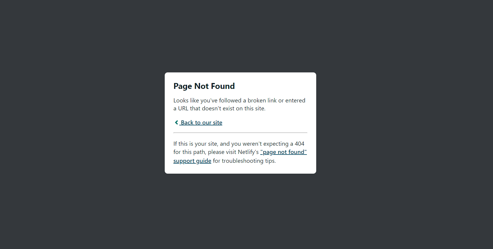
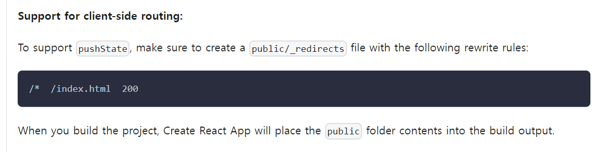

## 1. 최적화와 배포

에러 핸들링을 하기 전에 내일까지 배포하는 것이 목표이기 때문에 그전에 여태까지 한 작업들을 최적화하고 배포를 먼저 한 후에 readme작성을 하게 되었다. 우선 최적화는 memo와 useCallback을 이용해 auth와 todo페이지의 불필요한 re-rendering을 막았다.

#### 1.1 auth 페이지

auth 페이지에서는 회원가입 form과 로그인 form이 같이 존재하고 상태가 변하면 authForm 내부 모두가 다시 실행되기 때문에, 모든 input들이 re-rendering되는 모습을 보였다. 이를 해결하기 위해서 input을 컴포넌트로 만들어서 각 컴포넌트에 주입되는 함수나 props가 바뀌는 게 아니면 업데이트 되지 않게 해주었다.

```jsx
//이전 코드

function AuthForm({
  process,
  onSubmit,
  onChange,
  message,
  setMessage,
  info,
  setInfo,
}) {
	...
   return (
    <S.AuthFormLayout onSubmit={handleSubmit}>
      <h1>{process === 'login' ? '로그인' : '회원가입'}</h1>
      <div>
        <label htmlFor={`${process}_email`}>Email</label>
        <S.AuthInput
          name='email'
          onChange={handleChange}
          id={`${process}_email`}
          placeholder='아이디를 입력해주세요'
        ></S.AuthInput>
      </div>
      <div>
        <label htmlFor={`${process}_password`}>Password</label>
        <S.AuthInput
          name='password'
          onChange={handleChange}
          id={`${process}_password`}
          placeholder='비밀번호를 입력해주세요'
        ></S.AuthInput>
      </div>
      {message.message ? (
        <S.Message success={message.success}>{message.message}</S.Message>
      ) : null}
      <S.SubmitBtn
        onSubmit={handleSubmit}
        disabled={!(info.isEmailValid && info.isPasswordValid)}
      >
        {process === 'login' ? '로그인' : '회원가입'}
      </S.SubmitBtn>
    </S.AuthFormLayout>
  );
}
export default AuthForm

//수정 이후 코드

function AuthForm({
  process,
  onSubmit,
  onChange,
  message,
  setMessage,
  info,
  setInfo,
}) {

	...

  return (
    <S.AuthFormLayout onSubmit={handleSubmit}>
      <h1>{process === 'login' ? '로그인' : '회원가입'}</h1>
      <AuthInput
        onChange={handleChange}
        process={process}
        name={'email'}
      ></AuthInput>
      <AuthInput
        onChange={handleChange}
        process={process}
        name={'password'}
      ></AuthInput>
      {message.message ? (
        <S.Message success={message.success}>{message.message}</S.Message>
      ) : null}
      <S.SubmitBtn
        onSubmit={handleSubmit}
        disabled={!(info.isEmailValid && info.isPasswordValid)}
      >
        {process === 'login' ? '로그인' : '회원가입'}
      </S.SubmitBtn>
    </S.AuthFormLayout>
  );
}

//AuthInput
import React, { memo } from 'react';
import S from './styles';

function AuthInput({ onChange, process, name }) {
  return (
    <div>
      <label htmlFor={`${process}_email`}>{name}</label>
      <S.AuthInput
        name={name}
        onChange={onChange}
        id={`${process}_email`}
        placeholder='아이디를 입력해주세요'
      ></S.AuthInput>
    </div>
  );
}

export default memo(AuthInput);


```

컴포넌트로 authInput을 만들고 AuthInput을 memo로, onChange함수를 useCallback을 이용해 메모리에 저장해둠으로써 해당 input이 아닌데도 업데이트되는 부분을 막을 수 있었다. 그리고 이름을 styled-component의 convention을 정해놓으니 겹치지 않아서 더 편리하게 naming할 수 있었다.

​ input들의 리랜더링은 막았지만 회원가입부분을 작성하는데 로그인 부분이 업데이트 되는 모습이 보였다. 불필요한 re-rendering이기 때문에 AuthForm도 똑같이 memo로, AuthForm에게 전달되는 함수인 onSubmit, onChange, exceptionTest을 useCallback을 이용해 메모리에 저장해 동일하게 불필요한 re-rendering을 막았다.



#### 1.2 Todo 페이지

​ todo페이지에서는 각 Todo를 수정하면 해당 todo를 제외한 나머지 todo들과 함께 전체적으로 re-rendering이 되기 때문에 Auth와 동일하게 관련 함수인 onUpdate와 onDelete를 useCallback으로, TodoItem은 memo를 이용해 메모리에 저장해 불필요한 re-rendering을 막았다.

​ todo를 생성하는 input의 경우 Todo 전체 파일에 있게 되면 계속해서 업데이트되기 때문에 따로 컴포넌트화 시켜 memo로 저장한 후에 prop으로 전달해주는 함수들을 useCallback으로 메모리에 저장해 불필요한 re-rendering을 막았다.

```jsx
import React, { memo, useRef } from "react"
import S from "./styles"

function TodoForm({ onSubmit, isBlank }) {
  const inputRef = useRef()
  const handleSubmit = e => {
    onSubmit(e, inputRef)
  }
  return (
    <S.TodoForm onSubmit={handleSubmit}>
      <input
        ref={inputRef}
        type="text"
        id="todoInput"
        placeholder={
          isBlank ? "내용이 비어있습니다.😅" : "오늘의 투두를 작성해주세요😀"
        }
      />
      <button>Add</button>
    </S.TodoForm>
  )
}

export default memo(TodoForm)
```


## 2. Netlify를 이용한 배포

​ Netlify를 이용해서 배포하는 것은 create-react-app 공식 홈페이지에 잘 안내되어있기 때문에 크게 어려움은 없었지만 Github page로 배포할 때와 동일하게 새로고침을 하게되면 에러가 발생했다. netlify를 이용한 게 github pages에서 발생했던 동일한 에러 때문이었는데.... 역시 한번 마주한 에러를 해결하지 않으면 결국엔 돌아와서 똑같이 괴롭히는 것 같다. 이번 기회에 확실히 해결하고 넘어가고자 한다.



​ 생각보다 해결방법은 간단하게 CRA 공식홈페이지 deploy부분에 설명되어있었다.



에러가 난 이유는 내가 만든 프로젝트는 Single-page-application(SPA)이다. SPA의 경우 하나의 index.html을 갖고 모든 일이 index.html에서 이루어지기 때문에 "/"가 아닌 "/todo"에서 새로고침을 하게 되면 **해당 url에서는 index.html을 불러올 수 없기 때문에** 에러 페이지를 보여주게 되었다. 이를 해결하기 위해서 netlify는 public 폴더에 \_redierects라는 파일을 만들어 해당 코드를 그대로 적어주면 해결 할 수 있다.

끝으로 github pages에 대해서도 알아보았는데 github pages는 SPA를 지원하지 않아 라우팅이 불가능한 문제점을 갖고 있다. 그래서 404.html을 만들고 CI에서 빌드시에 index.html을 404.html로 옮겨서 다시 index.html내용을 보여주는 형식으로 처리한다고 한다.

[참고:heyeon.log velog ](https://velog.io/@heyoon/github-pages%EC%97%90%EC%84%9C-%EB%9D%BC%EC%9A%B0%ED%8C%85%EB%90%9C-%ED%8E%98%EC%9D%B4%EC%A7%80%EC%97%90%EC%84%9C-%EC%83%88%EB%A1%9C%EA%B3%A0%EC%B9%A8%EC%8B%9C-404%ED%8E%98%EC%9D%B4%EC%A7%80%EB%A5%BC-%EB%B0%98%ED%99%98%ED%95%A9%EB%8B%88%EB%8B%A4)

```yml
# CI 설정파일
- name: Install and Build 🔧
        run: |
          npm install
          npm run build
          cp dist/index.html dist/404.html
```

위의 방식으로 기존 github pages로 만들었던 프로젝트들을 해결해봐야겠다고 생각했다.
