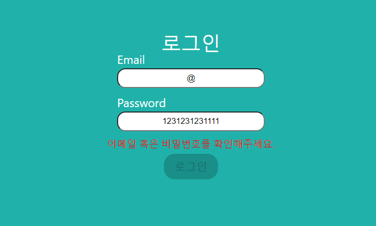

## 새롭게 배운 내용

사전과제의 요구사항 자체는 그렇게 복잡하지 않았다. 하지만 과제를 처음 만들고 나서, 다시 돌아보면서 코드를 고쳐나가면서 배우는 게 많았다.

## 1. HTTP 통신에 대한 이해

사전과제를 하는 과정에서 wanted에서 제공해 준 서버의 url이 바뀐 적이 있었다. 4시간 정도 구글링도 하고, wanter에서 제공해준 로컬 서버를 클론해와서 해결하려고 시도해봤지만 접속이 되지 않았다. 다음날 보았더니 서버주소가 바뀌어있었다...

그냥 포기하고 다음날 시도할 걸 후회도 했지만 **"HTTP 통신과 에러에 대한 의미를 내가 제대로 이해하고 있지 않구나"** 라는 생각에 http 통신에 대해서 공부하게 되었다.

HTTP는 서버와 client 간의 통신 규약으로 클라이언트의 요청(request)에 서버가 해당하는 응답(response)를 보내는 과정이다.

client가 요구할 때는 요구사항에 맞는 url과 헤더, 바디에 내용을 담아서 보내게 되고, 보낸 요청에 따라 서버는 올바른 요청인지 잘못된 요청인지 statusCode와 에러메시지 등을 담아서 응답해 준다.

과제를 통해서 CRUD에 해당하는 GET, POST, DELETE, PUT 모든 요청들을 다 사용해볼 수 있었다. 각 요청마다 알맞은 header와 body의 내용을 보내는 과정은 많은 도움이 되었다. 헤더의 content-type과 authorization들을 담는 법, bearer token이 뭔지, access_token을 받고 어떻게 처리 해야 할 지 등 너무 중요한 내용들을 많이 공부할 수 있었다.

## 2. 리액트 폴더 구조와 styled-component 파일 분리

과제는 평가를 받는 것이다 보니, 폴더 구조에도 신경이 쓰여 처음으로 리액트 폴더 구조에 대해 공부했다.

공통의 기능에 따라 아니면 하나의 기능과 관련된 컴포넌트 등으로 묶는 법을 알 수 있었고, 규모가 큰 프로젝트에서 어떻게 정리하고 사용하는지 예시들도 볼 수 있었다.

styled-component는 css in js 다 보니 styling 코드가 jsx파일에 같이 존재해 파일의 내용이 길어지는 문제점과 styled-component와 기능을 위한 component의 구분이 안 가는 문제점도 있었다.

이 둘을 한번에 해결하는 style.js를 만들고 내부에 S 객체를 만들어 컴포넌트들은 객체의 프로퍼티로 만들고 S 객체 하나만 export해 만드는 방법을 새롭게 알게 되었다.

## 3. fetch와 에러핸들링

청원사이트를 제작할 때의 로그인과 회원가입을 담당해서 제작했었지만 에러핸들링을 하는 함수 내부 코드가 너무 복잡해지는 아쉬움이 있었다.

그때는 분명 이해하지 못했을 부분을 이번 과제를 통해서 직접 찾고 적용하면서 어떻게 에러 핸들링을 하면 될 지 알게 되었다.

fetch 자체는 http에러에 대해서 에러를 던지지 않기 때문에 response의 ok프로퍼티를 이용해서 에러를 던져 줄 수 있고, 던져진 에러에 따라 에러 핸들링을 할 때는 에러 객체를 상속해 custom 에러 클래스를 만들어 각각의 에러에 대한 statusCode에 맞는 반환을 해 줌으로써 처리할 수 있었다.

## 아쉬운 점

#### 1. Axios 사용

fetch로 먼저 만든 후에 axios를 이용해보려 했지만 에러핸들링에 너무 많은 시간을 쏟다 보니 axios를 공부할 시간이 없었다.

axios를 왜 쓰는지, 어떤 장점이 있는지에 대해 좀 더 공부해보고 이후 프로젝트들에 적용해보아야겠다.

#### 2. 놓친 에러

어제 직전에 테스트를 하면서 발견한 에러로, 제출을 하고 나면 상태들이 초기화되게 했을 때, 다시 작성 시 @가 인식되지 않아서 이메일에 @가 있고, 비밀번호가 8자 이상이어도 버튼이 활성화 되지 않는 에러를 발견했다.

setState가 비동기처리이기 때문에 생긴 에러라 예상은 되지만 해결하지 못하고 제출한 게 아쉬움이 남는다.

#### 3. 시간 제한과 커밋 쪼개기

10월 12일까지 제출 시 가산점 1점이 있기 때문에 저녁 11시에 에러핸들링을 이해하고 수정하고 배포하느라 11시 58분에 완료했다. 하지만 작업하면서 수정한 내용 중에서 다른 에러를 일으키는 걸 보고 다시 수정하고 커밋했더니 12시 3분에 커밋이 올라가 이미 시간을 넘겨버렸다.

만약에 두 가지 일을 따로 커밋을 해두었더라면 커밋을 삭제만 했으면 시간 내에 작업을 완료했을텐데 아쉬움이 남았다.

개발자로 목표를 잡고 한 첫 도전이라, 나보다 잘하는 사람들에 대한 걱정도 되고, 떨어지면 자존감이 많이 떨어질 것 같다는 생각도 들었다.

하지만 언제인지는 모르지만 "나는 목표로 한 개발자가 될 것이다"는 생각과, 과정에서 배움이 있었기 때문에 "이미 나에게 이득이다"란 생각으로

편하게 마무리했다. 이제는 다시 리액트와 타입스크립트 공부를 하고, 계획했던 채용공고 정리 서비스를 만들어 갈 때이다.

항상 다음 목표를 생각하고 결과에 휘둘리지 않는 단단함을 키워 가는 시기로 삼아 가야겠다.
