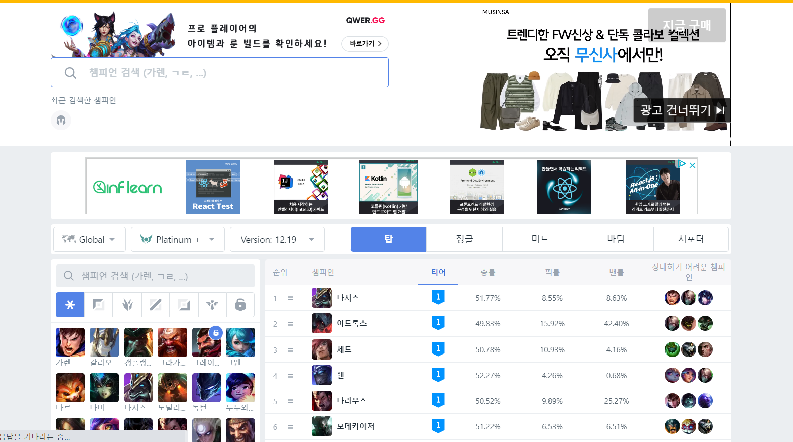

9월 말에 생각해두었던 채용공고 정리 사이트를 이번 주부터 본격적으로 만들어 보고자 한다. 급하게 한 주 안에 최대한 만드는 것을 목표로 잡았는데, 이유는 다음 주에 프리온보딩 코스 평가 결과가 나오기 때문에, 만약 합격한다면, 내 프로젝트 자체를 새롭게 기획하고 만들기 보다는, 과제를 하고, 새롭게 알게 된 걸로 프로젝트들을 수정하는 방향으로 시간을 써야 맞지 않을까 생각되었다. 그래서 먼저 기획 내용을 다시 점검하고 참고하고 공부할 내용들을 정리했다.

## 😁 현재까지 기획

### 1. 크롤러 만들기

우선 채용공고를 크롤링을 위한 언어를 정하는 게 어려웠다. 파이썬이나 node JS를 사용해야 하는 상황에서 자바스크립트를 엄청 좋아하고, node JS를 언젠가는 공부해야 한다는 마음이 있어서 많이 고민을 하다가, 우선 파이썬으로 만들기로 정했다.

파이썬은 이미 여러가지 크롤러를 만드는 영상들이 많아, 보고 배울 수 있는 코드가 많기 때문에 우선 잘 만들어 진 코드를 보면서 배운 후에, Node js로 바꿔서 만들어도 늦지 않겠다는 생각이 들었다. 파이썬으로 크롤러를 이용해 최대한 빨리 만들고 간단하게 프론트 페이지랑 연결해보는 것을 목표로 한다.

크롤러로 정리할 내용은 회사/ 주요업무/ 자격요건/ 우대사항 4가지로 정리해보고자 한다.

## 2. 프론트 세부 페이지 만들기

프론트에서 만들고 싶었던 내용은 표의 형식을 사용하지만, 좀 더 효과적으로 정리할 수 있는 양식이 있을 지 조사가 필요하다.

#### 1. 부트텐트 (https://boottent.sayun.studio/camps)

부트텐트는 개발자들을 위한 부트캠프들을 정리해서 보여주는 서비스로, 부트캠프별로 어떤 과정이 있는지, 접수일 등 기준으로

사용자가 원하는 기준의 해당 부트캠프를 찾아볼 수 있다. 어떤 기준을 추가할 지나 기준에 따라 필터링할 때 어떻게 할 지 참고하면 좋겠다고

생각했다.

#### 2. OP.GG (https://www.op.gg/champions)

OP.GG는 게임 사용자들에게 게임에 대한 다양한 전략, 이용자 정보, 전적 등을 제공하는 서비스이다.

주로 게임할 때 이용했지, 정리가 어떻게 되어있는지 고민은 안해봤는데 가독성 높게 잘 만들어져 있는 것을 느꼈다.

페이지 마다 중요한 내용, 현재 순위, 티어, 승률 등을 담고 있다. 공고마다 우선순위나 중요도를 담는 부분을 참고할 수 있을 것 같다.

