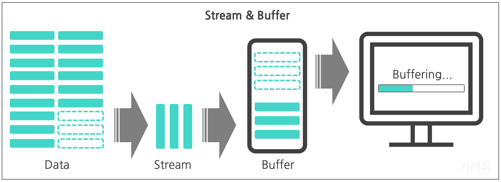

# 🎈 Node JS란

노드 JS는 브라우저밖에서도 자바스크립트를 사용할 수 있는 자바스크립트 런타임 환경이다. single thread 언어인 Javascript가 브라우저 위에서 browser API를 이용한 비동기 처리로 다양한 일을 처리할 수 있었던 것 처럼, Node JS 또한, 자체 API를 이용해서 비동기 처리를 이용해 다양한 기능을 구현할 수 있고, brower처럼 Event를 통해서 콜백을 실행하는 특징을 가진다.

이러한 기능중에서 나에게 현재 필요한 노드 JS의 기능은 API 서버를 만드는 것으로, 서버를 만들기 위한 기초 API들을 먼저 정리하고 서버를 만드는 과정을 정리해보려 한다.

## Module system

노드의 모듈시스템은 자체적인 **require(module)**이라는 함수를 통해서 받아올 수 있다. 현재는 자바스크립트 자체의 **import/export**도 이용가능한데, npm의 package.json에 "type":"module"로 추가해주어야한다.

## Path

말그대로 경로를 받아올 수 있는 모듈로, 다양한 디렉토리, 파일 등을 받아올 수 있는 API이다.

```javascript
path.basename(__filename) //현재 파일의 경로
path.extname(__filename) //현재파일의 확장자
path.join(__dirname, "image") //현재폴더에 image 파일의 경로
```

## File system

파일 시스템 모듈은 파일, 폴더를 읽고 쓰고 이동하는 등의 일을 할 수 있는 api로 script로 작성시 자동화 프로그램도 만들 수 있다.

서버를 만들고 나서 내 컴퓨터 내의 파일들을 정리하는 스크립트를 만드는 연습도 해보면 좋을 것 같다.

```javascript
fs.renameSync(oldPath,newPath) //동기적으로 파일을 이동시켜
fs.rename(oldPath,newPath,(error,data)=>{...}) //비동기적으로 파일을 이동시켜
fs.promises // promise를 이용해 비동기적으로 파일 시스템을 작성

fs.readFile(file, option)//비동기적으로 option으로 인코딩방식 등을 정해서 파일을 읽어
fs.writeFile(file, data) //비동기적으로 해당 파일에 데이터를 새로 작성한다
fs.appendFile(file, data) //비동기적으로 해당 파일에 데이터를 추가 작성한다
```

## 버퍼와 스트림

버퍼와 스트림은 너무나도 익숙하게 많이 들어온 개념들이다. **버퍼는 데이터 조각**으로 원본 데이터를 한번에 다 보내는 것이 아니라 데이터를 버퍼로 조금씩 잘라서 보낸다. 이렇게 **데이터 조각을 보내는 과정을 스트리밍**이라고 하고, 사용자가 받는 데이터의 속도가 보내는 데이터 속도보다 빠르다면, 화면이 보이지 않는 등의 일이 일어나는데 이런 현상을 우리가 흔히 이야기하는 **버퍼링이 걸린다**는 일이다.

이렇게 버퍼와 스트림을 이용하면 한번에 다 보내서, 다 받을때까지 사용자가 볼 수 없는 문제를 해결할 수 있어서 메모리효율과 시간 효율이 좋은 장점을 가진다.

[사진 출처: [카레유 티스토리](https://curryyou.tistory.com/440) ]



```javascript
const buf = Buffer.from("hello") //<Buffer 68 65 6c 6c 6f>
const buf2 = Buffer.from("hello") //<Buffer 68 65 6c 6c 6f>
const newBuf = Buffer.concat([buf, buf2]) //<Buffer 68 65 6c 6c 6f 68 65 6c 6c 6f> 버퍼 이어붙이기

const fs = require("fs")

const data = []

const readStream = fs
  .createReadStream(파일, option)
  .on("data", chunk => {
    // 데이터를 받아올 때 마다 실행해
    data.push(chunk)
  })
  .on("end", () => {
    console.log(data.join("")) // 데이터를 다받으면 실행해
  })
  .on("error", error => console.log(error)) // 에러 발생시 실행해
```

stream을 공부하고 느낀 가장 큰 장점은 **piping**이 가능하다는 점이다. piping은 stream들을 이어주는 것으로 stream의 결과들을 chaining이 가능하다.

```javascript
const readStream = fs.readStream("./ex1.txt")
const writeStream = fs.createWriteStream("./ex2.txt")
readSream.pipe(writeStream) //ex1.txt을 읽고 ex2.txt에 쓰는 파이프
```

## 서버 제작

위의 정리한 Node JS API들과 HTTP 지식들을 이용해서 간단한 서버를 만들어보았다.

### 서버사이드 렌더링

Node 서버는 flask를 사용했을 때와 동일하게, request로 받은 요청에 따라 response로 해당하는 html을 보여주는 서버를 먼저 제작했다. 과정은 다음과 같이 정리할 수 있다.

1. http모듈을 이용해서 서버를 만든다.
2. 서버에 받은 request의 url에 따라 html을 보낸다.

file을 읽는 방법으로 fs.readFile으로 할 수도 있지만 buffer와 stream의 효율이 더 좋기 때문에 createReadStream을 이용했다.

stream으로 받아온 buffer 데이터를 pipe를 이용해서 response로 보내면, res.end()를 하지 않아도 데이터가 다 받아지면

pipe가 자동으로 끝내줘서 코드가 더 간단해진다.

```javascript
const http = require("http")
const fs = require("fs")
const path = require("path")

const server = http.createServer((req, res) => {
  const url = req.url
  const filePath = path.join(__dirname)
  res.setHeader("content-Type", "text/html") //어떤 형식으로 데이터를 보낼지를 담아
  if (url === "/") {
    fs.createReadStream(`${filePath}/template/index.html`).pipe(res) //html을 버퍼로 읽어서 읽은 데이터를 response로 흘려보내줘
  } else if (url === "/courses") {
    fs.createReadStream(`${filePath}/template/courses.html`).pipe(res)
  } else {
    fs.createReadStream(`${filePath}/template/not-found.html`).pipe(res)
  }
})

server.listen(8080)
```

### JSON을 이용한 서버

JSON은 Javascript Object Notation의 약자로 네트워크통신을 위한 구조화된 데이터를 의미한다. 앞서 정리했었던 HTTP 통신으로 받은 request에 따라 해당하는 응답을 보내줄때, 요청에서 요구하는 데이터를 body에 담아서 보내줄 때, JSON으로 전달할 수 있다. 간단하게 배열을 GET이나 POST를 이용해서 JSON으로 보내주는 서버를 만들었다. 위의 서버와 다르게 request의 method별로 다른 응답을 보내주어야하고, 적절한 status_code를 함께 담아주어야한다.

(GET이 성공하면 200, POST가 성공하면 201)

```javascript
const arr = [1, 2, 3]

const server = http.createServer((req, res) => {
  const method = req.method
  if (method === "GET") {
    res.writeHead(200, { "Content-Type": "application/json" }) //head에 status_code, content-type을 담아
    res.end(JSON.stringify(arr)) //원하는걸 담아서 보내줘
  } else if (method === "POST") {
    const body = []
    req.on("data", chunk => {
      body.push(chunk)
    }) //req로 온 데이터를 받아
    req.on("end", () => {
      const item = Buffer.concat(body).toString() //버퍼로 받아온 데이터를 이어
      arr.push(JSON.parse(item))
      res.writeHead(201)
      res.end() //아무것도 담지 않아
    })
  }
})

server.listen(8080)
```
