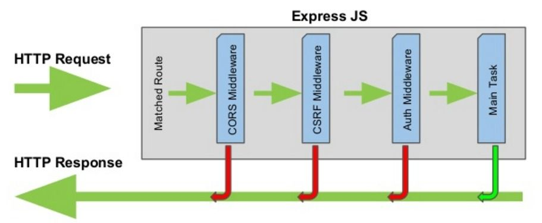

# ✨ Express

express는 노드 JS의 프레임워크로 앞서 만든 Node js의 코드 복잡도를 줄여주고, 쉽게 서버를 만들 수 있게 도와준다. express의 가장 큰 특징은 **middleware의 체이닝**이라고 할 수 있다. 미들웨어들이 연결되어있어, 처리할 수 있는 요청에 대해서 해당 미들웨어 내에서 처리하고, 담당 미들웨어에서 처리할 수 없는 요청에 대해서는 다음으로 넘기는 과정으로 보다 이해하기 쉽고 간결한 특징을 가진다.


## request

request에서 내가 헷갈렸던 부분은 query string과 path variable의 차이이다. 리액트를 하면서 잘 이해하지 못하고 사용했던 것 같아 [Integerous DevLog 블로그](https://ryan-han.com/post/translated/pathvariable_queryparam/)의 글을 참고해 정리해보고자 한다.

두가지를 구분하기 위해서는 이용목적을 이해해야한다. Path variable은 <u> resource를 구분하는 방법</u>이고, query string은 자료에서 <u>정렬이나 필터링을 할때</u> 사용되는 방법이다. 예로 /videos라는 url에서는 video 목록을 가져오는 것을 의미하고, /videos?channel=mnet라고 한다면 video목록에서 channel이 mnet인 것을 받아온다고 생각할 수 있다.

```javascript
// "/hi"로 접속시
app.get('/:id', (req, res, next) => {
  console.log(req.params); //{id:"hi"}
  console.log(req.query); //{}
});

// "/hi?keyword=hello"
app.get('/:id', (req, res, next) => {
  console.log(req.params); //{id:"hi"}
  console.log(req.query); //{keyword:"hi"}
});
```

## response

response에서는 method가 더 간결해져서 이해가 편했다.

1. response.json(data) : json으로 파싱해서 데이터를 전송

2. response.sendStatus(status_code): status_code만 전송
3. response.status(status_code).send(content): status와 데이터를 함께 전송

## middleware Chain

middleware의 구성은 action에 해당하는 method에 url과 callback 함수를 전달하는 방식이다. callback 함수에는 request,response, next를 받아올 수 있는데, 현재 미들웨어에서 처리할 수 있으면 response를 이용하고, 처리할 수 없을 때는 next를 이용해서 다음 미들웨어로 넘긴다.

```javascript
app.get('/', (req, res, next) => {
  //일처리
  next();
});

app.all('/users', (req, res, next) => {
  //일처리
  next();
});

app.use((req, res, next) => {
  res.status(404).send('not available');
});
```

각 method들 (GET,POST,PUT,DELETE 등)에 대한 method들 외에 **use**와 **all**이란 method가 존재한다. use는 url과 관련된 모든 경로, url을 전달하지 않은 경우에는 모든 url에서 처리해주는 미들웨어를 만들 수 있다. all은 해당 url에 한에서 모든 method를 처리하는 url이다. path variable이 추가되서 /users/1과 같은 요청은 처리할 수 없다.

미들웨어는 이렇게 우리가 직접 사용할 수 있는 것 외에도 express 내장 미들웨어나 npm에 올라와있는 유용한 미들웨어도 있다. json으로 값을 파싱해서 받아올 수 있는 **express.json()**이나 cors에러를 해결해주는 **cors 미들웨어**, 나 보안에 필요한 헤더를 추가해주는 **helmet 미들웨어**가 있다. 사용할 때는 동일하게 app.use(middleware)로 전달해서 사용할 수 있다.
