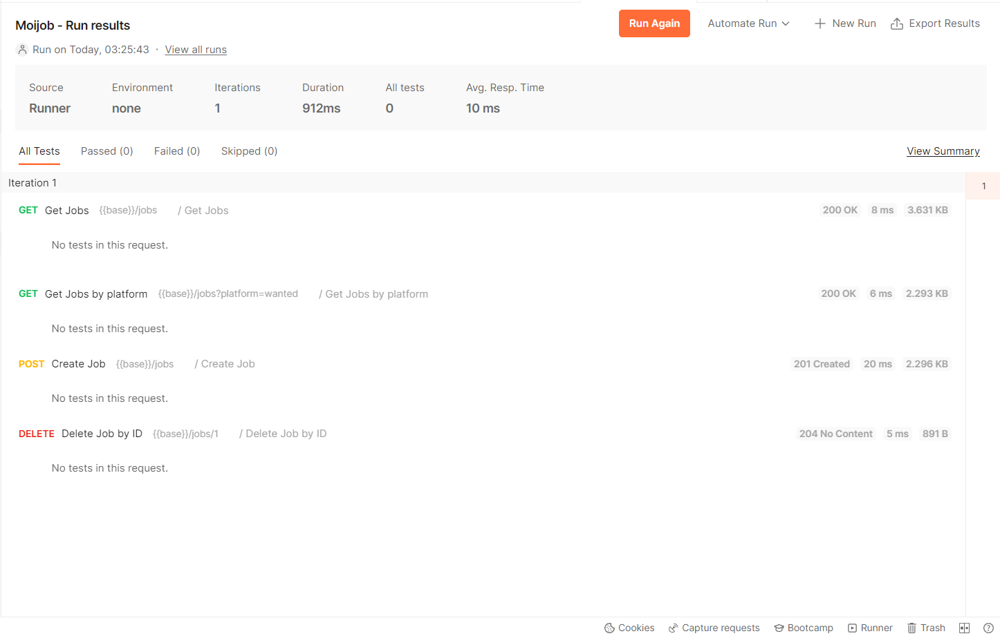
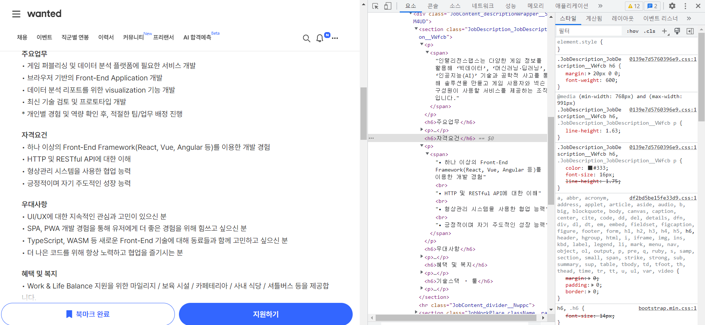
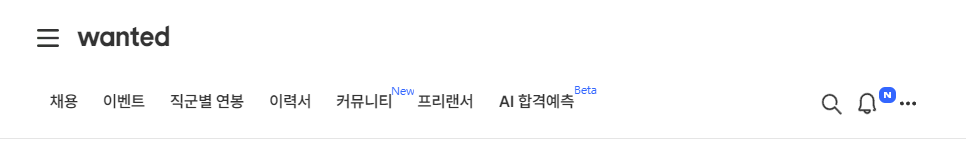
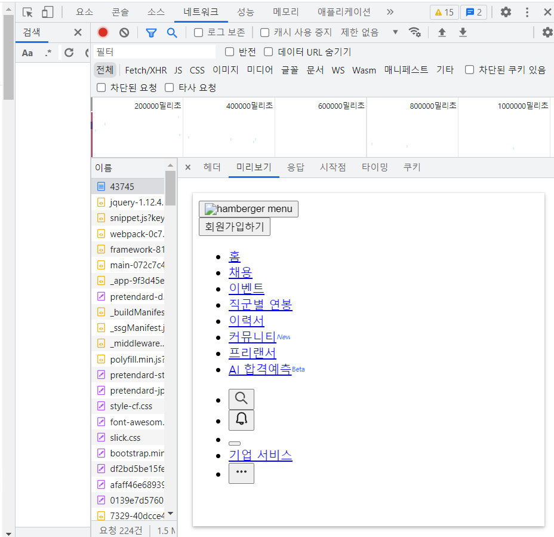

공부를 바탕으로 서버를 만들기 전에 우선 서버의 어떤 기능이 필요할 지 먼저 정리한 후에, 직접 서버를 만들었다.

## SCHEMA

#### Job data

스크롤러로 받아올 데이터 내용은 회사이름, 주요업무, 자격요건, 우대사항, 플랫폼, url 으로 정했다.

```
//Job
{
	name:string
	platform:string
	id:string
	main_work:string[]
	qualification:string[]
	preferential:string[]
	url:string
}
```

#### GET /jobs

데이터베이스에 저장되어있는 공고들을 받아온다.

```
response 200
{
	[job,job...]
}
```

#### GET /jobs?platform=:platform

해당 플랫폼에 맞는 공고들을 받아온다.

```
response 200
{
	[job,job...]
}
```

#### POST /jobs

전달 받은 url과 platform을 이용해서 크롤링을 한 후에 데이터베이스에 추가하고 만들어 진 job을 보여준다.

```
request
{
	url:string
	platform:string
}

reponse 201
{
	name:string
	platform:string
	id:string
	main_work:string[]
	qualification:string[]
	preferential:string[]
	url:string
}
```

#### DELETE /jobs/:id

전달 받은 id에 해당하는 job을 삭제한다.

```
request
{
	id:string
}

response 204
```

위의 스키마를 바탕으로 서버를 만들고, postman을 이용해서 api가 정상적으로 작동하는지 확인했다. 앞서 공부했던 유용한 미들웨어 (helmet, cors)등을 적용해보았고, 아직 데이터베이스가 없기 때문에, 우선 서버의 로컬변수로 저장해서 관리했다. 데이터는 op.gg의 공고문을 참고해서 만들었다.

```javascript
import express from "express"
import helmet from "helmet"
import cors from "cors"
import "express-async-errors"
import morgan from "morgan"

const app = express()
let jobs = [
  {
    name: "오피지지(OP.GG)",
    platform: "wanted",
    id: "1",
    main_work: ["OGT 웹사이트 최적화", "OGT 글로벌 플랫폼 개발 및 운영"],
    qualification: [
      "Javascript의 대한 높은 이해도를 보유하신 분",
      "Next.js, React.js을 활용한 개발 경험이 있으신 분",
      "HTTP, Networking에 대한 높은 이해도를 보유하신 분",
      "HTML, CSS 등 마크업에 대한 충분한 이해도가 있으신 분",
      "Server Side Rendering에 대한 높은 이해도를 보유하신 분",
      "자신이 만드는 서비스와 기능에 대한 책임감이 높으신 분",
      "다양한 직군의 사람들과 원활한 협업이 가능하신 분",
    ],
    preferential: [
      "프로젝트를 스스로 리딩 해본 경험이 있으신 분",
      "i18n을 적용한 글로벌 서비스에 대한 경험이 있으신 분",
      "Next.js를 이용하여 서버 사이드 렌더링 개발 경험이 있으신 분",
      "사용자를 위한 UI/UX 경험 개선을 지향하는 성향을 지니신 분",
      "프로젝트 기획 단계부터 출시까지 모든 과정에 참여하신 경험이 있으신 분",
      "E스포츠 게임을 즐기거나 게임 및 시장에 대한 높은 이해도를 보유하신 분",
      "서비스 운영에 있어 Search Engine Optimization, User Retention, Acquisition에 대한 경험이 있으신 분",
    ],
    url: "https://www.wanted.co.kr/wd/124677",
  },
  {
    name: "오피지지(OP.GG)",
    platform: "Wanted",
    id: "2",
    main_work: ["OGT 웹사이트 최적화", "OGT 글로벌 플랫폼 개발 및 운영"],
    qualification: [
      "Javascript의 대한 높은 이해도를 보유하신 분",
      "Next.js, React.js을 활용한 개발 경험이 있으신 분",
      "HTTP, Networking에 대한 높은 이해도를 보유하신 분",
      "HTML, CSS 등 마크업에 대한 충분한 이해도가 있으신 분",
      "Server Side Rendering에 대한 높은 이해도를 보유하신 분",
      "자신이 만드는 서비스와 기능에 대한 책임감이 높으신 분",
      "다양한 직군의 사람들과 원활한 협업이 가능하신 분",
    ],
    preferential: [
      "프로젝트를 스스로 리딩 해본 경험이 있으신 분",
      "i18n을 적용한 글로벌 서비스에 대한 경험이 있으신 분",
      "Next.js를 이용하여 서버 사이드 렌더링 개발 경험이 있으신 분",
      "사용자를 위한 UI/UX 경험 개선을 지향하는 성향을 지니신 분",
      "프로젝트 기획 단계부터 출시까지 모든 과정에 참여하신 경험이 있으신 분",
      "E스포츠 게임을 즐기거나 게임 및 시장에 대한 높은 이해도를 보유하신 분",
      "서비스 운영에 있어 Search Engine Optimization, User Retention, Acquisition에 대한 경험이 있으신 분",
    ],
    url: "https://www.wanted.co.kr/wd/124677",
  },
]

app.use(express.json())
app.use(cors())
app.use(helmet())
app.use(morgan("tiny"))
app.get("/jobs", (req, res, next) => {
  const platform = req.query.platform
  const data = platform ? jobs.filter(item => item.platform === platform) : jobs
  res.status(200).json(data)
})

app.post("/jobs", (req, res, next) => {
  const { url, platform } = req.body
  const job = jobs[0] //cheerio로 크롤링해야해, 에러 조건도 달아줘야해
  jobs = [job, ...jobs]
  res.status(201).json(job)
})

app.delete("/jobs/:id", (req, res, next) => {
  const id = req.body.id
  console.log(id)
  jobs.filter(job => job.id != id)
  res.sendStatus(204)
})

app.use((req, res, next) => {
  res.status(404)
})

app.use((error, req, res, next) => {
  res.status(500).send("something wrong")
})

app.listen(4000)
```

postman으로 정상적으로 다 작동하는 것을 확인할 수 있었다. 이제 중요한 건 실제로 크롤링을 한 데이터를 만드는 과정이다.



# Cheerio를 이용한 크롤링

cheerio는 크롤링을 위한 Node Js 라이브러리로, 파이썬의 beautifulSoup과 같은 역할을 한다.

먼저 원티드 페이지를 보면 내가 원하는 정보는 h6태그에 카테고리 제목이, p안의 span의 내용들이 바로 담겨 있다. 페이지 내부의 다른 곳에서 h6태그와 p태그가 사용되고 있지 않기 때문에 간단하게 할 수 있을 것이라 생각했지만 이상하게 아무것도 크롤링이 되지 않았다.

[원티드 페이지 html구조]



아래 코드를 보면 p태그 안에 있는 span을 받아와야 하지만 아무 것도 받아오지 못했고, 내가 잘못 코드를 친 부분이 있는지

확인 차 span만 불러왔을 때는 navbar에 있는 beta만 받아왔다. 전혀 예상하지 못한 Beta가 어디서 나온 건지 확인해보니

페이지 상단의 navbar의 AI 합격예측이라는 메뉴에 있는 span의 text내용이었다.

[헤더 화면]


```javascript
import cheerio from "cheerio"
import axios from "axios"

const getHTML = async () => {
  try {
    return await axios.get(`https://www.wanted.co.kr/wd/43745`)
  } catch (error) {
    console.error(error)
  }
}

const parsing = async () => {
  const html = await getHTML()
  const $ = cheerio.load(html.data)
  const $List = $("span")

  $List.each((idx, node) => {
    console.log($(node).text()) //Beta
  })
}
```

왜 안되는지 체크하기 위해서 네트워크 창을 보니 받아온 html을 보았을 때 **정적으로 만들어진 페이지만 cheerio가 받아와서 찾다보니 생긴 일이 아닐까** 라는 생각이 들었다. 만약 내 생각이 맞다면, 동적으로 페이지를 받아오기 위해서는 이전에 사용했던 chromium과 같은 라이브러리가 필요할 것 같다.

[정적페이지만 먼저 받아오는 상황]

