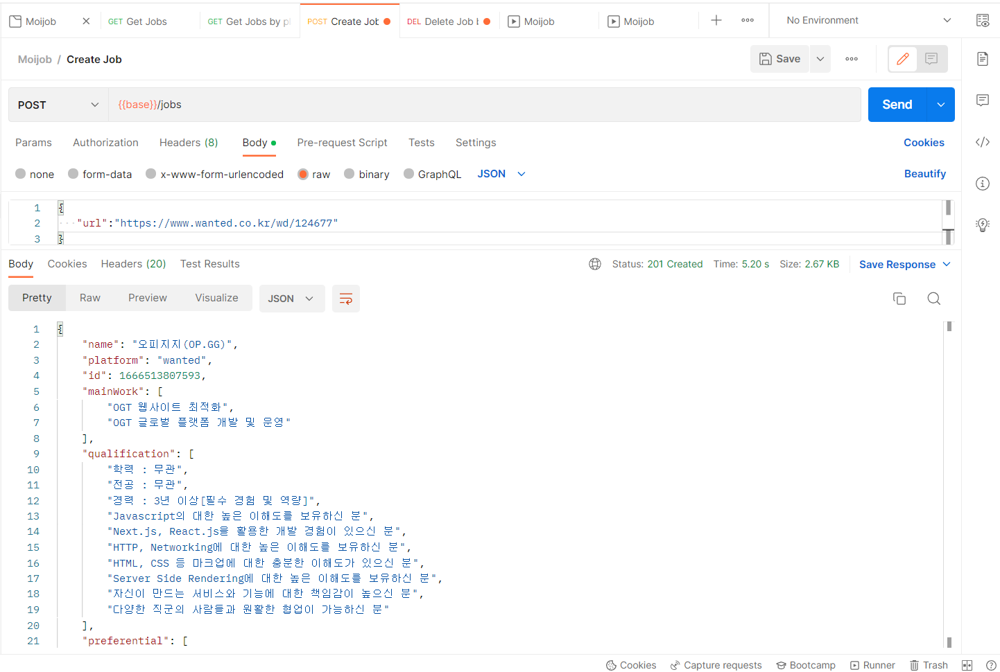

# Puppeteer
Puppeteer는 Chrome브라우저에서 사용할 수 있는 devtools API를 제공하는 Node js 라이브러리이다. 이전에 사용했던 Selenium과 같이 브라우저를 접속해서 이벤트 발생 등 다양한 api를 지원한다. 차이점이라면 Puppeteer는 크롬위에서만 동작하기 때문에 다른 브라우저에서는 사용할 수 없다. 하지만 성능이 Selenium보다 좋고, 서비스가 크롬에서만 작동해도 상관이 없다 생각이 들어 우선 Puppeteer를 사용해보았다.

어제까지 작업했을 때, 생긴 문제는 axios를 이용해 정적으로 페이지를 불러오면 내가 원하는 설명이 담긴 부분들이 들어오지 않는다는 점이었다. 이를 해결하기 위해서 puppeteer를 이용해 동적으로 페이지를 불러왔다.

```javascript
const browser = await puppeteer.launch(); //puppeteer로 브라우저를 실행, 옵션으로 실제로 브라우저를 켤 수 있어
const page = await browser.newPage(); //우리가 사용할 페이지
await page.goto(url); //원하는 url로 연결
const content = await page.content(); // url의 html을 받아와
```

위 코드로 불러온 html에서 어제 공부했던 cheerio를 이용해 데이터를 추출하려 시도했다. 다행히 내 예상이 맞아, 어제와는 다르게 puppeteer를 이용해 데이터를 받아올 수 있었다. 받아온 데이터중에서 span안의 값들은 처음 scheme을 짤 때 생각했던, 배열형식으로 만들기 위해 split을 이용해 배열로 저장했다.

```javascript
	 async creatJob(url) {
    const browser = await puppeteer.launch();
    const page = await browser.newPage();
    await page.goto(url);

    const content = await page.content();
    const $ = cheerio.load(content);
    const titleLists = $('h6');
    const contentLists = $('p>span');
    const result = {
      name: $(titleLists[0]).text(),
      platform: 'wanted',
      id: Date.now(),
      mainWork: [],
      qualification: [],
      preferential: [],
      url,
    };

    contentLists.each((idx, node) => {
      switch (idx) {
        case 1: {
          const mainWork = $(node)
            .text()
            .split('• ')
            .filter((item) => !!item);
          result.mainWork = mainWork;
          break;
        }
        case 2: {
          const qualification = $(node)
            .text()
            .split('• ')
            .filter((item) => !!item);
          result.qualification = qualification;
          break;
        }
        case 3: {
          const preferential = $(node)
            .text()
            .split('• ')
            .filter((item) => !!item);
          result.preferential = preferential;
          break;
        }
      }
    });
    await browser.close();
    return result;
  }
```

async-await으로 감싸진 함수이기 때문에 반환시 promise로 받게 되기에 해당 미들웨어에서도 동일하게 async-await으로 받아서 원하는 데이터를 받아오고, postman으로 정상적으로 동작하는 걸 확인했다.

```javascript
app.post('/jobs', async (req, res, next) => {
  const url = req.body.url;
  const job = await crawler.creatJob(url);
  jobs = [job, ...jobs];
  res.status(201).json(job);
});
```



## 프론트 페이지 기획

프론트 페이지를 어떻게 만들지에 대해서 고민해보니, 내가 보여주고 싶은 내용이 너무 많다는 점이 문제가 되었다. 지금의 데이터도 많은 내용을 받아오고, 거기서 내용에서 더 추출한다해도 어떤 기준으로 줄여야 할지도 문제가 되었다. 그래서 우선은 추출해온 데이터를 다보여줄 수 있는 카드 형식으로 만들어보기로 우선 구상했다. 받아온 데이터에서 필터링의 기준을 조금씩 다양화하고 형식들을 바꿔나가는 방법으로 우선 계획했고, 중요하게 내가 생각했던 전체적인 로직에서 데이터베이스부분을 조금 다르게 가져가야했다.

데이터베이스를 사용할 줄 몰라, 따로 공부가 필요한데 지원했던 원티드 프리온보딩코스에 합격해서, 우선 프론트 공부를 다시 더 초점을 맞춰야하지 않을까란 생각이 들었다. 매주 몇개의 과제가 있을지 모르지만, 과제를 가장 큰 우선순위로 두고 한달을 보내야하기에, 우선은 프론트에서 **파이어베이스**를 이용해서 realtime database를 이용해서 개발을 하고, 서버는 데이터를 추출해서 전달해주기만 하는 방식으로 사용하기로 계획을 수정했다.
