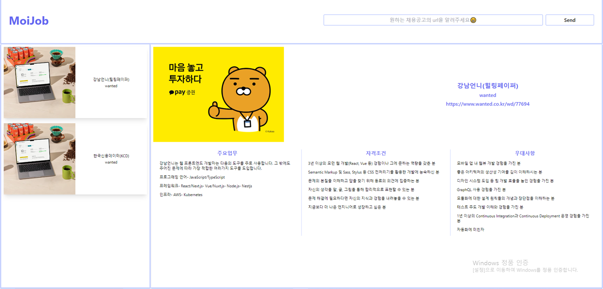

## 채용공고서비스 UI 제작

채용공고서비스 UI를 고민하면서, 정리하는 형식들을 참고하게 되었다.

기존의 서비스를 구상했던 이유가 자동화해서 받아오는 편리함도 있지만, 공고를 쉽게 비교하고 중요내용만 간략하게

보기 위해서 였다. 그러기 위해서는 받은 내용을 보여줄 UI디자인이 중요했고, 참고한건 "evernote" 어플리케이션이다.

[Evernote]

Evernote디자인을 보면 왼쪽의 관련된 내용을 모아두고 자세히 보고 싶은 부분은 오른쪽에 보여주는 형식으로 되어있다. 내 서비스에서도 왼쪽에 스크롤링한 공고들을 간략하게 보여주고, 오른쪽에는 자세히 보고싶은 공고를 보여주는 방식으로 디자인해보았다. UI제작을 위해서 tailwind css라이브러리를 사용해서 제작해보았다. styled-components를 좋아하긴 하지만, 새로운 프로젝트를 하면서 새로운 라이브러리들을 경험해보는 것도 좋을 것 같고, 보다 디자인이 잘되어있는 tailwind를 이용하면 쉽게 내가 원하는 UI를 만들 수 있을 것이라 예상되었다.

우선 제작해본 디자인이다. evernote처럼 왼쪽에 공고들을 간략하게 두고 오른쪽에 자세한 내용을 보여줄 수 있는 공고들을 담았다. 담고보니 조금 부실(?)해보여서 디자인적으로도 계속 고민이 필요하다.

## 로직 구상

서비스가 제공할 일을 정리하면 다음과 같다.

1. 공고의 url을 받아서 전달하면 서버에 url을 전달하고, 데이터를 추출받는다.
2. 추출한 공고를 데이터베이스를 저장한 후에, 사용자가 원하는 기준에 따라 필터링된 데이터들을 보여준다.

첫번째를 위해서, 서버에서는 회사의 이미지도 받아오면 좋을 것 같아, 이미지를 받아오는 부분을 추가하고, 프론트에서는 데이터를 보내고 받는 로직을 추가해야한다. 두번째를 위해서는 localstorage를 우선 이용해 데이터를 저장하고, 필터링을 할 수 있게 UI와 로직을 추가한다.

처음에는 뭔가 괜찮은 아이디어다하고 시작했는데 생각보다 초라하다고 느껴져 맘이 힘들기도 했다. 그래도 **계속해서 업데이트하다보면 좀 더 괜찮아지지 않을까, 누군가가 쓸 수도 있지 않을까** 생각하면서 내일 더 발전시켜나야겠다.
