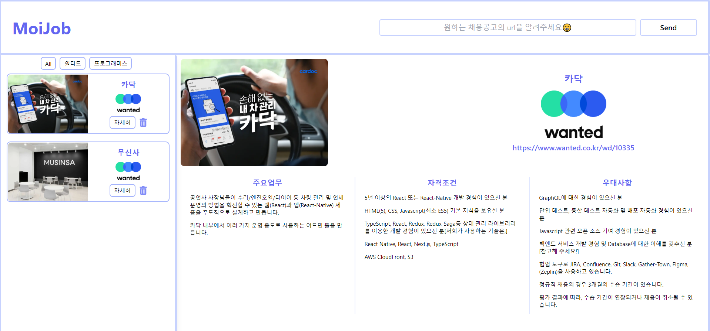
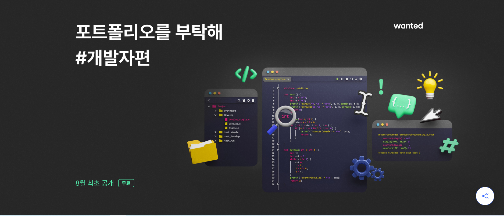
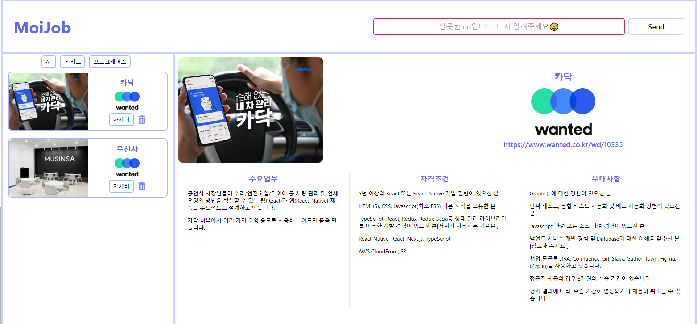

## UI 수정

어제 생각했던 카드를 필터링 할 수 있는 버튼들을 추가하고, 원티드 로고를 추가했다. 서버에서 크롤링 할 때 이미지를 함께 받아올 수 있게 로직을 추가해 조금 더 디자인 적으로 채웠다.

[개선 UI]

그리고 원티드의 포트폴리오 관련 자료를 보다가 서비스를 조금 더 발전 시킬 수 있는 포인트를 얻을 수 있었다.

[원티드 포트폴리오를 부탁해](https://www.wanted.co.kr/events/talk8)



포트폴리오를 작성할 때, 어떤 내용을 핵심으로 삼아서 작성해야 하는 지에 대해서 말씀해주는데, 여기서 가장 큰 포인트가 되었던 점은, 어떤 사람을 찾고 있는지는 "Job Description(JD)"에 담겨있다는 점이었다. JD에 담긴 회사가 바라는 능력을 아는 데서 그치지 않고, 리액트를 잘한다는 것을 어떤 건지, 타입스크립트를 잘 다룬다는 건 어떤 건지 **스스로 잘한다를 정의하고 관련 경험을** **기술한다면** **매력적인 포트폴리오가 될 수 있다**고 말해 주셨다.

그러면 내 서비스도 단순히 크롤링한 걸 보여주고 정리하기만 하지 말고, 정리해온 각각의 JD에 대해 **사용자 자신의 경험과 생각을 정리할 수 있게 까지 한다면 더 좋지 않을까?** 라는 생각이 들어서 우선 페이지를 완성한 후에 기록할 수 있는 페이지를 추가 해보기로 계획했다.

## 크롤링 로직

서버에 만들어놓은 크롤링 로직을 프론트 페이지와 연결했다. 프론트 페이지와 연결하면서 조금 까다로웠던 부분은 입력받은 url을 어떻게 예외 처리를 할 지였다.

#### url 예외처리

url을 체크할 수 있는 곳은 서버와 프론트 모두 가능하기 때문에 어느 곳에서 처리할 지 고민하다가, 안전하게 둘 다 동일한 로직으로 처리했다. 원티드 채용공고들은 "https://www.wanted.co.kr/wd/"로 시작하는 공통점을 발견했고 간단하게 https://www.wanted.co.kr/wd/로 시작하는지만 체크했다.

서버에서는 url이 잘못되면 크롤링을 실행하지 않고 바로 에러를 던져주고, 던져진 에러를 받아서 400 Bad Request로 응답하게 로직을 구성했다.

```javascript
//서버

//crawler.js
export default class Crawler {
  constructor() {
    this.wantedURL = 'https://www.wanted.co.kr/wd';
  }

  checkUrl(url) {
    return url.startsWith(this.wantedURL);
  }

  async creatJob(url) {
    if (!this.checkUrl(url)) {
      throw new Error('잘못된 URL입니다.');
    }
    ...
  }
}


 //app.js

app.post('/jobs', async (req, res, next) => {
  const url = req.body.url;
  let job;
  try {
    job = await crawler.creatJob(url);
    jobs = [job, ...jobs];
    res.status(201).json(job);
  } catch (error) {
    res.sendStatus(400);
  }
});

```

프론트 페이지에서는 동일한 로직으로 에러가 발생하면 placeholder와 border색을 바꿔주게 설정했다.

[에러핸들링적용]

