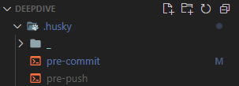

# 1주차-첫번째 섹션 협업툴: 문서화

기대하고 떨리기도 했던 프리온보딩 코스가 오늘부터 시작되었다. 세션의 주제는 ""협업 tool"이었다. 채용공고에서 한번씩 보이던 esLint와 prettier, git, 그리고 처음 알게 된 git hook과 husky에서 다룬 시간이었다. 오늘 수업을 들으면서 "왜 ESLint와 prettier를 채용공고에 넣었을까"라는 의문을 깰 수 있는 시간이었다.

협업 툴의 가장 기본되는 생각은 **같은 세팅에서 시작하자**이다. 이러한 세팅을 위한 기술들에 대해 정리해보고자 한다.

## 1. Git

Git은 분산형 버전 관리 시스템 (DVC: Distributed Version Control)이다.

이전의 CVS(Centralized Version Control)는 오프라인으로 작업이 어려운 점, 서버가 죽으면 데이터가 다 날라가 버리는 단점 등을 있었다.

Git은 오프라인에서도 작업을 할 수 있으며, 개발자 모두가 같은 history를 가지고 있기 때문에 서버가 죽어도 쉽게 복구 시킬 수 있는 장점을 가지고 있다.


이렇게 많은 사람이 함께 사용할 수 있는 Git을 잘 사용하기 위해서는 서로 간의 약속이 필요하고

이걸 **Commit Message Convention**이라고 부른다. 이러한 convention을 지킴으로써 작성자가 아닌 다른 사람이 코드를 읽을 때 어떤 목적으로 코드를 구성했는지 쉽게 알 수 있는 장점이 있다.

### 1.1 Commit Message Convention

코드 컨벤션은 같이 일하는 팀의 약속이기에 내부에서 조금씩 달라질 수는 있지만 모두가 같이 지켜야 하는 약속이다.

대표적인 예로 **[Udacity commit message guide](https://udacity.github.io/git-styleguide/)**가 있다. 내용을 참고해서 정리해 보고자 한다.

```
type: Subject

body

footer
```

위와 같이 커밋 메시지는 세 가지로 크게 나뉜다.

#### Type

타입의 경우 가장 간략히 어떤 일을 했는지 summary를 담아줘야 한다.

- **feat:** A new feature
- **fix:** A bug fix
- **docs:** Changes to documentation
- **style:** Formatting, missing semi colons, etc; no code change
- **refactor:** Refactoring production code
- **test:** Adding tests, refactoring test; no production code change
- **chore:** Updating build tasks, package manager configs, etc; no production code change

위의 내용을 보다 보니 청원사이트 서비스를 만들면서 동일한 convention으로 작업했었고 지금도 커밋 메시지를 이렇게 작성하고 있다. 처음 방법을 잘 배워두었다는 생각이 들었다.

[팀원들과 함께 정한 컨벤션]


#### Body

Body는 선택 사항으로 어떤 문제를 해결했는지 왜 이렇게 수정했는지를 설명하는 부분으로 팀 프로젝트 때 PR을 보내면서 코드를 설명했던 부분과 같았다.

#### Footer

Footer도 동일하게 선택사항이며, 주로 이슈 번호를 담는다고 한다.

### 1.2 Git history

git history는 프로젝트가 어떤 문제들을 해결해왔는지 남기는 **발자취**와 같다고 생각된다. 그렇기 때문에 history에 불필요한 commit들이 남발 되어 있다면 프로젝트가 해결하고자 한 문제점들을 한눈에 알아보기 힘들다. 이러한 부분을 막기 위해서 "squash merge"와 "rebase merge" 전략이 존재한다.

### merge

하나의 문제를 해결하기 위해서 브랜치를 만들고 그 브랜치에서 작업을 한 후에 커밋들을 그냥 merge를 하게 되면 브랜치를 파기 전 commit과 이어져 history에 남게 되고 복잡해진다.


### Squash merge


이것을 해결하기 위해서 사용할 수 있는 방법이 squash merge라는 방법으로 branch의 여러 개의 커밋을 하나의 커밋으로 합쳐서 기존 브랜치에 merge할 수 있다. 하나의 main branch만 남게 됨으로 history가 더 간결해지는 장점을 가진다. 하지만 a,b,c 서로 다른 내용이 하나로 합쳐지기 때문에 자세한 내용은 볼 수 없다는 단점도 가진다.

### Rebase merge


하나하나의 내용을 담을 수 있는 방법으로는 rebase merge로 기존 branch를 만든 init 커밋에서 부모를 e로 rebase를 해 합치는 방식이다. squash merge와 달리 각각의 커밋을 볼 수 있지만 여전히 세부적인 커밋들이 많아질 수도 있다는 단점이 존재한다.

용도에 따라 목적에 따라 두 가지 방법을 사용하면 될 것 같고, 이전 청원서비스를 만들 때에는 PR을 날림으로써 squash merge가 자동으로 되어서 편하게 작업했다. 개인 사이드 프로젝트를 할 때는 branch도 만들지 않고 그냥 커밋했었는데, 이제부터라도 history관리를 해야겠다는 중요성을 느꼈다.

## 2. ESLint 와 Prettier


#### ESLint

ESLint는 자바스크립트에서 에러가 날 수 있는 버그들을 잡아 줄 수 있는 툴이다. 코드와 관련된 두 가지 일을 하는데 하나는 **code formatting,** 다른 하나는 **code quality**이다. 두 가지 일을 다 할 수 있지만 ESLint는 주로 후자인 code quality에 대한 역할을 주로 담당하고, code formatting은 prettier에 일임하는 형식으로 둘을 함께 사용한다.

Code quality부분은 자바스크립트 내부에서 버그가 발생할 수 있거나 불필요한 코드 등에 대해 경고를 미리 던져 주는 역할을 한다. 코드 내에 `console.log()`가 남아있을 때 에러를 던져 주거나, ` ;`로 끝나지 않았을 때 수정 해주는 등의 일을 할 수 있다. 설정 파일은 .eslintrc.js로 원하는 확장자나 규칙들을 추가해서 사용할 수 있고, `eslint <filename>`을 이용하면 직접 실행할 수 있고 `eslint <filename> --fix`를 사용하면 ESLint에서 수정할 수 있는 에러를 수정해준다.

```json
// .eslintrc

{
  "extends": ["react-app", "eslint:recommended"],
  "rules": {
    "no-var": "error", // var 금지
    "no-multiple-empty-lines": "error", // 여러 줄 공백 금지
    "no-console": ["error", { "allow": ["warn", "error", "info"] }] // console.log() 금지
  }
}
```

위 **eslint:recommended**라는 플러그인을 추가해주면 자동으로 eslint 규칙들이 추가되는데 추가되는 규칙은 eslint 공식 문서의 체크표시가 되어있는 규칙들이다.


#### Prettier

Prettier는 ESLint와 달리 code quality에는 관심이 없고, **code formatting**에만 관심을 가지는 툴이다.

prettier와 ESLint의 충돌을 막기 위해서는 간단하게 plugin을 추가하면 되는데, 우선 "eslint-config-prettier"와 "eslint-plugin-prettier" 두 가지 패키지를 설치한다. 설치 후에는 간단하게 .eslintrc.js파일에 해당 플러그인을 추가하면 된다.

```javascript
module.exports = {
  extends: ['eslint:recommended', 'plugin:prettier/recommended'],
};

```

위의 설정에 따른 결과로 ESLint는 두가지 에러를 던져준다.


```javascript
//이전 코드
var foo = 'not used'; //var ESLint
console.log(
  '...............................................................................................................'
);
//prettier

//수정된 코드

var foo = 'not used';

console.log(
  '...............................................................................................................'
);
```

앞서 얘기한 대로 vscode에는 extension이 이미 존재하기 때문에 extension을 사용할 수 있지만, 새로 vscode를 설치하거나 다른 에디터를 사용하는 경우 등 플러그인만 사용하면 자동화가 어려울 수 있다. 일일이 eslint를 돌려보고 버전 관리를 할 수는 없기 때문에 프로젝트를 받고 자동으로 실행해 줄 수 있는 자동화가 필요하다.

### Git hook과 husky를 이용한 자동화

위의 문제를 해결하는 방법으로 **Git hook과 husky**를 함께 사용할 수 있다. Git hook은 git 명령어 사용 전 후에 특정 동작을 실행할 수 있게 설정하는 방법이다. git hook만으로는 설정이 복잡하기 때문에 husky를 이용해서 미리 세팅해둔 git hook을 적용시킬 수 있다.

husky는 `npx husky add .husky/pre-commit "npm run lint"` 와 같이 간단하게 해당 git hook에 맞는 명령어를 저장할 수 있다. 실행하면 .husky라는 폴더가 생기고 해당 hook을 자동으로 실행 해주는 파일이 생성된다. 이것을 이용하면 package.json에 있는 lint라는 script를 커밋 전에 ESLint로 확인한 후에, 통과하면 커밋을 할 수 있게 자동화가 가능하다.



실제로 커밋하면 다음과 같은 결과를 볼 수 있다.

[커밋 전 상태]


[커밋 후 에러]


git hook과 husky를 이용해서 세팅하는 전반적인 과정은 다음과 같이 정리할 수 있다.

1. 처음 husky를 설치 `npm i husky --save-dev`

2. 필요한 hook 추가하기 `npx husky add .husky/pre-push "npm run lint"`

3. husky에 등록되어있는 git hook을 적용 `npx husky install`

   - 이후에 clone하면 바로 실행 될 수 있게 package.json에 `"postinstall":"husky install"` 추가하기

4. scripts에 자동화할 ESLint와 Prettier 명령어 추가하기

   ```json
   {
     "scripts": {
       "postinstall": "husky install",
       "format": "prettier --cache --write .",
       "lint": "eslint --cache ."
     }
   }
   ```

[참고자료]

- NHN Cloud GitHub의 Merge, Squash and Merge, Rebase and Merge 정확히 이해하기](https://meetup.toast.com/posts/122
- https://www.youtube.com/watch?v=Y3kjHM7d3Zo
