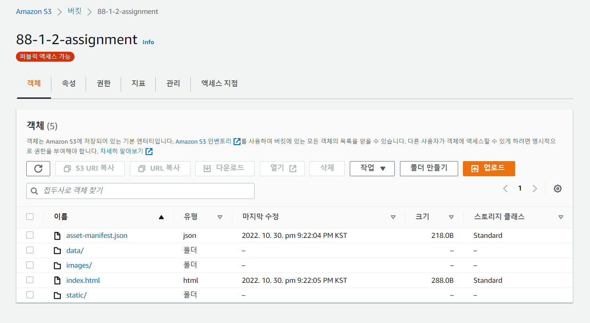

# 초기세팅 커밋 합치기


협업을 위해 ESLint, Prettier를 처음 사용하다보니 규칙들을 추가하고 업데이트를 해갈 필요가 있었다. 그러다 보니 한줄한줄이 추가된 자잘한 커밋들이 쌓여서 보기가 안좋아 이번 프로젝트를 하면서 같이 정했던 규칙들을 추가해 **하나로 합친 commit history**로 합치자는 생각이 들었다.

[commit message 컨벤션이 지켜지지 않아있는 이전모습]

```
* [2022-10-28] [d776662] | [setting] 초기세팅 업데이트   (HEAD -> main)
* [2022-10-27] [13db846] | fix: arrow-body-style eslint 설정 수정   (origin/main, origin/HEAD)
* [2022-10-27] [cc0652e] | fix: comma-dangle 설정 변경
* [2022-10-27] [85db00a] | fix: function-component-definition eslint 설정 수정
* [2022-10-27] [f283b3e] | setting: eslint airbnb style 적용
* [2022-10-26] [b04631c] | Fix : 불필요한 코드 리코일 삭제
* [2022-10-26] [b8a34ae] | feat: 허스키 포함 세팅 추가
* [2022-10-26] [49cbe3e] | feat : 허스키 포함 전 초기 세팅
```

위의 코드들은 .eslintrc.js에 한 두줄의 규칙을 추가한 부분이기 때문에 하나로 묶고 레포에 어떤 규칙이 있는지, 어떻게 세팅된 것을 사용하면 되는지 적어주면 앞으로 프로젝트를 할 때 많은 도움이 될 수 있지않을까 생각이 되었다.

## git rebase

rebase가 merge를 할 때만 이용된다고 생각했었는데 commit들을 합칠 때도 사용할 수 있었다. 우리 프로젝트의 경우 첫 커밋부터 하나로 합치고 싶었기 때문에

`git rebase -i --root`를 통해 초기 커밋을 pick으로 나머지 커밋들은 squash로 합쳐서 하나의 커밋으로 합쳤다.

```
* [2022-10-26] [3a2ab8b] | [setting] 협업툴 (ESLint, Prettier, GitHook, Husky) 초기세팅 추가
```

# 서버와 AWS


이번 수업에서 배웠던 내용은 서버와 클라우드 컴퓨터로 듣기만 하고, 사용해본 적이 없던 aws에 대해서 배울 수 있었다. 서버를 프리온보딩 코스를 시작하기 전에 조금은 공부해서 "항상 켜져 있는 서버"의 필요성을 더 느낄 수 있었다. API를 받기 위해서는 서버가 켜져 있어야 하는데 "moijob" 서비스를 만들면서 서버용과 클라이언트용 서버를 둘 다 켜 놓고 확인해야 했기에 불편함이 있었다.

## 서버

이렇게 항상 켜놓을 수 있는 서버는 두 가지 방식이 존재한다. 한가지는 실제로 내가 사서 서버용으로 컴퓨터를 켜놓는 방식, **On-Premise** 방식이고, 다른 방식은 실제로 사지 않고 클라우드 서버를 이용해 사용하는 **클라우드 컴퓨팅** 방식이다. on-premise방식의 경우에 실제하는 컴퓨터를 사용하기 때문에 실제적인 비용과 관리비용이 따로 들지만 클라우드 서버의 경우 클라우드를 제공해주는 회사에서 관리해주고, 그에 대한 비용을 지불하는 방식이다. 클라우드 서비스를 제공하는 서버는 전세계에 서버실이 있기 때문에 미국에서의 사업을 목표로 한다면 미국의 서버를 이용해 한국서버에서 이용하는 것보다 빠른 성능을 가질 수도 있는 장점과 필요한 만큼의 성능을 사용할 수 있는 장점도 가지기 때문에 현재 주요한 사업 중 하나로 꼽힌다.

## AWS

AWS는 amazon web service로, 클라우드 컴퓨팅의 대표적인 서비스이다. AWS에는 용도에 맞는 다양한 서비스가 존재한다. 그중 아마 내가 가장 많이 사용할 서비스는 S3 (Simple Storage Service)일 것 같다. S3 서비스는 말하자면 dropbox와 같은 기능처럼, 이미지나 파일 등의 정적파일을 불러올 때 사용하며 정적 웹사이트 호스팅에도 사용될 수 있다.

이용은 아주 간단했다. CRA로 만든 프로젝트를 build한 후에 build폴더의 내용을 그대로 올려주기 만하면 Client-side-rendering을 이용한 배포가 간단하게 이루어진다. 이때 버킷의 설정을 public access로 하고 policy를 다음과 같이 설정하면 된다.

```json
{
  "Version": "2012-10-17",
  "Statement": [
    {
      "Sid": "PublicReadGetObject",
      "Effect": "Allow",
      "Principal": "*",
      "Action": "s3:GetObject",
      "Resource": "arn:aws:s3:::<bucket-name>/*"
    }
  ]
}
```


