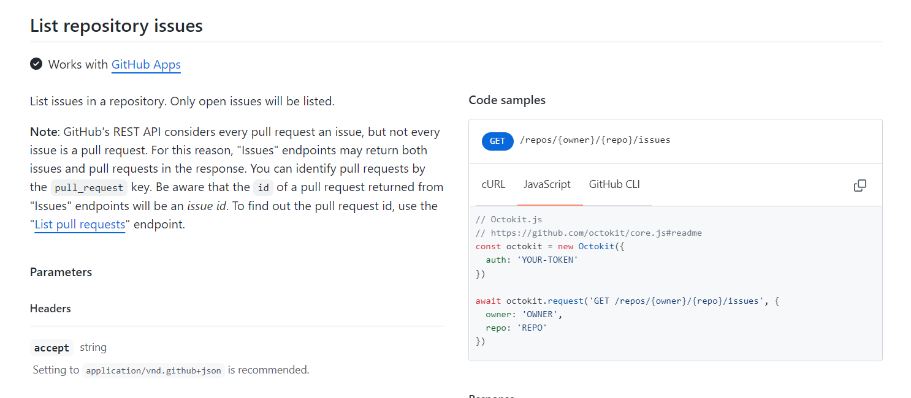
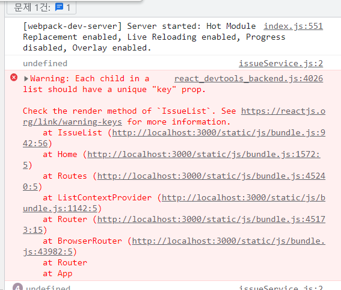

# 🧨1-2 과제 회고

원티드 프리온보딩 두 번째 과제는 github API를 이용해 두 가지 페이지 (이슈 목록과 상세 페이지)를 만드는 과제였다. 세부적인 요구사항에서 가장 중요했던 부분은 리스트에서 **Github API 데이터 요청,** **context API를 활용한 API연동**, **다섯 번째 셀에 광고이미지를 넣어줄 것**, **스크롤을 내리면 이슈 목록에 추가 로딩이 될 수 있게 infinity scroll을 구현할 것**이었다. 위 요구사항을 어떻게 해결했는지에 대해 정리하고 정리해 보고자 한다.

## 1. Github Issue API

첫번째 문제는 간단하게 해결할 수 있었다. 문서를 보니 list issue API에서 기본적으로 open된걸 불러오고 sort query를 이용해서 comment가 많은 순으로 받아올 수 있었다.



문서에서 발생할 수 있는 에러는 404와 422 두 가지이기 때문에 두 가지 에러에 따라 에러메시지를 커스텀할 수 있게 이전에 만들어둔 httpError class를 이용해 알맞은 에러를 반환해 줄 수 있게 했다.

```javascript
//issueService.js

import HTTPError from '../network/httpError';

const getIssueList = async page => {
  const response = await fetch(
    `https://api.github.com/repos/angular/angular-cli/issues?sort=comments&per_page=30&page=${page}`,
    {
      method: 'GET',
      headers: {
        Authorization: `token ${process.env.REACT_APP_TOKEN}`,
      },
    }
  );
  if (!response.ok) {
    throw new HTTPError(response.status, response.statusText);
  } else {
    const data = await response.json();
    return data;
  }
};

export default getIssueList;

//httpError.js

export default class HTTPError extends Error {
  constructor(statusCode, message) {
    super(message);
    this.name = 'HTTPError';
    this.statusCode = statusCode;
  }

  get errorMessage() {
    switch (this.statusCode) {
      case 404:
        this.message = '해당 레포를 찾을 수 없습니다.';
        break;
      case 422:
        this.message = '요청이 잘못된 endpoint로 전달되었습니다';
        break;
      default:
        throw new Error('Unknown Error');
    }
    return this.message;
  }
}

```

## 2. context API를 활용한 API 연동

### Context API

context API는 전역상태를 관리하는 방법으로, provider내부의 컴포넌트들에게 전달시 prop으로 자식 컴포넌트에 하나하나 전달하는게 아니라, 필요한 컴포넌트에서 바로 상태에 접근할 수 있는 db와 같은 역할을 할 수 있다. 이번 과제에서 context API를 사용하려고 한다면 issue list를 불러오고 불러온 데이터를 context API에 넣어주어, list내용이 필요한 곳에서 사용이 가능하게 만들었다.

</img>

context API 자체에서 api를 이용해 값을 넣어둘까 생각을 했지만, 내부에서 계속 값이 바뀌면 받는 시점에 따라 다른 데이터가 전달될 수도 있을 것 같아 단순이 데이터만 보관하고 변경할 수 있는 함수를 context로 같이 제공하는 방식으로 코드를 구성했다.

```javascript
import { useMemo, useState, createContext } from 'react';

export const ListContext = createContext();
export const ListContextProvider = ({ children }) => {
  const [issues, setIssues] = useState({});
  const setNextPage = () => setPage(page + 1);
  const value = useMemo(
    () => ({ issues, page, setNextPage, setIssues }),
    [issues, page]
  );
  return <ListContext.Provider value={value}>{children}</ListContext.Provider>;
};
```

### Custom Hook: useFetch

두가지 페이지 중 어디를 먼저 접속해도, api로 데이터를 contextAPI에 저장하게 하기 위해서는 동일한 로직을 두 페이지 모두 가지고 있어야 했다. 로직의 재사용을 위해 useFetch라는 custon Hook을 만들어서 한 곳에서 관리할 수 있게 했고, 두 페이지 중 어디를 접속해도 리스트를 불러올 수 있기 때문에 성능이 더 좋게 구성할 수 있겠다는 생각이 들었다.

useEffect 내부에서는 async await으로 함수를 감싸면 promise가 반환되기 때문에 사용할 수 없어, getList를 함수를 따로 만들어서 useEffect로 실행해 주는 로직을 사용했다.

```javascript
const useFetch = () => {
  const { issues, setIssues, page } = useContext(ListContext);
  const [isLoading, setIsLoading] = useState(true);
  const [error, setError] = useState('');
  const getList = async () => {
    setIsLoading(true);
    try {
      const data = await getIssueList(page);
      if (data.length === 0) {
        setLastPage(true);
      }
      setIssues((prev) => {
        const updated = { ...prev };
        data.forEach((issue) => {
          updated[issue.id] = issue;
        });
        return updated;
      });
    } catch (error) {
      setError(error.errorMessage);
    }
    setIsLoading(false);
  };
  useEffect(() => {
    getList();
  }, [page]);

  return [isLoading, error, issues, lastPage];
};
```

### issues 전역상태 자료구조

context 내부 상태를 처음에는 배열을 이용해 api 데이터들을 담아두려고 했다. 하지만 상세페이지에 갔다가 돌아왔을 때, api가 호출되면서 같은 데이터가 두개씩 들어가는 오류가 생겼다. 이러한 오류를 해결하기 위해서 **Set**을 이용해 중복된 데이터는 제거하려 했지만, 여전히 남아있었다. 중복제거가 되지 않았던 이유는 데이터 object들이 같은 자료를 가지고 있지만 **다른 참조값**을 가지고 있어 다른 값으로 처리가 된다고 생각했다.

이러한 중복을 제거하기 위해서 처음에는 받은 배열과 기존 배열을 비교하는 로직을 짜려고 했지만, **O(n^2)의 시간복잡도**를 가지기 때문에 자료양이 많아질수록 성능이 안 좋아질 것이라는 생각이 들었다.

이점을 해결하기 위해서 자료구조를 **Object**로 바꾸었다. object의 key를 data의 id로, value를 데이터 자체로 한 오브젝트를 만들면, 중복을 간단하게 제거할 수 있고 이후에 배열로 바꾸어 mapping할 때 정렬만 해주면 되기 때문에 **O(nlogn)**으로 보다 나은 성능을 갖게 될 것이라 예상했다.

```javascript
const IssueList = () => {
  const { setNextPage } = useContext(ListContext);
  const [isLoading, error, issues, lastPage] = useFetch();

  return (
    <>
      <S.List>
        {Object.values(issues)
          .sort((a, b) => b.comments - a.comments)
          .map((issue, idx) => {
            return <IssueItem key={issue.id} {...issue} />;
          })}
        {isLoading && <Loader />}
      </S.List>
    </>
  );
};

export default IssueList;
```

자료구조를 object로 바꾼 덕분에 detail페이지에서 보여줄 때도 다른 api 호출없이 useParam으로 받아온 id값으로 issues에 접근해 데이터를 불러올 수 있었다.

```react
import React, { memo } from 'react';
import { useNavigate, useParams } from 'react-router';
import S from './styles';
import formatDate from '../../utils/formatDate';

const IssueItem = ({ id, number, title, user, created_at, comments }) => {
  const navigate = useNavigate();
  const params = useParams();
  const date = formatDate(created_at);
  const handleClick = () => {
    if (!params.id) {
      navigate(`/detail/${id}`);
    }
  };
  return (
    <S.List onClick={handleClick} params={!!params.id}>
      <S.LeftBox>
        <header>
          <span>{`#${number}`}</span>
          <S.Title>{title}</S.Title>
        </header>
        <div>
          <span>{`작성자: ${user && user.login}`}</span>
          <span>{date}</span>
        </div>
      </S.LeftBox>
      <S.RightBox>
        코멘트:
        {comments}
      </S.RightBox>
    </S.List>
  );
};

export default memo(IssueItem);

```

## 3. 다섯번째 셀에 광고 보여주기

list의 특정부분에 추가된 것을 보여준 것을 해본 적이 없어서 고민하다, mapping을 할 때 index가 4가 되었을 때 issueItem 컴포넌트와 함께 adBox 컴포넌트를 보여주는 방식을 선택했다. 하지만 key가 계속해서 중복된다는 에러가 발생했다.

```react
import React, { useContext } from 'react';
import S from './styles';
import IssueItem from '../issueItem/IssueItem';
import AdBox from '../adBox/AdBox';
import useFetch from '../../hooks/useFetch';
import useObservation from '../../hooks/useObservation';
import { ListContext } from '../../context/ListContext';
import Loader from '../loader/Loader';

const IssueList = () => {
  const { setNextPage } = useContext(ListContext);
  const [isLoading, error, issues, lastPage] = useFetch();

  return (
    <>
      <S.List>
        {Object.values(issues)
          .sort((a, b) => b.comments - a.comments)
          .map((issue, idx) => {
            if (idx === 4) {
              return (
                <>
                  <AdBox />
                  <IssueItem key={issue.id} {...issue} />
                </>
              );
            }
            return <IssueItem key={issue.id} {...issue} />;
          })}
        {isLoading && <Loader />}
      </S.List>
    </>
  );
};

export default IssueList;

```
 <br/>


 
<br/> 
어디서 계속해서 에러가 나오는지 찾는 중에 issueItem에 key값을 주었기 때문에 에러가 발생되었다는 것을 알게되었다. 해결하기 위해서 fragment가 아니라 div로 감싸주고 div에 key값을 전달해줘 에러를 해결할 수 있었다.

```react
import React, { useContext } from 'react';
import S from './styles';
import IssueItem from '../issueItem/IssueItem';
import AdBox from '../adBox/AdBox';
import useFetch from '../../hooks/useFetch';
import useObservation from '../../hooks/useObservation';
import { ListContext } from '../../context/ListContext';
import Loader from '../loader/Loader';

const IssueList = () => {
  const { setNextPage } = useContext(ListContext);
  const [isLoading, error, issues, lastPage] = useFetch();


  return (
    <>
      <S.List>
        {Object.values(issues)
          .sort((a, b) => b.comments - a.comments)
          .map((issue, idx) => {
            if (idx === 4) {
              return (
                <div key={issue.id}>
                  <AdBox />
                  <IssueItem {...issue} />
                </div>
              );
            }
            return <IssueItem key={issue.id} {...issue} />;
          })}
        {isLoading && <Loader />}
      </S.List>
      {!lastPage ? (
        <S.Target ref={targetRef} />
      ) : (
        <S.Banner>마지막 페이지입니다🎈</S.Banner>
      )}
    </>
  );
};

export default IssueList;

```

(나중에 안 사실이지만 react.fragment에도 key값을 줄 수 있다고 한다.)

## 4. Infinite Scroll

이번 과제에서의 가장 큰 핵심 조건이었다. 테오님의 오픈채팅방에서도 간간히 올라오던 **infinite scroll**에 대한 질문들을 보면서 저게 왜 필요하지라는 생각을 했었는데 이번에 직접 구현해보면서 사용자 경험을 향상시킬 수 있는 기능이라는 점을 많이 느꼈다. 한번도 구현해본 적이 없던 기능이기 때문에 관련 글을 많이 찾아보고 가장 잘 정리되어 있는 [카카오 엔터프라이즈의 글](https://tech.kakaoenterprise.com/149)을 참고해 만들어보았다.

만드는 방식을 scroll event를 이용하는 방식과 Intersection Observer API를 사용하는 두 가지 방식이 설명되어 있었는데, 이전에 Intersection Observer API를 사용해본 경험이 있었기 때문에 곧바로 Intersection Observer API를 이용해서 구현해 보았다.

기본적인 로직은 observer가 **관찰해야 할 target**을 만들고, observer가 감지할 영역에 대한 정보를 담은 **option**과 감지되었을 때 API 호출을 해줄 **callback**을 전달해 구현하는 방식이다. callback함수는 useFetch hook에 연결해두었던 page를 증가시키는데, page 상태를 앞선 useFetch의 useEffect hook의 dependency로 전달해두었기 때문에 페이지 변화에 따라 api 호출이 자동으로 연결된다.

### Custom Hook: useObservation

Observation을 하는 로직을 관심사 분리를 할 수 있게 useObservation이라는 Hook으로 로직들을 정리했다. Hook은 관찰할 ref를 반환해 ref를 우리가 원하는 타겟으로 연결할 수 있다.

```react
import { useCallback, useEffect, useRef } from 'react';

const option = {
  root: null,
  rootMargin: '0px',
  threshold: 1,
};

const useObservation = onIntersect => {
  const ref = useRef(null);
  const callback = useCallback(
    (entries, observer) => {
      entries.forEach(entry => {
        if (entry.isIntersecting) onIntersect(entry, observer);
      });
    },
    [onIntersect]
  );

  useEffect(() => {
    if (!ref.current) {
      return;
    }
    const observer = new IntersectionObserver(callback, option);
    observer.observe(ref.current);
    return () => observer.disconnect();
  }, [ref.current, callback]);
  return ref;
};

export default useObservation;

```

어려웠던 점은 **초기 렌더링 시에 전달해주었던 callback이 실행되어서 계속해서 page 2인 상태로 시작되는 점**이었다. 이것을 막기 위해서 useFetch의 isLoading상태를 이용해서 로딩이 아닐 때만 useObservation에 전달해준 callback 함수가 실행되게 했다.

```react
import React, { useContext } from 'react';
import S from './styles';
import IssueItem from '../issueItem/IssueItem';
import AdBox from '../adBox/AdBox';
import useFetch from '../../hooks/useFetch';
import useObservation from '../../hooks/useObservation';
import { ListContext } from '../../context/ListContext';
import Loader from '../loader/Loader';

const IssueList = () => {
  const { setNextPage } = useContext(ListContext);
  const [isLoading, error, issues] = useFetch();
  const onObserve = (entry, observer) => {
    observer.unobserve(entry.target);
    if (!isLoading) {
      setNextPage();
    }
  };

  const targetRef = useObservation(onObserve);

  return (
    <>
      <S.List>
        {Object.values(issues)
          .sort((a, b) => b.comments - a.comments)
          .map((issue, idx) => {
            if (idx === 4) {
              return (
                <div key={issue.id}>
                  <AdBox />
                  <IssueItem {...issue} />
                </div>
              );
            }
            return <IssueItem key={issue.id} {...issue} />;
          })}
        {isLoading && <Loader />}
      </S.List>
      <S.Target ref={targetRef} />
    </>
  );
};

export default IssueList;

```

### 마지막 페이지 무한 API 호출

구현이 다 끝난 줄 알았지만 마지막 페이지에서 계속해서 API가 호출되는 에러가 발생했다.


에러 해결을 위해서 팀원분들의 도움을 받아 useFetch에 lastPage라는 상태를 추가했고, 더 이상 불러올 데이터가 없으면 빈 배열로 받아오는 점을 이용해 data.length가 0일 때 lastPage를 True로 바꿔 해결할 수 있었다.

```react
//useFetch.jsx

const useFetch = () => {
  const { issues, setIssues, page } = useContext(ListContext);
  const [isLoading, setIsLoading] = useState(true);
  const [error, setError] = useState('');
  const [lastPage, setLastPage] = useState(false);
  const getList = async () => {
    setIsLoading(true);
    try {
      const data = await getIssueList(page);
      if (data.length === 0) {
        setLastPage(true);
      }
    ...
  };
  useEffect(() => {
    getList();
  }, [page]);

  return [isLoading, error, issues, lastPage];
};

export default useFetch;


//issueList.jsx

import React, { useContext } from 'react';
import S from './styles';
import IssueItem from '../issueItem/IssueItem';
import AdBox from '../adBox/AdBox';
import useFetch from '../../hooks/useFetch';
import useObservation from '../../hooks/useObservation';
import { ListContext } from '../../context/ListContext';
import Loader from '../loader/Loader';

const IssueList = () => {
  const { setNextPage } = useContext(ListContext);
  const [isLoading, error, issues, lastPage] = useFetch();
  const onObserve = (entry, observer) => {
    observer.unobserve(entry.target);
    if (!isLoading && !lastPage) {
      setNextPage();
    }
  };

  const targetRef = useObservation(onObserve);

  return (
    <>
      <S.List>
		...
      </S.List>
      {!lastPage ? (
        <S.Target ref={targetRef} />
      ) : (
        <S.Banner>마지막 페이지입니다🎈</S.Banner>
      )}
    </>
  );
};


```


## 마치며

혼자 공부할 때는 그냥 에러해결을 위해서 해결방법을 찾고 기록하는 게 다였는데, 팀원분들이 물어봐 주시고 도와주시는 과정이 나에게 너무 너무 소중한 경험이었다. 내가 **왜 이렇게 코드를 짰는지** 물어 봐주는 사람이 있다는 게,**피드백과 질문**을 해주시는 분이 있다는 게 내가 성장할 수 있는 기회라는 생각이 들었다. 앞으로는 더 고민하고 **왜**와 **어떻게**를 잘 설명하는 코드들을 담아내서 더 잘 준비해 나갈 수 있는 시간으로 삼아 가야겠다.
