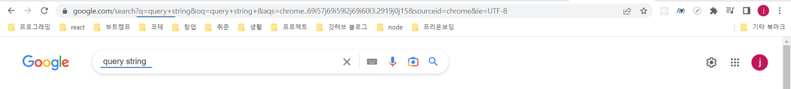

# 📜 과제 설명

이번 과제는 간단하게 하나의 페이지로 되어있고 **검색창과 검색어 추천 기능**을 구현하는 과제였다. 검색창을 UI로 구현한 후에 검색창에 입력에 따라 관련된 추천 검색어를 api를 이용해 받아와 보여주면 되는 간단해 보였던... 하지만 하나하나 공부할 게 많았던 유익한 과제였다.

세부 부분은 총 4가지로 다음과 같이 정리할 수 있다.

1. 추천 검색어에서 키워드 볼드처리
2. API호출한 결과를 로컬 캐싱
3. 입력마다 api호출을 하지 않게 api 호출 횟수를 줄이기
4. 키보드 만으로 추천 검색어로 이동하게 하기

저번과 달리 React Query를 사용하지 않았는데, 이유는 React Query를 사용하면 자동으로 서버 데이터를 로컬 캐싱할 수 있기 때문에 제한되었고, Typescript를 기반으로 진행했다.

# 🎈 전역상태에 대한 고민

특별히 이번과제를 하면서 신경썼던 부분은 **전역상태**였다. 당연히 고민해야할 부분이지만 저번 과제를 피드백을 받으면서 전역상태를 어떻게 관리해야 하는지 디테일하게 알게 되었다. 저번 과제에서 마지막에 react query를 이용해 리팩토링을 하면서 서버의 데이터를 받은 후에 다시 context API를 이용해 전역상태로 넘겨주는 방식으로 사용했다. 멘토님께서 **Server State를 다시 Client State로 다룰 이유가 없다**고 말씀해주셨다.

**Server State와 Client State**, 처음 생각해본 주제였다. 당연히 server에서 받아온 데이터를 사용하려면 client의 전역상태로 받아서 사용해야한다고 생각했었다. server State와 client State는 어떻게 다른걸까?

## Server state와 Client state

둘의 차이에 대해서 찾아보면서 [React Query와 상태관리 :: 2월 우아한테크세미나](https://www.nashu.dev/content-a-day/20220222/react-query) 글을 읽으면서 이해하게 되었다.

**Client State**

- client에서 관리하는 상태
- 다른 사람과 공유하지 않고 client 화면에서 사용자와 interaction으로 변화가능
- client 에서 최신으로 관리됨

**Server State**

- server에서 관리하는 상태
- fetch와 같이 네트워크 api가 필요함
- 다른 사람과 공유하는 데이터로 변경된 데이터를 사용자가 알 수 없을 수 있음

둘의 가장 큰 차이점은 **데이터를 관리하는 주체가 누구냐**에 있다. 그렇기 때문에 이전 방식처럼 api를 호출한 후에 결과를 로컬의 전역상태로 관리한다면 사실은 서버의 데이터가 바뀌었을 때 반영하기 어려운 문제가 존재했다. 그리고 이런 부분을 해결하기 위한 라이브러리들 만의 방법이 있지만 **react Query**를 이용하면 stale time와 같은 option들을 이용해 시간을 정해 새로 받아올 수 있고, 자동 로컬 cahche기능도 제공하기에 **Server state와 Client state** 를 구분해서 관리할 수 있다는 큰 장점을 갖게된다. 이제야 react query의 필요성을 제대로 이해할 수 있게 되었고, 다음 step으로 그럼 어떤걸 client의 전역상태로 관리해야할까?

## **어떤 기준**으로 전역상태를 선택할까?

**Server state와 Client state** 를 구분하고 나니 내가 생각해왔던 전역 상태의 기준이 흔들렸다. 어떤 기준으로 전역상태를 선택하면 될지가 다음 고민으로 이어졌다. 해답은 context API를 이용하는 이유와 동일했다, Prop-drilling을 막기 위해. 반복적으로 상태를 전달해주는 경우 내 기준은 2번 이상의 component를 거쳐서 전달해줘야한다면 하나의 client 전역상태로 관리하면 좋겠다는 기준이 생겼다. 그러면 전역상태를 관리하는 방법은 contextAPI, redux, recoil과 같은 라이브러리가 다일까?

## Query String: 잊혀진 전역상태

상태관리라 하면 contextAPI나 redux와 같은 라이브러리만을 떠올렸지만, 이번 수업시간에 하나의 전역상태 관리방법으로 **Query String**에 대해 멘토님께서 알려주셨다. 가장 기본적인 요소이지만 고민하지 못했던 부분이었다. 우리가 쇼핑몰 사이트에서 여러가지 필터(키, 옷 종류 등)를 적용한 후에 친구에게 공유한다고 했을 때 화면과 url이 동기화 되어있지 않다면 친구가 보는 화면은 내가 보여주고 싶어했던 페이지와는 다른 페이지 될 것이다.

이렇게 query String을 하나의 전역상태로 생각해 query String에 따라 화면을 렌더링할 수 있고, 이러한 방법은 세부적인 필터나, 입력값을 관리할 때 유용하다는 것을 알게 되었다.

(실제 구글 검색창에 내용을 입력한 후에 구글의 url을 보면 반영되어 있는 것을 볼 수 있다)



이번 과제를 하면서 원래는 keyword라는 전역상태를 만들고 input의 값이 변화할 때마다 keyword상태를 변화시켜 api를 호출하려 했지만, **query String을 바꿈으로써 query에 따라 api를 호출하는 방식으로 상태관리를 해보면 어떨까**라는 생각으로 프로젝트를 진행했다.

처음에 useParams를 이용하면 query String을 받아올 수 있을까 했지만 useParms로 받아올 수 있는 것은 말그대로 paramter, /:id라면 id값만 받아올 수 있었다. query string을 받아오기 위해서는 **window.location**을 이용하거나 react-router-dom의 **useLocation**을 이용해서 path를 받고 별도의 qs 라이브러리를 이용해 object로 만든 후에 받아오는 방법도 있었다. 하지만 추가적인 라이브러리없이, 간결하게 사용하고 싶어 **useSearchParam**이라는 react-router-dom의 메소드를 이용했다.

useSearchParam은 useState처럼 배열의 첫 요소는 현재 url의 파람이 담겨있고, 두번째 요소는 param을 변경할 수 있는 setState와 같은 함수가 담겨있다. 값만 받아오면 되기 때문에 첫요소의 메소드인 get으로 해당 query string을 받아 하나의 상태로 관리했다.

```tsx
import { useSearchParams } from 'react-router-dom';

const useQueryString = () => {
  const [params] = useSearchParams();
  const query = params.get('q') || '';
  return query;
};

export { useQueryString };
```

<br/>

# 💾 로컬 캐싱

이번 과제의 핵심적인 부분중 하나였던 로컬 캐싱을 할 수 있는 방법으로 **HTTP cache-control**, **local Storage**, **Session Storage** 세가지에 대해서 고려했고, **Session Storage**를 이용하기로 결정했다.

## HTTP cache-control

HTTP cache-control은 api호출 후에 받아온 데이터를 저장한 후에 이후 같은 데이터를 요청했을 때 새로 api를 호출하는 것이 아니라, cache되어 있는 데이터를 가져올 수 있는 방법으로, 서버 state의 변화를 확인하고 가져올 수 있어 가장 좋은 방법이라 생각되었다. 네트워크 상에서는 cache data의 경우 데이터 크기가 작고, 서버의 응답이 200과 304로 구분되어 표시되었지만, client에서의 서버 응답이 모두 동일하게 200 OK로 들어와 cache된 데이터인지 확인하기 어려운 문제가 있었다.

[서버의 응답]


[client가 받은 서버의 응답]


## Browser Storage

다음으로 브라우저 내의 storage를 이용하는 방식을 고려했다. 서버의 데이터를 브라우저로 가져와서 client에서 저장하다보니 **서버의 데이터 변화를 알 수 없는 단점**이 존재한다. 그렇기 때문에 브라우저에 닫아도 계속해서 저장하는 local storage가 아니라 브라우저를 닫으면 저장된 데이터를 초기화하고, 새로운 api 호출을 하는 **session storage**를 이용하는 게 더 적절한 선택이라 생각되었다.

session storage를 처음 써봤지만 local Stoarge와 동일한 method라 사용법은 간단했고, 저장할 때는 JSON.Stringfy를 받아올 때는 JSON.parse를 이용해 변화해줘야했기 때문에 CacheService class를 만들어 사용했다.

```typescript
export default class CacheService {
  static setData = (query: string, words: SearchType[]) => {
    const stringifyWord = JSON.stringify(words);
    sessionStorage.setItem(query, stringifyWord);
  };

  static getData = (query: string) => {
    const data = sessionStorage.getItem(query);
    const parsedData: SearchType[] = JSON.parse(data || JSON.stringify([]));
    return parsedData;
  };
}
```

다른 팀의 코드에서 map을 이용해 로컬 캐싱을 구현한 부분을 보면서 이렇게 구현할 수도 있었겠구나 느끼기도 했다.

```typescript
const myCache = new Map();

export const setMyCacheData = <T>(key: string, data: T) => {
  const value = { data, expired: new Date().getTime() + 5000 };
  myCache.set(key, value);
};

export const getMyCacheData = (key: string) => {
  if (myCache.has(key)) {
    if (myCache.get(key).expired > new Date().getTime()) {
      return myCache.get(key).data;
    } else {
      myCache.delete(key);
    }
  }

  return null;
};
```
<br/>
# 🎨키워드 Bold 처리

키워드는 queryString을 이용해서 간단하게 가져올 수 있었지만 api 데이터에서 해당 query를 bold처리하기 위해서는 별도의 방법을 고민해야했다. string을 tag로 바꿔줘야했기 때문에 관련 내용을 찾아보았더니 가장 먼저 나온건 `dangerouslySetInnerHTML`이었다. 이름부터 쓰지말라는 것 같아 왜 사용하면 안되는지 먼저 찾아보니, 문자열을 태그로 바꿀 수 있다는 것은 사용자가 임의로 script를 삽입할 수 있다는 보안문제가 존재했다.

이를 보완하기 위해 우선 문자열 내의 query부분을 기준으로 split으로 array를 만들어 키워드가 있는 index에만 `<b></b>`로 감싸주는 방식으로 해결했다. 키워드를 기준으로 자르기 때문에 항상 키워드는 두번쨰에 존재해 쉽게 처리할 수 있었다.

```tsx
//splitByKeyword.ts
const splitByKeyword = (query: string, text: string) => {
  if (text.toUpperCase().includes(query.trim().toUpperCase())) {
    return text.split(new RegExp(`(${query})`, 'gi'));
  }
};

export { splitByKeyword };

//searchItem.tsx

const KEYWORD_INDEX = 1;

const SearchItem = ({
 ...
}: SearchItemProps) => {

  const query = useQueryString();
  const textArray = splitByKeyword(query, text);

  return (
    <Link to={`/search?q=${text}`}>
      <S.Wrapper ref={itemRef} active={active} onMouseEnter={handleMouseEnter}>
        <BsSearch />
        <span>
          {textArray?.map((item, idx) => {
            if (idx === KEYWORD_INDEX) {
              return <b key={item}>{item}</b>;
            }
            return item;
          })}
        </span>
      </S.Wrapper>
    </Link>
  );
};

export default SearchItem;
```
<br/>

# ✨Debouncing과 Throttling

입력마다 API호출하지 않도록 호출 횟수를 줄이는 방법을 찾아보다가 Debouncing과 Throttling에 대해 알게 되었다. 사실 이전 무한 스크롤을 구현하는 과제에서 scroll event를 이용해 구현했을 때 생기는 문제를 해결하는 방법으로 Debouncing과 Throttling있다는 점을 본 적이 있었다. 하지만 그때는 Intersection Observer API를 이용했어서 크게 공부를 안했지만 이번기회에 제대로 공부해보고자 했다.

## Debouncing

Debouncing은 자주 발생하는 이벤트를 원하는 시점의 이벤트를 기준으로 일을 처리하는 방식이다. 이번과제에서는 input의 onChange로 인해 생기는 이벤트에 따라 api를 호출해서 추천 검색어를 받아와야했다. 만약에 모든 event에 대해서 api를 불러온다면 불필요한 API 호출이 생기기 때문에 onChange의 event 중 사용자가 입력을 마쳤을 때의 input value를 api로 호출하는게 더 효율적인 방법이 되었다. 이를 구현하기 위해서 마지막으로 입력된 값을 api로 전달하는 debounce방식을 이용했다.

```typescript
useEffect(() => {
  if (query) {
    if (NO_SESSION_ITEM) {
      dispatch({ type: 'SET_DATA', data: cachedItem });
    } else {
      const debounce = setTimeout(() => {
        getResponse();
      }, DELAY_TIME);
      return () => clearTimeout(debounce);
    }
  }
}, [query]);
```

setTimeout을 이용해 delay time 뒤에 전달해준 callback 함수를 실행하게 하는데, 이때 input의 입력으로 query가 바뀌면 이전 실행대기중이던 debounce 함수는 clearTimemout으로 인해 사라지게 되고 마지막으로 전달해준 값만 실행시키는 방식으로 debouncing을 구현했다.

## Throttling

Throttling은 일정 시간을 두고 시간 안의 하나의 이벤트만을 처리하는 방식이다. debouncing과 다른 점으로 정해진 시간내에 다른 입력이 들어와도 무시하고 정해진 시간이 지난 이후에 다시 이벤트를 받아 실행시킨다는 점이다. 둘을 정리하면 주기적으로 이벤트를 발생시키는 것이 Throttling, 처음이나 끝에 들어온 이벤트만을 처리하는 방식이 Debouncing으로 이해할 수 있다.

debouncing은 검색과 같이 시점의 결과가 중요할 때 사용하고, throttling은 무한 스크롤과 같은 과제에서 성능개선을 위해 사용할 수 있다. 이번기회에 제대로 이해할 수 있어 좋은 기회가 되었다.

<br/>

# ⌨ 키보드만으로 추천검색어로 이동가능하도록 구현

키보드만으로 추천검색어들로 이동하기 위해, 추천 검색어 **리스트 배열의 index와 keydown, keyup event**를 이용했다.

window의 keydown, keyup Event를 사용해 화면에서 방향키를 눌러 바로 추천검색어 리스트로 이동이 가능하게 해, 변화된 index와 searchItem의 index가 같을때 해당 searchItem 컴포넌트의 배경색을 변화시켜 현재 위치를 UI로 알 수 있게 했다.

추천 검색어 리스트 배열의 자료 양이 많아지면 scroll이 생기고 container 크기 밖의 item이 보이지 않는 문제점이 있었다. 이를 해결하기 위해서 scrollIntoView 메소드를 이용해 해당 아이템의 위치로 자동으로 스크롤이 될 수 있게 했다.

마우스이동과 키보드이동이 호환이 가능할 수 있게 하기 위해서 mouse Event에 따라서도 index가 변할 수 있게 했는데, 처음에 mouseMove 이벤트를 이용했더니 너무 많은 이벤트가 발생해 당황하기도 했다. 마우스가 해당 item에 올라왔을 때만 index를 바꿔주면 되니까 mouseEnter로 해결할 수 있었다.

적절한 이벤트 선택이 중요하다는 것도 배울 수 있는 기회였다.

```tsx
//useKeyboard
import { useState, useEffect } from 'react';

type KeyType = 'ArrowDown' | 'ArrowUp' | 'Enter';

const useKeyPress = (targetKey: KeyType) => {

const [keyPressed, setKeyPressed] = useState(false);

const downHandler = (event: KeyboardEvent) => {
  const { key } = event;
  if (key === targetKey) {
    setKeyPressed(true);
    }
  };

const upHandler = (event: KeyboardEvent) => {
  const { key } = event;
  if (key === targetKey) {
    setKeyPressed(false);
    }
  };

useEffect(() => {
  window.addEventListener('keydown', downHandler);
  window.addEventListener('keyup', upHandler);

  return () => {
    window.removeEventListener('keydown', downHandler);
    window.removeEventListener('keyup', upHandler);
   };
 });

return keyPressed;
};

export { useKeyPress };

//SearchItem.tsx
const KEYWORD_INDEX = 1;

const SearchItem = ({
 active
 ...
}: SearchItemProps) => {
  const itemRef = useRef<HTMLLIElement>(null);

  const handleMouseEnter = () => {
    setIsMovingMouse(true);
    setCursor(index);
  };
  useEffect(() => {
    if (active && !isMovingMouse) {
      itemRef.current?.scrollIntoView({
        behavior: 'smooth',
        block: 'center',
      });
    }
  });
  return (
    <Link to={`/search?q=${text}`}>
      <S.Wrapper ref={itemRef} active={active} onMouseEnter={handleMouseEnter}>
        <BsSearch />
        <span>
          {textArray?.map((item, idx) => {
            if (idx === KEYWORD_INDEX) {
              return <b key={item}>{item}</b>;
            }
            return item;
          })}
        </span>
      </S.Wrapper>
    </Link>
  );
};

export default SearchItem;

```

<br/>

# 😀 마치며

이제 마지막 과제만을 앞에 두고 있다. 다음주면 한달간의 과정이 끝나고 진짜 지원을 하게되는데 걱정되고 두렵기도 하다. 하지만 배운 내용을 통해 넓혀진 시야와 다른 사람들의 코드를 보면서 배운 더 좋은 코드들을 내가 해왔던 프로젝트들에 적용해 간다면 분명 더 큰 경쟁력과 힘이 될 것 같다는 자신감도 생긴다. 공부할 건 많지만, 조급한 마음보다 기쁜 마음으로 배워가는 태도를 유지해가자.
