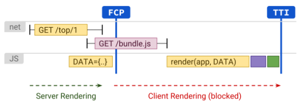

# 👓 Next JS

Next js는 typescript와 함께 프론트엔드의 뉴노멀이라고도 불리는 프레임워크로, 내가 관심이 갔던 대부분의 기업들에서 사용하고 있는 기술이다. 기술을 이해하기 위해서 먼저 웹의 역사를 먼저 정리해 보고, CSR과 SSR의 각각의 장단점과 둘의 방식을 합친 Universal Rendering을 정리해보고자 한다.

# 💿MPA(Multi Page Application)

SSR (server-side-rendering)은 사실 CSR(Client Side Rendering) 보다 훨씬 오래된 렌더링 방식이다.

MPA (Multi Page Application) 시절에는 서버로 우리가 원하는 url을 보내면 서버는 해당 url에 해당하는 html을 보내주고 브라우저는 렌더링 해주는 방식으로 사용되었다. Web의 발전과 Javascript의 발전으로 비동기 처리가 가능해 지면서, 기존의 MPA에서 가진, 업데이트 된 화면을 보여주기 위해 **새로운 HTML 전체를 받아 와야 하는 문제점**을 해결할 수 있었다. 여러 개의 페이지를 다 받아오지 않고 발전된 Javascript를 이용해 단 하나의 html만 받아 와서, Javascript로 동적으로 Dom 요소들을 변형하는 SPA (Single Page Application)방식이 시작되었다.

# 📀CSR과 SSR

SPA 의 큰 특징은 html을 하나만 받아오기 때문에, 새로고침을 하지 않고도 새롭게 반영된 화면을 받을 수 있다는 점으로, 사용자 경험이 향상될 수 있고, 전체를 받아오는 게 아니라 **바뀐 부분만** 수정하는 효율적인 렌더링 방식이다. 이렇게 서버와 분리되어 브라우저에서 javascript를 이용해 어떻게 웹페이지를 렌더링 할지 정하는 방식을 CSR (Client Side Rendering)이라고 하고, SPA를 이용한 CSR의 방법으로 React가 대표적인 라이브러리로 사용되고 있다.

CSR을 이용하게 되면 서버는 하나의 html을 응답으로 주면 되기 때문에 **서버 부하가 적은 장점**과 javascript를 다 받아뒀기 때문에 이후 페이지 로드 시간이 짧은 장점을 가진다.

이렇게 좋아 보이는 CSR은 2가지 큰 단점을 가지는데, 바로 SEO (Search Engine Optimization)와 첫 화면을 보여주기 까지 오랜 시간이 걸린다는 점이다.

### SEO

SEO는 구글이나 네이버의 검색에서 검색을 했을 때, 노출되는 것을 의미한다. 우리는 googling이란 단어가 생길 정도로 많은 정보를 검색 사이트를 통해서 얻는다. 그렇기 때문에 서비스를 검색엔진에게 잘 보여주고 사용자에게 자주 보여 줄 수 있는 것 자체가 너무나 중요하다. 검색엔진의 봇이 우리 서비스를 잘 크롤링할 수 있게 만드는 과정을 SEO라고 하고, 여기서 CSR이 큰 단점을 가진다.

앞선 과제에서 CSR에서 react-helmet과 react-snap을 이용해서 CSR에서 route에 맞는 html을 만들어 head부분에 넣을 부분들을 넣어주었지만 이렇게 해야 했던 근본적인 문제는 CSR이 하려 했던 효율적인 전략, **단 하나의 HTML을 이용해 Javascript로 동적으로 페이지를 만들려 하기** 때문이다. 단 하나의 HTML은 비어있어 우리가 동적으로 Javascript로 DOM요소를 넣어주기 때문에 검색엔진이 크롤링할 때는 아무것도 볼 수 없는 상태가 된다. 아무 정보를 주지 않으면 당연히 검색엔진은 아무것도 가져가지 못한다...

### CSR의 렌더링 과정의 단점

CSR은 FCP (First Contentful Paint) 와 TTI (Time To Interactive) 요소에서 큰 단점을 가진다. 왜냐하면 반복적으로 언급한 하나의 html에 Javascript로 페이지를 동적으로 만들기 때문이다. server에 먼저 Html을 요청 후 첫 번째 contents를 받아오는 시간 TTFB (Time To First Byte)는 비어있는 HTML이기 때문에 빠르지만, 이후 Javascript를 받아 오고 javascript를 실행하고, react를 실행해 Rendering이 시작되어 동적으로 DOM을 구성한다.

그로 인해 FCP, 실제 화면을 보여 주는 데 시간이 오래 걸리고, 그로 인해 TTI, user의 이벤트에 반응하기까지 오랜 시간이 걸린다. 그렇기 때문에 javascript 번들 크기에 따라 사용자가 빈 화면을 오랜 시간 봐야 할 수 있는 큰 단점을 지닌다.

### CSR의 단점을 해결해 줄 수 있는 SSR?

위의 언급한 단점들 SEO와 느린 FCP를 해결하기 위해 SSR을 사용할 수 있다. SSR은 SEO를 위해 각각 route에 해당하는 html을 가지고 있어, 해당 html을 서버가 응답해주기 때문에 검색엔진이 크롤링할 수 있는 장점을 가진다. 서버가 미리 만들어놓은 html을 먼저 제공하기 때문에 사용자가 빈 페이지에서 기다리는 게 아니라, 자바스크립트를 다운 실행 전 **먼저 그려진 페이지를 볼 수 있어** 빠른 FCP를 가지는 장점을 가지며, 서버에서 페이지 로직과 렌더링을 실행해 TTI도 빠르다.

하지만 역시 무조건 좋은 점만 가지는 것이 아니라 SSR도 단점이 존재한다. 내용이 차있는 html 페이지를 보내줘야 하기 때문에 CSR과 달리 TTFB가 느린 단점을 가지며, 서버에서 요청에 따라 주어야 하는 내용이 많아져 부하가 심해지는 단점도 가진다. 초기 html에 담아줘야 할 양이 많다면 오히려 페이지 로드에 단점을 가질 수 있다.

역시 무조건 좋은 것과 무조건 안 좋은 것은 없다. 그렇다면 이 두 가지 중 "어떤 걸 이용해야 할까?" 라는 고민이 들 때, 각각의 장점을 이용하자는 방식인 **universal Rendering**이라는 방식이 있고 이 방법이 바로 NEXT js가 지원하는 방식이라는 것을 알게 되었다.

# 😁Universal Rendering

**Universal Rendering**은 Next JS가 지원하는 방식으로 SSR을 이용해 먼저 경로에 맞는 페이지를 만들어 전달한 후에 client에서 rehydration을 해 다시 렌더링하는 CSR의 방식을 이용하는, SSR과 CSR을 모두 사용하는 방식이다. CSR의 단점인 느린 FCP를 해결할 수 있는 장점이 있다.그럼 어떻게 두가지 방식을 사용하는 걸까?

먼저 서버에서 렌더링할 내용을 만든 후에 해당 페이지를 문자열로 클라이언트에 넘겨준다. **(serialization)** 클라이언트는 넘겨받은 페이지에 자바스크립트 이벤트 요소를 연결하는 과정을 진행한다. **(hydration)**

이러한 과정은 우리가 서버와 통신하는 과정과 유사한다. JSON을 이용해 통신할 때 JSON.stringfy로 된 내용을 전달한 후에 전달 받아서 client에서 사용할 때는 JSON.parse를 이용해 파싱해준다. 이때 함수는 전달할 수 없는 특징을 가진다,

universal rendering에서도 이와 동일하게 서버에서는 해당 페이지 내용을 html 페이지를 문자열로 전달해주고, client에서는 전달받은 html 문자열을 이용해 페이지를 만들고, 적절한 함수와 이벤트를 붙여준다. 이렇게 두가지 일이 분리되어 있기 때문에 javascript번들 크기가 클 경우에는 화면은 SSR처럼 먼저보이지만 TTI는 늦어지는 단점을 가질 수 있다.

# 마치며

역시 완벽한 기술은 없다. 항상 상황에 맞는 알맞은 기술이 존재할 뿐이다는 걸 느낀다. 그리고 개발자는 그 상황에 맞는 기술을 사용할 줄 아는 게 중요하다고 생각된다. 서버와 클라이언트를 이 과정을 이해하는 중요성을 너무 느낀 시간이었다. 이제 직접 과제에 NEXT js를 써보려 한다.

- [mpa와 spa](https://lvivity.com/single-page-app-vs-multi-page-app_)
- [csr과 ssr](https://rockcontent.com/blog/client-side-rendering-vs-server-side-rendering/)
- [web vital과 csr,ssr](https://velog.io/@yrnana/%EC%9B%B9%EC%82%AC%EC%9D%B4%ED%8A%B8-%EC%84%B1%EB%8A%A5-%EB%A9%94%ED%8A%B8%EB%A6%AD#csr-client-side-rendering)
- [csr,ssr,ssg](https://ajdkfl6445.gitbook.io/study/web/csr-vs-ssr-vs-ssg)
