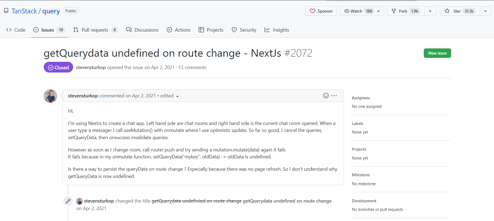
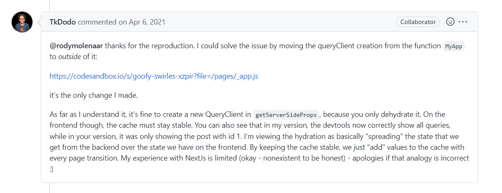

드디어 프리온보딩 코스의 마지막 과제가 되었다. 정리했던 NEXT JS를 공부한 내용과 과제를 하면서 해결해나간 에러들, 멘토님의 피드백을 받았던 부분들을 작성해 보고자 한다.

# 📜 과제 설명

마지막 과제는 일주일 동안 핀테크 기업의 관리자 서비스 페이지를 제작하는 것이었다. 회원가입/로그인 페이지와 메인 보드 페이지 두 가지 페이지를 제작해야 했다. 기술 스택은 typescript와 멘토님의 적극적인 권유로 처음으로 Next js를 이용했고, data fetching으로는 react query를 이용해 서버 데이터를 관리해, client 상태와 분리해서 관리했다.

세부 부분은 총 5가지로 다음과 같이 정리할 수 있다.

1. Next JS를 이용한 페이지 세팅
2. 회원가입과 로그인 페이지와 에러핸들링
3. react query를 이용한 CRUD
4. Query string을 이용한 필터링 구현
5. Pagination

# 👓 Next JS


NEXT JS를 처음 사용하면서 느낀 점은 CRA을 이용해서 react를 사용할 때와 "너무 다르다" 였다. 이 점은 프레임워크와 라이브러리의 차이에서 나온다고 생각되었다.

## 📖 프레임워크와 라이브러리

프레임워크와 라이브러리는 내가 작성하는 **코드가 어떻게 작동하냐**가 가장 큰 차이점이라 생각된다.

라이브러리는 내가 사용한 코드에 따라 어떤 것을, 어떻게 사용할 지를 정하는 커스텀이 자유롭지만, 프레임워크는 반대로 프레임워크에서 정한 방식에 맞춰서 코드를 작성해야한다.

예로 CRA에서는 자유롭게 어떻게 router 파일을 만들어서 관리할 지 app.tsx에 포함해서 관리할 지 등을 정할 수 있지만, Next js에서는 반드시 pages폴더 내부에서 사용해야하는 특징을 가진다.


그렇기 때문에 Next js를 사용할 때는 **Next js에서 정해놓은 방식을 잘 배워나가는 게 중요하다**.

## 🥊 Next js 이용하기

처음 사용해봐서 아직 너무 미숙하지만, 우선 프로젝트를 하면서 필요했던 부분들을 먼저 찾아보고 공부했다.

### Routing

항상 먼저 프로젝트를 할 때 어떻게 웹페이지를 구성하면 될지를 고민하고 Routing과 기본적인 파일들을 만드는 습관이 있어, Routing에 대해 가장 먼저 공부했다. 앞서 프레임워크와 라이브러리를 정리하면서 작성했듯이 **Pages 폴더 내의 파일**로 routing을 설정할 수 있다.

이번 프로젝트를 하면서 필요했던 url에 따른 Next js 폴더 구조를 다음과 같이 표현할 수 있다.

|     url      |         Next js         |
| :----------: | :---------------------: |
|      /       |     pages/index.tsx     |
|    /login    |     pages/login.tsx     |
|     /:id     |     pages/[id].tsx      |
|  /register   |   pages/register.tsx    |
|   /account   | pages/account/index.tsx |
| /account/:id | pages/account/[id].tsx  |

동적라우팅의 경우도 간단하게 [id].tsx파일을 만들어서 설정할 수 있어서 편리했다.

### \_app.tsx

\_app파일은 서버에 요청이 들어왔을 때 가장 먼저 실행되는 컴포넌트로 공통로직이나, 글로벌 스타일링을 정의할 수 있다.

프로젝트에 필요한 context API의 provider와 react Query의 provider component를 감싸주었다.

```tsx
//_app.tsx

function App({ Component, pageProps }: AppProps) {
	...

  return (
    <AuthProvider authService={authService}>
      <InfoProvider infoService={infoService}>
        <QueryClientProvider client={queryClient}>
          <Hydrate state={pageProps.dehydratedState}>
            <ReactQueryDevtools initialIsOpen={false} />
            <Component {...pageProps} />
          </Hydrate>
        </QueryClientProvider>
      </InfoProvider>
    </AuthProvider>
  );
}

export default App;
```

### Next에서 localhost 서버와 client의 API 통신

로컬의 서버와 client 통신을 하면서 에러를 만났다. 프론트서버는 localhost:3000으로, 백엔드서버는 localhost:4000으로 동작하는 상황에서 다른 port를 사용하다보니 api요청에 대해 cors 에러가 발생했다.


post man으로 localhost:4000으로 요청했을 때는 아무 문제가 없었는데...

문제를 해결하기 위해 구글링을 했을 때 next.config.js의 rewrite를 해 3000 port로 요청을 보내지만, 4000 port으로 우회하는 방식으로 해결할 수 있었다.

```ts
/** @type {import('next').NextConfig} */
const nextConfig = {
  reactStrictMode: true,
  swcMinify: true,
  async rewrites() {
    return [
      {
        source: '/:path*',
        destination: 'http://localhost:4000/:path*',
      },
    ];
  },
};

module.exports = nextConfig;
```

문제는 cors 에러는 해결했지만 나에게 잘 받아드려지지 않았다. 왜냐하면 client의 모든 요청이 4000 포트로 요청을 보내는 것으로 바뀌어버렸기 때문이다. 미리 설정해둔 url중에 로그인 페이지 주소인 `/login` 과 로그인을 위한 요청의 `https://localhost:4000/login`이 연결되어버려, login을 위한 post요청이 아닌 login 페이지의 html을 응답으로 전달받게 되었다. 매번 서버의 api주소와 페이지 url을 다르게 설정하고 프로젝트를 해야할 지 고민되는 중에, 같이 수강하시는 분께서 이슈로 올려놓은 내 질문에 답변을 감사히 달아주셨다..


간단히 source의 url을 `/api/:path`로 설정하면 됬다... 조금 간단하게 해결할 수 있는 부분이라 머쓱..하기도 했지만 검색을 3시간 하다가 해결한 거라 너무 감사했다.

## 🖱 SEO

SEO를 위해서 간단하게 NEXT의 Head컴포넌트를 이용해 Meta데이터를 넣을 수 있었다. 이전 과제에서 했던 방식보다 너무나도 간단했던 SEO처리였다...

왜 SEO를 위해 NEXT를 써야하는지 조금 더 느꼈다.

```tsx
import Head from 'next/head';
import React from 'react';

export default function SEO({ text }: { text: string }) {
  return (
    <Head>
      <title>{text}</title>
      <meta name='description' content='마지막 과제입니다.' />
      <link rel='icon' href='/favicon.ico' />
    </Head>
  );
}
```

### Next와 브라우저 API

브라우저 API는 Next에서 CSR로 받은 이후에 사용할 수 있다. 몰랐던 나는 local storage를 당연히 그냥 이전처럼 사용했는데 에러를 만나게 되었다.


이렇게 브라우저 요소를 사용하기 위해서는 window가 존재하는지 체크하는 로직으로 감싸주거나 useEffect를 이용해서 렌더링이 된 이후에 사용하게 할 수 있다. 토큰 관련 로직을 처리할때 useEffect내에서 localStorage에 접근하는 로직을 추가했다.

```tsx
//_app.tsx

function App({ Component, pageProps }: AppProps) {

    ...

  useEffect(() => {
    const token = localStorage.getItem('accessToken');
    if (!token) {
      router.push('/login');
    }
  }, []);

  return (
    ...
  );
}

export default App;
```

<br/>

# ❗ 인증/인가 에러핸들링

회원가입과 로그인 로직은 맨 처음과제할 때 처럼 동일한 Layout을 이용해 만들어서 UI를 구성하고 각각의 api 요청에 대해서 어떻게 응답이 주어지는 지를 먼저 정리했다.

| 컴포넌트 | Status code     | 내용                                          |
| :------: | --------------- | --------------------------------------------- |
| 회원가입 | 400 Bad Request | 동일한 이메일이 이미 존재합니다.              |
| 회원가입 | 400 Bad Request | incorrect Passoword                           |
|  로그인  | 400 Bad Request | Email already exists                          |
|  로그인  | 400 Bad Request | Password is too short (세글자이상)            |
|  로그인  | 400 Bad Request | email format is invalid (적어도 @포함 세글자) |

위의 정리된 내용에 적절한 에러 메시지를 전달하고 싶어서 우선 기존 사용해왔던 httpError 클래스의 getter를 두가지로 나눠서 설정했다.

```tsx
export default class HTTPError extends Error {
  constructor(
    private statusCode: number,
    public message: string,
    private data?: string
  ) {
    super(message);
  }
  get signUpMessage() {
    if (this.statusCode === 400) {
      switch (this.data) {
        case SIGN_UP_MESSAGE.email:
          this.message = '이메일 형식이 올바르지 않습니다';
          break;
        case SIGN_UP_MESSAGE.password:
          this.message = '4자이상의 비밀번호를 입력해주세요';
          break;
        case SIGN_UP_MESSAGE.duplicate:
          this.message = '이미 존재하는 계정입니다';
          break;
        default:
          throw new Error('Unknown Error');
      }
      return this.message;
    }
    throw new Error('unknown Error');
  }

  get signInMessage() {
    switch (this.statusCode) {
      case 400:
        if (this.data === SIGN_IN_MESSAGE.password) {
          this.message = '비밀번호를 확인해주세요';
        } else if (this.data === SIGN_IN_MESSAGE.email) {
          this.message = '존재하지 않는 계정입니다';
        }
        break;
      case 404:
        this.message = '잘못된 요청입니다. url을 확인해주세요';
        break;
      default:
        throw new Error('Unknown Error');
    }
    return this.message;
  }
}
```

## AxiosInterceptor를 이용한 코드 중복 제거

커스텀 에러클래스를 만든 후에 사용할 때 같은 에러처리하는 로직이 반복되는 문제를 발견했다.

이후에 CRUD를 이용할 때도 많이 반복될 것 같아, 어떻게 처리할 지 고민하다가 axiosInterceptor를 이용한다면 클래스에서 에러를 처리하지 않고 한 곳에서 에러 처리를 한번에 정리할 수 있겠다는 생각이 들었다.

httpClient 클래스에서 axiosClient를 만들 때 constructor로 기본적인 error를 한 곳에서 처리하고 httpError클래스에서 세부 사항을 정리하면 더 좋은 코드가 될 것 같다는 생각으로 수정했다.

```typescript
//변경전
export default class AuthServiceImpl implements AuthService {
  constructor(private httpClient: AxiosInstance) {}

  async signUp({ email, password }: UserInfoType) {
    try {
      ...
    } catch (error) {
      if (error instanceof AxiosError) {
        const { response } = error;
        if (response) {
          throw new HTTPError(
            response?.status,
            response?.statusText,
            response.data
          );
        }
      }
    }

    throw new Error('Server Error');
  }

  async signIn(userInfo: UserInfoType) {
    try {
      ...
    } catch (error) {
      if (error instanceof AxiosError) {
        const { response } = error;
        if (response) {
          throw new HTTPError(
            response?.status,
            response.statusText,
            response.data
          );
        }
      }
    }

    throw new Error('Server Error');
  }
}

//변경 후

export default class AuthServiceImpl implements AuthService {
  constructor(private httpClient: AxiosInstance) {}

  async signUp({ email, password }: UserInfoType) {
    const response = await this.httpClient.post<AuthResponse>(
      'api/users/signup',
      { email, password }
    );
    const { data } = response;
    return data;
  }

  async signIn(userInfo: UserInfoType) {
    const response = await this.httpClient.post<AuthResponse>(
      'api/login',
      userInfo
    );
    const { data } = response;
    return data;
  }
}

//httpClient

export default class HttpClient {
  httpClient: AxiosInstance;

  constructor(private baseUrl: string) {
    this.httpClient = axios.create({
      baseURL: this.baseUrl,
    });
    this.httpClient.interceptors.response.use(
      (response) => response,
      (error) => {
        if (error instanceof AxiosError) {
          const { response } = error;
          if (response) {
            const { status } = response;
            throw new HTTPError(
                response?.status,
                response?.statusText,
                response.data
              );
            }
          }
        }
        throw new Error('Server Error');
      }
    );
  }
	...
}

```

## 🔑 JWT Token으로 다루기

다음으로 문제가 된 부분은 로그인으로 받은 user의 JWT token을 어디에 보관하고 어떻게 관리할 지였다. 필요한 기능중에 로그인을 한 후에 새로고침시 로그인 상태가 유지되어야하기 때문에 access token을 local storage에 보관했다.

localstorage를 이용해서 보관시에 XSS공격에 취약한 약점이 있다는 점을 알게 되어 좀 더 안전한 방식으로 하고 싶어서 여러가지를 검색하는 와중에 access token은 local Storage에 refresh token은 쿠키에 htmlOnly로 설정해서 사용하는 것을 알게되었다.

하지만 json server 백엔드 서버로 진행하다 보니 access token만 존재하고 refresh token이 없고, 쿠키를 위해서 별도의 라이브러리들을 다운받아야해서 우선은 localstorage에 보관하는 방향으로 진행했다.

### axiosInterceptor를 이용해 헤더에 토큰추가

받은 토큰을 data Fetching 로직에 자동으로 header에 넣어주기 위해서 axiosInterceptor에서 넣어주었다. token은 로그인/회원가입에는 필요하지 않기 때문에 httpClient에서 토큰을 헤더에 넣는 withToken메소드를 추가해 필요한 부분에만 토큰을 포함하게 로직을 구성했다.

```typescript
//HttpClient.ts

export default class HttpClient {
  httpClient: AxiosInstance;

  constructor(private baseUrl: string) {
    this.httpClient = axios.create({
      baseURL: this.baseUrl,
    });
    this.httpClient.interceptors.response.use(
      (response) => response,
      (error) => {
        if (error instanceof AxiosError) {
          const { response } = error;
          if (response) {
            const { status } = response;
            if (status === 401) {
              localStorage.removeItem(ACCESS_TOKEN);
              localStorage.removeItem(USER_ID);
              window.location.replace('/login');
            } else {
             ...
            }
          }
        }
        throw new Error('Server Error');
      }
    );
  }

  withToken() {
    this.httpClient.interceptors.request.use((config) => {
      const token = localStorage.getItem(ACCESS_TOKEN);
      if (config.headers && token) {
        config.headers.Authorization = `Bearer ${token}`;
      }
      return config;
    });

    return this.httpClient;
  }
}

//_app.tsx

function App({ Component, pageProps }: AppProps) {
  const client = new HttpClient(process.env.NEXT_PUBLIC_BASE_URL || '');
  const authService = new AuthServiceImpl(client.httpClient);
  const infoService = new InfoServiceImpl(client.withToken());
	...
}

export default App;


```

### 페이지 redirection

token이 없을 때 자동으로 로그인으로 이동하게 하기위해 \_app.tsx에 useEffect로 토큰의 유무를 확인하는 로직을 추가했다.

그리고 토큰이 없는 상태에서 data fetching api를 호출시에 401에러가 발생했다. 이때 자동으로 로그인페이지로 이동 될 수 있게 에러핸들링 부분에 해당 에러처리를 추가했다.

원래는 react-query의 data Fetching 로직에 토큰이 만료되고 호출시에 login으로 이동할 수있게 onError 옵션에 hook을 추가하려 했지만, 팀원분의 아이디어로 좀 더 빠른 시점에 에러처리가 될 수 있게 axiosInterceptor를 이용해 에러핸들링을 해주었다.

hook으로 했을 때는 토큰이 없는 채로 호출시에 여러번의 에러메시지가 떴지만, axiosInterceptor를 통해 시점을 당겼더니 에러메시지가 한번만 보이고 좀 더 빠르게 페이지 이동이 가능했다.

```tsx
//_app.tsx

function App({ Component, pageProps }: AppProps) {

    ...

  useEffect(() => {
    const token = localStorage.getItem('accessToken');
    if (!token) {
      router.push('/login');
    }
  }, []);

  return (
    ...
  );
}

export default App;

//httpClinet.ts

const ACCESS_TOKEN = 'accessToken';
const USER_ID = 'userId';
export default class HttpClient {
  httpClient: AxiosInstance;

  constructor(private baseUrl: string) {
   	...

    this.httpClient.interceptors.response.use(
      (response) => response,
      (error) => {
        if (error instanceof AxiosError) {
          const { response } = error;
          if (response) {
            const { status } = response;
            if (status === 401) {
              localStorage.removeItem(ACCESS_TOKEN);
              localStorage.removeItem(USER_ID);
              window.location.replace('/login');
            } else {
           		...
              );
            }
          }
        }
        throw new Error('Server Error');
      }
    );
  }

 	...
}
```

<br/>

# 🔍React-query를 이용한 CRUD 로직

이전에 react-query를 이용할 때는 간단하게 해당 데이터를 받아오는 부분만 했다면 이번에는 **Patch, Delete, Create** CRUD에 필요한 모든 부분을 react-query로 함께 처리했다. 이러한 처리를 위해 react-query에는 `useMutation`이라는 api가 있고, 이러한 서버데이터의 변화가 생기면 현재 보고있는 데이터는 stale해지기 때문에 이전 데이터 대신 새로운 데이터를 받아와야한다. 이를 위해서 useMutaion에 onSuccess에 `invalidataeQueries`를 전달해 기존의 데이터 대신 새로운 데이터를 받아올 수 있게 설정했다.

useMutation을 사용할 때는 **어떤 함수를 실행할지**를 전달하고 인자는 useMutation 내부 메소드인 **mutate로 전달**해서 사용할 수 있었다.

```typescript
//useModifyUser.ts

const userDeleteMutation = useMutation(
  async (userId: string) => {
    return infoService?.deleteUser(userId);
  },
  {
    onSuccess: () => {
      queryClient.invalidateQueries(['users', page]);
    },
  }
);
const settingDeleteMutation = useMutation(
  async (userId: string) => {
    return infoService?.deleteUserSetting(userId);
  },
  {
    onSuccess: () => {
      queryClient.invalidateQueries(['userSetting', 'all']);
    },
  }
);
const nameMutation = useMutation(
  async (info: { name: string; id: string }) => {
    return infoService?.patchUserName(info);
  },
  {
    onSuccess: () => {
      queryClient.invalidateQueries(['users', page]);
    },
  }
);

//userTableItem.tsx

const handleEdit = () => {
  nameMutation.mutate({ id: item.id.toString(), name: userName });
  toggleIsModifying();
};

const handleDelete = () => {
  userDeleteMutation.mutate(item.id.toString());
  settingDeleteMutation.mutate(userSetting?.id.toString() || '');
};
```

## ❗ 캐쉬 데이터가 사라지는 이슈 발생

react query를 잘 사용했다고 생각했지만 뜻밖에 에러를 만났다. useMutation으로 api 호출은 되고 서버에서도 데이터가 삭제, 수정, 생성이 되지만 UI로는 새롭게 fetching을 해오지 않는 문제였다. 왜그런지 확인하기 위해 직접 queryClient를 확인했을 때 기존에 queryMap에 존재하던 querykey들이 새로고침이나 같은 url을 바로 다시 접속했을 때 cache된 데이터가 모두 사라져버린 것을 확인할 수 있었다.

[devtool에서 사라진 cache 데이터]


<br/>
<br/>
 여러가지 방법을 고민하고 시도했다. 가장 먼저 시도한 방법은 React Query의 `keeppreviousdata`를 true로 설정하는 방법이었다. 이전 데이터를 새로운 데이터를 받아오기 전까지 보관하는 옵션이라 시도했지만 여전히 에러가 남아있었다.

두번째로 시도한 방법은 react query의 기능 중 persistQueryClient를 이용해 localstorage에 데이터들을 저장하는 방법을 생각했다. 하지만 많은 데이터를 매번 localStorage에 저장하는 방법은 비효율적이라는 생각에 다른 방법을 찾아보기로 했다.

블로그나 stackOverflow에서는 유사한 이슈를 찾을 수 없어, React Query github의 issue 페이지를 직접 검색해, 유사한 문제 상황을 담은 이슈를 6시간의 구글링 끝에, 포기직전에... 찾을 수 있었다.



cache된 데이터가 사라진 에러는 서버사이드 렌더링으로 같은 path로 이동 시에, react query가 페이지 이동을 인식하지 못해 생긴 문제였다. 이에 대한 해결방법으로 react query를 만든 Tk Dodo님이 올리신 codeSandBox 코드를 참고해 queryClient를 컴포넌트 밖에 선언해 전달하게 했더니 사라졌던 cache들이 모두 나오는 것을 확인할 수 있었다.

 

사실 혼자 에러를 해결하려했으면 포기했을지도 모르지만 팀원분들이 다같이 도와주셔서 오래걸렸지만 다행히 해결할 수 있었다. 한달동안 마주했던 에러를 해결한 여러순간들 중에서 가장 뿌듯하고 공식 레포에서 방법을 찾으려는 "개발자스러운 해결방법"을 시도한 게 너무 좋았다.

## 멘토님의 피드백

React query로 받은 데이터를 정제하는 과정에서 select라는 옵션이 있다는 것을 멘토님께서 알려주셨다. 훨씬 응집도있는 코드가 되고 불필요한 변수선언이 없어 이후 프로젝트에 적용해 보려한다. 또한 key값의 경우 재사용할 때 일치시켜줘야하기 때문에 상수로 관리하는게 안전하다는 부분을 놓쳤다는 것도 알 수 있었다.

<br/>

```tsx
//변경전

const { data: allUsers } = useQuery(['users', 'all'], () => {
  return infoService?.getAllUsers();
});
const { data: allAccounts } = useQuery(['accounts', 'all'], () => {
  return infoService?.getAllAccounts();
});
const user = allUsers?.find((item) => item.id.toString() === id);
const accounts = allAccounts?.filter((item) => item.user_id.toString() === id);

//변경 후
const { data: user } = useQuery(USERS.ALL, infoService.getAllUsers, {
  select: (data) => data?.find((item) => item.id.toString() === id),
});
const { data: accounts } = useQuery(ACCOUNTS.ALL, infoService.getAllAccounts, {
  select: (data) => data?.filter((item) => item.user_id.toString() === id),
});
```

<br/>
그리고 사용자의 전체 계좌를 세기 위해 빈 객체에 object의 key로 id를 주고 count하는 방법을 사용했는데 object의 불변성을 깨고 동적으로 key값을 할당하다보니 위험할 수 있는 로직이라는 피드백을 받았다. 코딩테스트를 자바스크립트로 할 때 문제만 풀면 된다는 생각으로 전혀 고려하지 못했던 부분이었다. 부족한 부분을 알게되어서 더 감사했고, reduce를 객체에서 사용하는 법을 새롭게 알게되었다.

<br/>
<br/>

```typescript
//변경전

const accountCount: AccountCountType = {};
accountData.forEach((item) => {
  const id = item.user_id;
  if (!accountCount[id]) {
    accountCount[id] = 1;
  }
  accountCount[id] += 1;
});

//변경 후
const accountCount: AccountCountType = accountData.reduce(
  (allAcount: AccountCountType, account) => {
    if (account.user_id in allAcount) {
      allAcount[account.user_id]++;
    } else {
      allAcount[account.user_id] = 1;
    }
    return allAcount;
  },
  {}
);
```

<br/>

# Query String을 이용한 상태관리

selector를 이용해 필터링을 하는 부분은 이번 과제에서 또다른 메인 주제라고 생각이 되었다. 과제에서 새로고침을 해도 같은 페이지를 보여주어야 한다는 부분을 보면서 가장 먼저 떠올렸던 부분이었다. Query string은 Next의 API인 useRouter를 이용해서 간단하게 접근이 가능했다.

useRouter에는 다양한 요소가 담겨져 있는데 param을 담고 있는 route와 query를 담고 있는 query, useNavigation과 같이 페이지 이동을 할 수 있는 push가 method로 있기 때문에 간단하게 적용할 수 있었다.

내가 특히 고민되었던 부분은 해당 상태를 url에 반영할 때 **이전 query값은 유지하면서 원하는 query만 수정할 수 있을까**였다. 그러기 위해서 먼저는 문자열을 수정하는 방식을 고민했지만 너무 복잡해지기 때문에 다른 방법을 고민하다가 urlSearchParams와 같이 router.push에 object로 query를 줄 수 있다는 것을 알게 되었다. 이를 활용해서 이전 query를 spread문법으로 받고, 수정할 부분만 overWriting하는 방식으로 해결할 수 있었다.

<br/>


query string을 상태로 생각해서 처리하다보니 전역상태가 크게 줄고, query와 UI가 동기화 되어있어, 항상 같은 url에 같은 UI를 가지는 장점이 너무 좋았다.

# Pagination

Pagination을 만들어본 적이 없어서 많이 고민이 되었지만 다음과 같은 계산으로 진행했다.

1. 전체 페이지수= Math.ceil(전체 아이템 갯수/ 페이지당 보여줄 갯수)
2. 전체 index=Math.floor(totalPage / 페이지에 내가 보여줄 페이네이션 수)
3. index에 따른 보여질 페이지 번호=[1, 2, 3, 4, 5].map((_item_) => index \* 5+ item)

index 상태를 클릭에 따라 올려주고 내려줌으로써 페이지 번호를 관리하고 해당 page를 queryString로 관리했다.

```tsx
export default function Pagination({ totalItems }: PaginationProps) {
  const router = useRouter();
  const { page } = router.query;
  const [index, setIndex] = useState(0);
  const pages = [1, 2, 3, 4, 5].map((item) => index * PAGENATION + item);
  const totalPage = Math.ceil(totalItems / USER_NUM);
  const isFirstIndex = index === 0;
  const isLastIndex = index === Math.floor(totalPage / PAGENATION);
  const currPage = page || '1';
  const handleClick = (e: React.MouseEvent<HTMLButtonElement>) => {
    const { name } = e.currentTarget;
    if (name === PREV) {
      setIndex((prev) => prev - 1);
    } else if (name === NEXT) {
      setIndex((prev) => prev + 1);
    }
  };

  return (
    <nav className="flex justify-center py-5">
      <ul className="inline-flex items-center -space-x-px">
        {!isFirstIndex && (
          <button
            className="px-3"
            name={PREV}
            type="button"
            onClick={handleClick}
          >
            <AiOutlineArrowLeft />
          </button>
        )}

        {pages.map((item) => {
          if (item <= totalPage) {
            return (
              <li key={item}>
                <Link
                  href={{
                    pathname: router.route,
                    query: {
                      ...router.query,
                      page: item,
                    },
                  }}
                >
                  {item}
                </Link>
              </li>
            );
          }
        })}
        {!isLastIndex && (
          <button
            name={NEXT}
            type="button"
            onClick={handleClick}
          >
            <AiOutlineArrowRight />
          </button>
        )}
      </ul>
    </nav>
  );
}

```

<br/>

# 😊 마치며

드디어 길었던 한달의 프리온보딩 코스가 끝났다. 추상화와 관심사분리와 같은 깊이 있는 내용들과 typescript, react Query, Next js까지 새로운 뉴노멀이 되어가는 스택들도 경험할 수 있었다. 정말 참여하기 잘했다고 느꼈고, 이전에 혼자 하던 `실력있는 개발자란 뭘까?`, `좋은 코드란 뭘까?`라는 고민에 기준이 생기게 되었고, 팀원들의 코드를 보면서 다른 사람의 코드를 보는 눈, 다양한 공식문서를 읽을 수 있는 힘도 기르게 되었다.

이제 남은 기간은 내가 얼마나 적용하고 더 성장하는냐에 달려있다. 많은 실패를 마주하고 새로운 것을 배우겠지만, 본질을 놓치지 않고 멘토님들처럼 배운 내용들을 이제 내가 누군가에게 전달하고 가르쳐 줄수 있는 날을 목표로 나아가고자 한다.
