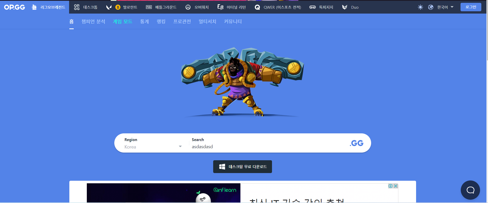
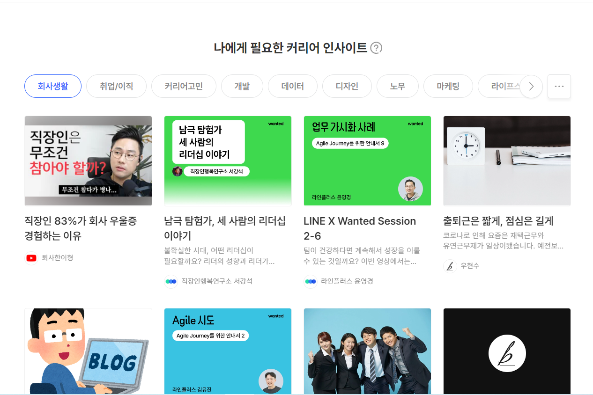
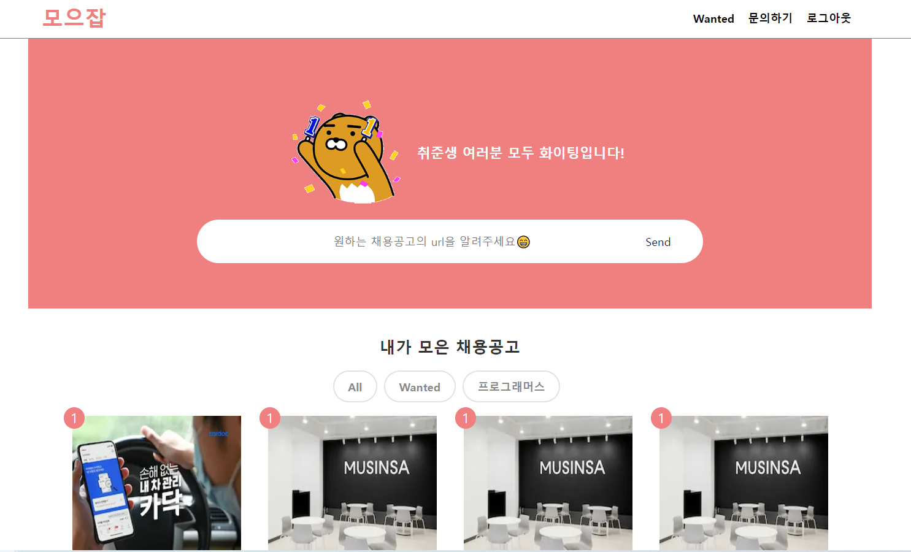

# ⚒ 모으잡 프로젝트 수정하기

프리온보딩 코스가 끝나고 이력서를 수정하며, 모으잡 프로젝트를 프로토타입으로 먼저 제작하기로 결정했다. 기존의 한계점은 schema를 짜고, 서버를 만들어두었지만, 별도의 CRUD 처리를 하기보다 단순히 크롤링 결과만 json으로 전달해주는 역할만 했다.

서버가 간단한 역할만 한다면 **Next js의 서버를 이용해** api로 전달해주고, 데이터베이스와 인증/인가는 **firebase**를 이용하면 프론트엔드 레포 내에서 충분히 모든 기능을 다 구현할 수 있겠다는 생각이 들었다. 필요하다면 이후에 백엔드를 공부하면서 백엔드 서버와 데이터베이스를 분리하고, 현재는 프로토타입으로 next js를 이용하면 충분할 것 같다는 생각이 들었다.

## ▶ Next js로 migration하기

기존의 CRA로 제작하던 프로젝트에서 Next js 바꾸기 위해 migration에 대해 알아보았고, 공식 홈페이지의 도움을 받았다.

(공식홈페이지 설명: [Migrating from Create React App ](https://nextjs.org/docs/migrating/from-create-react-app))

### 1. 리액트네이티브.json과 dependencies 정리하기

CRA에서는 당연했던 react-scripts와 react-router-dom은 next js를 사용하면서 제거해야했다. react-scripts 대신에 next를 이용하고, next 자체적으로 pages폴더내 파일을 routing해주기 때문이었다.

```json
{
  "name": "moejob-client",
  "version": "0.1.0",
  "private": true,
  "dependencies": {
    "next": "^13.0.4",
    "react": "^18.2.0",
    "react-dom": "^18.2.0",
    "react-icons": "^4.6.0",
    "react-scripts": "5.0.1",
    "web-vitals": "^2.1.0"
  },
  "scripts": {
    "dev": "next dev",
    "start": "next start",
    "build": "next build"
  }
}
```

### 2. static assets과 index.html

CRA에서 static assets와 index.html은 함께 public폴더에 있었지만 next를 사용하면서 index.html은 필요가 없기 때문에 static assets만 남겨두고 index.html 내부요소는 \_document.js나 \_app.js로 옮겨주면 되지만 비어있어서 그냥 제거했다.

### 3. src 파일 정리

CRA에서는 app.jsx를 기준으로 모든게 이루어졌지만, 이제 src 폴더가 불필요하고 app.jsx를 pages/index.js로 바꿔주면 기존대로 사용할 수 있었다.

페이지도 하나였고 구현사항이 적어서 생각보다 너무 간단하게 migration이 가능했다.

## 🚩 Typescript 적용하기

기존의 프로젝트는 javascript를 이용해서 개발했었기 때문에 안전하게 개발하기 위해 typescript를 추가했다.예전에는 typescript가 싫었는데 그새 안 쓰는 게 예상이 되지 않아서 더 불편해졌다. typescript도 간단하게 next js에서 알려주는 방식대로 진행했다. (https://nextjs.org/docs/basic-features/typescript)

먼저 `touch tsconfig.json`파일을 만든 후에 next를 실행하면 원래는 next가 자동으로 필요한 dependency들을 설치할지 물어본다고 한다.

```
npm run dev

# You'll see instructions like these:
#
# Please install TypeScript, @types/react, and @types/node by running:
#
#         yarn add --dev typescript @types/react @types/node
#
# ...
```

하지만 실행해도 설치할지 물어 보지 않아서 수동으로 관련 dependency들을 다운 받았다. 그리고 주의할 점은 `next-env.d.ts`파일이 생기는데 `.gitignore` 파일에 추가해 버전 관리에 포함되지 않게 해야 한다.

## 🎨 Styled-Components 적용하기

기존에는 tailwind로 진행했지만 간단하게 프로토 타입만 만들고 끝나는 게 아니라 계속해서 수정해나갈 프로젝트로 만들고 있기 때문에, UI 컴포넌트를 이용해 이해하기 쉽게 프로젝트를 진행하기 위해 styled components를 이용하기로 했다.

styled-components는 css-in-js이기 때문에 CSR과 달리 SSR에서는 설정을 추가해 주어야한다. next는 초기에 html을 그릴 때에는 SSR을 이용하고 이후에 CSR을 이용하기 때문에 styled-components를 그대로 사용하면 js가 다운 받고 스타일링이 되기 때문에 깜빡이는 문제가 발생한다.

이를 막기 위해서 \_document.tsx를 다음과 같이 설정함으로써 html파일에 스타일 요소를 넣어서 해결할 수 있다. 아직 정확히 코드 내용을 이해하지는 못했지만 우선 왜 해야하는지에 대한 이유만 알고 넘어갔다.

```tsx
import Document, {
  DocumentContext,
  DocumentInitialProps,
  Main,
  NextScript,
  Head,
  Html,
} from 'next/document';
import { ServerStyleSheet } from 'styled-components';

export default class MyDocument extends Document {
  static async getInitialProps(
    ctx: DocumentContext
  ): Promise<DocumentInitialProps> {
    const sheet = new ServerStyleSheet();
    const originalRenderPage = ctx.renderPage;

    try {
      ctx.renderPage = () =>
        originalRenderPage({
          enhanceApp: (App) => (props) =>
            sheet.collectStyles(<App {...props} />),
        });

      const initialProps = await Document.getInitialProps(ctx);
      return {
        ...initialProps,
        styles: (
          <>
            {initialProps.styles}
            {sheet.getStyleElement()}
          </>
        ),
      };
    } finally {
      sheet.seal();
    }
  }

  render() {
    return (
      <Html>
        <Head>
          <link
            href='https://fonts.googleapis.com/css2?family=Cabin&display=optional'
            rel='stylesheet'
          />
          <link
            href='https://fonts.googleapis.com/css2?family=Raleway&display=optional'
            rel='stylesheet'
          />
        </Head>
        <body>
          <Main />
          <NextScript />
        </body>
      </Html>
    );
  }
}
```

이후에는 SSR에서 CSR로 넘어갈 때 class 해쉬값의 차이로 에러가 날 수 있어서 babel에 설정이 필요한데 설정을 위해 `babel-plugin-styled-components`를 다운받고 .babelrc 파일에 다음과 같이 추가한다.

```json
{
  "presets": ["next/babel"],
  "plugins": [
    [
      "styled-components",
      {
        "ssr": true,
        "displayName": true,
        "preprocess": false
      }
    ]
  ]
}
```

이렇게 Next로 migration이 끝났다. 이제 기획을 다시 수정할 차례다.

# 🔭기획 수정

한달동안 프리온보딩 코스를 공부하면서 배웠던 부분들을 적용할 만한 부분들과 기존 기획에서 부족했던 부분들을 먼저 돌아봤다.

기존 기획)

1. 프론트 페이지에 채용공고의 url을 입력한다.

2. 프론트 페이지에서 전달된 url을 node 서버에서 크롤링을 한 후 주요업무/자격조건/우대사항에 대해 json파일에 넣어서 전달한다.

3. 프론트 페이지에서 전달받은 json을 프론트페이지에서 firebase를 이용해 데이터를 저장한다.

4. 프론트 페이지에서 데이터의 CRUD를 진행한다.

5. 재접속시 firebase에 저장해둔 데이터를 다시 받아서 보여준다.

기존 기획은 서버가 하는 역할이 크지 않았다. 우선 공부하는 목적으로 node서버를 express로 만들었었기 때문에 서버 자체의 기능이 너무 한정적이었다. 프론트에서 기존 기획은 거의 다 일을 처리할 수 있기 때문에 Next로 migration을 했고 Next서버를 이용해서 모든 기능을 구현하면 더 간단하고 좀 더 빠르게 개발이 가능할 것으로 예상되었다.

추가할 기능은 오늘 원티드에서 제공해준 이력서 강의를 들으면서, 자격 조건과 우대 사항에 대해서 해당여 부를 표시할 수 있는 **체크**기능을 만들고, 그에 따른 **우선순위 기능**을 추가하면 좋겠다는 생각이 들었다. 그리고 사용자별 데이터를 저장하기 위해서 **firebase기능을 이용해 인증/인가기능**을 추가할 예정이다.

프론트 페이지의 디자인은 wanted와 op.gg를 참고해 메인 페이지에는 전체 공고들을 보여주는데 필터링이 가능하게 만들려고 한다. 공고를 클릭시에는 디테일 페이지로 넘어가 해당 공고의 내용을 보여주고 동일하게 아래에 저장해둔 공고들을 보여 주는 형식으로 진행하면 어떨까라는 생각이 들었다.

# Home 페이지 스타일링

기획한 대로 우선 간단하게 Home페이지 디자인을 완성했다. 모바일 페이지도 고려해 max-width를 1000px로 고정해두었다. url form을 이전처럼 navbar에 두지 않고 이번에는 main 컨텐츠에 넣어두었다. 그냥 form만 두기엔 너무 허전해서 op.gg를 참고해 검색 주변에 캐릭터를 추가했다.

[op.gg 검색창]



urlForm 아래에는 크롤링한 전체 채용공고들을 보여주고 플랫폼별로 필터링이 가능하게 버튼을 추가해두었다. 이후에 query string을 이용해 필터링을 추가할 예정이다.

레이아웃은 원티드 홈페이지를 참고했다. 원티드의 경우 4개에서 화면크기가 작아지면 2개로 줄이는데 반응형으로 적용하기 좋을 것 같아 참고해서 만들었다. 우선순위를 표시하는 부분은 공고의 뱃지처럼 붙여주는 것으로 해두었다. 이후에 별점으로 평가해서 반영해도 좋을 것 같다.

[원티드 게시물]



스타일링을 하면서 styled-components가 tailwind로 작업하던 것보다 훨씬 편하다고 많이 느꼈는데, 특히 next/image를 다루는 것에 있어서 좀 더 편하게 스타일링이 가능해서 좋았다. 이미지를 remote에서 받아올 때는 해당 주소를 next.config.js에 추가해줘야 한다는 점도 새롭게 알게 되었다.

```tsx
const Img = styled(Image)`
  width: 100%;
`;

//next.config.js

module.exports = {
  images: {
    domains: ['image.wanted.co.kr'],
  },
};
```

완성한 모습은 아래 사진과 같다. 개인적으로는 굉장히 만족했고 기능을 내일부터 붙여나가 토요일까지 prototype을 완성해보는 것이 이번 주의 목표다.


