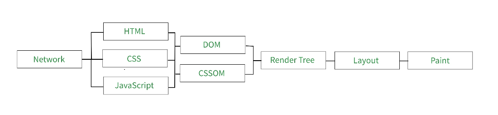
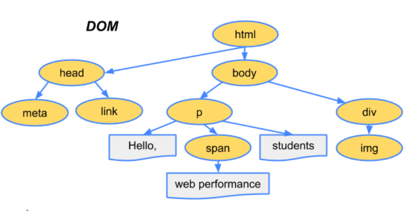
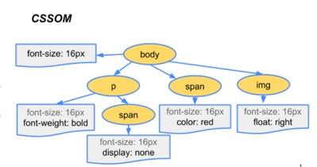
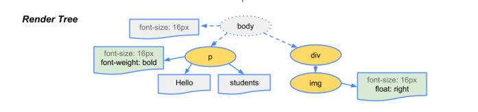
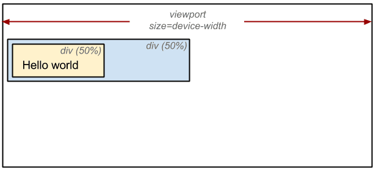

우리가 당연하게 생각하고 있는 컴퓨터를 켜서,크롬을 누르면 브라우저 화면을 보여준다는 것은 사실 어마어마한 작업이 뒤에서 돌아가고 있다. 브라우저가 해당 url을 서버에 요청하고 필요한 정보를 서버가 응답으로 보내줬을 때, 그 결과 ( html, css, javascript )를 우리에게 그려주는 과정, **Critical Rendering Path**에 대해 알아보자.

## CRP의 정의

Critical Rendering Path는 브라우저에서 <u>html, css, javascript를 해석해서 화면에 그려주는 과정</u>이라고 정의할 수 있다. 우리가 작성한 코드들, html, css, javascript를 받으면 그걸 그대로 보여주는 게 아니라, 먼저 브라우저가 이해할 수 있게 변환해줘야한다. 이때 html parser와 css parser를 이용해 코드를 읽어, 브라우저가 이해할 수 있는 구조로 **토큰화**를 한다. 이 토큰의 결과물들을 한번쯤 들어본 적 있는 DOM과 CSSOM이다.

공부하면서 먼저 정리해둘 것은 각 파일을 읽어나가는 과정에 사용되는 엔진이 **두가지**라는 점이었다. 하나는 렌더링을 해주는 "브라우저의 렌더링 엔진", 다른 하나는 자바스크립트를 읽어주는 "자바스크립트 엔진"이다. 전달받은 html을 읽는 것은 렌더링 엔진, 자바스크립트를 읽고 DOM을 조작하는 등의 일을 하는 것은 자바스크립트 엔진이다.

## CRP 세부과정

세부과정은 다음과 같은 과정으로 나타낼 수 있다. 각각의 과정에 대해 알아보자.



### DOM 트리

DOM은 Document Object Model로 HTML parser를 이용해 브라우저가 이해할 수 있는 <u>Tree</u> 구조로 변환해 만든 구조다. 내가 작성하는 html 태그들은 DOM 트리의 Node로 변환되게 된다. 브라우저는 tree구조를 통해 태그들의 부모관계를 이해할 수 있다.

```html
<!DOCTYPE html>
<html>
  <head>
    <meta name="viewport" content="width=device-width,initial-scale=1" />
    <link href="style.css" rel="stylesheet" />
    <title>Critical Path</title>
  </head>
  <body>
    <p>Hello <span>web performance</span> students!</p>
    <div></div>
  </body>
</html>
```



그러면 이렇게 만들어진 DOM tree는 <u>어떻게 스타일링이 되는 걸까?</u>

### CSSOM 트리

css파일은 보통 html의 head에 넣어주는데 자바스크립트 엔진이 html을 읽다가 link:css를 만나면 html 파싱을 멈추고 css 파일을 불러온다. 불러온 css파일은 css parser에 의해 브라우저가 이해할 수 있는 트리구조인 CSSOM (CSS Object Model)을 만들게 되고, 브라우저는 만든 tree구조를 통해서 CSS의 기본 원리인 Cascading rule (아래로 내려올 수록, 해당 태그에 구체적인 styling요소일수록 우선순위가 높다)를 적용할 수 있다. CSSOM을 만든 이후에 다시 html파싱이 멈춰진 곳으로 돌아가 다시 html을 파싱한다.

```css
body {
  font-size: 16px;
}
p {
  font-weight: bold;
}
span {
  color: red;
}
p span {
  display: none;
}
img {
  float: right;
}
```



이렇게 만든 각각의 Tree들은 <u>어떻게 합칠까?</u>

### Render Tree

Render Tree는 앞서 정리한 DOM tree와 CSSOM Tree를 합쳐서, DOM Tree의 Node에 CSSOM에서 결정된 스타일링을 적용한 구조다. Render Tree에서 특징적인 것은 실제로 브라우저에 그려주지 않을 부분 (html의 head나 display:none으로 스타일링된 node)을 제외하고 보여줄 부분만 담는다는 것이다.



그러면 우리가 작성한 <u>Javascript</u>는 어떻게 작동하는 걸까?

### Javascript

자바스크립트도 css파일과 동일하게 html의 파싱하는 과정에서 렌더링 엔진이 script를 태그를 만나면 DOM생성을 중지하고 자바스크립트 엔진의 파싱과 실행을 진행한다. 자바스크립트 엔진은 자바스크립트를 읽어 AST(abstract syntax tree)를 생성한 후에 실행한다. 이때 DOM이나 CSSOM을 변경한다면 렌더트리가 변경되게 되고, 변경된 렌더트리를 기준으로 브라우저 화면을 다시 그리는 리플로우(layout 계산을 다시 실행)와 리페인트(다시 paint과정을 다시 진행)를 한다.

이렇게 자바스크립트로 변경까지 한 후에 렌더트리를 만들었지만, <u>어디에 요소를 그릴지</u> 정해지지 않았다.

### Layout

Layout과정은 Render Tree로 어떤요소로 어떻게 그릴지를 결정한 후에 어디에 그릴지를 결정하는 과정이다. 해당요소의 부모자식관계, css에서 정의된 크기와 위치를 이용해 고정된 값으로 변환한다.

```html
<!DOCTYPE html>
<html>
  <head>
    <meta name="viewport" content="width=device-width,initial-scale=1" />
    <title>Critial Path: Hello world!</title>
  </head>
  <body>
    <div style="width: 50%">
      <div style="width: 50%">Hello world!</div>
    </div>
  </body>
</html>
```



이제 위치까지 계산이 끝났다. 다음으로는 드디어 <u>실제로 그리는 과정</u>이다.

### Paint와 composite

<u>Paint</u>는 브라우저 요소를 실제 픽셀단위로 그리는 과정이다. 여기서 중요한 것은 요소를 그릴 때 한 층에 다 그리는 것이 아니라 여러개의 층으로 나눠서 그린다는 점이다. 하나의 층에 그리지 않고 여러개의 층로 나눠서 그리는 이유는, 하나 surface에 그릴 경우, 내부 요소에 변화가 생기면 전체를 다시 그려야하는 단점이 생기기 때문이다. 그렇기 때문에 위치나 스타일링 요소가 바뀔 수 있는 부분은 다른 층으로 그려진다. 변화될 부분을 따로 층을 만드는 방법으로 css의 will-change와 같은 방법이 있다.

이렇게 여러 층으로 그려놓은 요소들을 하나의 층으로 합치는 과정을 <u>composite</u>이라고 한다.


## CRP와 성능

위의 세부과정들을 통해서 어떻게 브라우저를 통해 우리가 요청한 화면이 그려지는 지를 알아보았다. 이제 중요한 점은 이러한 과정을 알기 때문에 **성능**을 고려해서 코딩할 수 있어야한다. 각 과정에서 성능을 고려해서 작업한다면, 훨씬 빠르게 화면이 그려질 수 있다. 여기서 고려해야할 중요한 점은 **과정의 앞부분의 변화가 생기면 이후 과정도 다시 새로 일어난다는 점**이다.

만약 아래 그림과 같이 layout이 새로 일어나야한다면 layout이 변경된 이후 과정인 paint와 composite도 다시 실행되어야 하기 때문에, 성능에 영향을 줄 수 있는 변화가 된다. 그렇기 때문에 요소를 이동시킬 때 position을 변화시키는 것(layout) 보다 transform을 이용해 (transform) 요소를 이동시키는 게 더 성능이 좋은 이유가 된다.


이러한 비교를 위해서는 https://csstriggers.com/와 같은 사이트를 참조해 브라우저별로 적절한 styling의 선택이 가능하다.

## 리액트와 CRP

리액트를 사용하면서 DOM요소를 컴포넌트로 만들고 추가하고 제거하는 작업들을 많이 해왔다. CRP를 이해하고 나면 여태까지 작업했던 과정에 대해 의문이 생긴다. DOM을 직접건드리면 이후에 layout, paint, composite도 다 다시 일어나야하고 **화면이 깜빡일 것 같은데 왜 일어나지 않았을까?**

이유를 찾아보니 피상적으로만 알고 있던 리액트의 <u>V-DOM</u>과 <u>Reconcilation</u> 덕분이었다.

### V-DOM

리액트는 가상 DOM, V-DOM(Virtual DOM)을 가지고 있다. 리액트를 이용하면 상태에 따라 UI의 변화가 발생한다. 하지만 이러한 변화에 항상 즉각적으로 DOM을 바꾸는 것이 아니라, V-DOM을 업데이트 하고 실제 DOM에 반영할 타이밍을 관리하는 "스케줄러"가 있어, 변화들을 모아서 <u>한번에 처리한다</u>. 그렇기 때문에 state를 바꾸었을 때 즉각적으로 바뀌지 않을 때가 있고, "setState가 비동기로 처리된다"는 의미가 여기에 있다. V-DOM 덕분에 정말 필요한 부분에만 업데이트가 일어나기 때문에, 효율적으로 렌더링이 가능하고 이러한 업데이트를 **Reconcilation**이라고 부른다.


그러면 Reconcilation에서 V-DOM과 실제 DOM은 어떻게 비교될까?

### Reconcilation

react에서 리랜더링이 필요한 경우는 props나 상태가 변화한 경우다. 상태변화에 따라 V-DOM을 업데이트하고 실제 DOM과 비교해, 필요한 부분을 업데이트하는 과정을 **Reconcilation**라고 한다. Reconcilation을 하기 위해 변화에 따라 어떤 요소가 바뀌었는지 일일히 비교한다면 리액트 공식홈페이지에서는 O(n^3)의 시간복잡도(n은 tree 요소 수) 를 갖는다고 한다. 일일히 다 비교하지 않기 위해서 리액트는 두가지 전제를 이용한다.

첫번째는 element type이 달라지면 다른 tree를 만든다는 점이다. a태그에서 img태그로 바뀐다면 아예 다른 트리를 만든다는 의미이다. 부모 node가 달라지면 일일히 자식까지 비교하는 것이 아니라 새로운 tree로 바꾸는 것으로 이해했다. <u>상태의 불변성</u>을 전제한 동작이다. 상태를 변화시킬 때 항상 새로운 상태로 변화시켜줘야한다는 원칙이 여기서 기인한다. Object의 참조값을 이용한 **얕은 비교**를 통해 같은 상태인지 다른 상태인지 비교하기 때문에 상태를 업데이트 시켜줄 때는 새로운 값을 할당해 주어야한다.

두번째로 개발과정에서 key를 이용해 달라져야할 부분을 알려줄 수 있다는 점이다. react를 개발하면서 map으로 반복되는 컴포넌트를 넣을 때 자주 마주하는 에러였는데 왜 리액트가 에러로 던져주는지 알 수 있는 부분이다. key를 이용해서 바뀌어야하는 요소를 알려줌으로써 불필요한 업데이트를 막을 수 있기 때문이다.


위 두가지 전제를 이용해 V-DOM과 실제 DOM을 비교하기 때문에 O(n)의 시간복잡도를 가지고 처리할 수 있다. 그렇기 때문에 보다 빠르게 DOM에서 변화되야할 부분을 찾을 수 있고, 찾은 부분은 적절한 타이밍에 한번에 업데이트하기 때문에, 성능을 보장할 수 있어, 깜빡임없이 렌더링이 가능했다.

## 마치며

스코프, 실행컨텍스트,클로저를 공부할 때도 느꼈지만 우리가 당연하게 쓰고 있는 것 뒤에서 돌아가고 있는 작업들을 알게 되면 깜짝 놀라게 된다. 이렇게 많은 작업이 되고 있다니... "누군가 하는 모습이 쉬워보인다면 그사람은 그분야의 고수다"라는 말이 있듯이 그만큼의 추상화가 잘 되어있어 사용자는 그런 부분들을 알지 못해도 사용할 수 있다는 게 놀랍다. CRP를 이전에 알고는 있었지만 리액트에서는 어떻게 연결되는지에 대해 비어있는 부분이었는데, 이번기회에 연결이 되면서 채울 수 있는 좋은 기회였다. 리액트를 쓰는 이유로 단순히 시장에서 많이 쓰여서라고 대답하기 보다는, SPA에서 자바스크립트로 다양한 interaction을 하면서 DOM요소들을 건드리게 되는데, 이때 V-dom과 reconcilation과 같은 내부 동작으로 **최적화가 된 렌더링을 보장해주기 때문에**라고 대답하면 더 좋은 대답이 될 것 같다.

### 참조

- [dom](https://poiemaweb.com/js-dom)
- [constructing the object model](https://web.dev/critical-rendering-path-constructing-the-object-model/)
- [critical rendering path (web performance)](https://dev.to/coderedjack/critical-rendering-path-web-performance-23ij)
- [성능 최적화](https://reactjs-kr.firebaseapp.com/docs/optimizing-performance.html)
- [reconciliation](https://reactjs.org/docs/reconciliation.html#gatsby-focus-wrapper)
