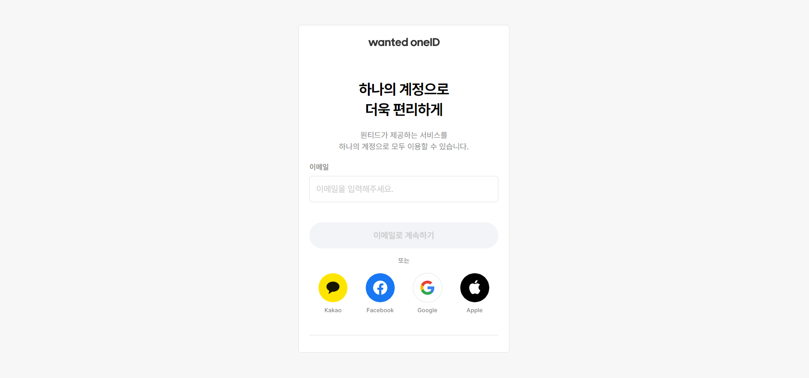
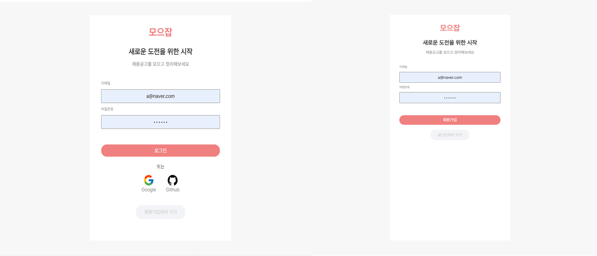

# 🔑 회원가입/로그인 페이지

회원가입과 로그인을 통해서 개인 별로 채용공고를 관리하기 위해서 회원가입/로그인 페이지를 만들었다. 페이지를 만들면서 고민했던 과정을 정리해보았다.

## 🎨 디자인

디자인은 원티드의 로그인/회원가입 페이지를 참고했는데 컨텐츠를 모바일 사이즈인 400px를 기준으로 만들어 모바일과 데스크 탑에서 동일하게 보일 수 있게 했다. 이것을 참고해 똑같이 400px를 기준으로 디자인했고, OAuth를 연결해 간편하게 이용할 수 있게 해당 플랫폼들을 아래에 추가했다.

[원티드의 회원가입/로그인 페이지]



[모으잡의 회원가입/로그인 페이지]


## 💊Firebase의 Auth 기능

로그인/회원가입을 아직 직접 구현하기 위해서는 node js에 대한 공부가 더 필요해, 우선은 firebase로 구현했다. firebase 문서를 참고해서 email/password, google, github 세 가지 방식을 이용해 기능을 구현했다.

### AuthService 모듈 제작

먼저 firebase를 이후에 database에도 이용할 예정이기 때문에, 공통으로 전달할 수 있게 \_app.tsx에서 firebaseApp을 만들고 각각의 모듈에 전달할 수 있게 했다.

```tsx
const config: ConfigType = {
  apiKey: process.env.NEXT_PUBLIC_API_KEY || "",
  authDomain: process.env.NEXT_PUBLIC_AUTH_DOMAIN || "",
  projectId: process.env.NEXT_PUBLIC_PROJECT_ID || "",
  storageBucket: process.env.NEXT_PUBLIC_STORAGE_BUCKET || "",
  appId: process.env.NEXT_PUBLIC_APP_ID || "",
  measurementId: process.env.NEXT_PUBLIC_MEASUREMENT_ID || "",
}

function MyApp({ Component, pageProps }: AppProps) {
  const app = initializeApp(config)
  const authService = new AuthServiceImpl(app)
  const { push } = useRouter()

  return (
    <>
      <AuthProvider authService={authService}>
        <Component {...pageProps} />
      </AuthProvider>
    </>
  )
}
export default MyApp
```

회원가입/로그인 로직을 담는 모듈인 Authservice는 아래와 같이 interface와 interface를 실행하는 AuthserviceImpl class를 만들었다.

```typescript
/Authtypes.ts
export interface AuthService {
  signIn: (email: string, password: string) => Promise<UserCredential>;
  signUp: (email: string, password: string) => Promise<UserCredential>;
  OAuthSignIn: (platfrom: OAuthType) => Promise<UserCredential>;
  signOut: () => Promise<void>;
}

//Authservice.ts
export class AuthServiceImpl implements AuthService {
  googleProvider: GoogleAuthProvider;
  githubProvider: GithubAuthProvider;
  auth: Auth;

  constructor(private app: FirebaseApp) {
    this.googleProvider = new GoogleAuthProvider();
    this.githubProvider = new GithubAuthProvider();
    this.auth = getAuth(this.app);
  }
  signIn(email: string, password: string) {
    return signInWithEmailAndPassword(this.auth, email, password);
  }

  signUp(email: string, password: string) {
    return createUserWithEmailAndPassword(this.auth, email, password);
  }

  OAuthSignIn(platform: OAuthType): Promise<UserCredential> {
    const provider = this[`${platform}Provider`];
    return signInWithPopup(this.auth, provider);
  }

  signOut() {
    return signOut(this.auth);
  }
}

```

### SignIn과 SignUp

회원가입/로그인 페이지 내 AuthService가 사용될 곳은 AuthForm 컴포넌트로 회원가입과 로그인 모두에서 동일한 UI를 사용되게 했다. 한곳에서 회원가입/로그인 두 가지 조금 다른 로직을 처리해야 했기 때문에 컴포넌트 내부가 복잡하다고 생각했다.

회원가입 페이지에서 성공 시에는 login페이지로 이동하면서 이전에 있던 에러 메시지는 지워줘야 했고, 로그인 페이지는 성공시에 받은 userData를 이용해 accessToken을 받을 수 있어 우선 localStorage에 저장하고 메인 페이지로 이동해야 했다.

```tsx
//AuthForm.tsx
...
export default function AuthForm({ isLogin }: AuthFormProps) {
	...
  const authService = useAuth();
  const { push } = useRouter();

  const handleSubmit = (e: React.FormEvent<HTMLFormElement>) => {
    e.preventDefault();
    const { email, password } = userInfo;
    if (isLogin) {
      authService
        .signIn(email, password)
        .then((userData: UserCredential) => {
          return userData.user.getIdToken();
        })
        .then((token) => {
          localStorage.setItem(AccessToken, token);
          push('/');
        })
        .catch((error) => setMessage(error.message));
    } else {
      authService
        .signUp(email, password)
        .then(() => {
          push('/login');
          setMessage('');
        })
        .catch((error) => setMessage(error.message));
    }
  };

  return (
    <Layout action="submit" onSubmit={handleSubmit} isActive={!isInActive}>
      <AuthInput
        name={EMAIL_INPUT.name}
        text={userInfo.email}
        title={'이메일'}
        placeholder={EMAIL_INPUT.placeholder}
        dispatch={dispatch}
      />
      <AuthInput
        name={PASSWORD_INPUT.name}
        text={userInfo.password}
        title={'비밀번호'}
        placeholder={PASSWORD_INPUT.placeholder}
        dispatch={dispatch}
      />
      {message && <ErrorMessage message={message} />}
      <button type="submit" disabled={isInActive}>
        {name}
      </button>
    </Layout>
  );
}
```

로직이 promise chaining으로 이어지다 보니 하는 일에 비해 로직이 차지하는 코드가 많이 보여, 따로 분리하고자 했다. 정리할 때 custom Hook을 이용하려 했지만 custom Hook은 handleSubmit 내부에서 사용할 수 없기 때문에 "함수"로 분리해 정리했다.

```tsx
//logic.ts
export const login = async (
  userInfo: UserInfoType,
  authService: AuthService,
  router: NextRouter,
  setMessage: React.Dispatch<React.SetStateAction<string>>
) => {
  const { push } = router;
  const { email, password } = userInfo;
  try {
    const userData = await authService.signIn(email, password);
    const token = await userData.user.getIdToken();
    localStorage.setItem(AccessToken, token);
    push('/');
  } catch (error) {
    const loginError = error as { message: string };
    setMessage(loginError?.message);
  }
};

export const register = async (
  userInfo: UserInfoType,
  authService: AuthService,
  router: NextRouter,
  setMessage: React.Dispatch<React.SetStateAction<string>>
) => {
  const { push } = router;
  const { email, password } = userInfo;
  try {
    await authService.signUp(email, password);
    push('/login');
  } catch (error) {
    const registerError = error as { message: string };
    setMessage(registerError?.message);
  }
};

//AuthForm.tsx
export default function AuthForm({ isLogin }: AuthFormProps) {
  const [message, setMessage] = useState('');
  const [userInfo, dispatch] = useReducer(authReducer, initialState);
  const isInActive = !userInfo.emailValid || !userInfo.passwordValid;
  const authService = useAuthService();
  const router = useRouter();
  const handleSubmit = (e: React.FormEvent<HTMLFormElement>) => {
    e.preventDefault();
    if (isLogin) {
      login(userInfo, authService, router, setMessage);
    } else {
      register(userInfo, authService, router, setMessage);
    }
  };
  const name = isLogin ? '로그인' : '회원가입';

  return (
 	...
  );
}
```

### OAuthSignIn

firebase의 OAuth 서비스를 이용하기 위해서 해당 플랫폼의 provider을 연결하고 signInWithPopup 메소드를 이용하면 되는데, provider의 종류에 관계없이 하나의 함수를 사용하기 위해 전달받은 platform의 provider와 연결될 수 있게 로직을 구성했다. AuthService와 연결하기 위해서 button태그의 name으로 인자를 전달되게 했다.

```typescript
//AuthService.ts
export class AuthServiceImpl implements AuthService {
  googleProvider: GoogleAuthProvider
  githubProvider: GithubAuthProvider
  auth: Auth

  constructor(private app: FirebaseApp) {
    this.googleProvider = new GoogleAuthProvider()
    this.githubProvider = new GithubAuthProvider()
    this.auth = getAuth(this.app)
  }

  OAuthSignIn(platform: OAuthType): Promise<UserCredential> {
    const provider = this[`${platform}Provider`]
    return signInWithPopup(this.auth, provider)
  }
}

//PlatformBtns.tsx

export const OAuthLogin = async (
  name: OAuthType,
  authService: AuthService,
  router: NextRouter
) => {
  const { push } = router
  try {
    const userData = await authService.OAuthSignIn(name)
    const token = await userData.user.getIdToken()
    localStorage.setItem(AccessToken, token)
    push("/")
  } catch (error) {
    console.log(error)
  }
}

export default function PlatformBtns() {
  const authService = useAuthService()
  const router = useRouter()
  const handleClick = (e: React.MouseEvent<HTMLButtonElement>) => {
    const { name } = e.currentTarget
    if (name === PLATFORM.GOOGLE || name === PLATFORM.GITHUB) {
      OAuthLogin(name, authService, router)
    }
  }
  return (
    <Wrapper>
      <button name={PLATFORM.GOOGLE} onClick={handleClick}>
        ...
      </button>
      <button name={PLATFORM.GITHUB} onClick={handleClick}>
        ...
      </button>
    </Wrapper>
  )
}
```

### Logout

Navbar의 로그아웃 버튼을 추가해 간단하게 처리할 수 있었다.

```tsx
export default function Navbar() {
  const { push } = useRouter()
  const authService = useAuthService()
  const onSignOut = () => {
    authService
      .signOut()
      .then(() => {
        localStorage.removeItem(AccessToken)
        push("/login")
      })
      .catch(error => console.log(error))
  }
  return (
    <Wrapper>
      <Layout>
        <Link href="/">모으잡</Link>
        <Btns>
          <button onClick={onSignOut}>로그아웃</button>
        </Btns>
      </Layout>
    </Wrapper>
  )
}
```

아직 예외 처리, token관리, redirection을 해주어야 하지만 우선 전반적으로 완성한 후에 다시 돌아와서 수정하고자 한다. 남은 큰 기능들은 Database, 자격조건/우대사항 체크 기능, 크롤러 프로그램을 수행해 줄 서버 기능이 있다.
