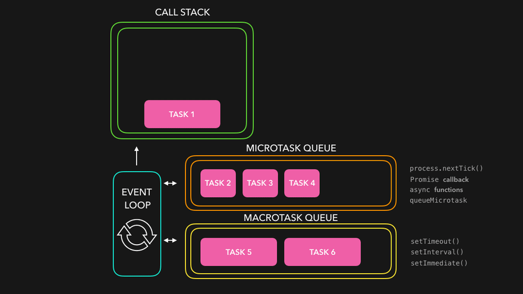

# 💡 비동기와 프로미스

"동기다, 비동기다", 자바스크립트를 사용하면서 많이 들어온 말이다. 비동기와 프로미스를 이해한다는 것은 프로그램의 흐름을 이해하고 성능 최적화, 에러 핸들링 등을 처리할 수 있는 아주 중요한 요소이기 때문에 정리해 보고자 한다.

먼저 <u>동기와 비동기란 뭘까?</u>

## 📂동기와 비동기

위 그림의 동기적인 과정은 하나의 일이 끝날 때까지 기다렸다가 다음 일을 처리하는 것을 의미하고, 아래 그림은 비동기 과정으로 하나의 일을 끝날 때까지 기다리는 것이 아니라 일을 동시에 처리하고 있다. 비동기 처리 과정은 여러 일을 같이 하고 있기 때문에 훨씬 시간이 적게 걸리는 것을 알 수 있다.

이렇게 하나의 일을 처리하는데 오랜 시간이 걸려 이후 작업을 막게 되는 경우, 비동기 처리를 통해 효율을 높일 수 있다.


a,b,c 라는 변수를 간단하게 호출하고 있는 예시를 보자.

```javascript
const a = 1
const b = 2
const c = 3

console.log(a)
console.log(b)
console.log(c)

//결과: 1,2,3

//비동기
console.log(a)
setTimeout(() => {
  console.log(b)
}, 0)
console.log(c)

//결과: 1,3,2
```

동기 코드인 위의 예시는 결과가 일의 순서대로 1,2,3이란 결과를 나타내고, 비동기 코드인 아래의 예시는 1,3,2라는 코드를 적은 순서와 다른 결과를 갖게 되었다.

console.log(b)를 console.log(c)보다 먼저 자바스크립트 엔진이 읽었지만, 비동기 처리에 의해 순서대로 진행하는 것이 아니라 <u>b를 다른 곳에서 처리한 후에 가져오는 것</u>처럼 보인다. 만약 b가 처리하는데 엄청 오래 걸리는 과정이라고 가정한다면, 동기적 코드에서는 오랜 시간 뒤에 c가 호출이 가능하다. 비동기 처리로 인해 오래 걸리는 b라는 일을 넘겨서 처리하는 동안 c를 처리하면 훨씬 효율적으로 일을 처리할 수 있다.

그러면 이렇게 보내진 비동기 처리는 <u>어디서, 어떻게</u> 이루어지는 걸까?

## ⏰ 모든 일의 순서를 관리하는 스케줄러, Event loop

자바스크립트는 싱글 스레드로 일이 처리된다. 여러 개의 일을 한번에 처리하는 것이 아니라, **한번의 하나의 일만 처리할 수 있다**는 의미다. 그러면 앞서 보았던 비동기 처리는 어디서 이루어지는 의문이 든다. 비동기는 여러 개의 일을 동시에 처리하는 것이고, 우리가 브라우저를 이용할 때 여러 개의 일을 동시에 하는 것처럼 느껴지는데 어떻게 된 걸까?

이것을 이해하기 위해서는 먼저 자바스크립트 엔진과 브라우저의 역할을 이해할 필요가 있다.

먼저 자바스크립트 엔진에는 힙과 콜스택으로 구성되어 있다. 콜스택은 실행 컨텍스트 스택과 같은 것으로, 실행 컨텍스트의 순서를 기억하고 있다. 힙에는 객체가 저장되는 메모리 공간으로 동적으로 생기는 변수들, 크기를 정할 수 없는 객체들을 저장하고 실행 컨텍스트는 힙에 저장된 객체들을 참조하고 있다. 그렇기 때문에 앞서 말한 대로 자바스크립트 자체는 싱글 스레드로 콜스택에 쌓여있는 순서로 코드를 평가하고 실행하는 기능만 갖고 있다.

비동기 처리를 위해서는 자바스크립트 엔진이 작동하는 **Node Js나 브라우저**가 도와줘야 한다. 앞선 코드에서 사용된 setTimeout과 같은 브라우저/Node API를 사용하면 자바스크립트 엔진은 평가하고 실행하는데, 호출되는 시점과 콜백함수의 등록은 브라우저와 Node.js가 해 준다. 이렇게 등록할 콜백함수를 보관하는 곳은 Task Queue다. Task Queue에 저장된 callback함수는 <u>하나씩</u> event loop이 callstack이 비어 있을 때 가져와 자바스크립트 엔진이 처리할 수 있게 한다.

이렇게 다른 역할을 갖고 있는 자바스크립트 엔진과 브라우저를 연결해 자바스크립트의 동시성을 지원하는 것이 **Event loop**이다.


앞선 비동기 예제를 다시 설명하면 다음과 같다.

```javascript
const a = 1
const b = 2
const c = 3

console.log(a)
setTimeout(() => {
  console.log(b)
}, 0)
console.log(c)

//결과: 1,3,2
```

1. 전역컨텍스트가 만들어지고 콜스택에 들어간다.
2. 평가 과정을 통해 변수 a,b,c가 등록되고 실행 과정에서 WebAPI인 SetTimeOut은 함수 컨텍스트를 만들어 콜스택에 추가된다.
3. SetTimeOut 내부 콜백 함수는 브라우저로 넘어가고 함수 컨텍스트는 종료되어 콜스택에서 제거된다.
4. 타이머가 완료되면 taskQueue에 콜백 함수가 등록되는데, 이 과정에서 자바스크립트 엔진은 다음 실행 코드인 console.log(c)가 처리한다.
5. call stack이 다 비면 taskQueue에 있던 콜백 함수를 가져와 console.log(c)를 수행한다.

이러한 과정 때문에 결과가 1,3,2로 처리되었던 것이다.

주의할 점은 자바스크립트 엔진은 싱글 스레드이지만 브라우저는 멀티스레드로 여러가지 일을 동시에 처리해 줄 수 있다.

그러면 <u>모든 비동기 처리</u>를 콜백함수로 하면 되는걸까?

## ❗ 콜백 함수의 한계

콜백함수는 **콜백함수 내부 결과를 외부로 반환할 수 없다**. 앞서 사용한 setTimeOut을 예로 설명해보면 콜백 함수가 실행되는 시점에는 setTimeOut의 함수 컨텍스트가 존재하지 않는다. 그렇기 때문에 상위 스코프의 변수에 값을 할당하거나 결과를 반환하는 것이 불가능하다. 그렇기 때문에 try-catch문으로 에러 처리를 하려해도 에러가 발생하는 시점에서의 에러는 잡히지 않는다.

실행 결과에 따라 다음 과정을 전달하기 위해서는 콜백 함수 내부에서 처리되어야 하고, 이 과정이 중첩되게 되면서 가독성이 떨어지는 "Callback hell"이 된다.

아래 코드는 Callback hell의 예제로 로그인 과정을 구현한 코드다. 이렇게 코드가 짜여져 있다면 가독성이 떨어지고, 유지 보수에도 어려운 단점을 갖는다.

```javascript
class UserStorage {
  loginUser(id, password, onSuccess, onError) {
    setTimeout(() => {
      if (
        (id === "seul" && password === "123") ||
        (id === "kim" && password === "456")
      ) {
        onSuccess(id)
      } else {
        onError(new Error("error"))
      }
    }, 2000)
  }

  getRoles(user, onSuccess, onError) {
    setTimeout(() => {
      if (user === "seul") {
        onSuccess({ name: "seul", role: "admin" })
      } else {
        onError(new Error("error"))
      }
    }, 1000)
  }
}

const userStorage = new UserStorage()
const id = prompt("아이디를 입력해 주세요!")
const password = prompt("비밀번호를 입력해 주세요!!")

userStorage.loginUser(
  id,
  password,
  user => {
    userStorage.getRoles(
      user,
      userWithRole => {
        alert(
          `hello ${userWithRole.name}, you have a ${userWithRole.role} role`
        )
      },
      error => {
        console.log("에러2")
      }
    )
  },
  error => {
    console.log("에러1")
  }
)
```

그러면 <u>callback함수의 한계를 어떻게 극복할 수 있을까?</u>

## 🎈 callback 함수의 한계를 극복하기 위한, Promise

Promise는 말 그대로 약속, 이후에 약속된 결과를 주겠다는 의미를 가지며, 비동기 처리 상태와 결과를 관리하는 객체다.

promise의 비동기 처리 상태는 pending (수행되지 않은 상태), fulfilled (성공), rejected (실패), 세 가지가 있고, 상태 정보는 promise를 만들 때 전달 받은 인자인 resolve와 reject를 호출하면서 변경된다. resolve는 성공 시에 수행할 함수, reject는 실패 시에 수행할 함수이다.

비동기 처리 결과에 따라 다음 후속 처리를 위해서 then, catch, finally 내장 메소드를 이용할 수 있으며, then은 성공했을 때를, catch는 실패했을 때, finally는 성공,실패와 상관없이 처리할 수 있다. 각각은 promise를 반환하기 때문에 체이닝이 가능하다.

체이닝에서 주의할 점은 성공 시 반환한 값은 다음 then의 인자로 전달 되고, promise로 계속해서 처리가 된다는 점이다. promise를 처음 배울 때 가장 어려운 부분이었다. catch는 어느 곳에서 에러가 나도 받아오기 때문에 then의 두 번째 인자로 에러처리를 하지말고, 항상 catch를 사용하는 것이 효율적이다.

```javascript
function getData(state) {
  return new Promise(function (resolve, reject) {
    if (state === "성공") {
      resolve("성공")
    } else {
      reject(new Error("Request is failed"))
    }
  })
}

getData("성공")
  .then(console.log) //성공
  .catch(function (err) {
    console.log(err)
  })

getData("실패")
  .then(console.log)
  .catch(function (err) {
    console.log(err) // Error: Request is failed
  })
```

그러면 이번엔 앞서 보았던 callback hell 예제를 promise로 해결해보자

```javascript
class UserStorage {
  loginUser(id, password) {
    return new Promise((resolve, reject) => {
      setTimeout(() => {
        if (
          (id === "seul" && password === "123") ||
          (id === "kim" && password === "456")
        ) {
          resolve(id)
        } else {
          reject(new Error("에러1"))
        }
      }, 2000)
    })
  }

  getRoles(user) {
    return new Promise((resolve, reject) => {
      setTimeout(() => {
        if (user === "seul") {
          resolve({ name: "seul", role: "admin" })
        } else {
          reject(new Error("에러2"))
        }
      }, 1000)
    })
  }
}

const userStorage = new UserStorage()
const id = prompt("아이디를 입력해 주세요!")
const password = prompt("비밀번호를 입력해 주세요!!")

userStorage
  .loginUser(id, password)
  .then(userStorage.getRoles)
  .then(user => alert(`hello ${user.name}, you have a ${user.role} role`))
  .catch(console.log)
```

클래스 내부는 크게 달라진 것은 없지만, 사용할 때 복잡도가 크게 줄어 가독성이 향상된 것을 알 수 있다. 이렇게 프로미스를 통해 callback함수의 한계인 후속처리와 에러처리를 해결할 수 있다는 것을 알 수 있었다.

### Promise의 메소드

promise의 또다른 장점은 promise 자체적으로 제공하는 다양한 메소드다.

#### 1. Promise.all

여러개의 promise를 동시에 병렬적으로 이용할 때, 사용할 수 있는 메소드로, 인자로 프로미스의 이터러블을 전달받는다. 전달된 이터러블의 순서가 보장되어 반환되며, 요소중 하나라도 rejected상태가 되면 바로 종료되며 가장 먼저 rejected된 결과를 catch로 전달한다.

아래의 예제에는 세가지 서로 의존되지 않는 promise가 수행되는데. chaining을 이용해 총 6초 정도가 걸리는 상황이다.

```javascript
const requestData1 = () =>
  new Promise(resolve => setTimeout(() => resolve(1), 3000))
const requestData2 = () =>
  new Promise(resolve => setTimeout(() => resolve(2), 2000))
const requestData3 = () =>
  new Promise(resolve => setTimeout(() => resolve(3), 1000))

const res = []
requestData1()
  .then(data => {
    //3초뒤 받아와
    res.push(data)
    return requestData2()
  })
  .then(data => {
    //2초뒤 받아와
    res.push(data)
    return requestData3()
  })
  .then(data => {
    //1초뒤 받아와
    res.push(data)
    console.log(data) //총 6초 뒤 호출
  })
  .catch(console.log)
```

promise.all을 이용하면 가장 오래 걸리는 requestData1이 fulfilled 상태가 될 때, 총 3초 정도가 지나고 then으로 처리 결과를 전달되어 더 효율적으로 처리가 가능하다.

```javascript
const requestData1 = () =>
  new Promise(resolve => setTimeout(() => resolve(1), 3000))
const requestData2 = () =>
  new Promise(resolve => setTimeout(() => resolve(2), 2000))
const requestData3 = () =>
  new Promise(resolve => setTimeout(() => resolve(3), 1000))

Promise.all([requestData1(), requestData2(), requestData3()])
  .then(console.log) //[1,2,3]
  .catch(console.error)
```

#### 2. Promise.race

Promise.race는 말 그대로 경주하듯이, 전달 받은 promise 중 가장 먼저 fulfilled된 promise의 처리결과를 resolve하는 promise를 반환한다. 에러 처리는 Promise.all과 동일하게 요소 중 하나라도 rejected상태가 되면 바로 종료되며 가장 먼저 rejected된 결과를 catch로 전달한다.

```javascript
const requestData1 = () =>
  new Promise(resolve => setTimeout(() => resolve(1), 3000))
const requestData2 = () =>
  new Promise(resolve => setTimeout(() => resolve(2), 2000))
const requestData3 = () =>
  new Promise(resolve => setTimeout(() => resolve(3), 1000))

Promise.race([requestData1(), requestData2(), requestData3()])
  .then(console.log) //3
  .catch(console.error)
```

#### 3. Promise.allSettled

settled은 fulfilled이나 rejected로 비동기 처리가 된 상태를 의미해 성공/실패 여부와 상관없이 결과를 반환해 주는 메소드다.

```javascript

Promise.allSettled([
  new Promise((resolve) =>
    setTimeout(() => {
      resolve(1);
    }, 2000)
  ),
  new Promise((_, reject) =>
    setTimeout(() => {
      reject(new Error('error'));
    }, 1000)
  ),
]).then(console.log);

//결과:
[
  { status: 'fulfilled', value: 1 },
  {
    status: 'rejected',
    reason: Error: error
        at Timeout._onTimeout (C:\Users\juni2\projects\js study\DeepDive\main.js:32:14)
        at listOnTimeout (node:internal/timers:559:17)
        at processTimers (node:internal/timers:502:7)
  }
]

```

## Promise 처리는 microtask Queue

event loop을 설명하면서 callback은 task queue에 저장된다. promise는 callback함수와 달리 task Queue가 아닌 micro-task Queue에 저장된다.



microtask queue는 task queue보다 우선순위가 높아 callstack이 비게 되면, event loop이 microtask queue의 promise를 **다 가져와** 처리한다. 이때 microtask Queue가 비지 않으면 다음으로 event loop이 이동하지 않고 계속해서 머물러서 브라우저가 죽어버리는 것을 볼 수 있다.

```javascript
function handleClick() {
  Promise.resolve(0).then(() => {
    handleClick() //재귀로 계속해서 promise를 추가해
  })
}

handleClick()
```

## 마치며

새롭게 알게 된 것은 promise의 then에게 두 번째 인자로 에러 처리를 담아 줄 수 있다는 점이었다. 하지만 catch로 에러 처리하는 것이 더 직관적이고 효율적이라는 점도 알게 되었다. promise를 여러 개 동시에 처리한 적이 없어서 promise의 메소드를 사용해본 적이 없는 아쉬움이 있었는데, 필요할 때 떠올릴 수 있게 공부한 것이 좋은 경험이었다.

[참조]

- [Understanding Event Loop, Call Stack, Event &amp; Job Queue in Javascript](https://medium.com/@Rahulx1/understanding-event-loop-call-stack-event-job-queue-in-javascript-63dcd2c71ecd)

- [모던 자바스크립트 딥다이브](http://www.yes24.com/Product/Goods/92742567)

- [Callback Hell (콜백 지옥)](https://velog.io/@seul06/JavaScript-%EC%BD%9C%EB%B0%B1-%EC%A7%80%EC%98%A5)

- [자바스크립트 Promise 쉽게 이해하기](https://joshua1988.github.io/web-development/javascript/promise-for-beginners/#promise%EA%B0%80-%EB%AD%94%EA%B0%80%EC%9A%94)
