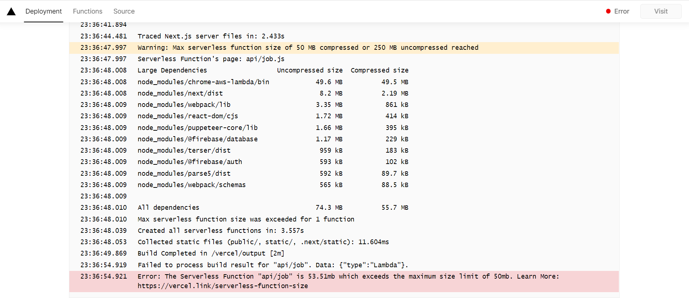
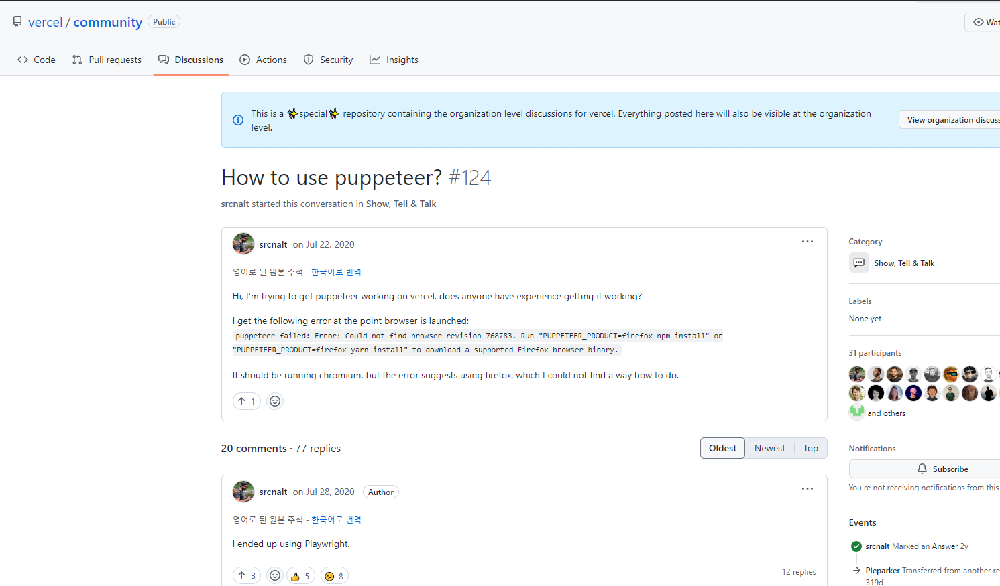
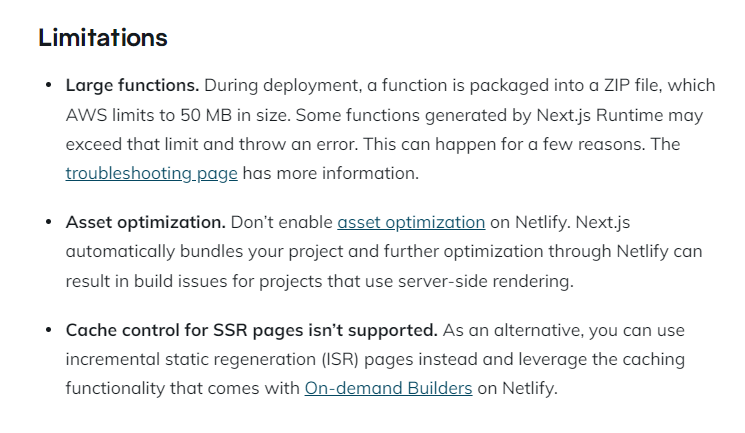
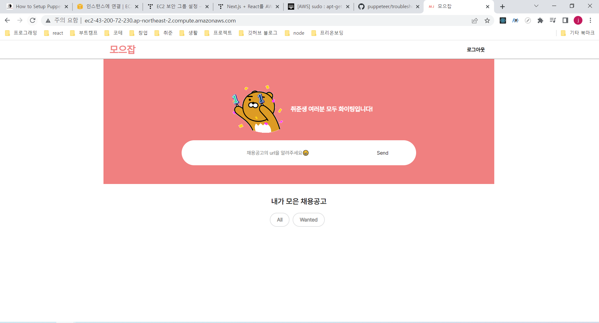

## ✨ vercel로 간단하게 배포... 라고 할 뻔

누가 그랬다... next js는 vercel에서 만들었으니까 vercel을 이용하면 배포가 뚝딱이라고. 나의 경우에는 그게 안되었다.. 어제 28일 오후 8시부터 새벽 5시까지의 사투를 작성해보려 한다.

### Vercel

무료이고, CI/CD가 자동화되었고, next js를 만든 회사이기 때문에 연동이 잘될 것 같다는 기대감으로 가장 먼저 시도했다. 처음에는 문제없이 동작하는 듯 했다. 하지만 api 서버를 수정하고 다시 배포하려고 재배포를 했을 때, 이상한 에러를 만나게 되었다..

[serverless function error]

"serverless function"이라는 난생 처음 보는 단어부터 만나고 찾아보니, 내가 추가한 크롤링 프로그램의 api 함수의 용량이 50MB를 넘기 때문에 배포 에러가 난 것이었다. api/job.ts 자체는 크게 용량을 차지할 부분이 없지만 크롤링 프로그램에서 하는 게 많아서 문제가 되었나 라는 생각으로 puppeteer vercel을 검색한 결과, 나와 똑같은 문제를 겪고 있는 사람들을 vercel/issues에서 찾을 수 있었다.

[링크: https://github.com/vercel/community/discussions/124]

20개의 discussion을 다 읽고 제시한 방법들을 다 시도했다. node를 14버전으로 낮추고 패키지들을 조정하는 방법, 아예 다른 크롤링 프로그램을 쓰는 방법 등을 해보았지만 node 14로 낮출경우 styled-components와 의존성 문제가 발생했고, 크롤링 프로그램을 바꿔도 여전히 에러가 있었다.

지금으로써는 vercel로는 방법이 더 이상 없겠다는 생각에 다른 배포 방법을 찾아 나섰다.

### Netlify

vercel과 같이 무료로 배포가 가능한 netlify를 찾아보고, 가장 먼저 serverless function을 확인했더니... vercel과 동일하게 50MB 제한을 두고 있었다.
배포해봤자 동일한 에러로 배포가 되지 않을 것을 알게 되고 결국 찾은 곳은 AWS의 ec2였다.

[netlify issue]

### AWS EC2

EC2는 클라우드 컴퓨팅 서비스를 공부하면서 컴퓨터 한대를 빌리는 것과 같다는 것을 알고 있었다. 컴퓨터를 커스텀할 수 있다는 장점이 있지만, 나에게는 장점이 아닌 두려움이었다. 보안이나 AWS 설정들을 잘못해두거나 사용 중에 잘못해서 과금이 되는 경우들도 찾아보다 보니 어려워 보였다.

하지만 프로젝트를 그냥 로컬에서 "헤헤 잘돌아간다" 하고 사람들에게 보여줄 수 없다면 무슨 의미겠나 라는 생각으로 간절하게 AWS EC2로 배포를 시작했다. 다행히 자세히 설명해놓으신 블로그를 발견해서 따라했다. 고마워요... (https://iborymagic.tistory.com/103)

실제 컴퓨터를 설정하는 것이기 때문에 OS부터 설정해야 했다. Ubuntu 18.04를 선택하고 t2.micro로 인스턴스를 선택했다. 키페어는 pem을 이용해 ssh로 접속이 가능하게 설정했다. 그리고 내 로컬 폴더의 root에 .pem 파일을 추가한 후에 예로 되어있는 부분을 이용해 접속할 수 있었다.

[참고 블로그의 예시]

여기까지 괜찮다고 생각했지만 어려움은 Linux를 이용한 실행 과정에 시작되었다. 예시 블로그에서는 내부 설정 과정이 삭제되어있지만 EC2에 접속한 후에 설치할 패키지들이 있다. 그때 처음 써보는 Linux 명령어들에 멘붕이 오기도 했지만... 역시 좋은 분들이 써놓은 블로그의 도움으로 해결했다.

가장 먼저 해야 할 일은 node js, npm, yarn을 설치하는 일이었다. 여기서 어려웠던 것은 분명 블로그에`sudo apt-get install <패키지>` 를 이용하면 된다고 되어 있는데 내가 사용하는 환경에서는 되지 않았다. 그 이유는 linux 배포판에서 apt-get을 지원하지 않아서 생긴 에러였고, 대신 apt-get 대신 `sudo yum install <package이름>`를 이용하면 되었다. 진행 중에 그냥 `yum install <package이름>`으로 해보았지만, 권한 문제가 생겨 실행되지 않는 것을 보고, `sudo`가 관리자 권한으로 실행하는 것을 새로 알게 되었다.

이렇게 나름 명령어에 익숙해지고 난 후에 드디어 npm과 node, yarn을 성공적으로 설치할 수 있었다. 이렇게 친숙한 패키지들을 설치하고 나니 수월하게 git clone으로 레포를 가져와 실행할 수 있었다. 레포를 가져온 후에 환경변수를 설정하기 위해 `vim.env`로 들어가 직접 써서 추가한 후에 yarn build와 yarn start를 진행해서 드디어 페이지에 접속할 수 있었다.

페이지에 접속하고 나서 여러 기능을 체크하는 와중에 크롤링을 이용해 새로운 공고를 받아오는 기능을 체크하다가 `Error: Failed to launch the browser process!` 에러를 발견하게 되었다. puppeteer 에러라는 것을 확인하고 관련 puppeteer의 troubleShooting부분을 보았다. 페이지에서는 노드 14 버전에서 실행 시 생길 수 있는 문제라고 했지만, ec2에 설치한 노드 버전은 16이기 때문에 해당되지 않았다. 그럼 문제가 뭔지 고민 끝에 `puppeteer의 동작 방식이 로컬의 chrome을 이용한다`는 것을 생각해냈다. 그렇기 때문에 chrome과 관련된 패키지가 깔려있지 않을 경우 에러가 발생할 수도 있을 것 같아, 관련 패키지들을 찾아 설치했다.

(참고한 Ubuntu에 chrome 설치하는 방법 https://frugalisminds.com/how-to-setup-puppeteer-in-centos-7/)

다행히 예측한 원인이 맞아서 정상 작동되는 것을 확인했다.

이후에 ec2 접속을 종료해도 계속해서 서버가 동작할 수 있게, 무중단 배포를 적용했다. pm2를 이용해 무중단 배포를 실행해 배포를 완료할 수 있었다.
