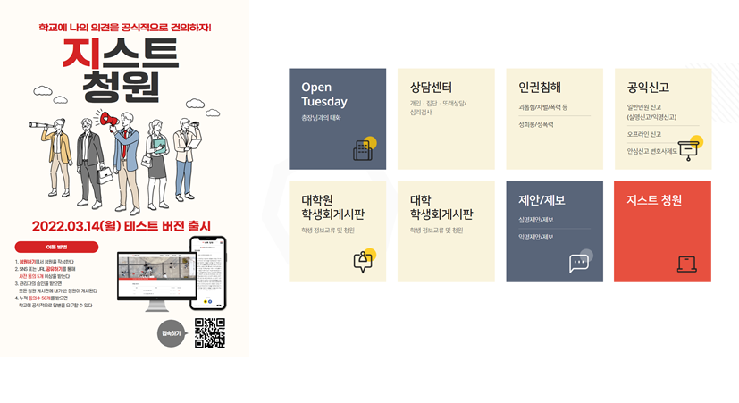

# 🙋‍♂️ 지스트 청원서비스

지스트 청원서비스는 8명으로 이루어진 Better IT팀이 2021년 7월에 팀빌딩을 시작해 2022년 3월 14일에 런칭, 현재는 학교에서 운영되고 있는 프로젝트다. 나는 2021년 11월부터 참여해 4월까지 참여했고, 코딩 공부를 시작하고 처음으로 참여한 팀 프로젝트였다. 그때 배웠던 많은 것들이 토대가 되어, 혼자 프로젝트를 할 때, 프리온보딩 코스에 참여하면서도 적용해 나갔다. 개발 공부를 하면서 중요한 전환점이 되었던 지스트 청원서비스를 회고해보려 한다.

## 🙄 같이 해도 괜찮을까..?

내가 참여하기 전 Better IT 팀은 원래 7명 이었다. 팀은 학교 알고리즘 공부를 위한 동아리에서 시작되어, 컴퓨터 공학 전공생 7명이 함께해 있었다. 운이 좋았던 나는, 그 당시에는 몰랐지만 그중에 친한 친구 2명이 참여하고 있었고, 룸메이트였던 친구에게 개발 공부를 시작하면서 '어떻게 공부하면 좋을지 모르겠다'는 이런저런 고민을 얘기하다가 '그러면 내가 이런 걸 하고 있는데 같이 하는 건 어때' 라고 먼저 제안해주었다. 혼자 공부하면서 투두리스트 페이지를 만들고 '나는 개발자가 될 거야' 하던 한참 부족한 시절의 나였지만, 고마운 친구들은 나에게 먼저 같이 해보자는 제안을 해주었다.

제안을 받고 내가 짐이 되지는 않을까 고민도 많이 되었다. 팀의 목표가 확실해 보였고, 나는 아직 부족하다는 생각이 너무 많아 더 자신감이 없었다. 친구가 그래도 팀으로 해보는 경험이 중요하다고 설득해줘서 **도전**해 보기로 마음 먹었다. 그렇게 Better IT팀의 프론트엔드 개발자로 참여하게 되었다.

## 🚩 학교야, 우리 얘기 좀 들어줘

당시 우리 팀이 정의한 문제는 <u>학교와 학생의 소통 부재</u>였다. 당시에 대학원에는 학생회가 활발히 활동하고 있었던 것에 반해, 대학교의 학생회는 없는 상태여서 학교에 대학생들의 의견을 건의할 방법이 없었고, 그로 인해 학생들의 불만은 에브리타임과 같은 곳에 올라오고 있는 상황이었다. 에브리타임에 올라온 의견들 중에 개인적인 일들도 있지만 많은 사람들의 동의를 받고, 공감 가는 건의사항들이 많았기 때문에 이런 **학생들 공공의 문제들을 직접 학교에 전달할 수 있는 방법이 없을까**하는 고민에서 시작했다.

학교에 학생들의 문제를 전달하는 방법이 어떤 것이 있을지 고민했고, 당시 청와대의 국민 청원 페이지가 있어 사람들의 많은 공감과 동의를 받고 있었고, 우리도 **학교 내의 청원 페이지를 만들어 보는 게 어떨까**라는 생각으로 이어졌다. 당시 아직 학교가 우리의 서비스를 이용할 지 정해지지 않은 상태였지만 학교와 학생들 사이의 소통 창구가 될 수 있기를 바라는 마음으로, 그렇게 지스트 청원서비스가 시작되었다.

## 🎨 서비스의 얼굴, 디자인의 시작

문제 정의와 문제 해결 방식에 대해 팀이 동기화가 되고 나서 프론트엔드 개발자로써 가장 처음 참여한 일은, 다같이 디자인을 구상하고 계획하는 일이었다. 당시 프론트엔드 팀에서 Figma를 이용해서 디자인한 후에 화면으로 옮기기로 해, 먼저 Figma로 디자인을 했다. 내가 참여한 시점에서는 홈페이지와 청원페이지의 디자인이 끝난 상태였고, 회원가입과 로그인 페이지부터 디자인에 참여했다. 4명의 팀원들이 모두 모여서 기획하고 어떤 디자인이 더 적절할 지, 청와대 국민 청원, 국회의 국민 청원, 그리고 학교의 홈페이지를 참고해 서비스의 디자인을 입혀갔다. 디자인을 하면서 어떤 게 더 좋을지 너무 고민될 때는 옆에서 회의하고 있는 백엔드 팀의 의견을 구하기도 하면서, 팀원들 모두가 동의한 디자인을 만들어 갔다.

[ Figma에 함께 디자인한 청원 서비스 페이지 ]

## 👓 디자인했으니 이제 만들자, 페이지 스타일링

구체적인 디자인을 만든 이후에 실제로 서비스에 반영하는 일은 생각보다 어려운 일이었다. 팀 내 스타일링 라이브러리로 styled-components와 chakra-ui를 이용하기로 정해, 처음으로 CSS-IN-JS를 공부하고 사용해보았다. 자바스크립트에서 css를 하다니 너무 신기하면서도, css module을 이용해 스타일링하던 나에게는 너무 어려워 며칠을 고생하기도 했다. 그래도 역시 시간이 흐르니 익숙해지면서, 컴포넌트 내에 존재하는 style 코드들 때문에 코드 양이 많아져 로직을 구분하기 어려우니 style.ts로 따로 분리하는 건 어떨까 제안하기도 하고, 내부적으로 공용으로 사용되는 css속성들을 전역변수로 바꾸고 고정 px단위로 되어있는 스타일 코드들을 rem과 em으로 바꾸는 작업을 제안해서 수정하기도 했다.

[issue로 등록하고 작업해서 올린 PR]

## 🔑 내가 담당한 회원가입/ 회원정보 변경 페이지

스타일링에 대해 먼저 공부한 이후에 내가 담당한 페이지는 회원가입, 로그인, 비밀번호 변경 페이지였다. 처음으로 백엔드 팀에서 만들어 준 swagger API문서를 보면서 사용하는 게 쉽지 않았지만, 조금씩 익숙해지면서 API를 연결하는데 큰 문제는 없었다. 아래에서 각각의 페이지마다 가졌던 인증 로직들을 정리해 보고자 한다.

### 회원가입와 비밀번호 변경 페이지

청원 서비스는 학교 구성원을 타겟으로 하기 때문에 학교 내부 구성원임을 인증할 수 있는 방법이 필요했고, 그 방법으로 "학교 자체 이메일"을 이용해서 인증하는 방식을 선택했다. 우선 개인정보를 보관해야 하기 때문에 해당 약관을 동의를 받고 회원가입을 진행할 수 있게 했다. 약관부분에 어떤 내용을 담아야 할지는 개인정보와 관련되어 있다 보니 조심스러워 국민청원이나 다른 서비스들의 약관들을 참고해서 작성했다. 이용약관에 동의하고 나면 지스트 이메일을 입력 받고, 입력 받은 이메일로 인증 메일을 보낸다. 보낸 인증메일를 이용해 인증하면 이후에 개인정보를 입력해 회원가입이 성공하는 workflow를 가지고 있다.

[회원가입 성공 과정]

작업하면서 중요했던 건 각 과정 사이 사이에 필요한 "예외 처리"를 어떻게 할 지였다. 과정마다 발생할 수 있는 에러에 따라서 다음 스텝을 어떻게 가져가야 할 지 백엔드팀과 회의를 하면서 발생할 수 있는 에러 내용들을 모두 대응할 수 있게 처리했다.

만약 혼자서 프로젝트를 했다면 이메일 인증 코드 유효시간이 만료된 이후에 인증 코드를 입력할 때나, 이메일 인증 코드를 입력하고 나서 회원가입을 하지 않고 시간이 흘러 인증 코드 유효 시간을 넘겼을 때와 같은 세부적인 내용들은 놓칠 수 있었을 것 같다. 함께 작업을 해서 더 디테일하게 발생할 수 있는 예외상황들을 처리할 수 있었다.

작업의 편의성을 위해 백엔드 팀에게 부탁해 인증 코드의 유효시간을 1분으로, 인증코드 입력 이후의 유효시간을 5분으로 설정해서 진행했고, 계속해서 새로운 계정을 만들 수 없는 상황이었기에 만든 계정을 삭제할 수 있는 개발 전용 api도 부탁해서 협업하는 과정이 있었다.

회원가입 하나의 페이지이지만 PR을 통해 작업에 대한 프론트 팀의 리뷰를 받고, 백엔드팀과 회의로 API를 결정하고 협업하는 과정은 팀으로써 동료로써 일하는 법을 배우는 좋은 경험이 되었다.

### 비밀번호 찾기

회원가입 페이지를 만들고 나서, 만든 페이지는 비밀번호 변경 페이지로 거의 동일한 예외처리와 UI 가지기 때문에 간단하게 제작할 수 있었다.

[비밀번호 찾기 성공 과정]

### 회원정보변경

회원가입과 비밀번호 찾기 페이지를 만든 이후에 담당한 페이지는 회원정보 변경 페이지로 회원정보 변경에는 회원탈퇴와 비밀번호 변경 기능을 담고 있었다. 만든 후에 회원 탈퇴 기능이 꼭 필요한 지에 대한 팀 회의를 거쳐 회원탈퇴 기능은 빼기로 결정되었지만, 회원가입을 하면서 연결했던 계정 삭제 API를 이용해 간단하게 회원탈퇴 페이지를 만들었다.

[개발 버전의 회원정보변경 페이지와 회원탈퇴 성공 과정]

비밀번호 변경 페이지는 간단하게 현재 비밀번호와 바꿀 비밀번호를 입력해서 재설정이 가능할 수 있게 백엔드팀과 회의로 정했다. 로그인 시에 받아오는 쿠키에 현재 로그인한 사용자의 세션 키가 담겨 있어서 다른 사용자 정보를 기입하지 않아도 비밀번호만을 이용해 재 설정이 가능하게 했다. 사용자의 입장을 더 고민해서 작업한 부분이라 더 의미 있는 경험이었다.

[배포 버전의 회원정보변경 페이지와 비밀번호 변경 성공 과정]

## 📣 드디어 출시, 그리고 이후 작업

출시 전에 우리 팀은 대학원 학생회와 학교 측 담당 선생님들과 계속해서 미팅을 가지고, 우리가 만든 개발 버전의 페이지를 보여드리면서 학교 측의 지원을 약속을 받을 수 있었다. 미팅을 계속 가지면서 실제로 사용될 때를 고려한 피드백을 받아 사전 청원의 기준 (동의 수 5개)과 정식 청원의 기준(동의 수 50개)을 조율하는 등 서비스에 중요한 원칙들을 조정해나갔다. 그렇게 기다리던 목표로 3월 14일에 테스트 버전을 런칭하고 학교 곳곳에 직접 홍보를 위해 포스터를 붙이는 등 홍보 활동을 함께 하고, 학교에서도 적극적으로 홍보에 참여해 주셨다.

[홍보 포스터(좌)와 학교소통마당페이지에 추가된 우리 서비스(우)]

팀 내에서 홍보를 위한 한가지 아이디어로, 국민 청원처럼 학교의 대표이신 총장님께서 직접 영상을 통해 약속을 해주시는 것이 어떤지에 대한 의견이 나왔다. 영상을 통해 직접 답변을 해주신다면 우리 서비스에 대한 학교 측의 공식적인 지원을 드러내게 되면서 홍보 효과와 공신력을 가질 수 있겠다는 기대를 가질 수 있었다. 총장님과 미팅을 진행했고, 흔쾌히 참여해주시겠다는 답변을 받을 수 있었다.

기존의 답변된 청원 페이지에는 영상을 보여주기 보다는 학교 측에 제공할 관리자 페이지에서 답변 내용만 작성하려 했기 때문에 새롭게 영상을 담을 수 있는 방법이 필요했다. 그때 유튜브로 영상을 받아오고 보여 주는 프로젝트를 했던 경험이 있어, 유튜브로 학교에서 영상을 찍어서 올려주면 영상 컴포넌트를 추가해서 답변의 가장 위에 담으면 될 것 같다고 내가 의견을 제시해, 관리자 페이지를 맡은 팀원과 같이 전담해서 진행했다. 진행하면서 관리자 페이지에서 어떻게 url을 전달해서 받아올 지 등을 같이 회의했고, embed형식의 youtube url을 받아와, 우리 팀의 가장 첫 번째 응답을 영상으로 보여 줄 수 있었다.

[첫번째 청원에 대한 총장님의 답변을 담은 페이지]

   

이후에도 학교 측과 회의를 하면서 이미 학교 내 담당 부서가 있어서, 청원보다 학교 내 관련 부서와 연락하는 게 더 빠른 해결 방안이 될 수 있는 경우에는 "반려된 청원"으로 새로 분류하면 좋겠다는 의견이 있었다. 기존의 정식 청원의 분류는 진행 중인 청원/만료된 청원 두 가지로 하고 있었는데 반려된 청원을 추가하기 위해 담당해서 작업했다. 기존의 진행중인 청원과 만료된 청원의 디자인이 있었기 때문에 크게 어렵지 않게 확장할 수 있었다.

[지스트 청원의 반려된 청원페이지]

처음 홍보했을 때는 가입자 수가 50명도 되지 않아서 걱정하고 있었지만, 갑자기 회원 수가 늘어 현재는 304명의 회원수, 27개의 정식 청원 중 7개의 답변된 청원과 594개의 총 동의 수를 갖는 학교의 서비스로 계속해서 사용되고 있다.

## 📔 마치며

처음 팀에 들어갈 때는 자바스크립트만 조금 알고 시작한 정도여서, 프로젝트를 위해서 리액트, 리덕스, 타입스크립트 등을 실전으로 부딪히면서 배웠다. 새로운 것을 배우는 게 어렵고 힘들기도 했고, git을 어떻게 써야 하는지 등 모든 게 다 처음이라 어려웠다. 하지만 너무 좋은 팀을 만나서, 모르면 물어볼 수 있었고 어려운 부분을 직접 이끌어주고 페어 프로그래밍도 하면서 한 명의 팀원으로 성장해서, 나중에 내 의견도 제시할 수 있었다.

[처음 typescript를 쓰면서 너무 답답해서 쓴 any....]

이때 배운 좋은 코드 컨벤션, git을 다루는 법 등의 경험이 이후에 프리온보딩 코스를 하면서, 프로젝트를 좀 더 적극적으로 참여하고, 이제는 팀원들을 오히려 도와줄 수도 있는 사람으로 성장할 수 있었다.
