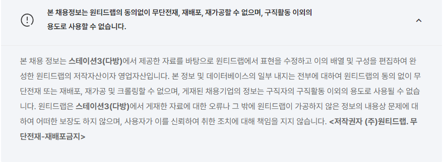
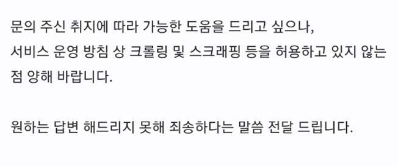

# 🛠 리팩토링

프로토타입을 만들고, 프로토타입에 대한 리드미 작성까지는 끝났다. 하지만 급하게 진행하다 보니 아직 손봐야 할 곳이 많이 보였다. 주변에 피드백을 받아서 고쳐야 할 부분들을 수정하고 수정 과정을 담아보려 한다.

## 🎃 느린 check 박스

checkbox 기능은 해당 공고의 자격 조건과 우대 사항에 얼마나 해당되는지 기록하고, 50%이상일 경우 합격 가능성이 높은 공고이므로 따로 표시하기 위해 추가한 기능이었다. 각 체크 상태를 반영하기 위해서 직접 데이터베이스에 업데이트가 될 수 있게 로직을 구성했다. 데이터베이스에 저장된 상태를 받고 react-query로 UI와 상태를 동기화 시키는 방식으로 짜서, 별도의 상태를 두지 않으려 노력했다. 하지만 주변의 피드백을 받았을 때 클릭하고 약 0.5초 뒤에 반응해서 답답함을 느꼈다는 의견이 있었다. 이를 해결 위한 과정을 정리해 보려 한다.

우선 handleChange의 내부 로직이 같은 로직이 중복되는 문제가 있어 중복을 제거하려 했다. kind 자체를 key로 전달해서 해당하는 값에 맞는 배열을 수정하는 방식으로 변경했다. 하는 과정에 kind 타입 자체의 문제로 인해서 내부 곳곳에 수정을 했지만, 전반적으로 훨씬 깔끔해진 결과를 얻을 수 있었다.

```tsx
// 수정 전

const handleChange = (e: React.ChangeEvent<HTMLInputElement>) => {
  const { name } = e.currentTarget
  let modifiedJob
  if (job) {
    if (kind === Kinds.qualification) {
      const qualification = [...job?.qualification].map(item => {
        if (item.text === name) {
          return { ...item, checked: !item.checked }
        }
        return item
      })
      modifiedJob = { ...job, qualification }
    } else {
      const preferential = [...job?.preferential].map(item => {
        if (item.text === name) {
          return { ...item, checked: !item.checked }
        }
        return item
      })
      modifiedJob = { ...job, preferential }
    }
    mutate(calculateChecks(modifiedJob))
  }
}

// 수정 후
const handleChange = (e: React.ChangeEvent<HTMLInputElement>) => {
  const { name } = e.currentTarget
  if (job && !isMainJob) {
    const targetList = [...job[kind]].map(item => {
      if (item.text === name) {
        return { ...item, checked: !item.checked }
      }
      return item
    })
    const modifiedJob = { ...job, [kind]: targetList }
    mutate(calculateChecks(modifiedJob))
  }
}
```

다음으로는 메인 이슈였던 느린 체크박스 반응을 해결하기 위해서 UI를 위한 상태를 따로 놔둬서 UI 상태와 DB를 동시에 업데이트하는 방식으로 사용자가 느낄 수 있는 답답함을 해결할 수 있었다. 하지만 조금 더 나아가서, 이렇게 UI상태로 관리한다면 DB를 업데이트하는 횟수를 페이지를 떠날 때 해서 API 호출 비용을 줄이는 방향으로 개선하면 어떨까라는 추후 방향도 고민했다.

```tsx
export default function DescriptionItem({
  text,
  isMainJob,
  checked,
  kind,
}: DescriptionItemProps) {
  const [isChecked, setIsChecked] = useState(checked)
  const handleChange = (e: React.ChangeEvent<HTMLInputElement>) => {
    const { name } = e.currentTarget
    if (job && !isMainJob) {
      const targetList = [...job[kind]].map(item => {
        if (item.text === name) {
          return { ...item, checked: !item.checked }
        }
        return item
      })
      const modifiedJob = { ...job, [kind]: targetList }
      mutate(calculateChecks(modifiedJob))
    }
    setIsChecked(!isChecked)
  }
  return (
    <S.Wrapper>
      {isMainJob && <RiCheckboxBlankCircleFill />}
      {!isMainJob && (
        <input
          type="checkbox"
          name={text}
          checked={isChecked}
          onChange={handleChange}
        />
      )}
      <span>{text}</span>
    </S.Wrapper>
  )
}
```

## Custom Hook

react-query를 이용해 전역 상태로 캐쉬된 서버데이터를 편하게 받아올 수 있지만, 데이터를 불러오기 위한 로직이 계속해서 반복되기 때문에 따로 custom hook으로 분리하는 게 어떨까라는 생각에 따로 모아두기로 했다. 불러오는 키를 상수로 정해서 안전하게 관리가 가능했고, 컴포넌트 내부 로직이 깔끔해져서 좋았다. 하지만 아쉬운 점은 hook은 hook내부에서만 정리할 수 있기 때문에 hook안에서 dbService나 useRouter와 같은 반복되는 로직은 어떻게 다시 정리할 수 있을까 고민도 되었다. 이후에 좀 더 리팩토링이 필요하다.

```tsx
const JOBS_KEY = "jobs"

export const useGetJobs = () => {
  const dbService = useDBService()
  const { data: jobs, isLoading } = useQuery([JOBS_KEY], () =>
    dbService.getJobs()
  )
  return { jobs, isLoading }
}

export const useGetFilteredJobs = () => {
  const { query } = useRouter()
  const { id } = query
  const dbService = useDBService()
  const { data: jobs, isLoading } = useQuery(
    [JOBS_KEY],
    () => dbService.getJobs(),
    {
      select: (data: ModifiedJobsType) => {
        return Object.values(data).filter(item => item.id !== id)
      },
    }
  )
  return { jobs, isLoading }
}

//binding이 강해서 좀더 연결성을 떨어뜨려야 재사용 가능
export const useCreateJob = (
  setMessage: React.Dispatch<React.SetStateAction<string>>,
  setUrl: React.Dispatch<React.SetStateAction<string>>
) => {
  const dbService = useDBService()
  const queryClient = useQueryClient()
  const { mutate, isLoading } = useMutation(
    async (url: string) => {
      const { data } = await axios.post(
        `${process.env.NEXT_PUBLIC_HOST}/api/job`,
        {
          url,
        }
      )
      const job = modifyJob(data)
      dbService.addJob(job)
    },
    {
      onSuccess: () => {
        queryClient.invalidateQueries([JOBS_KEY])
        setMessage("")
      },
      onError: error => {
        if (error instanceof AxiosError) {
          const { response } = error
          if (response) {
            setMessage(response.data.message)
          }
        }
      },
      onSettled: () => {
        setUrl("")
      },
    }
  )
  return { mutate, isLoading }
}

export const useUpdateJob = () => {
  const dbService = useDBService()
  const queryClient = useQueryClient()
  const { mutate } = useMutation(
    async (job: ModifiedJobType) => {
      return dbService.updateJob(job)
    },
    {
      onSuccess: () => {
        queryClient.invalidateQueries(["jobs"])
      },
      onError: error => {
        if (error instanceof AxiosError) {
          const { response } = error
          if (response) {
            console.log(response)
          }
        }
      },
    }
  )
  return mutate
}

export const useDeleteJob = () => {
  const queryClient = useQueryClient()
  const dbService = useDBService()
  const { mutate } = useMutation(
    async (job: ModifiedJobType) => {
      return dbService.removeJob(job)
    },
    {
      onSuccess: () => {
        queryClient.invalidateQueries(["jobs"])
      },
      onError: error => {
        if (error instanceof AxiosError) {
          const { response } = error
          if (response) {
            console.log(response)
          }
        }
      },
    }
  )
  return mutate
}

export const useGetJobById = () => {
  const { query } = useRouter()
  const dbService = useDBService()
  const { id } = query
  const jobId = typeof id === "string" ? id : id?.join() || ""
  const { data, isLoading } = useQuery(
    [JOBS_KEY],
    () => {
      return dbService.getJobs()
    },
    {
      select: (data: ModifiedJobsType) => {
        return data[jobId]
      },
    }
  )
  return { data, isLoading }
}
```

# 😥 크롤링의 문제

이전에 크롤링에 대해 조사하면서 저작권의 문제가 생길 수 있다는 것을 인지하고는 있었다. 웹에 존재하는 정보를 받아오고 그것을 정제하는 방법이지만 데이터가 재산인 기업들의 입장에서는 예민하고 중요한 문제임은 분명했다. 이번에 원티드에서 채용공고들을 보면서 채용공고 아래 다음과 같은 문구가 적혀있는 것을 확인했다.


시작 전에도 학습 용도로 만들려는 서비스였기에 크게 문제가 되지 않을 것이라 생각하고 제작했지만, 먼저 확인이 필요할 것 같아 원티드 측에 직접 문의해보았다. 문의 결과는 크롤링 자체를 금지하고 있다는 답변을 받을 수 있었다.


실제로 크롤링은 저작권 문제로 많은 법적 공방이 진행 중이다. 채용공고 플랫폼 사이에서 법적 공방도 있었다는 것을 찾아보면서, 어떤 방향으로 수정하면 좋을까 라는 고민이 되었다.

[[실제 법적 공방에 대한 ZDNET Korea 뉴스기사](https://zdnet.co.kr/view/?no=20170927180839)]


지금까지 해왔던 방식의 기본은 크롤링을 이용해 데이터를 자동화해서 정리하는 방식이었다. 작업을 계속하면서 자동화라는 방식이 좋기는 하지만 크롤링 자체를 정확하게 하는 방법의 한계를 느끼기도 했고, **플랫폼에 없는 회사들도 정리할 수 있게** 하고 싶기도 했다.

이번 계기로 다른 방향으로 서비스를 수정해야 했고, 보다 사용자가 쉽게 정리할 수 있는 방법이 어떤 게 있을까 라는 고민과 채용 플랫폼 시장에 대한 조사가 부족했다는 것도 느꼈다. 프로젝트를 어떻게 수정할 지 앞으로 어떻게 발전시켜나갈지 좀 더 고민해서 수정이 필요하다.
