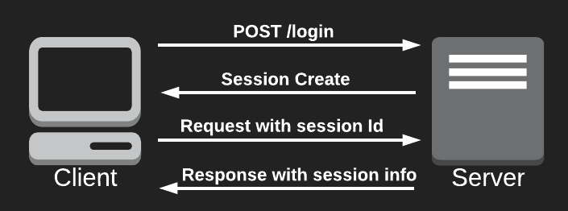
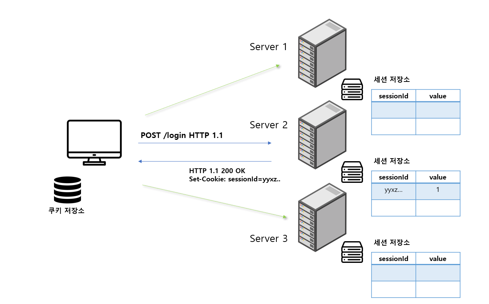
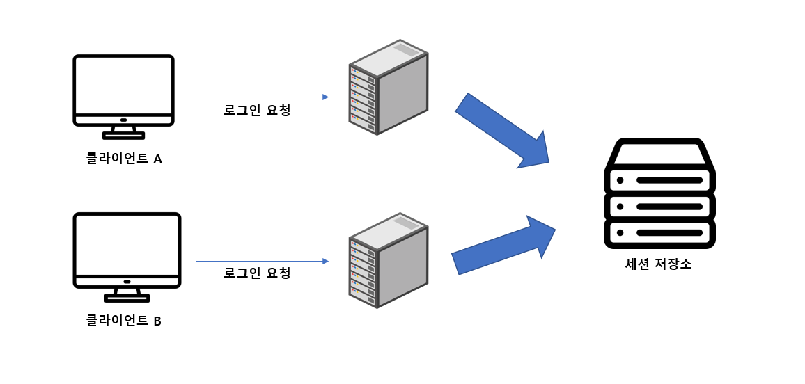
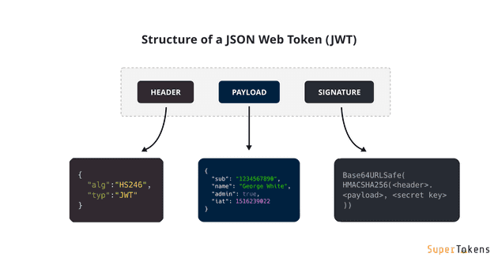
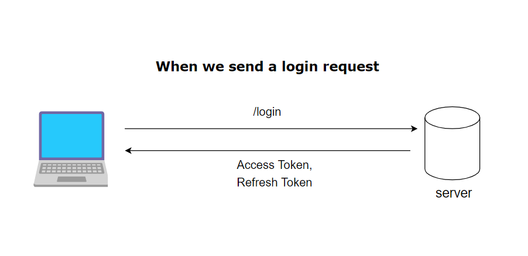
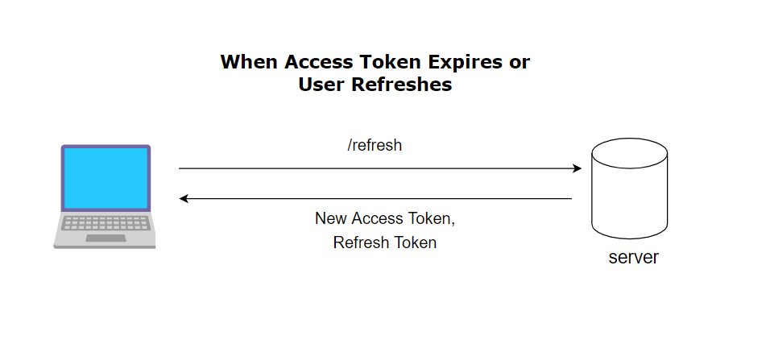
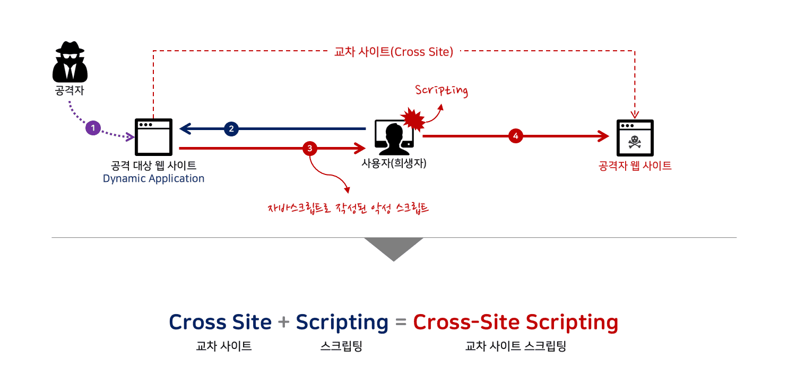
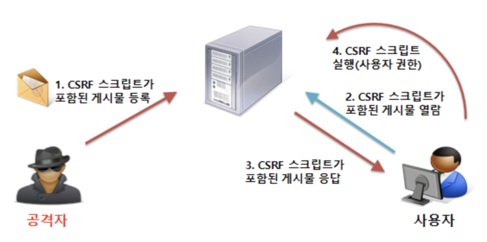
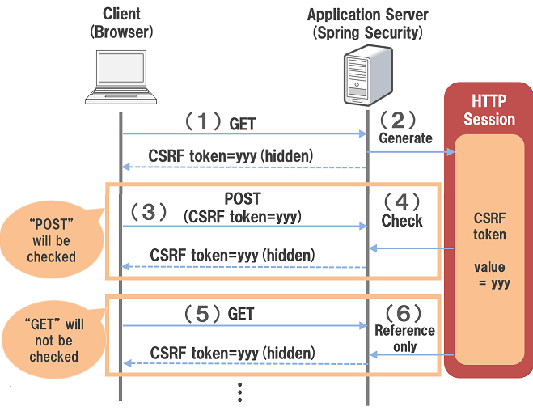

# 🔏 Cookie,Session, JWT

모으잡의 Next-auth를 고려하면서 Cookie,Session, JWT에 대해 다시 정리할 필요성을 느꼈다. 각각의 문제점과 해결과정들을 정리하고 보안을 어떻게 고려해서 각각을 사용할 수 있을지 정리해보았다.

## 인증과 인가란

인증과 인가, 단어 만으로는 구분이 잘 안 가서 먼저 정리가 필요했다. **인증**은 정보를 이용해 신원을 확인하는 과정이고, **인가**는 사용자가 해당 리소스에 대해 접근할 수 있는 권한이 있는지 확인하는 과정이다.

예를 들어 커뮤니티에 들어가 글을 작성한다고 가정하자. 아이디와 비밀번호를 정하고 만든 `회원정보를 이용해 서비스 이용자라는 권한`을 얻고 들어갈 수 있는 것, 바로 `인증과정`이다. 로그인 후에 마음에 들지 않는 다른 사람의 글을 지우고 싶어졌다. 하지만 내가 쓰지 않은 글은 지울 수 없다. 왜냐하면 다른 사람의 글을 수정할 수 있는 권한이 없기 때문이다. 이게 바로 `인가과정`이다.

이러한 인증, 인가과정을 처리하기 위한 인증방식으로 "cookie와 session을 이용한 방법"과 "JWT를 이용하는 방법"이 있다. 먼저 각각에 대해서 정리해 보고자 한다.

### Cookie와 Session

두 가지 방식을 이해하기 전에 이전에 정리했던 HTTP의 특징 중 stateless를 이해해야 한다. stateless는 클라이언트와 서버사이의 http 통신들간의 연관성이 없다는 의미이다. 먼저 어떠한 통신을 보내야 다음 통신을 보내는 것이 아니라 항상 독립적인 통신을 유지한다. 그렇기 때문에 우리가 이전에 인증했는지를 http 통신 자체는 알 수 없다.

#### Cookie

쿠키는 웹사이트에 방문 시에 서버를 통해 **클라이언트 브라우저에 설치되는 key와 value 형태를 가진 데이터 파일**을 의미한다. HTTP로 해당 사이트에 로그인 요청을 하게 되면 서버는 인증 정보를 쿠키에 담아 응답을 보내주게 되는데, 이때 받은 쿠키는 **브라우저에 자동으로 저장**되고 클라이언트가 직접 넣어서 요청을 보내지 않아도 브라우저가 자동으로 request header에 넣어서 서버에 전달한다. 인증이 필요할 때마다 로그인을 하지 않아도 인증을 할 수 있는 장점을 가진다.

이렇게 쿠키는 HTTP의 stateless 특성을 지키면서 인증을 할 수 있다. 하지만 인증 정보가 클라이언트의 브라우저에 저장되어 자바스크립트로 접근이 가능한 상태로 보관 시 보안에 위험한 단점을 가진다. 이점을 해결하기 위한 방법이 `session`이다.

#### Session

세션은 쿠키로 담아서 보냈던 인증 정보를 클라이언트에 보관하는 것이 아니라 **서버가 보관하는 방법**이다. 로그인 요청이 들어오면 해당하는 사용자 정보를 담은 세션ID를 만들어 서버에 저장한 후에 해당 세션ID를 쿠키에 담아 브라우저에 보내게 된다. 이때 브라우저에 보낼 때 cookie를 그냥 보내는 것이 아니라 **httpOnly**로 보내 자바스크립트로 접근할 수 없고 브라우저만 읽을 수 있게 보낸다.

이렇게 세션을 이용하게 되면 클라이언트는 같은 사용자 정보로 login을 했을 때, 별다른 처리를 하지 않아도 request Header에 전달 받은 쿠키를 넣어서 보내게 되고, 서버는 **서버에 저장해둔 세션 정보와 일치하는지**를 확인해 인증 과정을 진행한다.

이렇게 세션을 이용하게 되면 서버가 관리하고 있기 때문에 쿠키를 그냥 발급할 때보다는 느리지만, 보안을 강화할 수 있다. 하지만 서버 자체가 세션을 관리해야 하면서 서버가 stateful해지는 단점을 가진다.

그리고 이렇게 stateful 해진 서버는 **session을 어떻게 관리해야 할 지**에 대한 문제를 가지게 된다.

먼저 만약 서버 로컬에 저장한다면 서버가 꺼지게 된 사고가 발생한다면 이전의 모든 사용자의 정보를 잃어 버리게 된다. 두 번째로는 확장성이 떨어지게 된다. 여러 대가 되었을 때 각각 서버에 저장한다면 서버1에서 인증한 사용자가 서버3으로 접속했을 때 같은 정보지만 인증 받지 못하는 단점을 갖게 된다.

이러한 문제점을 해결하기 위해 session을 이용할 때는 **Session DB를 두어 서버와 분리해 관리**한다. 서버가 꺼져도 DB가 살아있다면 사용자 정보가 날라가지 않고, 서버가 여러 대가 되어도 한 곳에서 세션을 관리하기 때문에 인증을 받을 수 있게 된다.

하지만 여전히 정보를 그대로 가지고 있는 stateful한 단점을 가지고 있으며, 서버가 여러 대로 분산해 요청들을 처리해도 여전히 세션 DB는 한 곳에서 인증해주어야 하기 때문에 성능의 문제점도 가지고 있다. 이것을 해결하기 위해 나온 것이 `JWT`다.

### JWT

JWT (Json Web Token)은 JSON 객체 구조의 인증 정보를 secret 키를 이용해 암호화 시킨 토큰으로 header, payload, signature 세 가지로 구성되어 있다.

- Header: 암호화를 위해 사용한 알고리즘과 type
- Payload: 전송할 인증 정보
- Signature: Base64방식으로 header, payload 인코딩하고 secret 키로 암호화 되어있는 문자열로, payload의 내용 변화를 체크하기 위해 사용된다.

JWT는 이렇게 암호화가 되어있어서 안전하구나 싶지만, JWT 자체는 json이 base 64로 인코딩되어있는 것이기 때문에 **누구나 jwt를 디코딩해 header와 payload의 값을 알 수 있다**. 그렇기 때문에 노출되어도 크게 위험하지 않은 username과 같은 최소한의 정보를 담아서 인코딩해 담는다.

그러면 보안에 취약한 것 아닐까 싶지만, signature부분은 header와 payload **서버에 보관할 개인 키**를 이용해서 암호화되어있기 때문에 안전하다. 서버만이 복호화할 수 있는 개인 키가 있기 때문에 서버는 JWT 토큰을 전달한 클라이언트에 전달해주고 전달받은 토큰으로 이후에 쿠키를 사용하듯이 인증이 필요한 요청에 담아서 서버에 요청한다. 요청에 들어있는 JWT의 signature부분을 서버에 저장되어 있는 secret으로 복호화해 header와 payload를 확인해 인증하게 된다.

서버는 더 이상 인증을 위해 session을 가지고 있지 않아도 되고, 각각의 서버에 secret 키를 두고 확인하면 되기 때문에 성능 문제도 해결할 수 있는 장점을 가진다. 하지만 토큰 stateless한 장점은 session과 다른 보안의 허점을 만든다. 토큰을 노출된 경우 해당 사용자로 로그인한 사람이 서버에서는 누구인지 알 수가 없다. 이때문에 **토큰을 어떻게 관리할 지**에 대해서 새로운 문제점을 가진다.

#### Access Token과 Refresh Token

토큰 관리를 위해 주로 만료 기간이 짧은 `Access 토큰`과 만료 기간이 긴 `refresh 토큰`을 두고 관리한다. 유효기간이 짧은 access Token만 보내게 되면 유저는 계속해서 로그인 과정을 거쳐야 하기 때문에 유효 기간이 긴 refresh 토큰을 함께 보내 로그인 유지가 될 수 있게 한다.

과정을 보면 먼저 토큰을 발급할 때 두 가지 토큰을 다 전달한다.

사용자는 전달 받은 access token으로 유효 기간 동안 인증을 진행하고, 이후 유효 기간이 다되게 되면 refresh 토큰을 이용해 새롭게 access token을 받아 인증을 진행할 수 있다.

Access 토큰은 유효 기간이 짧지만 여전히 그사이에 해킹의 위험이 있고, Refresh Token 유효 기간이 길기 때문에 더욱 보안에 신경을 써야 한다. 그러므로 **프론트엔드 입장에서 어디에 보관하냐**는 여전히 문제가 된다.

### 그래서 토큰은 어디에 보관해야 할까?

가장 먼저 고려된 것은 내가 자주 사용해온 방식인 브라우저의 **localstorage**이다. local storage는 브라우저가 닫혀도 유지되기 때문에 자바스크립트로 접근해 request header의 Authorization에 해당 토큰을 담아 주는 방식으로 사용할 수 있다. 가장 간단하고 쉽기 때문에 프로젝트의 토큰을 로컬스토리지로 관리했다. 하지만 이러한 방식은 ` XSS (Cross-Site Scripting) 공격`에 취약한 단점을 가진다.

#### XSS (Cross-site scripting)

XSS 공격은 웹사이트에 **악성 스크립트를 주입하는 방식**으로 주로 페이지의 input이나 form을 이용해 공격하는 방식이다. 주입해놓은 사이트에 사용자가 로그인하게 될 경우에 사용자의 토큰, 쿠키 등의 정보를 빼낼 수 있게 된다.

그렇기 때문에 자바스크립트로 접근할 수 있는 localstorage나 별도의 옵션없이 쿠키에 토큰을 저장하게 될 경우에는 XSS 공격에 취약하게 된다. 이것을 막기 위해서는 `클라이언트 메모리에 저장하는 방식`과 `http only 쿠키`를 이용하는 방식이 있다. 클라이언트의 메모리에 저장할 경우에는 관리는 쉽지만 로그인을 유지할 수가 없는 단점이 있어 보통 http only 쿠키로 서버에서 토큰을 보내주면 브라우저에 저장하고 자동으로 요청시 담아서 보내는 방식을 적용할 수 있다.

하지만 http only 쿠키로 토큰을 저장하는 방법도 CSRF 공격에 약한 단점이 존재한다.

#### CSRF(Cross-site Request Forgery)

CSRF공격은 사용자가 원하지 않은 action을 하게하는 해킹 방법으로, 로그인한 사용자의 정보를 이용해 사용자 몰래 브라우저에 저장되어있는 쿠키를 이용해 요청을 보내는 방식이다. http only로 된 쿠키이기 때문에 직접 빼올 수는 없지만 계좌이체나 물건을 구입하는 요청을 보내는 등의 요청을 할 수 있다. 그렇기 때문에 http only 쿠키만을 이용해서 토큰을 관리한다면 CSRF공격에 취약할 수 있어, 추가적인 방식이 필요한데 이때 사용할 수 있는 방법이 `CSRF 토큰`이다.

CSRF 토큰을 서버에서 발급하면 클라이언트의 메모리에 저장해 두고 요청을 보낼 때마다 함께 보내서, http only 쿠키와 CSRF토큰을 서버가 확인 후에 요청이 처리될 수 있게 함으로써 공격을 막을 수 있다.

### 마치며

인증이란 과정은 굉장히 복잡한 과정들이 숨어있고 고려해야할 점이 많다. 프론트엔드에서나 백엔드에서만 잘 처리한다고 해결되는 것이 아니라 두가지 측면을 모두 생각해야 보안을 고려한 인증방식이 될 수 있다.

[참고]

- [인증방식: Cookie & Session vs JWT](https://tecoble.techcourse.co.kr/post/2021-05-22-cookie-session-jwt/)

- [쿠키와 세션 그리고 토큰 JWT](https://velog.io/@gloom/%EC%BF%A0%ED%82%A4-%EC%99%80-%EC%84%B8%EC%85%98%EA%B7%B8%EB%A6%AC%EA%B3%A0%ED%86%A0%ED%81%B0JWT)

- [쿠키와 세션 개념](https://interconnection.tistory.com/74)

- [세션 불일치시 해결방법들](https://velog.io/@dailyzett/%EC%84%B8%EC%85%98-%EB%B6%88%EC%9D%BC%EC%B9%98-%EC%8B%9C-%ED%95%B4%EA%B2%B0-%EB%B0%A9%EB%B2%95%EB%93%A4)
