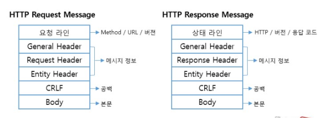
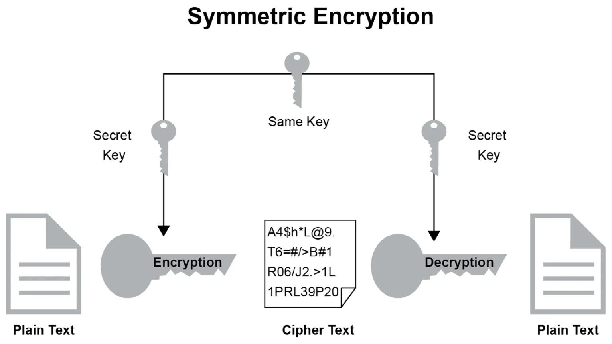
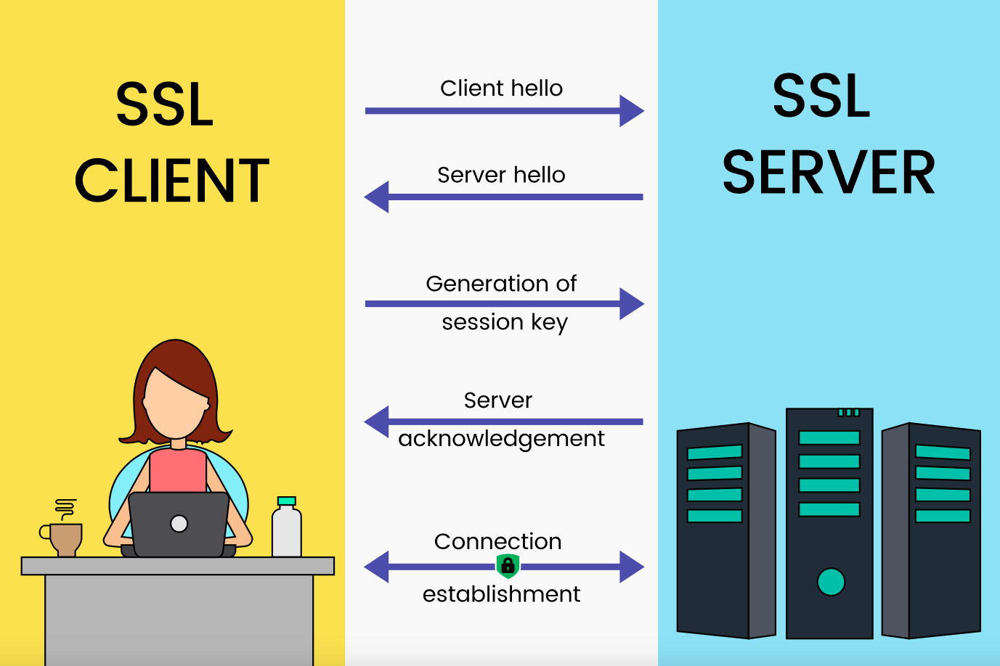

이번에 핀테크 기업의 면접을 처음으로 보면서 네트워크 통신에 대해 잘 모른다는 것을 많이 느꼈다. 가장 기본적인 http/https부터 쿠키와 로컬스토리지, 세션스토리지 등을 주제로 하나씩 정리해 보고자 한다.

# 🔓 http와 https

`http와 https의 차이점이 뭔가요?` 면접의 첫 질문이었다. 내 대답은 http와 https의 가장 큰 차이점은 **보안**에 있습니다 였다. 면접관님께서 주신 다음 질문은 그럼 "어떤 보안 방식으로 처리가 되나요?"였다. 분명히 보안이 좋아지는 것은 알지만 어떤 방식을 이용해서 보안이 좋아지는 지는 몰라 모르겠다고 답할 수 밖에 없었다.

http와 https는 보안에 차이점이 있다. 각각에 대해 정의하고 내가 뭘 대답하지 못했는지 그 차이점을 좀 더 파헤쳐 보자.

http는 `HyperText Transfer Protocol`의 약자로 웹에서 다른 컴퓨터, 서버와 통신할 때 따라야 하는 통신 규약, 형식이다. 클라이언트와 서버 사이에 이루어지는 요청/응답 프로토콜로 요청에 필요한 정보들을 형식에 넣어서 요청하면, 응답으로 필요한 내용을 이 형식에 맞게 담아서 전달해 준다. 쉽게 말해 컴퓨터가 전송된 데이터가 **어떤 형식으로 적혀있는지 이해할 수 있게 알려 주는 것**이라고 생각할 수 있다.

https는 `HyperText Transfer Protocol Secure `의 약자로 http에 보안을 강화한 프로토콜이다라고 이해할 수 있다. https가 가지는 장점은 세 가지가 있다.

첫 번째로, https는 제 3자가 봐도 이해할 수 없게 **암호화**를 시켜 데이터를 주고 받는다. http의 문제점은 내가 전송한 정보를 제 3자가 봤을 때 이해할 수 있는 형식으로 전달된다는 점이다. 이렇게 암호화가 되지 않는 상태로 전송하게 되면 내 개인정보가 노출되는 문제가 생기기 때문에, https는 우리가 보낼 http통신의 body부분을 암호화해 해결한다.

두 번째로는 **신뢰할 수 있는 사이트**인지 판별해 준다. https를 기관에서 검증된 사이트만 허가 받기 때문에 url주소가 유사한 피싱 사이트를 판별하는 데에도 도움을 준다.

세 번째로 검색엔진의 SEO의 장점을 가진다. 구글의 검색엔진은 https를 검색 순위 결정 요소에 반영한다. https로 더 나은 UX와 사이트 체류 시간 등의 장점을 고려해 반영되어 있다. 그렇기 때문에 https는 SEO자체에도 큰 장점을 가지게 된다.

그러면 https가 어떻게 구현되는지를 알아보기 위해 먼저 대칭키와 비대칭키를 알아보자

### 🔑 대칭키와 비대칭키

먼저 키는 우리가 보내고 받을 데이터를 암호화하는 알고리즘을 의미한다. 대칭키는 서버와 클라이언트 **모두가 같은 키**를 가지고 있는 경우를, 비대칭키는 **서로 다른 2개의 키가 한 쌍**으로 사용되기 때문에 비대칭 키라고 한다.

#### 대칭키

대칭키는 서버와 클라이언트가 `같은 키`를 갖고 있기 때문에, 클라이언트에서 암호화해서 보낸 정보를 서버가 바로 복호화할 수 있어 빠르게 처리가 가능하다. 하지만 문제점은 서버와 클라이언트 모두 같은 키를 갖기 위해서 최소한 한번의 전송이 필요한데, 이때 해킹된다면 해킹한 곳에서도 같은 키를 가져 애써 암호화한 데이터가 해킹되는 문제를 가진다.

이러한 문제를 해결하기 위해 나온 것이 **비대칭 키**이다.

#### 비대칭 키

비대칭 키는 **서로 다른 한 쌍의 키**를 사용한다. 두 키를 각각 A키와 B키라고 부른다고 하면, A키로 암호화를 하면 B키로만 복호화를 할 수 있고, B키로 암호화를 하면 A키로만 복호화가 가능하다. 이런 비대칭 키는 `공개키`라고도 불리는데 그 이유는 서버가 개인키로 A키를 보관하고, B키는 공개키로 누구나 알 수 있게 공개한다.

우리가 원하지 않는 제 3자도 공개키를 갖게 되지만 오직 서버의 개인키로만 복호화가 가능해 대칭키의 제 3자가 같은 키로 복호화할 수 있는 문제점을 해결할 수 있다.

이렇게 좋은 비대칭 키 방식을 이용하면 될 것 같지만 비대칭키 알고리즘은 `시간이 오래 걸린다`는 단점을 가지고 있다. 클라이언트와 서버가 주고받는 모든 파일을 비대칭키 방식으로 암호화/복호화 과정을 진행할 수 없다.

정리하면 대칭키는 전송의 문제점을 가지고 있지만 빠르고, 비대칭 키는 대칭키의 전송의 문제점을 해결하지만, 오래 걸리는 단점을 가지고 있다. 실제로 https를 구현할 때는 대칭키와 비대칭키를 `혼합하는 방식`으로 사용된다. 그럼 이제 실제 https가 어떻게 이루어지는지 알아보자

### 🔓 SSL과 통신과정

SSL은 Secure Sockets Layer로 http통신의 모든 요청과 응답 데이터를 보내지기 전에 암호화하는 프로토콜이다. SSL에서 앞서 설명한 대칭키와 비대칭키를 혼용해서 사용한다.

#### 1) 공개키와 대칭키의 혼합한 통신과정

SSL 통신과정을 대칭키와 공개키를 중심으로 설명하면 다음과 같이 진행된다.

1. 서버는 자신의 공개키를 클라이언트로 전달하고, 클라이언트는 받은 `공개키로 대칭키를 암호화`해서 서버에게 다시 전달한다.
2. 암호화된 대칭키를 서버가 가지고 있는 개인 키로 복호화를 하면 결과적으로 서버와 클라이언트가 `같은 대칭키`를 가지게 된다.
3. 서버와 클라이언트가 같은 대칭키를 가지고 있기 때문에 `대칭키`를 이용해, 빠르고 안전하게 데이터를 전송할 수 있게 된다.

위 과정으로 부족한 점은 https가 가지는 **신뢰할 수 있는 사이트를 판별하는 부분**이다. 이 부분은 아래 인증서를 추가한 통신 과정으로 설명하려 한다.

#### 2) 인증서를 추가한 통신과정

인증서를 추가한 통신과정을 이해하기 위해 CA (Certificate Authority)를 이해해야하는데, CA의 역할은 https로 인증하는 인증서를 발급해주고 해당 인증서가 유효한지 판별해주는 역할을 한다.

##### 통신 전

통신 전 상황은 서버는 CA로부터 인증서를 받기 위해 **서버 정보와 서버의 공개키**를 전달하고, CA의 개인키로 서명된 인증서를 받아서 보관하고 있고, 클라이언트의 브라우저에는 해당 CA의 공개키가 내장되어 인증서를 받으면 유효한지 확인할 수 있다.

##### handshake

이제 준비가 된 후에 클라이언트와 서버가 랜덤한 데이터를 이용한 요청과 응답을 하는데 이것을 `handshake`라고 부른다. 클라이언트가 랜덤한 데이터를 서버에 보내면 서버도 랜덤한 데이터를 만들어 `인증서`와 함께 전달한다.

##### handShake 이후

handshake가 끝난 후에 클라이언트는 받은 인증서를 인증기관의 공개키로 복호화해서 확인한다. 공개키로 복호화가 가능한 것은 CA의 개인키로 암호화가 된 인증서이기 때문에 유효여부를 확인할 수 있다. 확인 후에 인증서를 통해 전달 받은 서버 공개키로 자신의 대칭키를 암호화하고, 서버에 전달한다. 서버는 자신의 개인키로 사용자가 클라이언트의 대칭키를 복호화해서 얻는다. 이때 대칭키는 앞서 handshake에서 주고 받았던 랜덤데이터를 처리해서 만들게 된다.

이렇게 CA의 비대칭 키를 이용한 인증 방식으로 유효한 사이트인지도 https를 이용해 알 수 있게 된다.

## 마치며

http,https를 안다고 생각했지만 공부하면 공부할 수록 더 복잡하고 어려운 내용들이 있었다. 우선은 내가 이해할 수 있는 만큼 정리했다. 이후에 계속해서 업데이트하고 더 잘 설명하려고 수정해 나가야겠다.

[참고자료]

- [우아한테크코스 테코톡](https://www.youtube.com/watch?v=wPdH7lJ8jf0)

- [얄팍한 코딩사전](https://www.youtube.com/watch?v=H6lpFRpyl14)

- [http vs https](https://seopressor.com/blog/http-vs-https/)
