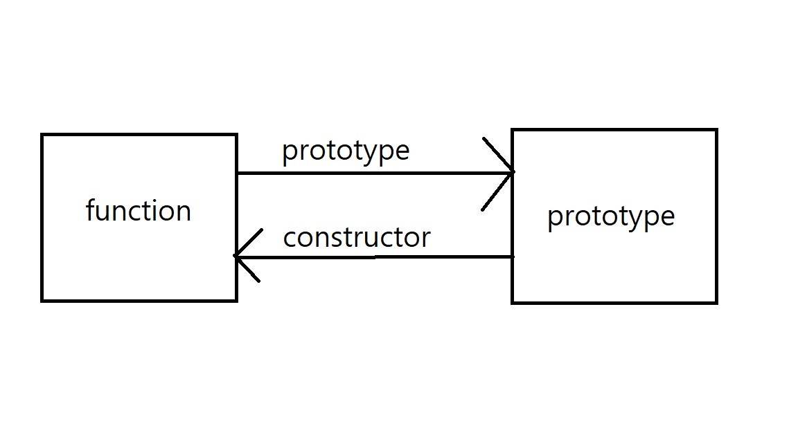
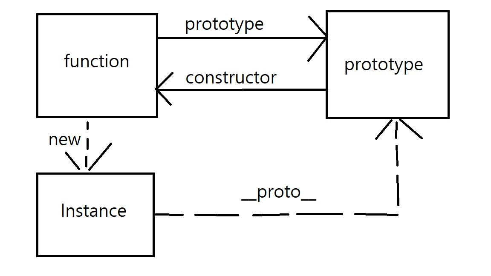

# 🎈 생성자 함수과 프로토타입

this를 공부하고 나서 생성자 함수, 프로토타입, 클래스에 대해 한번 정리할 필요성을 느꼈다. 생성자 함수를 시작으로 자바스크립트의 객체지향에 대해 정리해보고자 한다.

## ✏ 객체를 만드는 방법

생성자 함수도, 클래스도 결국에는 **객체를 만드는 방법**이다. 그래서 가장 먼저 자바스크립트에서 객체를 만드는 방법에 대해서 정리해 보고자 한다.

### 1) 객체 리터럴

객체 리터럴은 가장 쉽게 객체를 만드는 방법으로 `{}`로 내부에 넣을 속성과 메소드를 담아 만들 수 있다.

```javascript
const position = {
  x: 1,
  y: 2,
}
```

### 2) 생성자 함수

생성자 함수는 new연산자를 이용해 객체, 인스턴스를 생성하는 함수를 의미한다. 객체 리터럴보다는 상대적으로 복잡하게 객체를 만드는 방법이다.

#### 2-1) Object 생성자 함수

Object 생성자 함수와 new 키워드를 이용하면 빈 객체를 생성한다. 이후에 객체를 만들고 내부에 속성과 메소드를 추가할 수 있다.

```javascript
const person = new Object()

person.name = `lee`
person.sayHello = function () {
  console.log(this.name)
}
```

Object 생성자 함수 외에 빌트인 객체들도 new와 함께 생성할 수 있다.

```javascript
const strObj = new String("youngjun")
console.log(strObj)

const numObj = new Number(123)
console.log(numObj)

const boolObj = new Boolean(true)
console.log(boolObj)

const func = new Function("x", "return x*x")
console.log(func)

const arr = new Array(1, 2, 3)
console.log(arr)

const regExp = new RegExp(/ab+c/i)
console.log(regExp)
```

#### 2-2) 사용자 정의 생성자 함수

함수 내부에 인스턴스에 추가할 속성과 메소드를 정의한 후에 new 키워드로 인스턴스를 만들 수 있다.

```javascript
function Person(name) {
  this.name = name
  this.sayHello = function () {
    console.log(this.name)
  }
}
const person = new Person("youngjun")
console.log(person)
```

### 3) Object.create()

프로토타입의 상속을 이용해 객체를 만드는 방법으로 자체적으로는 빈 객체를 만들지만, prototype으로 전달 받은 속성과 메소드를 사용할 수 있다.

```javascript
const obj1 = { a: 1, b: 2 }
const obj2 = Object.create(obj1)

console.log(obj2) // {}
console.log(obj2.a) // 1
```

## 😁 생성자 함수의 필요성과 동작방식

객체를 만드는 방법들 중에 왜 생성자 함수가 쓰이는지와 동작 방식을 알아보자.

### 생성자 함수의 필요성

위의 세가지 방식 중 객체 리터럴이 가장 편하게 객체를 만들 수 있는 방법이다. 객체에 필요한 값을 직접 정의해줄 수 있어 커스텀하기도 쉽다. 하지만 **똑같은 속성과 메소드를 가지는 여러개의 객체**가 필요하다면 객체 리터럴로 일일이 만드는 것은 비효율적이다.

```javascript
const person1 = {
  name: "youngjun",
  sayHello() {
    console.log(this.name)
  },
}

const person2 = {
  name: "minjae",
  sayHello() {
    console.log(this.name)
  },
}
```

이렇게 여러 개의 유사한 객체가 필요할 때, **템플릿을 만들고 필요한 부분만 주입받아서 사용하면 편하지 않을까**라는 생각이 든다. 이럴 때 사용할 수 있는 것이 바로 생성자 함수다.

```javascript
function Person(name) {
  this.name = name
  this.sayHello = function () {
    console.log(this.name)
  }
}
const person = new Person("youngjun")
console.log(person)
```

### 동작방식

생성자 함수를 이용해 객체를 만들 때 **1) 인스턴스생성 2) 인스턴스 초기화 3) 인스턴스 반환** 세 가지 과정으로 진행된다. 위의 예제를 다시 살펴보자.

```javascript
function Person(name) {
  this.name = name
  this.sayHello = function () {
    console.log(this.name)
  }
}
const person = new Person("youngjun")
console.log(person)
```

#### 1) 인스턴스 생성

생성자 함수는 암묵적으로 빈 객체를 생성하고, 생성자 함수의 this와 바인딩이 된다.

```javascript
function Person(name) {
  // 1) 인스턴스 생성, this와 바인딩
  this.name = name
  this.sayHello = function () {
    console.log(this.name)
  }
}
const person = new Person("youngjun")
console.log(person)
```

#### 2) 인스턴스 초기화

this에 바인딩 되어있기 때문에 이후에 this를 이용해 초기화 과정을 진행할 수 있다.

```javascript
function Person(name) {
  // 1) 인스턴스 생성, this와 바인딩
  // 2) 인스턴스 초기화
  this.name = name
  this.sayHello = function () {
    console.log(this.name)
  }
}
const person = new Person("youngjun")
console.log(person)
```

#### 3) 인스턴스 반환

초기화 과정이 끝나면 return으로 적지 않아도 암묵적으로 this가 반환된다. 이때 다른 객체를 return하면 명시한 객체가 반환되고, 원시값으로 반환하면 암묵적으로 this가 반환된다.

```javascript
function Person(name) {
  // 1) 인스턴스 생성, this와 바인딩
  // 2) 인스턴스 초기화
  this.name = name
  this.sayHello = function () {
    console.log(this.name)
  }
  // 3) 인스턴스 반환
}

// 명시적으로 다른 객체 반환
function Person(name) {
  this.name = name
  this.sayHello = function () {
    console.log(this.name)
  }
  return {}
}
const person = new Person("youngjun")
console.log(person) // {}

//명시적으로 원시값 반환
function Person(name) {
  this.name = name
  this.sayHello = function () {
    console.log(this.name)
  }
  return "hi"
}
const person = new Person("youngjun")
console.log(person) // Person { name: 'youngjun', sayHello: [Function (anonymous)] }
```

## ⛏ 내부 메소드

생성자 함수는 일반함수와 동일하게 작성했지만 다르게 동작하는 것처럼 보인다. 어떤 차이가 있는지 생성자 함수의 내부 동작을 캐보자.

### 함수 객체의 [[call]]과 [[Construct]]

함수는 객체다. 객체이기 때문에 기존에 우리가 사용하던 객체의 특성을 이용할 수 있다.

```javascript
function bar() {}
bar.a = 1
console.log(bar.a) // 1
```

하지만 함수 객체는 일반 객체와 다르게 호출할 수 있고 생성자 함수로도 작동할 수 있다. 그이유는 함수 객체에는 일반 객체의 내부 메소드뿐만 아니라 **[[call]]과 [[construct]]**가 있기 때문이다. 이때 중요한 부분은 모든 함수는 [[call]]을 가지고 있어 호출이 가능하지만, `모든 함수가 [[construct]]를 가지는 것은 아니다`라는 것이다. 이렇게 [[construct]]를 가지는 함수를 constructor라고 부르고 [[construct]]를 가지지 않는 함수는 non-constructor라고 부르며 다음과 같이 정리된다.

- constructor: 함수 선언문, 함수 표현식, 클래스

- non-constructor: 메소드 축약, 화살표 함수

이렇게 내부적으로 [[construct]]를 가지고 있다면 new와 함께 사용하면 언제든 생성자 함수로 작동할 수 있다. 그렇기 때문에 생성자 함수로 사용하지 않을 거라면 화살표함수와 객체 내부에서는 메소드 축약을 사용하는 게 더 좋다고 생각된다.

```javascript
// 일반함수를 생성자함수로
function add(x, y) {
  return x + y
}

let inst = new add()
console.log(inst) //add{}

function createUser(name, role) {
  return { name, role }
}

inst = new createUser("lee", "admin")
console.log(inst) // { name: 'lee', role: 'admin' }

//생성자함수를 일반함수로
function Circle(radius) {
  this.radius = radius
  this.getDiameter = function () {
    return 2 * this.radius
  }
}

const circle = Circle(5)
console.log(circle) // undefined
console.log(radius) // 5
console.log(getDiameter()) //10
```

위 코드에서 일반함수를 생성자함수로 사용할 수 있는 것을 볼 수 있고, 생성자 함수를 일반 함수로 사용하는 경우에서는 this가 window가 되어 전역객체의 속성과 메소드로 등록된 것을 볼 수 있다.

## 🎚 생성자 함수 구분

위의 코드처럼 일반함수와 생성자함수는 구분하기 힘들기 때문에, 생성자 함수는 `대문자로 시작하는 Pascal표기법`을 이용한다. 하지만 단순히 명명법으로 구분하기 어렵기 때문에 `new.target`을 이용해 new를 이용해 생성자 함수로 함수가 호출되었는지 확인할 수 있다.

new.target은 new연산자와 함께 호출되면 함수 자신을 가리키고, 일반함수로 호출되었을 때는 undefined로 나타나기 때문에 각각에 따른 처리가 가능하다.

```javascript
function Circle(radius) {
  if (!new.target) {
    return new Circle(radius)
  }
  this.radius = radius
  this.getDiameter = function () {
    return 2 * this.radius
  }
}

const circle = Circle(5)
console.log(circle.getDiameter())
```

위 코드에서 new 키워드 없이 호출되었지만 new.target을 이용해 생성자함수로 다시 호출시켜 객체를 만든 것을 볼 수 있다.

# ✨ 프로토타입

자바스크립트는 멀티패러다임 언어로 프로토타입 기반의 객체지향 프로그래밍을 지원한다. 여기서 먼저 프로토타입 기반의 객체지향 프로그래밍에서 `객체지향 프로그래밍`이란 대상의 상태과 동작을 하나로 묶은 객체들의 집합으로 프로그램을 표현하려는 프로그래밍 방식을 의미한다. 객체지향 프로그래밍을 이해했으니 다음으로 프로토타입은 어떤 것인지 알아보자.

## 🙋‍♀️ 프로토타입이란

프로토타입은 우리가 앞서 알아본 생성자 함수로 객체를 생성했을 때, 만들어 진 객체의 부모와 같이 **상위 객체** 역할을 하는 객체를 의미한다. 즉 자바스크립트가 <u>상속</u>을 구현하는 방식이다. 만들어 진 객체는 프로토타입 객체를 상속하고 있기 때문에, 프로토타입 객체의 메소드들을 사용할 수 있다.


그러면 프로토타입이 어떻게 만들어지는 지 정리해보자

### 함수 선언

함수에는 내부 슬롯에`[[call]]`과 `[[construct]]`과 같이 `[[prototype]]`이 존재하는데 이는 함수를 선언할 때, 해당 함수로 만들어 질 인스턴스가 상속할 프로토타입을 가리키고 있다. prototype객체는 `[[construct]]`로 생성자함수를 가리키고 있다. 이렇게 프로토타입과 생성자함수는 단독으로 존재하는 것이 아니라 서로 prototype과 constructor속성으로 함께 존재한다.



```javascript
function Foo() {}
console.log(Foo.prototype) // {}
console.log(Foo.prototype.constructor) // [Function: Foo]
```

### 인스턴스 생성

생성자함수에 new 키워드를 이용해 인스턴스를 만들면 인스턴스는 프로토타입의 메소드를 상속 받아 사용할 수 있다. 생성자함수와 다르게 `[[prototype]]`에 직접 접근할 수는 없지만 `__proto__`를 이용해서 간접적으로 접근할 수 있다.



```javascript
function Foo() {}
Foo.prototype.val = "hi"
console.log(Foo.prototype) // { val: 'hi' }
console.log(Foo.prototype.constructor) // [Function: Foo]

const obj1 = new Foo()
console.log(obj1) // Foo {}
console.log(obj1.val) // hi
```

obj1의 생성자 함수에서 val 속성을 정의한 적이 없지만 프로토타입에 정의한 것을 상속받아 obj1에서도 사용이 가능한 것을 알 수 있다.

## 🙄 `__proto__`와 `prototype`

앞서 생성자 함수, 프로토 타입, 인스턴스 세 가지의 관계를 이해하기 위해 `__proto__`와 `[[prototype]]` 를 이용해 설명했다. 동일하게 프로토 타입을 가리키는 비 두 가지 속성을 헷갈리지 않게 먼저 정리해 보고자 한다.

먼저 `__proto__`는 **모든 객체**가 프로토타입에 접근할 수 있는 방법이다. `__proto__` 는 객체가 직접 가지고 있는 게 아니라 프로토타입을 이용한 상속으로 Object.prototype의 접근자 속성을 사용하는 것이다. `__proto__`를 이용해서 프로토타입을 접근할 수 있게 한 이유는 상호 참조에 의해 프로토타입 체인이 생기지 않게 방지하기 위해서다. 서로 상속해 자식이자 부모가 되는 상황이 되지 않게, 검색 과정이 무한 순회가 되지 않게 막을 수 있다.

하지만 `__proto__` 속성이 존재하지 않는 경우도 있기 때문에 프로토타입을 접근할 때 `Object.getPrototypeof`를, 프로토타입을 교체할 때는 `Object.setPrototypeOf`를 사용하는 것이 좋다.

```javascript
const obj = Object.create(null) // 상속을 이용해 만든 객체
console.log(obj.__proto__) // undefined

console.log(Object.getPrototypeOf(obj)) //null

const child = {}
const parent = { x: 1 }

Object.setPrototypeOf(child, parent)
console.log(obj2.x) // 1
```

`prototype`은 **함수**가 가지는 속성으로 생성자 함수가 만들 인스턴스의 프로토타입을 가진다. 그렇기 때문에 생성자 함수가 되지 못하는, [[construct]]가 없는 화살표함수나 메소드 축약표현은 `prototype`속성을 가지지 않고, 프로토타입을 생성하지 않는 것을 알 수 있다.

```javascript
const Person = name => {
  this.name = name
}

console.log(Person.hasOwnProperty("prototype")) //false
```

둘을 정리하면 `__proto__`는 **모든 객체**가 가지고 있지만 `prototype`은 **생성자 함수만** 가지고 있는 차이를 가진다.

## ⛏ 생성자 함수와 프로토타입

앞선 설명에 생성자함수와 프로토타입은 항상 함께 생성된다고 설명했다. 생성자 함수는 사용자 정의 생성자함수와 빌트인 생성자함수로 구분할 수 있다. 이 두가지 방식에서 생성자함수가 언제 생성되는지 알아보자.

### 사용자 정의 생성자 함수

```javascript
console.log(Foo.prototype) // {}
function Foo(name) {
  this.name = name
}
```

위 코드에서 Foo함수는 평가 단계에서 전역 스코프에 등록되면서 함수 객체가 바로 초기화가 된다. 이때 프로토타입도 함께 생성되어 바인딩 된다. 그렇기 때문에 `Foo. prototype`을 먼저 호출해도 에러가 나지 않고 값이 나오는 것을 볼 수 있다. 그리고 중요한 것은 "모든 객체는 프로토타입을 가지기 때문에" 바인딩된 프로토타입도 자신의 프로토타입을 Object.Prototype으로 가지게 된다.

### 빌트인 생성자 함수

빌트인 생성자함수는 `Object, String, Number`등 과 같은 함수로 전역 객체(브라우저: Window, NodeJS: Global) 가 생성될 때 함께 생성된다. 이때 사용자 정의 생성자 함수와 마찬가지로 생성자함수가 만들어질 때 함께 프로토타입도 만들어져 빌트인 생성자함수의 prototype에 바인딩된다.

## 👓 객체 생성 방식에 따른 프로토타입

생성자 함수를 정리하면서 먼저 객체를 생성하는 네 가지 방식을 설명했다. 네 가지 방식에 따라 어떻게 프로토타입이 정해지는지 알아보자.

### 1) 객체 리터럴

객체 리터럴은 **Object.Prototype**을 프로토타입으로 갖는다.

```javascript
const obj = {}
console.log(obj.constructor === Object)
```

### 2) Object 생성자 함수

Object 생성자함수도 객체 리터럴과 동일하게 **Object.Prototype**을 프로토 타입으로 갖는다.

```javascript
const Obj = new Object()
console.log(obj.constructor === Object)
```

### 3) 생성자 함수에 의해 생성된 객체

생성자함수는 생성될 때 프로토타입이 바인딩 되어 있어, 생성자 함수로 만들어지는 객체는 **생성자함수의 prototype 속성에 바인딩된 프로토타입**을 갖는다. 위 두 가지 방식과 다른 점은 Object.Prototype은 다양한 메소드가 있지만 생성자함수와 바인딩된 프로토타입은 constructor 속성만 가지고 있는 특징을 가진다.

```javascript
function Person(name) {
  this.name = name
}

Person.prototype.sayHello = function () {
  console.log(`${this.name}`)
}

const me = new Person("Lee") // Lee
const you = new Person("Kim") // Kim
me.sayHello()

console.log(me.hasOwnProperty) // [Function: hasOwnProperty]
```

me와 you는 프로토타입의 sayHello를 상속 받아 사용할 수 있다. 하지만 분명 바인딩된 Person.Prototype에는 새로 추가한 sayHello와 constructor만 속성으로 가지고 있어야하는데 <u>어떻게 Object.Prototype의 hasOwnProperty도 상속 받을 수 있을까?</u>

## 🖇 프로토타입 체인

앞선 예제에서 Person.Prototype에는 constructor만 있어야 하지만 hasOwnProperty도 사용할 수 있다. 이처럼 객체에서 접근하려는 속성이 없을 때에는 [[prototype]]을 이용해, 상속받은 부모의 프로퍼티들을 순차적으로 검색한다. 이렇게 프로토타입으로 계속해서 연결되어있는 것을 **프토토타입 체인**이라고 한다.

이렇게 체이닝이 가능한 이유는 모든 객체가 프로토타입을 가지기 때문에 계속해서 타고 올라갈 수 있다. 프로토타입 체인의 가장 끝은 항상 Object.prototype으로 Object.Protype의 프로토타입은 null로 탐색이 종료된다.

```javascript
function Person(name, gender) {
  this.name = name
  this.gender = gender
  this.sayHello = function () {
    console.log("Hi! my name is " + this.name)
  }
}
const foo = new Person("Lee", "male")

console.log(foo.__proto__ === Person.prototype) // true
console.log(Person.prototype.__proto__ === Object.prototype) // true
console.log(Person.__proto__ === Function.prototype) // true
console.log(Function.prototype.__proto__ === Object.prototype) // true
```

위 코드를 보면 첫번째 호출에서 생성자함수와 인스턴스가 같은 프로토타입을 가리키는 것을 알 수 있고, Person 생성자 함수의 프로토타입의 프로토타입이 Object.prototype이라는 것을 알 수 있다. 또한 빌트인 생성자함수인 Function의 프로토타입도 Object.Prototype인 것을 알 수 있다.


## ✏ 오버라이딩과 쉐도잉

프로토타입 체이닝으로 상속을 구현하면 인스턴스에 정의하지 않은 속성들도 사용할 수 있다는 것을 알게 되었다. 하지만 인스턴스에서 같은 이름의 속성으로 다른 내용을 담고 싶을 때가 있다. 이때 일어나는 일이 **오버라이딩과 쉐도잉**이다.

```javascript
function Person(name) {
  this.name = name
}

Person.prototype.sayHello = function () {
  console.log(`Prototype ${this.name}`)
}

const me = new Person("lee")
me.sayHello = function () {
  console.log(`instance ${this.name}`)
}

me.sayHello() // instance lee

delete me.sayHello

me.sayHello() // Prototype lee
```

sayHello를 프로토타입 체인에서 찾을 때 가장 먼저 인스턴스에서 속성을 찾기 때문에 먼저` instance lee`가 호출된 것을 볼 수 있고, 인스턴스의 sayHello를 제거한 후에는 없기 때문에 프로토타입 체인을 이용해 Person.prototype의 sayHello를 이용해 `Prototype lee`가 호출된 것을 볼 수 있다.

스코프체인에서 같은 이름의 식별자를 사용할 수 있는 것처럼 프로토타입 체인도 동일하게 작동한다.

## 👉 프로토타입 바꾸기

앞서 `prototype` 과 `__proto__`를 이용해 접근할 수 있다는 것을 알았다. 이제는 직접 접근해서 프로토타입을 바꿔보자

### 1) 생성자함수로 프로토타입 바꾸기

생성자함수에서 프로토타입에 접근하기 위해서는 `prototype`을 이용하면 된다.

```javascript
function Person(name) {
  this.name = name
}

Person.prototype = {
  constructor: Person,
  sayHello() {
    console.log(this.name)
  },
}

const me = new Person("lee")

console.log(me.constructor === Person)
```

### 2) 인스턴스로 프로토타입 바꾸기

인스턴스에서 프로토타입에 접근하기 위해서는 `__proto__`를 이용할 수 있지만 앞서 정리한 것처럼 `__proto__`로 접근할 수 없는 객체도 있으므로 `Object.getPrototypeOf`와 `Object.setPrototypeOf`를 이용할 수 있다.

```javascript
function Person(name) {
  this.name = name
}

const me = new Person("lee")

const parent = {
  sayHello() {
    console.log(this.name)
  },
}

Object.setPrototypeOf(me, parent)
me.sayHello()

console.log(me.constructor === Person) // false
console.log(me.constructor === Object) // true
```

위 코드에서 me의 프로토타입이 바뀌면서 기존의 Person.Prototype이 constructor가 아니라 parent의 constructor인 Object.Prototype이 constructor가 되는 것을 볼 수 있다.

위 두 가지의 차이점은 <u> 생성자함수의 prototype이 새롭게 연결된 프로토타입을 가리키고 있냐</u>로 볼 수 있다. 이렇게 직접 프로토타입을 바꿔서 상속관계를 바꿀 수 있지만, 위험하다고 생각된다. 자식이 부모를 바꾸다 보면 관계가 꼬일 수도 있기 때문에 동적으로 바꾸지 않는 것이 더 좋을 것 같다.

그러면 프로토타입을 바꾸지 않고, 상속받은 속성을 사용하기 위해서 어떤 프로토타입이 프로토타입 체인에 있는지 알고 싶을 수 있다. <u>프로토타입에 해당 객체가 있는 지</u> 어떻게 확인할 수 있을까?

## 😉 Instanceof

Instanceof 키워드는 **객체의 프로토타입 체인에 생성자함수의 프로토타입이 존재하는지** 확인할 수 있다.

```javascript
function Person(name) {
  this.name = name
}

const me = new Person("Choi")

console.log(me instanceof Person) // true
console.log(me instanceof Object) // true

const parent = {}
Object.setPrototypeOf(me, parent)
console.log(me instanceof Person) // false
console.log(me instanceof Object) // true
```

위 코드에서 `Object.setPrototypeOf`을 이용해 me의 prototype이 바뀐 것을 볼 수 있다. 바뀌고 난 후에 `instanceOf`를 이용해 확인했을 때, 기존 프로토타입이었던 Person.Prototype이 프로토타입 체인에서 사라지게 되어 false로, 새롭게 부모가 된 객체 리터럴의 Prototype인 Object.Prototype은 true 나오는 것을 볼 수 있다.

```javascript
function Person(name) {
  this.name = name
}

const parent = { x: 1 }
Person.prototype = parent

const me = new Person("hi")

console.log(parent.constructor === Person) //false
console.log(me) // { name: 'hi' }
console.log(me instanceof Person) //true
```

이 부분을 정리하면서 헷갈렸던 것은 생성자 함수의 프로토타입을 parent로 바꾼다고 해서 생성자 함수를 이용해 만들어진 인스턴스의 모습에 영향을 주지 않는다는 것이었다. 인스턴스의 프로토타입만 바뀔 뿐, me자체가 `{ x: 1 }`이 되는 것이 아니다. 그리고 새롭게 바꾼 프로토타입의 constructor가 인스턴스의 생성자함수를 가리키고 있지 않아도 프로토타입 체인에 존재한다면 instanceOf는 true를 반환한다.

## 👆 Object.create

객체를 만드는 방법 중 마지막 방법이었던 `Object.create()`는 프로토타입을 직접 정해서 새로운 객체를 생성한다. 직접 상속을 정해 주는 것이기 때문에 new 키워드 없이도 객체를 만들 수 있고, 객체 리터럴도 상속받을 수 있다.

```javascript
const obj1 = Object.create(null)
console.log(obj.toString()) // TypeError: obj.toString is not a function

const parent = { x: 1 }
const child = Object.create(parent)
console.log(child.x) // 1
console.log(Object.getPrototypeOf(child) === parent) // true
```

위 코드에서 null을 프로토타입으로 만든 객체는 프로토타입의 종점에 해당하기 때문에 Object.Prototype의 내부 메소드를 사용할 수 없는 것을 볼 수 있다. Object.create에 Parent를 이용해 child를 만들면, child는 parent의 x속성을 상속 받고 parent를 프로토타입으로 가지고 있는 것을 볼 수 있다.

## 🎮 정적 속성/메소드

정적 속성/메소드는 **생성자 함수 자체가 소유하는 속성과 메소드**이기 때문에 인스턴스에서 참조할 수 없는 특징을 가진다.

```javascript
function Person(name) {
  this.name = name
}

Person.prototype.sayHello = function () {
  console.log(this.name)
}

Person.staticProp = `static Prop`
Person.staticMethod = function () {
  console.log("static method")
}

const me = new Person("choi")
Person.staticMethod() // static method
me.staticMethod() // TypeError: me.staticMethod is not a function
```

위 코드에서 생성자 함수 자체가 가지는 속성과 메소드는 인스턴스에서 사용할 수 없는 것을 볼 수 있다. 앞서 본 그림에서 상속은 프로토타입 체인을 이용해 이루어지기 때문에 생성자 함수 자체가 가지고 있는 static 속성과 메소드는 상속받을 수 없다는 것을 알 수 있다.


## 🤗 객체 속 속성 존재 여부 확인과 나열

### 1) 속성 존재 여부

객체의 속성이 존재하는지 확인하는 방법으로 `in`을 사용할 수 있다. 이때 프로토타입으로 상속되는 속성들도 다 확인할 수 있는 특징을 가진다.

```javascript
const Person = {
  name: "choi",
}

console.log("name" in Person) // true
console.log("hasOwnProperty" in Person) // true
```

만약 객체가 가지고 있는 고유 속성만 확인하고 싶다면 hasOwnProperty를 이용해서 확인할 수 있다.

```javascript
const Person = {
  name: "choi",
}

console.log(Person.hasOwnProperty("name")) // true
console.log(Person.hasOwnProperty("hasOwnProperty")) //false
```

### 2) 나열하기

객체 프로퍼티를 순회하며 나열하는 방법으로 for~in 구문이 있다. 이때 주의할 점은 고유 속성 뿐 아니라 상속 받은 속성 중 `[[Enumerable]]`이 true인 값들도 열거한다.

```javascript
const Person = {
  name: "choi",
}

Object.setPrototypeOf(Person, { x: 1 })

for (const key in Person) {
  console.log(key)
}
// name
// x
```

객체가 가진 속성들만 나열하려 한다면 `Object.keys()`,`Object.values()`,`Object.entries()`와 같은 메소드를 이용할 수 있다.

```javascript
const Person = {
  name: "choi",
}

Object.setPrototypeOf(Person, { x: 1 })

console.log(Object.keys(Person)) // ["name"]
console.log(Object.values(Person)) // ["choi"]
```

[참고]

- [모던 자바스크립트 딥다이브](http://www.yes24.com/Product/Goods/92742567)
- [프로토타입](https://poiemaweb.com/js-prototype)
