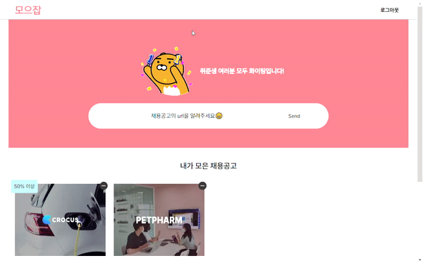
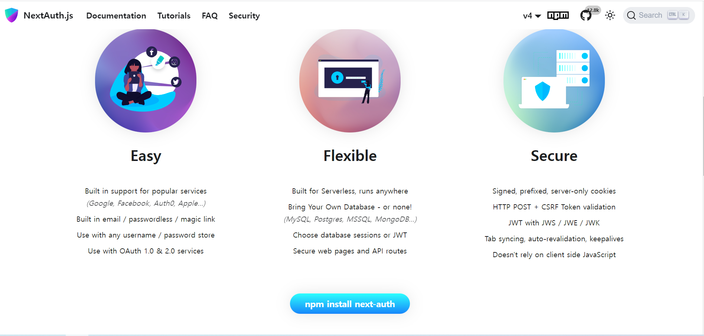
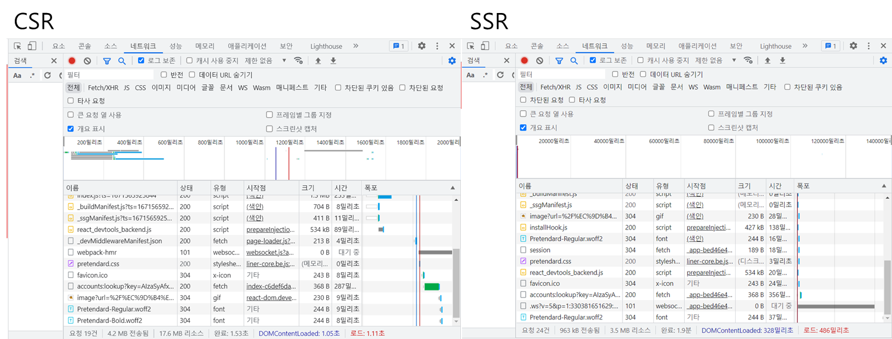

# 🔓 SSR을 이용한 인증/인가 도입

이번에 프로젝트를 고민하면서 항상 답답했던 부분이었던 페이지 redirection과 인증 과정에 대해 더 깊이 공부했다. CSR로 처리하던 인증 방식을 SSR로 수정하기까지 과정을 정리해 보려 한다.

## 😅 Firebase의 API를 이용한 User 상태 관리

기존 Authentication은 firebase Auth를 이용해 받아온 user정보의 **token을 localstorage에 저장**해서 확인했다. localstorage에 token을 저장하는 방식은 보안에 취약하다는 얘기를 많이 들어, 새로운 방법을 고민하고 있었다. 고민과정에서 firebase의 API로 `onAuthStateChanged`가 있다는 것을 알게 되었고, API를 이용한다면 별도의 토큰과 쿠키를 직접 저장하지 않아도 될 것이란 예상이 되어 적용했다.

```tsx
//AuthService.ts
export class AuthServiceImpl implements AuthService {
  googleProvider: GoogleAuthProvider;
  githubProvider: GithubAuthProvider;
  auth: Auth;

  constructor(private app: FirebaseApp) {
    this.googleProvider = new GoogleAuthProvider();
    this.githubProvider = new GithubAuthProvider();
    this.auth = getAuth(this.app);
  }
    ...
  onUserStateChanged(callback: Dispatch<SetStateAction<User | null>>) {
    return onAuthStateChanged(this.auth, callback);
  }
}

//AuthContext.tsx

type InitialValue = {
  authService: AuthService;
  user: User | null;
};

const AuthContext = createContext<InitialValue | null>(null);
export const AuthProvider = ({ children, authService }: AuthProviderProps) => {
  const [user, setUser] = useState<User | null>(null);
  useEffect(() => {
    authService.onUserStateChanged((user) => {
      setUser(user);
    });
  }, []);

  return (
    <AuthContext.Provider value={{ user, authService }}>
      {children}
    </AuthContext.Provider>
  );
};

export const useAuthService = () => {
  const context = useContext(AuthContext);
  if (!context) {
    throw new Error('Not under AuthProvider');
  }
  return context;
};

```

<br/>

이렇게 수정하고 API를 이용해 login상태를 확인해서 페이지 이동을 하다 보니 다른 문제가 생겼다. 랜더링을 하고 API로 user상태를 바꾸기 전, 초기 값이 null로 되어있어 API 호출시 **user가 없는 상태로 호출**되어 에러가 나타났다. 우선 useJobs 훅 내부에 useEffect로 user상태가 달라지면 refetch해 받아올 수 있게 해결했다.

```typescript
export const useSpecificJobs = () => {
  const { user } = useAuthService();
  const { query } = useRouter();
  const { id } = query;
  const dbService = useDBService();

  const getFilteredJobs = useQuery(
    [JOBS_KEY],
    () => {
      if (!user) {
        return {};
      }
      return dbService.getJobs(user);
    },
    {
      select: (data: ModifiedJobsType) => {
        if (!data) {
          return [];
        }
        return Object.values(data).filter((item) => item.id !== id);
      },
      onError: (error) => {
        console.log(error);
      },
    }
  );
  useEffect(() => {
    getFilteredJobs.refetch();
  }, [user]);
	...
};
```

채용공고들을 받아오는 과정이 늘어나게 되어 **같은 API를 두번 호출하는 과정에서 시간이 더 오래 걸리게 되었다**.

[호출 과정]

1. 메인 페이지 렌더링
1. API호출
1. User상태 업데이트
1. API 재호출

해결방법으로 user를 먼저 받고 API콜을 하는 방법과, auth를 server-side로 먼저 받아오는 방법 두가지 방법이 떠올랐다. 그중 먼저 현재 진행하고 있는 CSR에서 해결방법을 찾아보았다.

## 💻 CSR에서의 해결법: Protected Route 도입

CSR에서 해결하기 위해서는 fetch로 user를 받아온 후에 api를 호출할 수 있게 해야 했다. 검색해서 새롭게 알게 된 것은 Protected Route라는 HOC를 이용하는 방법이었다.

### 1) 로그인 flow 수정하기

먼저 가장 시급한 문제는 로그인 후에 메인 페이지 이동시에 User가 없는 상태로 API가 호출된다는 점이었다. 이것을 막기 위해서는 먼저 user상태를 관리해 줄 수 있는 component가 필요했고, AuthStateChanged라는 컴포넌트를 만들어 컴포넌트가 마운트되면 먼저 User를 받아오고, 이후에 메인 페이지가 렌더링 될 수 있게 했다.

```tsx
// AuthStateChanged.tsx

import React, { useEffect, useState } from 'react';
import { useAuthService } from '../context/AuthContext';

export default function AuthStateChanged({
  children,
}: {
  children: React.ReactNode;
}) {
  const { authService, setUser } = useAuthService();

  const [loading, setLoading] = useState(true);
  useEffect(() => {
    authService.onUserStateChanged((user) => {
      setUser(user);
      setLoading(false);
    });
  }, []);

  if (loading) {
    return <h1>로딩중</>;
  }

  return <>{children}</>;
}

// _app.tsx

function MyApp({ Component, pageProps }: AppProps) {
    ...
  return (
    <>
      <QueryClientProvider client={queryClient}>
        <DBProvider dbService={dbService}>
          <AuthProvider authService={authService}>
            <AuthStateChanged>
              <ThemeProvider theme={theme}>
                <GlobalStyle />
                <Component {...pageProps} />
              </ThemeProvider>
            </AuthStateChanged>
          </AuthProvider>
        </DBProvider>
      </QueryClientProvider>
    </>
  );
}
export default MyApp;

```

User가 있어야만 다음 컴포넌트들로 넘어가 동작하기 때문에 이전 가장 큰 문제였던 API를 정상적으로 한번만 호출하게 해결할 수 있었다.

하지만 여전히 살짝 문제가 남아있었던 것은 AuthStateChanged에서 User를 받아오는 동안 **화면에 로딩을 보여줘야 한다**는 점이었다. 로딩을 안 보여주기 위해 loading이 true일 때 `<></>` 리액트 fragment로 반환한다 해도 여전히 불러오는 동안의 빈 페이지가 보였다.

[AuthStateChanged 컴포넌트를 추가한 후 새로고침한 모습]



### 2) Protected Route

두 번째로 로그인하지 않고 메인 페이지에 접속하는 경우와 로그인 후에도 로그인 페이지에 접속하려는 경우를 막기 위한 리다이렉션 로직이 필요했다. 이것을 위해서 AuthStateChanged 컴포넌트와 유사하게 조건에 따라 렌더링을 해줄 수 있는 ProtectedRoutes 컴포넌트를 추가했다. Protected Route는 필요한 페이지에 맞게 사용되어야 했기 때문에 type을 정할 때 Generic을 이용해 정해 줄 수 있었다.

```tsx
//ProtectRoute.tsx

import { useRouter } from "next/router"
import React, { ComponentType } from "react"
import { useAuthService } from "../context/AuthContext"
export function withPublic<T>(Component: ComponentType<T>) {
  return function WithPublic(props: T) {
    const auth = useAuthService()
    const router = useRouter()
    if (auth.user) {
      router.replace("/")
      return <></>
    }
    return <Component auth={auth} {...props} />
  }
}

export function withProtected<T>(Component: React.ComponentType<T>) {
  return function WithProtected(props: T) {
    const auth = useAuthService()
    const router = useRouter()
    if (!auth.user) {
      router.replace("/login")
      return <></>
    }
    return <Component auth={auth} {...props} />
  }
}

// pages/login.tsx
function Login() {
  // ...
}

export default withPublic(Login)

// Pages/register.tsx
function Register() {
  // ...
}

export default withPublic(Register)

// pages/index.tsx
function Home() {
  // ...
}

export default withProtected(Home)

// pages/job/[id].tsx

function Index() {
  // ...
}

export default withProtected(Index)
```

Protected Route를 이용해 로그인을 한 후에 home에서 login으로 이동하거나 로그인을 하지 않고 login에서 home으로의 이동을 막을 수 있었다. 하지만 여전히 앞서 문제가 되었던 페이지 이동시간동안 **로딩을 보여줘야 하는 문제**가 있었다.

Protected Routes를 알기 전에 해결방법으로 떠올렸던 **서버사이드에서 auth를 미리 받아와** 렌더링 전에 체크한 후에, 해당 페이지에서 auth를 바로 받아볼 수 있다면 좀 더 로직도 간단해지고, next를 잘 활용하는 방법이 되지 않을까라는 생각이 들어 다시 찾아보기 시작했다.

## 💾 Next-auth를 이용한 SSR로 전환

SSR을 이용하기 위한 방법을 찾기위해 Next JS 공식 사이트를 찾아보니, 제시된 방법으로 `with-iron-session`과 `next-auth`라는 라이브러리를 이용하는 방법이었다. 그중에서 기존 지원했던 OAuth를 이용한 로그인 방식을 그대로 사용할 수 있는 **next-auth**를 선택했다.

[next auth]


Next-auth는 Next js에서 쉽게 인증과정을 구현해 줄 수 있는 라이브러리로, API Routes를 이용해 서버단에서 session과 토큰을 만들고 확인해 client에서 필요했던 확인로직을 줄여줄 수 있다. Next Auth를 공부하면서 굉장히 다양한 Provider들을 OAuth로 제공해준다는 점이 놀라웠다. 특히, 카카오톡과 네이버도 지원해준다는 점이 신기했고, 다양한 DB와도 연동해서 사용할 수 있어 좋았다.

SSR을 Next-auth로 적용할 수 있다는 사실을 알게 된 후에, 라이브러리를 잘 사용하기 위해 **인증, 인가 과정**과 앞서 사용했던 방식인 **local storage에 두는 방식이 왜 안 좋은지**에 대해 이해하고, **Next-auth가 해결책이 될 수 있는지** 고민했다.

### 😖 토큰을 localStorage에 두면 안되는 이유

local storage는 브라우저가 닫혀도 유지되기 때문에 로그인을 유지할 수 있는 간편한 방법으로 사용해왔다. 하지만 이러한 방식은 ` XSS (Cross-Site Scripting) 공격`에 취약한 단점을 가진다.

#### XSS (Cross-site scripting)

XSS 공격은 웹사이트에 **악성 스크립트를 주입하는 방식**으로 주로 페이지의 input이나 form을 이용해 공격하는 방식이다. 주입해놓은 사이트에 사용자가 로그인하게 될 경우에 사용자의 토큰, 쿠키 등의 정보를 빼낼 수 있게 된다. 그렇기 때문에 자바스크립트로 접근할 수 있는 localstorage나 별도의 옵션이 없는 쿠키에 토큰을 저장하게 될 경우에는 XSS 공격에 취약하게 된다.


이것을 막기 위해서는 `in-memory에 저장하는 방식`과 `http only 쿠키`를 이용하는 방식이 있다. in-memory에 저장할 경우에는 관리는 쉽지만 로그인을 유지할 수가 없는 단점이 있어, 보통 http only 쿠키로 서버에서 토큰을 보내주면 브라우저에 저장하고 자동으로 요청시 담아서 보내는 방식을 적용할 수 있다. 하지만 http only 쿠키로 토큰을 저장하는 방법도 `CSRF 공격`에 약한 단점이 존재한다.

#### CSRF(Cross-site Request Forgery)

CSRF공격은 사용자가 원하지 않은 action을 하게하는 해킹 방법으로, 로그인한 사용자의 정보를 이용해 사용자 몰래 브라우저에 저장되어있는 쿠키를 이용해 요청을 보내는 방식이다. http only로 된 쿠키이기 때문에 해킹범이 쿠키를 직접 빼올 수는 없지만, 대신 자신이 원하는 요청에 사용자의 토큰을 이용해 사용할 수 있다. 그렇기 http only 쿠키만 사용하는 것이 아니라 추가적인 인증방식이 필요한데, 이때 사용할 수 있는 방법이 `CSRF 토큰`이다.


CSRF 토큰은 서버에서 발급하는 인증용 토큰으로, 클라이언트는 받은 토큰을 in-memory에 저장해 두고 이후 요청에 토큰을 함께 보낸다. 만약에 해킹범이 CSRF공격을 한 후에 사용자의 쿠키를 이용해 요청을 보내더라도, 사용자가 직접보내는 것이 아니라면 토큰이 없기 때문에 서버가 확인할 수 있게해 공격을 막을 수 있다.


그러면 Next-auth를 이용한 인증방식은 어떻게 이루어지고 있을까?

### Next-auth의 보안 방식과 적용

Next-auth는 OAuth와 JWT를 지원하고, 무엇보다 고민했던 보안 문제를 한번에 해결해 줄 수 있었다. `CSRF토큰`을 POST 요청에 적용하고, 인증을 위한 토큰과 세션들을 `server-readable-only cookie`로 자동으로 관리해준다. 두가지 덕분에 앞서 알아보았던 XSS공격과 CSRF 공격을 방어하면서 인증을 편하게 할 수 있다는 것을 확인했다.


Next auth에 대해 공부하면서 기본적으로 password를 사용하지 않는 방향을 지향한다는 것을 알게 되었다. 비밀번호는 보통 하나의 비밀번호가 여러 곳에 사용되기 때문에 보안에 민감한 사항이라고 생각해, 기존 회원가입-로그인 로직 대신에 "이메일 인증"으로 교체하고, OAuth로 "구글"과 "Github"를 이용한 총 세가지 방식의 인증과정을 진행하기로 했다.

OAuth를 이용할 때도 고려해야할 점은, 다른 플랫폼이지만 같은 email을 사용하는 경우이다. 고민을 해보았을 때 다른 플랫폼이지만 같은 email로 접속했을 때 같은 채용공고들을 보여줘도 괜찮을 것 같아 이부분은 provider 옵션에 `allowDangerousEmailAccountLinking`을 추가해서 처리했다.

### 사용 방법

Next-auth를 사용하기 위해서는 우선 `pages/api/auth/[...nextauth].ts`를 만들어야한다. 내가 사용한 `[...nextauth].ts`파일 내용은 아래와 같고, 코드의 이해를 돕기 위해서 공통 부분을 설명하고 각각의 provider들의 연결을 정리해보려 한다.

```typescript
import GoogleProvider from "next-auth/providers/google"
import GithubProvider from "next-auth/providers/github"
import EmailProvider from "next-auth/providers/email"
import NextAuth from "next-auth"
import { PrismaAdapter } from "@next-auth/prisma-adapter"
import prisma from "../../../prisma/prisma"
import nodemailer from "nodemailer"
import { html, text } from "../../../src/utils/emailFormat"

export default NextAuth({
  providers: [
    GoogleProvider({
      clientId: process.env.GOOGLE_ID || "",
      clientSecret: process.env.GOOGLE_SECRET || "",
      allowDangerousEmailAccountLinking: true,
    }),
    GithubProvider({
      clientId: process.env.GITHUB_ID || "",
      clientSecret: process.env.GITHUB_SECRET || "",
      allowDangerousEmailAccountLinking: true,
    }),
    EmailProvider({
      server: process.env.EMAIL_SERVER,
      from: process.env.EMAIL_FROM,
      async sendVerificationRequest({
        identifier: email,
        url,
        provider: { server, from },
      }) {
        const { host } = new URL(url)
        const transport = nodemailer.createTransport(server)
        await transport.sendMail({
          to: email,
          from,
          subject: `Sign in to ${host}`,
          text: text({ url, host }),
          html: html({ url, host, email }),
        })
      },
    }),
  ],

  session: {
    strategy: "jwt",
  },
  adapter: PrismaAdapter(prisma),
  pages: {
    signIn: "/login",
  },
  secret: process.env.JWT_SECRET,
  debug: true,
  callbacks: {
    async session({ session, token, user }) {
      session.user.id = user.id
      return session
    },
  },
})
```

### 공통 부분

- secret: 배포 때, JWT를 만드는데 사용될 secret으로 터미널에 `openssl rand -base64 32` 을 입력해 만들어진 키를 env에 추가해 연결했다.

- debug: 연결된 provider의 토큰 내용이나 에러들을 볼 수 있는 옵션으로 터미널로 내용들을 확인할 수 있다.

- callbacks: 인증과정에서 필요한 내용들을 커스텀하는 부분으로 API에 필요한 id를 값을 기본적으로 `session/user`에 담겨있지 않아 추가해주었다.

- pages: custom 로그인 페이지를 연결할 url을 전달해 줄 수 있다.

- session: database와 연결하게 되면 사용자 정보가 세션으로 관리되기 때문에 jwt로 변경했다. database를 연결하지 않으면 기본적으로 jwt가 된다.

callbacks에서 추가할 부분은 타입도 추가해줘야하기 때문에 `next-auth.d.ts`에서 정의해주었다.

```typescript
// types/next-auth.d.ts

import { DefaultUser } from "next-auth"
declare module "next-auth" {
  interface Session {
    user: DefaultUser & {
      id: string
    }
  }
}
```

### Adapter

사용자정보들을 저장할 DB를 연결하는 부분으로, next-auth는 다양한 DB를 지원한다. 그중에서 기존에 사용하던 firebase 대신에 prisma를 이용해 연결했다. Firebase를 사용하려했지만 현재 next-auth가 version 4로 업데이트 하면서 지원하지 않는 것을 확인했다.

그래서 새로운 Database를 찾다가 `prisma`를 사용했다. `Prisma`는 ORM으로 SQL DB와 함께 사용되지만 현재 MongoDB까지 지원해줘, 데이터의 schema를 기입해서 안전하게 관리할 수 있고, 다양한 database를 지원하는 장점들로 선택했다.

#### Prisma를 이용한 DB 연결

prisma를 이용해 MongoDB를 연결하기 위해서 next-auth의 공식 홈페이지를 참고하면 되지만 주의할 부분이 있었다.

공식 홈페이지의 schema의 VerificationToken 부분의 id가 없기 때문에 에러가 발생하는데, 이것을 해결하기 위해서는 다음과 같이 추가해 해결할 수 있었다.

```typescript
// ...

model VerificationToken {
  id         String   @id @default(auto()) @map("_id") @db.ObjectId
  identifier String
  token      String   @unique
  expires    DateTime @map("expiresAt")

  @@unique([identifier, token])
  @@map("verification_tokens")
}

```

### OAuth

OAuth로 사용한 Google과 Github에 연결하기 위해서는 각각 ID와 Secret을 전달해주어야한다. 이때 많이 에러가 났던 부분은 인증이 끝나고 돌아갈 `callback`을 설정해주는 부분이었다. 배포를 하면서 에러가 많이 난 부분이라 미리 로컬과 배포용 두개의 OAuth 인증 정보를 만들고, 각각 구분된 key와 secret으로 `.env.local`과 `.env.production`으로 해두었다면 헷갈리지 않았을텐데라는 아쉬움이 든다.

#### Google

Google의 경우는 GCP(Google Cloud Platform)에 들어가 사용자 인증정보- OAuth Client ID를 만들면 되는데 이때 주의할 점은 url주소를 잘 적어주어야했다.

- 개발: url=`http://localhost:3000`, 승인된 리디렉션 URI= `http://localhost:3000/api/auth/callback/google`
- 배포: url= `http://moejob.shop`, 승인된 리디렉션 URI= `http://moejob.shop/api/auth/callback/google`

#### Github

Github은 Github 본인계정의 settings-왼쪽 메뉴 가장하단의 developer settings-OAuth Apps를 이용해 추가하면 된다. 이때도 url주소를 주의해서 적어야했다. 특히 Github은 한번 인증된 계정의 url을 바꾸어도 잘 적용이 안되 새롭게 배포용 계정을 만들어서 인증했다.

- 개발: Homepage URL=`http://localhost:3000`, Authorization callback URL= `http://localhost:3000/api/auth/callback/github`

- 배포: Homepage URL=`http://moejob.shop`, Authorization callback URL= `http://moejob.shop/api/auth/callback/github`

### Email

이메일을 연결하는 부분이 가장 힘들었던 부분중 하나다. Next-auth와 검색의 대부분은 `sendGrid`의 SMTP를 이용해 이메일을 보낼 수 있게 소개했지만, 가입을 해도 계정이 pending상태로 남아있어서 `Gmail`을 이용한 방법으로 바꾸었다.

우선 next-auth자체에 `nodemailer`가 없기 때문에 nodemailer를 설치한 후에 연결해주었다. Gmail페이지에서 설정에 들어가 IMAP을 사용으로 수정하고, google계정의 앱비밀번호를 추가해 환경변수로 전달했다.

- `EMAIL_SERVER =smtp://<email>:<app password>@smtp.gmail.com:587`

- `EMAIL_FROM=moejob@gmail.com`

이렇게 설정만 하면 기본 이메일 포맷으로 나오기 때문에 추가적인 포맷을 위해 EmailProvider option으로 sendVerificationRequest로 필요한 내용들을 전달 할 수 있다.

### \_app.tsx

각각의 Provider를 연결한 후에 컴포넌트에 적용하기 위해서는 next-auth가 제공하는 `SessionProvider`을 감싸주면 컴포넌트 내부에서 `useSession` hook을 이용해 session정보를 전역 상태로 사용할 수 있다. 덕분에 기존에 CSR에서 사용하고 있던 AuthService를 이용해 user를 따로 관리하지 않아도 되었다.

```tsx
function MyApp({ Component, pageProps }: AppProps) {
  const dbService = new DBServiceImpl(firebaseApp)
  return (
    <>
      <QueryClientProvider client={queryClient}>
        <DBProvider dbService={dbService}>
          <SessionProvider basePath={process.env.NEXTAUTH_URL}>
            ...
          </SessionProvider>
        </DBProvider>
      </QueryClientProvider>
    </>
  )
}
```

### Proteceted Route

getServerSideProps로 session을 받아와 로그인 된 사용자인지 먼저 체크해 주는 방식을 통해 현재 로그인된 유저인지 먼저 확인할 수 있었다. 먼저 서버에서 사용자정보를 이용해 리다이렉션 시키기 때문에 페이지를 랜더링을 하지 않고, 리다이렉션이 가능하게 되었다.

```tsx
export default function User({
  session,
}: InferGetServerSidePropsType<typeof getServerSideProps>) {
  return (
    <MainLayout>
      <JobSection session={session} />
    </MainLayout>
  )
}

export const getServerSideProps = async (context: NextPageContext) => {
  const session = await getSession(context)
  if (!session) {
    return {
      redirect: {
        destination: "/login",
      },
    }
  }
  return {
    props: { session },
  }
}
```

### Custom Login

Next auth를 이용하게 되면 기본적으로 제공해 주는 login 페이지가 있지만 이미 만들어둔 페이지가 있었기 때문에 custom 페이지와 연결했다. custom 페이지에서 provider를 이용하기 위해서는 서버로 해당 provider정보를 전달해 주어야 한다.

```tsx
const Login = ({
  providers,
}: InferGetServerSidePropsType<typeof getServerSideProps>) => {
  return (
    <>
      <SEO title="로그인" />
      <AuthLayout providers={providers} />;
    </>
  )
}

export default Login

export const getServerSideProps = async ({ req }: NextPageContext) => {
  const session = await getSession({ req })
  if (session) {
    return {
      props: {},
      redirect: {
        destination: "/",
      },
    }
  }

  return {
    props: {
      providers: await getProviders(),
    },
  }
}
```

## 👓성능 비교

크롬의 개발자도구를 이용해 완료 (페이지를 모두 불러오는데 까지 걸리는 시간)를 기준으로 CSR을 이용해 인증을 했을때 시간과 SSR을 이용해 인증을 했을 때 시간을 비교해보았다.



위 사진과 같이 CSR은 총 1.52s, SSR은 955ms로 SSR이 CSR에 비해 38%정도 로딩속도를 개선된것을 알 수 있었다.

## 마치며

이렇게 서버사이드 렌더링을 이용해서 인증을 적용하면서 전체적으로 컴포넌트들이 간단해졌고, **빈페이지를 보여주지 않고 페이지 이동**이 이루어져 성능 개선도 이루어진 점이 너무 좋았다. 이후에는 페이지마다 권한을 정하고 페이지 개선을 한 후에 SEO와 HTTPS를 적용하는 작업을 할 예정이다.

<br/>

[참조]

- [모의해킹 실무자가 알려주는, XSS 공격 기법](https://www.inflearn.com/course/%EB%AA%A8%EC%9D%98%ED%95%B4%ED%82%B9-xss-%EA%B3%B5%EA%B2%A9%EA%B8%B0%EB%B2%95?inst=29e33bf1)
- [CSRF를 1분 만에 해결하는 방법](https://doctorson0309.tistory.com/605)
