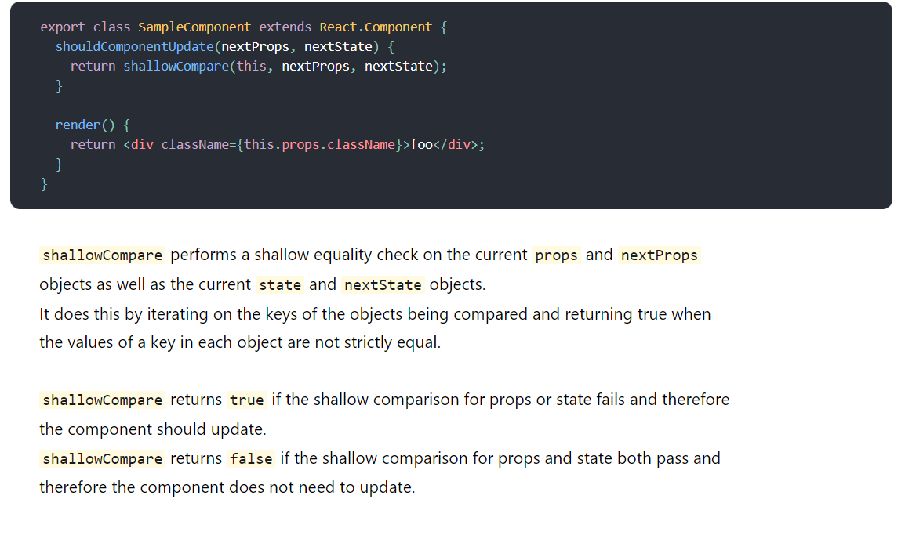

# 😁 리액트의 성능 보장방식

저번 면접 시간에 리액트에 대한 질문이 들어왔을 때, 안다고 자신했지만 돌아보니 너무 부족했었던 모습에 리액트 문서 자체를 다시 꼼꼼히 읽고 정리해야겠다는 생각이 들었다. 그중에 이번에 기본 동작원리와 성능과 관련된 useMemo와 useCallback에 대해 정리해 보려 한다.

## ❓ 왜 리액트를 써야 할까?

먼저 리액트를 쓰면서 `내가 왜 리액트를 사용하는지`에 대해서 많이 고민하지 못했다.

개인적으로 내가 느낀 리액트의 장점은 `자바스크립트를 적극적으로 사용한다`는 점이었다. 물론 Vue도 자바스크립트를 사용하지만 리액트는 라이브러리이기 때문에 좀 더 자유롭게 자바스크립트를 사용할 수 있고 잘 사용하기 위해서, 자바스크립트 자체를 좀 더 공부하게 되었다. 이점이 오히려 러닝 커브가 낮다는 점에서 Vue의 장점이 될 수 있지만 **하나의 언어를 정말 잘하고 싶었던** 나에게 있어서는 리액트의 장점이 되었다.

Vue와 React를 모두 사용해보았다면 더 잘 정리할 수 있을 것 같아, 이후에 조금씩 시도하면서 직접 느껴보고 정리해보면 좋을 주제라고 생각되었다.

## ❗ 리액트가 해결하고 싶었던 문제

이전에 CSR과 SSR 글과 Critical Rendering path에 대해 글을 쓰면서 정리했지만 SPA은 **MPA(Multi Page Application)의 문제점**을 해결하기 위해서 나오게 된 해결 방법이다. MPA의 문제점은 페이지 이동에 따라 HTML 전체를 새롭게 가져와야 하는 불필요한 비용이 발생한다는 점이었다.

이를 해결하기 위해 하나의 html에 javascript을 이용해 동적으로 DOM요소를 변형하는` SPA (Single Page Application) 방식`이 제안되었고 여기에 대표적인 라이브러리가 바로 **리액트**이다.

하지만 SPA는 DOM요소를 자바스크립트로 직접 건드리기 때문에 Critical Rendering Path에서 브라우저가 그려줘야하는`layout -paint- composite`과정이 다시 일어나야 해서 성능이 큰 문제가 될 수 있다. 이러한 성능 문제를 해결하기 위해서 리액트는 자체적인 <u>V-DOM을 이용한 Reconcilation</u>으로 해결한다. 두가지에 대해서 알아보자.

## 🎈 V-DOM과 Reconcilation

V-DOM은 리액트 자체의 가상의 DOM이다. 리액트는 기본적으로 UI를 업데이트 하기 위해, DOM을 변경하기 위해 **상태**를 사용한다. 이 상태에 따라 매번 DOM자체가 바뀌게 된다면 성능에 문제가 생기기 때문에 리액트는 자체적으로 `V-DOM`에 업데이트 해야할 부분을 먼저 반영한다. 이때 V-DOM을 DOM에 반영할 타이밍을 관리해주는 스케줄러가 있어, 적절한 타이밍에 V-DOM과 실제 DOM을 비교해 필요한 부분을 반영하는데 이것을 **Reconcilation**이라고 한다.

이렇게 V-DOM자체로 랜더링을 하는 것이 아니기 때문에 비용이 적게 들면서 매번 DOM을 업데이트하지 않고 필요한 DOM변화를 모아서 한번에 처리해 성능을 최적화한다. 이러한 과정이 이전에 많이 쓰이던 라이브러리인 JQuery와 차이가 나는 부분으로 DOM을 직접 변경하는 JQuery와 달리 필요한 변화를 비교하고 그부분만 업데이트해 훨씬 성능이 좋다.


**Reconcilation**은 **V-DOM을 이용해 실제 DOM과 비교해 반영하는 과정**이라고 정의할 수 있다. 이때 중요한 점은 비교하는 것 자체에도 성능이 문제가 될 수 있다는 점이다. 리액트 홈페이지에 비교 알고리즘으로 `state of art algorithm`을 이용한다면 O(n^3)의 시간 복잡도를 갖기 때문에 성능에 큰 문제가 된다고 한다. 그렇기 때문에 리액트는 성능을 고려한 비교를 위해 두가지 가정을 한다.

첫번째는 <u> element의 type이 달라지면 다른 트리를 만든다는 것</u>이고, 두번째로 개발자가 직접 child element에 <u>key</u>를 이용해 바뀌지 않을 곳을 알려줄 수 있다는 점이다. 이 두가지 가정을 통해서 reconcilation은 O(n)의 시간복잡도를 갖게 된다.

각각에 대해 자세히 정리해보자

### Elements Of Different Types

먼저 element의 tag 자체가 달라진다면, 예를 들면 `<a>` 에서 `<button>`으로 바뀌었다고 하면 자식을 더 이상 비교하지 않고 거기서 바로 새로운 DOM 트리를 만들고 아래 자식 요소들이 업데이트된다. 이때 tag는 같지만 className과 같은 attribute가 달라질 경우에는 DOM요소는 그대로 두고 attribute만 바꿔 반영한다.

### Key

key를 정해주어야 할때는 보통 배열의 요소를 mapping해줄 때 사용한다. 이때 key를 전달하지 않으면 리액트는 error를 던진다. 그 이유는 같은 tag가 반복되는 상황에서 순서만을 이용하게 되면 DOM요소가 변경되었을 때 전체를 다 변경해야하는 불필요한 비용이 발생하기 때문이다.

```jsx
// DOM
<ul>
  <li>Duke</li>
  <li>Villanova</li>
</ul>

// VDOM
<ul>
  <li>Connecticut</li>
  <li>Duke</li>
  <li>Villanova</li>
</ul>
```

위 코드와 같은 경우 react는 순서만으로 비교해 모든 요소가 다 바뀌었다고 이해하고 전체를 다 새롭게 DOM요소를 만든다. 이점을 해결하기 위해서 key를 이용한다면 내부 순서와는 상관없이 key값이 바뀐 요소만 찾아서 DOM을 업데이트해 최적화가 가능하다. 그렇기 때문에 **고유한 값**으로 key를 정해주는 것이 중요하며 key로 index를 직접 넘기면 안된다는 것이 이해가 되었다.

```jsx
<ul>
  <li key="2015">Duke</li>
  <li key="2016">Villanova</li>
</ul>

<ul>
  <li key="2014">Connecticut</li>
  <li key="2015">Duke</li>
  <li key="2016">Villanova</li>
</ul>
```

## 😲 Reconcilation 피하기

리액트의 기본원리는 **상태와 props가 바뀌면 해당 컴포넌트를 리랜더링**하는 것이다. 앞서 정리한 내용들은 이러한 변화로 V-DOM가 바뀌었을 때 V-DOM과 실제 DOM을 어떻게 비교해서 반영하냐에 관한 것이었다. 하지만 이렇게 최적화해서 리랜더링을 한다해도 리랜더링 자체는 비용이 드는 작업이다. 그렇기 때문에 기존의 UI자체를 재사용해, 리랜더링 자체를 줄여줄 수 있다면 더 좋은 방법이 된다.

기존의 UI를 재사용할 지를 개발자가 성능을 고려할 수 있는 방법으로 리액트는 `React.Memo`와 `useCallback,useMemo API`를 지원한다.

### React.Memo

리액트의 기본 원리에 따라서 상태가 바뀌면 해당 컴포넌트와 자식 컴포넌트를 모두 리랜더링을 해야 하지만, 자식 요소 중에서 전달받은 props가 변하지 않아서 UI를 변화하지 않아도 되는 경우가 존재한다. 이럴 때는 이전 UI를 그대로 사용하는 것이 더 효율적인데 이때 사용할 수 있는 것이 `React.Memo`이다.

```jsx
import { memo } from "react"

function SomeComponent(props) {
  // ...
}

const MemoizedComponent = memo(SomeComponent)
```

React.memo는 해당 컴포넌트를 감싸는 HOC (Higher Order Component)로 컴포넌트의 이전 props와 state 변화로 사용될 props 비교해서 차이가 있을 때에만 리랜더링을 하게한다.이때 중요한 것은 props를 비교하는 방식인데 `얕은 비교`를 통해 비교한다.

#### 얕은 비교와 불변성

자바스크립트의 비교는 데이터의 메모리 주소를 이용해 일치 여부를 확인한다. 원시형의 경우 값이 변경되면 새로운 메모리 주소에 변경된 데이터를 저장해 메모리 주소 자체로 비교해도 된다.

하지만 객체 타입은 해당 객체의 데이터를 보관하고 있는 참조값을 메모리 주소에 할당하기 때문에 내부 데이터가 바뀌어도 메모리 주소가 동일해, 주소값만을 비교하는 것이 아니라 내부 값이 변했는지 일일이 확인해야 한다. 그렇기 때문에 리액트에서는 비교의 편의를 위해서 **객체의 불변성**을 지키는 방식을 이용한다. 객체의 불변성을 지키게 되면 내부 데이터가 바뀌기 위해서는 새로운 객체로 바꾸어야 하기 때문에 원시형 타입과 같이 주소값만으로도 비교가 가능하게 된다.

그래서 리액트에서 객체상태를 변화 시키기 위해서는 state를 직접 mutate하는 게 아니라, **setState**를 구조분해할당을 이용한 방식으로 상태변화를 한다. 구조분해할당은 key로 전달된 값은 같지만 감싸고 있는 객체는 새롭게 할당하기 때문에 리액트에게 상태변화를 알려줄 수 있고, 자식으로 값을 전달했을 때 바뀐 부분만 업데이트 할 수 있게 된다.

**props 자체는 매번 랜더링에 따라 새롭게 만들어져 비교가 의미가 없다**. 비교를 위해서는 props 내부의 key를 돌면서 비교를 하게 되는데 값들 중에서 하나라도 false가 나오게 된다면 리랜더링이 필요하다고 판단하고 리랜더링을 한다.



### useCallback과 useMemo

React.Memo는 컴포넌트 자체의 props를 이용해서 리랜더링을 해야할 지를 고민한다면, **컴포넌트 내부의 데이터**를 저장해두고 불필요한 업데이트를 막아 효율적으로 사용하는 방법으로, **useCallback과 useMemo**가 있다.

함수형 컴포넌트는 매 리랜더링때마다 새롭게 실행되기 때문에, 그때마다 변수와 함수가 새롭게 생성되는 특징을 가진다. 만약에 이 변수들과 함수가 자식 컴포넌트에 전달된다면 React.Memo로 컴포넌트를 감싸더라도 전달되는 값이 계속해서 새로운 값으로 전달되기 때문에 결국 React.Memo로 감싸진 컴포넌트도 리랜더링이 될 수 있다.

#### useMemo(callbackFunction, deps)

useMemo는 값을 저장할 수 있는 함수로 반환하는 값을 저장하게 되고, deps로 전달된 값이 변할 때만 새롭게 생성한다.

```jsx
const memoizedValue = useMemo(() => computeExpensiveValue(a, b), [a, b])
```

#### useCallback(callbackFunction, deps)

useCallback은 useMemo로 저장하던 함수를 좀 더 간단하게 저장할 수 있게 도와주는 api로, useMemo와 동일하게 deps로 전달된 값이 변할 때 새롭게 생성된다.

```jsx
const memorizedFunction = useMemo(() => () => console.log("Hello World"), [])

const memorizedFunction = useCallback(() => console.log("Hello World"), [])
```
