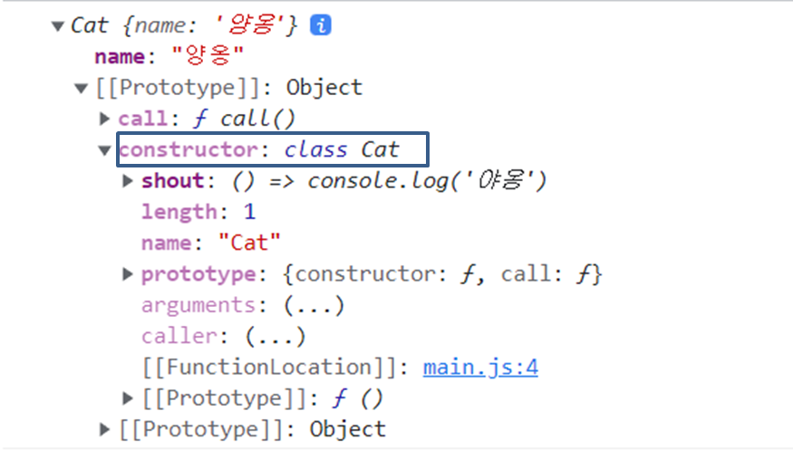
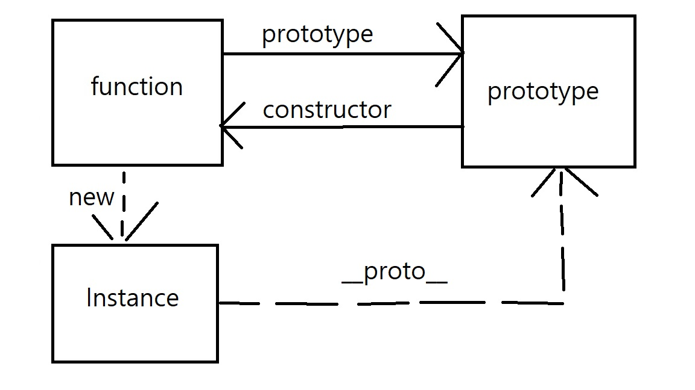
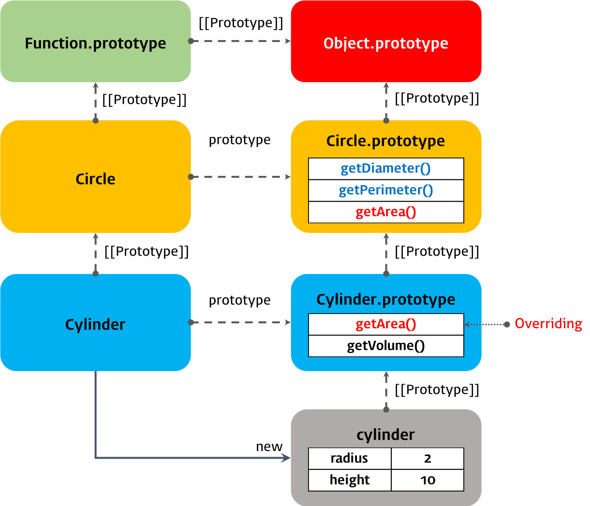

# 👓 Class

자바스크립트 자체는 프로토타입을 기반으로 객체지향을 지원하는 언어다. 클래스는 클래스에 익숙한 개발자들을 위한 프로토타입의 `문법적 설탕`이라고 불린다. 하지만 클래스가 자바스크립트 내에서 동작하는 방식에 차이점이 존재한다. 클래스에 대해서 알아보자

## 🙄 클래스의 정체와 호이스팅

먼저 클래스는 자바스크립트에서 `함수`다. 자바스크립트에서 함수는 `일급객체`이므로 매개변수, 반환 값으로 사용이 가능하고 변수에 저장할 수도 있다. 이렇게 생성자 함수와 같이 함수지만 차이점이 존재한다. 생성자 함수는 new가 없이 호출 시에 함수로써 동작하지만, 클래스는 new 키워드없이 호출할 수 없다.

```javascript
class Cat {
  constructor() {
    this.name = "야옹이"
  }
  call() {
    console.log(this.name)
  }
}

console.log(Cat()) //TypeError: Class constructor Cat cannot be invoked without 'new'
```

위 코드에서 new없이 호출시 에러가 발생한 것을 볼 수 있다.

클래스는 함수이기 때문에 호이스팅이 발생하지만, const, let으로 함수표현식과 같이 초기화 전까지 호출이 불가능한 TDZ에 빠지는 특징을 가진다.

```javascript
const Cat = ""
{
  console.log(Cat) // ReferenceError: Cannot access 'Cat' before initialization
  class Cat {}
}
```

위 코드에서 호이스팅되지 않았다면 전역에서 만든 Cat 변수가 있기 때문에 `" "`로 콘솔에 나와야한다. 하지만 호이스팅이 일어나 에러가 난 것을 확인할 수 있다.

## 😎 클래스의 메소드

클래스는 생성자 함수와 같이 인스턴스 메소드, 정적 메소드, 프로토타입 메소드, 총 세가지 메소드 영역을 가진다. 각각에 대해 알아보자.

### constructor

constructor 메소드는 class로 만들 인스턴스를 **생성**하고 **초기화**하기 위한 메소드다. 클래스는 함수이기 때문에 프로토타입을 가지는데 이때 프로토타입의 constructor는 클래스 자신을 가리키고 있다.

그렇기 때문에 클래스 자체로 인스턴스를 만들 수 있고, constructor 내부의 this는 인스턴스를 가리켜 만들어질 인스턴스의 초기값을 정할 수 있다. 이때 constructor메소드 내부에서 암묵적으로 return this를 자동으로 처리해주고 있다. 생성자함수에서 this로 인스턴스의 속성을 정해주던 것과 동일하다.

이때 this대신 다른 객체를 return하면 결과가 달라지기 때문에 return을 생략하는 게 좋다.

```javascript
class Cat {
  constructor(name) {
    this.name = name
    return {}
  }
}

const cat = new Cat("양옹")
console.log(cat) // {}
```

클래스로 만들어진 인스턴스도 생성자함수가 만든 인스턴스와 동일하게 프로토타입 체인에 들어가게 된다. 결국 정리하면 프로토타입 체인에서 클래스는 인스턴스를 생성하는 생성자 함수와 같은 역할을 한다고 생각할 수 있다.



### 프로토타입 메소드

생성자함수에서는 인스턴스들이 공통으로 참조할 함수를 만들 때, 프로토타입에 함수를 전달했지만 클래스에서는 클래스 내부의 메소드를 선언하면 자동으로 프로토타입의 메소드가 된다.

```javascript
class Cat {
  constructor(name) {
    this.name = name // 인스턴스 메소드
  }
  call() {
    //프로토타입 메소드
    console.log("야옹")
  }
}

const cat = new Cat("야옹이")
cat.call() // 야옹
cat.__proto__.call("야옹")
```

### 정적 메소드

정적 메소드는 생성자함수에서 생성자함수객체 자체가 갖는 속성으로, 클래스에서는 static을 붙여 정적 메소드를 정한다. class 자체가 갖는 메소드로 절댓값이나 랜덤한 수를 얻을 때 사용하던 `Math.abs()`가 static 함수의 예가 될 수 있다. 정적 메소드는 인스턴스에게 상속되지 않는 메소드로 별도의 인스턴스를 만들지 않고 사용해서 유틸리티 함수를 만들 때 사용된다.

```javascript
class Cat {
  static shout = () => console.log("야옹") // 정적 메소드
}

Cat.shout() //야용
```

## 🥚 인스턴스 생성과정

클래스의 인스턴스를 만드는 과정을 정리하면 생성자 함수와 동일하게 동작한다. 가장 먼저 new 키워드로 빈 객체를 만들고 this를 바인딩한다. constructor 내부코드를 통해 초기화한 후에 생략된 `return this`로 인스턴스를 만든다. 클래스 내부의 인스턴스 메소드는 프로토타입을 통해 상속되기 때문에 자체적으로는 가지고 있지 않다.

```javascript
class Cat {
  static shout = () => console.log("야옹")

  constructor(name) {
    this.name = name
  }
  call() {
    console.log("하이")
  }
}

const cat = new Cat("야옹")

console.log(cat.hasOwnProperty("call")) //false
console.log(cat.__proto__.hasOwnProperty("call")) //true
```

## 🩸 클래스의 getter와 setter

클래스는 **getter와 setter**를 이용해 데이터 속성 값을 읽거나 변경할 수 있다. getter와 setter는 모두 함수지만 사용할 때는 다른 속성과 동일하게 사용한다. getter는 해당 속성에 접근할 때 수행되는 함수이며 항상 값을 반환해줘야 하고, setter는 해당 속성을 변경할 때 실행되는 함수이므로 항상 인자가 필요하다. getter와 setter가 필요한 상황에 대해 알아보자.

```javascript
class Person {
  constructor(firstName, lastName) {
    this.firstName = firstName
    this.lastName = lastName
  }
  fullName() {
    return `${this.firstName} ${this.lastName}`
  }
}

const person1 = new Person(100, 90)
console.log(person1.averageScore()) //함수를 이용해야해
```

위의 코드의 점수의 평균 값을 얻고 싶은 상황에서 메소드로 평균 점수를 받을 수 있지만 averageScore를 속성으로 만들고 싶다. 그래서 우선은 초기 값으로 먼저 받아올 때 계산해서 속성으로 추가할 수 있다.

```javascript
class Person {
  constructor(firstName, lastName) {
    this.firstName = firstName
    this.lastName = lastName
    this.fullName = `${this.firstName} ${this.lastName}`
  }
}

const me = new Person("Youngjun", "Choi")
console.log(me.fullName) // Youngjun Choi
me.firstName = "hi"
console.log(me.fullName) // Youngjun Choi
```

하지만 문제점은 초기화로 값이 정해져버려 수학 점수를 수정했을 때 평균값은 반영이 안되고 있다. 이때 사용할 수 있는 것이 Getter와 Setter다.

```javascript
class Person {
  constructor(firstName, lastName) {
    this.firstName = firstName
    this.lastName = lastName
  }
  get fullName() {
    return `${this.firstName} ${this.lastName}`
  }

  set fullName(value) {
    this.fullName = value
  }
}

const me = new Person("Youngjun", "Choi")
console.log(me.fullName)
me.fullName = "yj Choi" // RangeError: Maximum call stack size exceeded
```

getter와 setter는 내부적으로 함수이기 때문 속성에 접근해 값을 반환해주고 변경할 수 있지만 사용 시에는 속성으로 사용할 수 있어 우리가 원하는 결과를 얻을 수 있다. 하지만 이때 주의할 점은 setter가 변경하는 속성의 이름과 접근하는 속성의 이름이 같을 경우 계속해서 **재귀적으로 호출**해 에러가 발생한다. 이를 해결하기 위해서는 값을 setter 속성을 직접 변경하는 것이 아니라 내부 속성을 이용해서 수정해야 한다.

```javascript
class Person {
  constructor(firstName, lastName) {
    this.firstName = firstName
    this.lastName = lastName
  }
  get fullName() {
    return `${this.firstName} ${this.lastName}`
  }

  set fullName(name) {
    ;[this.firstName, this.lastName] = name.split(" ")
  }
}

const me = new Person("Youngjun", "Choi")
console.log(me.fullName) // Youngjun Choi
me.fullName = "yj Choi"
console.log(me.fullName) // yj Choi
```

getter와 setter는 클래스 레벨의 접근자이기 때문에 프로토타입의 속성이 된다.


## 🗺 클래스의 필드

클래스의 필드에 constructor 함수로 초기화하지 않아도 되는 인스턴스 속성을 정의할 수 있다. 이때 this는 사용해서는 안되고 초기 값이 없다면 undefined로 할당된다. 인스턴스 속성은 항상 public이지만 최신 자바스크립트는 `#`으로 private 필드, 클래스 내부에서만 참조 가능한 속성을 만들 수 있다.

```javascript
class Person {
  #name = "비밀"
  get name() {
    return this.#name
  }
}

const me = new Person()

console.log(me.name)
console.log(me.#name) // SyntaxError: Private field '#name' must be declared in an enclosing class
```

클래스 필드에 `static`을 이용하면 앞서 클래스 레벨의 메소드를 만든 것처럼 속성도 추가할 수 있다.

```javascript
class Person {
  #name = "비밀"
  static male = "남자"
  get name() {
    return this.#name
  }
}

const me = new Person()
console.log(Person.male) // 남자
```

## 🐔 클래스의 상속

프로토 타입을 정리하면서 자바스크립트는 프로토 타입을 이용해 상속을 지원한다고 했었다. 클래스는 생성자 함수보다 편하게 `extends`키워드를 이용해 상속을 할 수 있다. 부모의 속성과 메소드를 상속을 받아 사용하기 위해 필요한 `super`키워드 에 대해 먼저 알아보자

### Super

`super`는 부모 클래스의 constructor를 호출하거나, 부모의 메소드를 참조할 때 사용한다. 각각의 경우에 대해 알아보자.

먼저 `super`를 호출할 때는 중요한 세 가지 규칙이 있다. 이러한 규칙은 자식 클래스로 인스턴스를 만들면서 먼저 부모 클래스에게 인스턴스 생성을 위임하기 때문에 지켜져야 한다.

1. 자식 클래스에서 constructor를 호출하는 경우에는 반드시 super를 호출해야 한다.

```javascript
class Parent {}

class Child extends Parent {
  //ReferenceError: Must call super constructor in derived class before accessing 'this' or returning from derived constructor
  constructor() {}
}

const child = new Child()
```

2. 자식 클래스의 constructor에서 super를 호출하기 전에 this를 참조할 수 없다.

```javascript
class Parent {}

class Child extends Parent {
  constructor() {
    //ReferenceError: Must call super constructor in derived class before accessing 'this' or returning from derived constructor
    this.a = 1
    super()
  }
}

const child = new Child()
```

3. 자식의 constructor 함수에서만 super가 호출될 수 있다.

```javascript
class Parent {}

class Child extends Parent {
  constructor() {
    this.a = 1
    super()
  }

  foo() {
    super() // SyntaxError: 'super' keyword unexpected here
  }
}

const child = new Child()
```

두 번째로 `super`를 이용해 부모 클래스의 메소드를 참조할 수 있다.

```javascript
class Parent {
  constructor(name) {
    this.name = name
  }

  sayHi() {
    return `${this.name}`
  }
}

class Child extends Parent {
  sayHi() {
    return `${super.sayHi()}` //parent.sayHi()
  }
}

const child = new Child("yj")
console.log(child.sayHi())
```

위 예제는 super를 통해 Parent 클래스의 프로토타입의 sayHi를 참조했다. 이때 this는 인스턴스를 가리키고 있기 때문에 name을 참조할 수 있다.

이렇게 super를 참조할 수 있는 것은 메소드가 내부 슬롯 `[[HomeObject]]`를 가져, 바인딩하고 있는 객체의 프로토타입을 가리키고 있다. `sayHi()`메소드의 `[[HomeObject]]`에는 `Child.prototype`이 바인딩되고 super를 참조해 `child.prototype`의 프로토타입인 `Parent.prototype`을 가리킬 수 있다.

super를 자식 클래스의 정적 메소드에서 이용하면 부모의 정적메소드를 참조할 수 있다.

```javascript
class Parent {
  static sayHi() {
    return `Hi `
  }
}

class Child extends Parent {
  static sayHi() {
    return `${super.sayHi()}`
  }
}

console.log(Child.sayHi()) // hi
```

이제 실제로 상속을 통해 객체를 만드는 과정에 대해 알아보자.

```javascript
class Circle {
  constructor(radius) {
    this.radius = radius // 반지름
  }

  getPerimeter() {
    return 2 * Math.PI * this.radius
  }

  getArea() {
    return Math.PI * this.radius ** 2
  }
}

// 자식 클래스
class Cylinder extends Circle {
  constructor(radius, height) {
    super(radius)
    this.height = height
  }

  getArea() {
    return this.height * super.getPerimeter() + 2 * super.getArea()
  }

  getVolume() {
    return super.getArea() * this.height
  }
}

const cylinder = new Cylinder(2, 10)

console.log(cylinder.getPerimeter())

console.log(cylinder.getArea()) // 150.79644737231007

console.log(cylinder.getVolume()) // 125.66370614359172
```

위의 예제로 인스턴스 cylinder가 만들어지는 과정을 순서대로 정리하면 다음과 같다.

1. Cylinder 클래스의 super 호출

   먼저 Cylinder 클래스의 constructor가 호출되는데 이때 super를 통해 **Cylinder 클래스에서 Circle클래스로 인스턴스 생성이 위임**된다. 그래서 실제로 인스턴스를 만드는 곳은 Circle 클래스이기 때문에 앞서 super를 먼저 호출하지 않으면 에러가 발생한다.

2. Circle 클래스의 인스턴스 생성과 this 바인딩

super호출로 Circle클래스는 인스턴스를 생성하기 위해 먼저 `{}`빈 객체를 만들고 this를 바인딩한다. 이때 this는 인스턴스를 가리키고 인스턴스의 프로토타입은 `Circle.prototype`이 아니라 `Cylinder.prootype`이 된다.

3. Circle 클래스의 인스턴스 초기화

   Circle클래스의 constructor함수로 인스턴스를 초기화한 후에 Cylinder클래스로 다시 전달한다.

4. Cylinder 클래스의 this바인딩

   Cylinder클래스에서는 별도의 인스턴스를 만드는 것이 아니라 전달받은 인스턴스를 this에 바인딩한다. 그렇기 때문에 super를 호출하기 이전에 this를 참조할 수 없다.

5. Cylinder 클래스의 초기화

   Cylinder 클래스의 constructor함수로 인스턴스의 초기화를 진행한 후에 this가 반환된다.

이러한 과정을 통해 만들어 진 인스턴스의 프로토타입 체인은 다음 그림과 같이 표현된다.



이때 `getArea` 메소드는 프로토타입 체인에서 Cylinder 클래스에 의해 override되면서 `Circle.prototype` 의 `getArea`가 아닌 `Cylinder.prototype`의 `getArea`로 호출되어 결과가 `4π`가 아니라 `48π`에 해당하는 `150.79644737231007`로 나타난다.

## 마치며

생성자 함수와 프로토타입을 이해하고 클래스를 다시 보면서 공통점과 차이점을 새롭게 알게 되었다. 이후에 타입스크립트에서 좀 더 강력한 객체 지향 요소들을 함께 정리할 예정이다.

[참조]

- [모던 자바스크립트 딥다이브](http://www.yes24.com/Product/Goods/92742567)
- [프로토타입](https://poiemaweb.com/es6-class)
