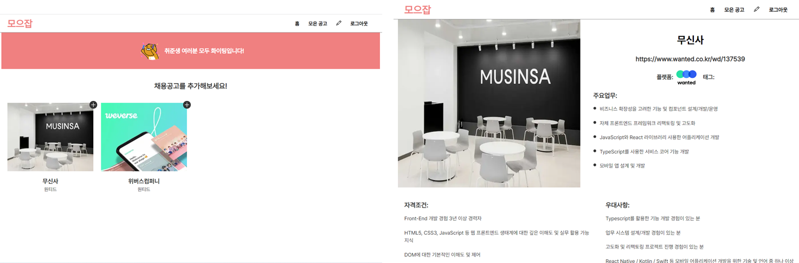
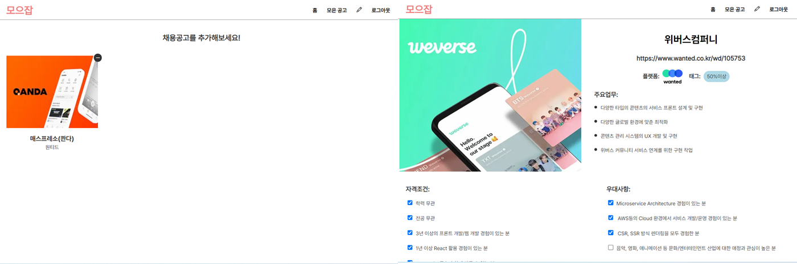
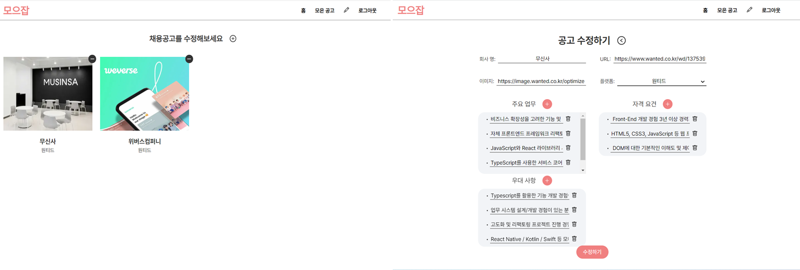
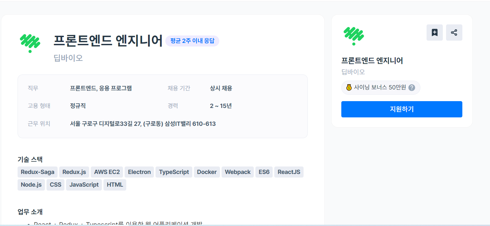
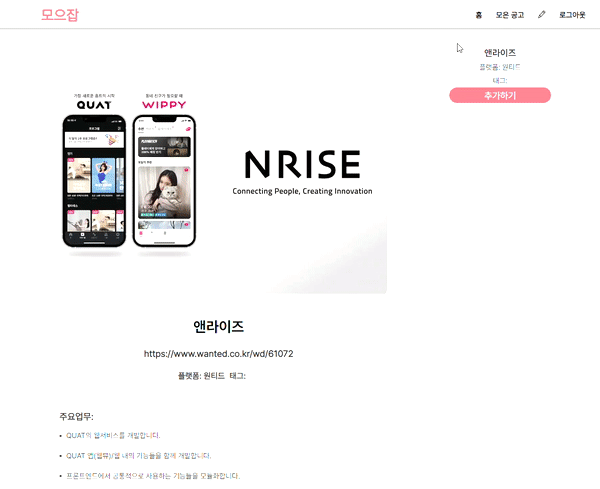
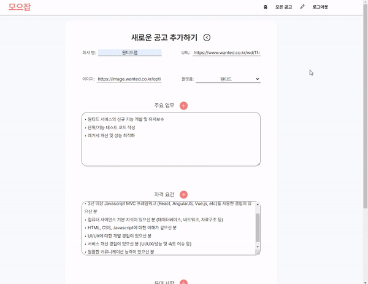

# 📋 기획 수정

기존의 모으잡으로 약 6명 정도 지인들에게 보여주고 피드백을 받았다. 피드백들 덕분에 보다 객관적으로 프로젝트를 볼 수 있었다.

먼저 `로그인을 해야 채용공고를 볼 수 있다`는 점이었다. 맨 처음 볼 수 있는 화면이 로그인 화면이었기 때문에 사용자 경험이 좋지 않다는 피드백을 들었고, 적극 공감했다. 내가 만든 서비스가 어떤 것인지도 모르는데 먼저 회원가입 하라는 것은 설득력이 전혀 없는 순서였다.

두 번째로는 UI적으로 너무 비어 보인다는 점이었다. 채용공고가 많으면 그나마 괜찮지만 메인 페이지가 너무 휑해 보인다는 점이었다. 이점도 공감했던 부분이었다. 채용 서비스들의 경우 다양한 이벤트들을 하고 있어서 `배너`로 보여 주지만 현재 나는 어떤 걸 먼저 띄워줘야 할 지 고민이 되는 상태다. 대신에 전체적인 UI를 좀 더 발전 시켜보려고 채용공고 사이트들의 예시들을 참조했다.

### ⛏ 서비스 work flow 수정하기

먼저 메인 페이지에서 채용공고들을 보여주기 위해서는 기존 데이터베이스와 사용자 별 권한을 정리할 필요가 있었다.

전체 공고는 메인 페이지에서 바로 볼 수 있어야 하므로 데이터베이스의 `jobs/`안의 객체로써 담겨있으면 좋겠다는 생각을 했다. 배열로 정리해도 되지만 디테일 페이지에서 상세 내용을 보여줘야 하므로, 전체 내용 중 원하는 상세 내용을 찾을 때 **배열보다 객체에서 찾는 것이 성능이 더 좋기 때문에** 객체로 저장하기로 했다. 전체 공고는 서비스를 사용하는 모든 사람이 볼 수 있어야 하지만 수정, 삭제, 추가는 인증된 사용자나 관리자 권한에서만 가능하게 구상했다.

로그인만 하면 모든 공고를 마음대로 할 수 있는 것이 걱정이 되기도 했지만, 서비스의 방향을, **서로 정리한 관심 있는 회사들의 채용공고 내용을 정리하고 공유할 수 있는 서비스로** 구상했으므로 인증된 사람들이 관리자 권한도 있게 하는 것이 좋아 보였다.

[권한 별 가능한 CRUD]

|                권한                 | 일반 사용자 |     인증된 사용자      |
| :---------------------------------: | :---------: | :--------------------: |
|        전체 공고 ( `jobs/`)         | GET만 가능  | GET, POST, DELETE, PUT |
| 유저별 공고 ( `Users/[user]/jobs` ) |   불가능    | GET, POST, DELETE, PUT |

전체공고와 유저별 공고에 따라 다른 API를 구현하려 했지만 서버 사이드에서 처리해서 받아오는 user를 먼저 받아올 수 있으므로 **user의 유무**로 각각을 구현할 수 있을 것 같다고 생각되었다. 그래서 기존 `DBService interface`를 수정한 후에 react query 커스텀 훅에 반영했다. 그리고 updateJob과 addJob의 함수가 똑같은 firebase의 set으로 만들기 때문에 둘을 하나의 함수로 합쳤다.

```typescript
// DBType.ts

export interface DBService {
  addOrUpdateJob: (job: Job, user?: User) => Promise<void>;
  getJobs: (user?: User) => Promise<Jobs>;
  removeJob: (job: Job, user?: User) => Promise<void>;
}

//DBService.ts

  async getJobs(user?: User): Promise<Jobs> {
    const dbRef = ref(this.db);
    const query = user ? `users/${user?.id}/` : '';
    return get(child(dbRef, `${query}jobs`))
      .then((snapshot) => {
        if (snapshot.exists()) {
          return snapshot.val();
        } else {
          return {};
        }
      })
      .catch((error) => {
        console.error(error);
      });
  }

  async addOrUpdateJob(job: Job, user?: User) {
    const query = user ? `users/${user?.id}/` : '';
    return set(ref(this.db, `${query}jobs/${job.id}`), job);
  }

  async removeJob(job: Job, user?: User) {
    const query = user ? `users/${user?.id}/` : '';
    return remove(ref(this.db, `${query}jobs/${job.id}`));
  }
}

```

```tsx
//useJobs.tsx

const JOBS_KEY = 'jobs';

export const useJobs = (user?: User) => {
  const dbService = useDBService();
  const queryClient = useQueryClient();
  const { query } = useRouter();
  const { id } = query;
  const jobId = typeof id === 'string' ? id : id?.join() || '';

  const getJobs = useQuery([JOBS_KEY, user], async () => {
    return dbService.getJobs(user);
  });
  const addOrUpdateJob = useMutation(
    async (job: Job) => {
      return dbService.addOrUpdateJob(job, user);
    },
    {
      onSuccess: () => {
        !user && queryClient.invalidateQueries([JOBS_KEY]);
        user && queryClient.invalidateQueries([JOBS_KEY, user]);
      },
    }
  );

  const deleteJob = useMutation(
    async (job: Job) => {
      return dbService.removeJob(job, user);
    },
    {
      onSuccess: () => {
        !user && queryClient.invalidateQueries([JOBS_KEY]);
        user && queryClient.invalidateQueries([JOBS_KEY, user]);
      },
      onError: (error) => {
        if (error instanceof AxiosError) {
          const { response } = error;
          if (response) {
            console.log(response);
          }
        }
      },
    }
  );

  const getFilteredJobs = useQuery(
    [JOBS_KEY, user],
    () => dbService.getJobs(user),
    {
      select: (data: Jobs) => {
        return Object.values(data).filter((item) => item.id !== id);
      },
      onError: (error) => {
        console.error(error);
      },
    }
  );

  const getJobById = useQuery([JOBS_KEY, user], () => dbService.getJobs(user), {
    select: (data: Jobs) => {
      return data[jobId];
    },
    onError: (error) => {
      console.error(error);
    },
  });

  return { getJobs, addOrUpdateJob, deleteJob, getJobById, getFilteredJobs };
};
```

useJobs에서는 user가 있을 경우 따로 받아 와야 하므로 react-query API의 key값으로 user를 포함 시켰다. 결과적으로 user의 유무로 처리하다 보니 기존의 user가 undefined일 때를 위해 따로 처리해주던 로직을 제외해 깔끔하게 나타낼 수 있었다.

권한에 따라 어떻게 데이터베이스를 처리할 지를 정하고 나서 `routing`에 대해서도 정리가 필요했다.

먼저 전체 공고의 CRUD는 `/` 와 `/admin` 두 가지 페이지로 나눴다. `/`에서는 전체 공고를 먼저 보여주고, 로그인한 유저는 공고를 추가할 수 있게 구상했다. `/admin`에서는 새로운 공고를 추가할 수 있고 전체 공고를 수정, 삭제할 수 있게 하려 했다.

유저 별 공고의 CRUD는 앞서 정리한 `/` 에서 추가 기능을 하기 때문에, `/user`에서는 모은 공고를 보여주고 공고를 수정, 삭제하는 기능을 처리할 수 있게 구상했다.

전체 공고와 유저 별 공고는 모두 동일한 JobSection 컴포넌트를 통해서 보여주고 있기 때문에 getServerSideProps로 전달된 user의 유무가 아니라 path가 `/user`인지 아닌 지를 기준으로 useJobs에 user를 전달해줘야 했다.

```tsx
// JobSection.tsx
export default function JobSection({
  session,
}: {
  session: Session | undefined;
}) {
  const { pathname } = useRouter();
  const isAdmin = pathname === '/admin';
  const title = getTitle(pathname);
  return (
    <Wrapper>
      <header>
        <Title>{title}</Title>
        {isAdmin && (
          <Btn href={'/admin/new'}>
            <AiOutlinePlusCircle />
          </Btn>
        )}
      </header>
      {/* <Filters /> */}
      <JobList session={session} />
    </Wrapper>
  );
}

// JobList.tsx

export default function JobList({ session }: { session: Session | undefined }) {
  const { pathname } = useRouter();
  const isUser = pathname === '/user' || pathname === '/user/[id]';
  const user = session?.user;
  const { getFilteredJobs } = useJobs(isUser ? user : undefined);
  const { isLoading, data: jobs } = getFilteredJobs;
    ...
  return (
    <Wrapper>
      {jobs && jobs.map((job) => <JobItem key={job.id} job={job} />)}
    </Wrapper>
  );
}
```

또한 JobItem은 일반 사용자는 추가, 삭제 버튼을 보여주지 않지만 로그인한 유저의 경우 `/`에서는 추가 버튼, `/user`와 `/admin` 에서는 삭제 버튼이 추가해야 했기 때문에 페이지 위치와 함께 로그인을 했는지 유무를 고려해서 UI로 나타내 주어야 했다. 로그인 유무는 getServersideProps로 전달받은 session을 전달해주기 보다 useSession hook을 이용해 CSR에서 받아와 확인했다.

- `/` 에서 일반 사용자: 버튼이 보이지 않음
- `/` 에서 로그인한 사용자: 추가 버튼이 보여
- `/user`와 `/admin`에서 로그인한 사용자: 이미 리다이렉션으로 로그인한 사용자는 확인이 가능하기 때문에 `/`페이지가 아니면 삭제 버튼이 보여

```tsx
export default function JobItem({ job }: { job: Job }) {
  const { name, platform, img, checkPercentage } = job;
  const { pathname, push } = useRouter();
  const isHome = pathname === '/';
  const [message, setMessage] = useState('');
  const { data: session } = useSession();
  const user = session?.user;
  const isLoggedin = !!session;
  const { addOrUpdateJob, deleteJob } = useJobs(user);
  const handleDelete = () => {
    deleteJob.mutate(job, {
      onSuccess: () => {
        setMessage('성공적으로 제거했습니다');
      },
      onSettled: () => {
        setTimeout(() => setMessage(''), 4000);
      },
    });
  };
  const handleAdd = () => {
    addOrUpdateJob.mutate(job, {
      onSuccess: () => {
        setMessage('성공적으로 추가했습니다');
      },
      onSettled: () => {
        setTimeout(() => setMessage(''), 4000);
      },
    });
  };

  const handleClick = () => {
    const link = redirectPath(pathname, job.id);
    push(link);
  };
  const over50Percent = checkPercentage >= 0.5;

  return (
    <>
      <Wrapper>
        {over50Percent && <Badge>50% 이상</Badge>}
        {!isHome && (
          <Btn onClick={handleDelete}>
            <MdRemove />
          </Btn>
        )}
        {isHome && isLoggedin && (
          <Btn onClick={handleAdd}>
            <AiOutlinePlus />
          </Btn>
        )}
        <ImgBox onClick={handleClick}>
          
        </ImgBox>
        <MetaBox>
          <h1>{name}</h1>
          <h3>{platform}</h3>
        </MetaBox>
      </Wrapper>
      {message && <Modal message={message} />}
    </>
  );
}
```

### ✒ 전체 공고를 추가,삭제할 수 있는 adminForm

기존의 크롤링 방식을 아예 제거하면서 새롭게 추가, 수정할 수 있는 form 페이지가 필요했다. form 페이지에는 기존 채용공고의 데이터 schema를 모두 작성할 수 있어야 했다. schema의 내용은 회사명, URL, 이미지, 플랫폼, 주요 업무, 자격 요건, 우대사항으로 수동으로 적어줘야 했다. 우선은 일일이 적는 방향으로 정했다. 이후에 새로운 추가하는 경우에는 input에서 textArea로 변경해 복사-붙여넣기가 좀 더 쉽게 될 수 있는 방향으로 고민하고 있다.

새로운 공고를 추가하는 페이지는 `/admin/new`로 수정할 때는 `/admin/[id]`로 수정이 될 수 있게 routing을 결정했다. AdminForm 컴포넌트 내에 함수들이 많아 커스텀 hook으로 분리했다. message 상태 같은 경우 mutate와 항상 같이 따라 다니기 때문에 여러 컴포넌트에 동일하게 나타나, 어떻게 하면 반복을 줄일 수 있을지 좀 더 고민이 필요하다.

```tsx
export default function AdminForm({ isNew, initialValue }: AdminFormProps) {
  const { job, onAdd, onChange, onDelete, onUpdateDescription } =
    useForm(initialValue);
  const [message, setMessage] = useState('');

  const DescriptionList: DescriptionListType[] = [
    {
      name: JOB_SCHEMA.MAIN_WORK,
      title: '주요 업무',
      value: job.mainWork,
    },
    {
      name: JOB_SCHEMA.QUALIFICATION,
      title: '자격 요건',
      value: job.qualification,
    },

    {
      name: JOB_SCHEMA.PREFERENTIAL,
      title: '우대 사항',
      value: job.preferential,
    },
  ];

  const title = isNew ? '새로운 공고 추가하기' : '공고 수정하기';
  const BtnText = isNew ? '추가하기' : '수정하기';

  const { addOrUpdateJob } = useJobs();
  const { mutate } = addOrUpdateJob;
  const handleSubmit = (e: React.FormEvent<HTMLFormElement>) => {
    e.preventDefault();
    const { dataset } = e.currentTarget;
    if (dataset.tag !== 'form') {
      return;
    }
    mutate(job, {
      onSuccess: () => {
        setMessage(
          isNew ? '성공적으로 추가되었습니다' : '성공적으로 수정되었습니다'
        );
      },
      onError: (error) => {
        if (error instanceof AxiosError) {
          const { response } = error;
          if (response) {
            setMessage(`${response.statusText} 에러가 발생했습니다`);
          }
        }
      },
      onSettled: () => {
        setTimeout(() => {
          setMessage('');
        }, 4000);
      },
    });
  };

  return (
    <Wrapper>
      ...
      <form data-tag='form' onSubmit={handleSubmit}>
        <AdminFormItem
          name={JOB_SCHEMA.NAME}
          title='회사 명'
          type='text'
          value={job.name}
          onChange={onChange}
        />
        <AdminFormItem
          name={JOB_SCHEMA.URL}
          title='URL'
          type='text'
          value={job.url}
          onChange={onChange}
        />
        <AdminFormItem
          name={JOB_SCHEMA.IMG}
          title='이미지'
          type='text'
          value={job.img}
          onChange={onChange}
        />
        <Select onChange={onChange} platform={job.platform} />
        {DescriptionList.map((item) => (
          <AdminDescriptionList
            name={item.name}
            title={item.title}
            value={item.value}
            onAdd={onAdd}
            onDelete={onDelete}
            onChange={onUpdateDescription}
          />
        ))}
        <Btn>{BtnText}</Btn>
      </form>
      {message && <Modal message={message} />}
    </Wrapper>
  );
}

//useForm.tsx

export const useForm = (initialValue: Job) => {
  const [job, setJob] = useState<Job>(initialValue);
  const onAdd = (name: DescriptionNameType) => {
    setJob((prev) => {
      const list = prev[name];
      const newItem: DescriptionType = { text: '', checked: false, id: uuid() };
      return { ...prev, [name]: [...list, newItem] };
    });
  };
  const onDelete = (name: DescriptionNameType, id: string) => {
    setJob((prev) => {
      const list = prev[name].filter((item) => item.id !== id);
      return { ...prev, [name]: list };
    });
  };
  const onChange = (
    e: React.ChangeEvent<HTMLInputElement | HTMLSelectElement>
  ) => {
    const { name, value } = e.currentTarget;
    setJob((prev) => ({ ...prev, [name]: value }));
  };

  const onUpdateDescription = (
    name: DescriptionNameType,
    value: string,
    id: string
  ) => {
    setJob((prev) => {
      const updated = prev[name].map((item) => {
        if (item.id === id) {
          return { ...item, text: value };
        }
        return item;
      });
      return { ...prev, [name]: updated };
    });
  };

  return { job, onAdd, onDelete, onChange, onUpdateDescription };
};
```

위와 같이 기획을 수정한 후에 홈페이지를 구성했을 때 다음과 같이 나타났다.

[홈페이지 ( `/`) , 전체 공고의 상세 페이지 (`/jobs/:id`) ]


[유저 별 페이지 ( `/user` ), 유저별 상세 페이지 (`/user/:id`) ]



[admin 페이지 ( `/admin` ), admin 상세 페이지 (`/admin/:id`) ]




## 🎨 디자인 수정

디자인에 대한 피드백을 받고 처음에는 잘 해뒀다고 생각했었는데 비어 보인다는 생각이 많이 들었다. 먼저 생각이 든 부분은 배경과 컨텐츠의 색이 똑같기 때문에 비어 보이는 게 크다는 생각이 들어서 컨텐츠와 배경 색을 구분하고 기존 메인 페이지부터 순서대로 손보기 시작했다.

### 메인 페이지

기존의 메인 페이지는 크롤링을 할 수 있는 form이 있어서 컨텐츠가 많이 없어도 괜찮았지만 form이 사라지고 난 뒤에는 허전함이 더 커 보였다. 그래서 우선은 필요 없는 배너는 없애고 각 jobItem의 크기를 키워서 보다 공고가 잘 보이게 수정했다. 여기서 홈페이지 디자인을 추가한다면 모든 공고로 페이지를 분리하고 메인 페이지에서 사용법에 대해서 나타내 주면 좀 더 좋지 않을까 생각도 들었다. 공고가 많아지면 페이지네이션이나 무한 스크롤을 추가해서 기능적인 보충도 필요할 것 같다.

[메인 페이지]


### 상세 페이지

기존 상세 페이지의 문제점은 사진과 채용공고의 주요업무를 한 줄에 나타내다 보니 사진의 크기나 주요 업무의 양에 따라 레이아웃에 문제가 생겼다. 이것을 해결하기 위해서 우선은 모두 세로로 레이아웃을 변경했고, 이미지 크기도 고정 시켜두었다. 이렇게 나타내면 가로로 너무 비게 되는 게 문제가 생겼는데, 이점은 프로그래머스와 원티드 페이지를 참고해 Sidebox 컴포넌트를 추가했다. Sidebox는 sticky를 이용해 사용자의 스크롤 위치와 상관없이 계속해서 보여 주면 좋을 것 같은 회사이름과 추가 버튼을 담았다.

[프로그래머스 채용공고 페이지]


[수정한 상세 페이지 ]


### AdminForm

AdminForm으로 몇 개의 채용공고를 직접 올리면서 현재 디자인은 공고의 내용을 담기에 가독성도 떨어지고 일일이 옮겨야 하는 불편함도 있었다. 이점을 해결하기 위해서 디자인을 상세 페이지 때와 같이 세로로 레이아웃을 바꾸고, 항목 하나하나를 담던 `<input/>`이 아니라 통으로 복사, 붙여넣기 할 수 있게 `<textarea/>`로 태그를 바꿔서 편의성을 높였다. 기존 input으로 타입과 모든 함수를 짜놨기 때문에 상태를 따로 추가해서 이후에 submit할 때 normalize시키는 방향으로 작업을 진행했다.

value값이 textArea는 string이고 기존 데이터는 배열이어서 type을 이용해 로직을 구분 시킬 수 있었다.

```tsx
// AdminDescriptionList.tsx
export default function AdminDescriptionList({
  name,
  title,
  value,
  onAdd,
  onDelete,
  onChange,
  onNewDescriptionChange,
}: AdminDescriptionListProps) {
  const isString = typeof value === 'string';
  return (
    <Wrapper>
      ...
      {isString && (
        <TextArea
          text={value}
          name={name}
          onChange={onNewDescriptionChange}
        ></TextArea>
      )}
      {!isString && (
        <ul>
          {value.map((item) => (
            <AdminDescriptionItem
              key={item.id}
              name={name}
              item={item}
              onChange={onChange}
              onDelete={onDelete}
            />
          ))}
        </ul>
      )}
    </Wrapper>
  );
}

// TextArea.tsx
export default function TextArea({ name, text, onChange }: TextAreaType) {
  const handleChange = (e: React.ChangeEvent<HTMLTextAreaElement>) => {
    const { value } = e.currentTarget;
    onChange(name, value);
  };
  return <Wrapper required value={text} onChange={handleChange}></Wrapper>;
}
```

크롤링으로 문자열을 처리할 때는 너무 많은 제약이 있었지만 직접 복사, 붙여 넣기를 한다고 했을 때는 해당 부분의 내용만 가져오면 되서, `•` 와 `-`를 제거해주고 띄어쓰기로 split만 하면 간단하게 데이터를 가공할 수 있었다. 이렇게 가공된 데이터를 기존 handleSubmit과 연결할 때, normalize한 데이터를 다시 setJob으로 업데이트 시키는 게 아니라 그대로 값을 사용해서 API를 호출했다. 이렇게 처리한 이유는 setState로 상태를 업데이트하고 mutate를 하면 동기적 코드지만 **setState가 비동기적으로 처리**될 수 있기 때문이었다.

```typescript
// normalizeDescription.ts

type RawDescriptionsType = {
  mainWork: string;
  qualification: string;
  preferential: string;
};

type NormalizedDescriptionsType = {
  mainWork: DescriptionType[];
  qualification: DescriptionType[];
  preferential: DescriptionType[];
  [index: string]: DescriptionType[];
};

export const normalizeDescriptions = (
  descriptions: RawDescriptionsType
): NormalizedDescriptionsType => {
  const result: NormalizedDescriptionsType = {
    mainWork: [],
    qualification: [],
    preferential: [],
  };
  const reg = /[•-]/gi;
  for (const [key, value] of Object.entries(descriptions)) {
    const text = value.replace(reg, '').trim();
    const items = text.split('\n');
    const normalizedItems = items.map((item) => {
      return { id: uuid(), text: item, checked: false };
    });
    result[key] = normalizedItems;
  }
  return result;
};


// AdminForm.tsx

 const handleSubmit = (e: React.FormEvent<HTMLFormElement>) => {
    e.preventDefault();
    const { dataset } = e.currentTarget;
    if (dataset.tag !== 'form') {
      return;
    }
    let targetJob = job;

    if (isNew) {
      const normalizedDescriptions = normalizeDescriptions(descriptions);
      targetJob = { ...job, ...normalizedDescriptions };
    }
    mutate(targetJob, {...})
  };
```

[수정한 전체공고 추가 페이지 (`/admin/new`)]

## 마치며

아직 하고 싶은 것도 부족한 것도 많은 프로젝트라 매번 새로운 시도들을 할 때 즐겁다. 물론 현실은 이력서를 쓰고 떨어지는 날들의 연속이지만 `무조건 개발자가 된다`는 생각으로 지금 내가 있는 자리에서 더 잘할 수 있는 방법들을 반영하다 보면 정말 원하는 회사에서 내가 원하는 서비스를 만들고 있지 않을까. 내일 나를 한번 더 믿어보겠다는 맘으로 개발을 즐기며 이 시간을 버텨나가려 한다.
