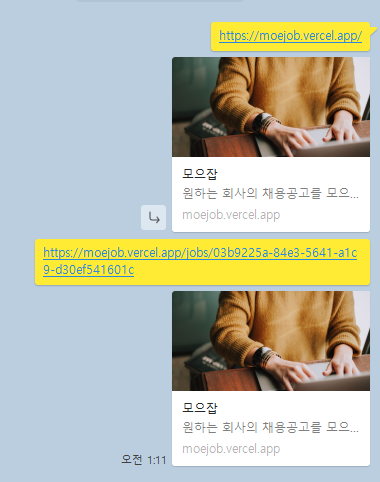

# 🕶서버사이드 랜더링을 이용한 성능 개선

모으잡 프로젝트 기획과 디자인을 수정하고 나서 그다음 작업으로 성능 개선을 목표로 잡았다. 다른 기능을 추가하기 보다 Next 자체를 좀 더 잘 쓰는 방법에 대해 고민했고 그 방법으로 **Next의 장점**을 살리려 고민했다. Next의 장점은 이미지 최적화나 코드 스플릿팅 등을 자동으로 지원해 주는 장점도 있지만 가장 큰 장점은 react에서 **서버 사이드 랜더링** 가능하다는 점이다. 서버 사이드 랜더링은 기존 SPA에서는 구현하기 힘든 <u>SEO 문제</u>를 쉽게 해결할 수 있고, 먼저 페이지를 보여 줌으로써 <u>사용자 경험을 향상</u>시킬 수 있다. 서버 사이드 렌더링을 적용해 해결해나간 과정을 정리해보려 한다.

## ⛳ 모으잡 SEO 최적화

**SEO** 는 Search Engine Optimization의 약자로 말 그대로 검색엔진 최적화를 의미한다. 검색엔진을 최적화 시킨다는 것은 구글이나 네이버와 같은 검색 사이트를 이용할 때 해당 키워드에 대해서 우선순위가 높게 나오게 만드는 것을 의미한다. 실제로 우리가 정보를 찾을 때 무조건 구글과 같은 검색 사이트를 통해 찾게 되는데 이러한 검색 사이트에서 높은 순위로 먼저 보인다는 것은 엄청난 마케팅 효과를 가진다.

그렇기 때문에 SEO는 서비스의 중요한 부분이 되었기 때문에 SEO 최적화는 중요한 성능 지표 중 하나가 되었다. SEO 최적화를 위해 먼저 검색엔진이 동작하는 방식을 정리해보자

1. 크롤링: 웹 크롤러가 사이트를 방문해 컨텐츠를 복사해서 검색엔진으로 가져온다.
2. 인덱싱: 가져온 컨텐츠를 주제 별로 색인해서 보관한다.
3. 랭킹: 검색 요청에 따라 색인된 컨텐츠에 순위를 부여해서 결과로 제공한다.


여기서 CSR이 SEO의 단점을 가지는 이유는 크롤링 과정에서 크롤러가 방문했을 때 비어있는 html문서만 복사하게 되기 때문이다. 이때 SSR을 통해 만들어진 페이지라면 먼저 컨텐츠가 있는 html을 크롤러가 복사해서 가져간다면 높은 순위로 보이게 된다.

CSR로 무조건 SEO 최적화를 못하는 것은 아니다. [원티드 프리온보딩 과제](https://choi2021.github.io/posts/%EC%9B%90%ED%8B%B0%EB%93%9C-%ED%94%84%EB%A6%AC%EC%98%A8%EB%B3%B4%EB%94%A9-2-1-%EA%B3%BC%EC%A0%9C-%ED%9A%8C%EA%B3%A0/)로 SNS의 공유시 이미지와 설명을 담을 수 있는 기능이 필요해 CSR로 `react-helmet`과 `react-snap`을 이용해 구현을 했었다. 하지만 오랜 시간 걸렸고 `react-snap`은 2년이나 업데이트가 되고 있지 않는 라이브러리라는 문제점도 있었다.

그렇기 때문에 이번에는 SSR를 이용해 모으잡 프로젝트에 SEO 최적화를 적용해보려 한다.

### 기존 상황

작업 전 상황은 일부 페이지에 간단한 title정보만 `<Head/>`태그 내에 작성되어 있는 상태였다. 개선하고 나서 비교를 위해 검색엔진 최적화 점수를 light house를 이용해 측정했을 때 아래와 같은 결과가 나타났다.

[수정 전 light house 검색엔진 점수]


### Next-seo 적용과 OG 문제점

개선을 위해서 `head`내용을 더 간편하게 사용할 수 있는 `Next-SEO`라이브러리를 이용해 meta태그와 SNS공유를 위한 Open Graph 내용을 추가했다. `Next-seo`는 `DefaultSeo`라는 컴포넌트가 있어 공통되는 부분을 한 곳에서 정의할 수 있다.

```tsx
// _app.tsx
const defaultSEO = {
  defaultTitle: "모으잡",
  titleTemplate: "%s | 모으잡", // %s로 페이지마다 title을 전달해줄 수 있어
  description: "원하는 회사의 채용공고를 모으고 비교해보자",
  canonical: "https://moejob.vercel.app/",
  keywords: ["moejob", "choi2021", "모으잡"],
  icon: "/favicon.ico",
  openGraph: {
    type: "website",
    locale: "ko_KR",
    url: "https://moejob.vercel.app",
    title: "모으잡",
    site_name: "모으잡",
    description: "원하는 회사의 채용공고를 모으고 비교해보자",
    images: [
      {
        url: "/banner.jpg",
        width: 285,
        height: 167,
        alt: "이미지",
      },
    ],
  },
}

function MyApp({ Component, pageProps }: AppProps) {
  const [queryClient] = useState(() => new QueryClient())
  const dbService = new DBServiceImpl(firebaseApp)
  return (
    <>
      <DefaultSeo {...defaultSEO} />
      ...
    </>
  )
}
export default MyApp
```

각 페이지마다 내용을 `NextSeo`컴포넌트의 props로 전달해 성능을 다시 검사했을 때 간단하게 SEO 최적화를 할 수 있었다.

```tsx
// pages/login.tsx
const Login = (...
) => {
  return (
    <>
      <NextSeo
        title="로그인"
        description="원하는 회사의 채용공고를 모으고 비교해보자"
        openGraph={{
          type: 'website',
          url: `${process.env.NEXT_PUBLIC_BASE_URL}/login`,
          title: '로그인 | 모으잡',
          description: '원하는 회사의 채용공고를 모으고 비교해보자',
        }}
      />
     ...
    </>
  );
};

// pages/jobs/[id]
function Index() {
    ...
  return (
    <>
      <NextSeo
        title={job?.name}
        openGraph={{
          title: `${job?.name}`,
          url: `${process.env.NEXT_PUBLIC_BASE_URL}/jobs/${job?.id}`,
          images: [
            {
              url: job?.img || '',
              width: 285,
              height: 167,
              alt: '상세 이미지',
            },
          ],
        }}
      />
    	...
    </>
  );
}

export default Index;
```

[Next-seo를 적용하고 검색엔진 최적화 점수]


하지만 SNS로 공유했을 때 상세 페이지에서도 `Default SEO`에 설정했던 이미지와 description이 공유되는 문제가 있었다. 카카오 톡, 페이스북, 슬랙 모두 기본 내용이 전달되는 것을 확인했고, 개발자 도구로 브라우저 상의 head를 보았을 때는 문제가 없었다.

[상세페이지에서도 나오는 default 이미지와 description]

문제를 해결하기 위해 고민을 하다가 상세 페이지에 전달되는 `job` 을 `<u>CSR에서 불러와</u>` 내용이 전달이 되지 않은 것 같다고 생각이 들었다. 그래서 서버 사이드로 내용을 prefetching을 해서 전달해주면 바로 header에 전달해 줄 수 있겠다고 예상했다.

### SSR을 이용한 data fetching

data fetching은 처음 프로젝트를 기획부터 고민했던 부분이었다. 서버에서 데이터를 받아오기 때문에 별도의 loading없이 보여줄 수 있지만 당장 필요한 부분일까 고민이 되어서 미뤄뒀었다. 이번 기회에 next의 data fetching에 대해 공부하고 적용할 수 있었다.

Next에서 data fetching은 SSG, SSR, CSR 다 지원한다. 이중에서 기존에 사용하고 있던 방식은 CSR이었고, 프로젝트에 필요한 방식은 SSR이라고 생각되었다. SSG를 next에서 먼저 추천해 주기도 하고 이미 빌드에서 만든 페이지를 응답하기 때문에 더 빠른 페이지 로딩 속도를 가지지만, 모으잡 프로젝트 특성 상 계속해서 채용공고 데이터를 추가, 삭제, 수정하기 때문에 **SSR**을 적용하는 게 알맞은 선택이라 생각했다.

SSR을 적용하기 위해서는 react-query에서 SSR을 적용하는 방법을 공부해야 했다. React query는 두 가지 방법을 지원한다.

- initialState
- hydration

**initialState**는 SSR에서 getServersideprops로 데이터를 불러온 후에 직접 props로 전달하기 때문에 보다 직관적이고 추가적인 코드 량이 적었다. 하지만 `useQuery`자체가 깊은 자식이 이용 시 inital data 자체를 전달해야 하기 때문에 prop-driliing이 생기고, 여러 곳에서 `useQuery`를 사용해야 할 경우에도 다 전달해줘야 하는 단점이 있었다.

```tsx
// react-query 공식홈페이지 예시

export async function getStaticProps() {
  const posts = await getPosts()
  return { props: { posts } }
}

function Posts(props) {
  const { data } = useQuery({
    queryKey: ["posts"],
    queryFn: getPosts,
    initialData: props.posts,
  })

  // ...
}
```

그래서 확장성과 유지보수를 고려했을 때 내가 선택한 방식은 두 번째 **Hydration** 방식이었다. prefetch한 데이터를 전달해줘 마크 업을 한 후에 hydrate(수분공급, 이벤트를 연결하는 과정)하는 것을 의미한다. 이것을 하기 위해서는 앞선 initialData보다는 조금 더 복잡한 별도의 세팅이 필요하다.

```tsx
// react-query 공식홈페이지 예시

// _app.jsx
import {
  Hydrate,
  QueryClient,
  QueryClientProvider,
} from "@tanstack/react-query"

export default function MyApp({ Component, pageProps }) {
  const [queryClient] = React.useState(() => new QueryClient())

  return (
    <QueryClientProvider client={queryClient}>
      <Hydrate state={pageProps.dehydratedState}>
        <Component {...pageProps} />
      </Hydrate>
    </QueryClientProvider>
  )
}

// pages/posts.jsx
import { dehydrate, QueryClient, useQuery } from "@tanstack/react-query"

export async function getStaticProps() {
  const queryClient = new QueryClient()

  await queryClient.prefetchQuery(["posts"], getPosts)

  return {
    props: {
      dehydratedState: dehydrate(queryClient),
    },
  }
}
```

위의 예시를 참고해서 `_app.tsx` 적용했을 때 아래 코드와 같이 된다.

```tsx
// _app.tsx
function MyApp({ Component, pageProps }: AppProps) {
  const [queryClient] = useState(
    () =>
      new QueryClient({
        defaultOptions: {
          queries: {
            staleTime: 1000 * 60,
          },
        },
      })
  );
	...
  return (
    <>
      <DefaultSeo {...defaultSEO} />
      <QueryClientProvider client={queryClient}>
        ...
           <Hydrate state={pageProps.dehydratedState}>
             <Component {...pageProps} />
           </Hydrate>
         ...
        <ReactQueryDevtools initialIsOpen={false} />
      </QueryClientProvider>
    </>
  );
}
export default MyApp;


```

`_app.tsx`는 추가하기만 하면 되었지만, 페이지에서 직접 datafetching을 적용하면서 문제가 생겼다. 우선은 데이터를 받아올 때 기존의 경우는 `jobList`컴포넌튼 내부에서 session을 전달받아 데이터를 불러오고 있었다. 페이지에서 data-fetching을 한다면 컴포넌트는 data-fetching에 대해서는 모르고 **주입받은 데이터를 보여주기 만** 하게 할 수 있지 않을까 생각되어 수정했다.

```tsx
// 기존 Joblist 컴포넌트
export default function JobList({ session }: { session: Session | undefined }) {
  const { pathname } = useRouter()
  const isUser = pathname === "/user" || pathname === "/user/[id]"
  const user = session?.user
  const { getFilteredJobs } = useJobs(isUser ? user : undefined)
  const { isLoading, data: jobs } = getFilteredJobs
  const vacantJobs = jobs?.length === 0
  if (isLoading) {
    return <GuideBox>채용공고를 불러오는 중입니다...</GuideBox>
  }
  if (vacantJobs) {
    return <GuideBox>채용공고가 비어있습니다😉</GuideBox>
  }

  return (
    <Wrapper>
      {jobs && jobs.map(job => <JobItem key={job.id} job={job} />)}
    </Wrapper>
  )
}

// 수정한 Joblist 컴포넌트

export default function JobList({ jobs }: JobListProps) {
  const vacantJobs = jobs?.length === 0 || !jobs
  if (vacantJobs) {
    return <GuideBox>채용공고가 비어있습니다😉</GuideBox>
  }

  return (
    <Wrapper>
      {!vacantJobs && jobs.map(job => <JobItem key={job.id} job={job} />)}
    </Wrapper>
  )
}
```

최대한 컴포넌트는 로직에 대해서 모르게 하고 페이지에서 필요한 데이터를 넘겨주는 방식으로 수정해, 훨씬 의존성을 낮출 수 있었다.

```tsx
// pages/index.tsx

function Home() {
  const { getJobs } = useJobs()
  const { data } = getJobs
  return (
    <MainLayout>
      <JobSection jobs={data} />
    </MainLayout>
  )
}

export default Home

export const getServerSideProps = async () => {
  const queryClient = new QueryClient()
  const dbService = new DBServiceImpl(firebaseApp)
  await queryClient.prefetchQuery<Jobs, AxiosError, Jobs, [string, string]>(
    [JOBS_KEY, "all"],
    () => dbService.getJobs()
  )

  return {
    props: { dehydratedState: dehydrate(queryClient) },
  }
}

// pages/jobs/[id].tsx

function Index() {
  const { getFilteredJobs, getJobById } = useJobs()
  const { data: job } = getJobById
  const { data: allJobs } = getFilteredJobs

  return (
    <>
      ...
      <MainLayout>
        {!job && <NotFound />}
        {job && (
          <>
            <DetailJob job={job} />
            <JobSection jobs={allJobs} />
          </>
        )}
      </MainLayout>
    </>
  )
}

export default Index

export const getServerSideProps = async (context: NextPageContext) => {
  const query = context.query
  const id = query.id?.toString()
  const queryClient = new QueryClient()
  const dbService = new DBServiceImpl(firebaseApp)
  if (!id) {
    return {
      redirect: {
        destination: "/",
      },
    }
  }

  await queryClient.prefetchQuery<Jobs, AxiosError, Jobs, [string, string]>(
    [JOBS_KEY, "all"],
    () => dbService.getJobs()
  )

  return {
    props: { dehydratedState: dehydrate(queryClient) },
  }
}
```

이렇게 서버 사이드 렌더링 data-fetching으로 수정하고 다시 확인했을 때 정상적으로 카카오 톡, 페이스북, slack 모두 잘 나오는 것을 볼 수 있었다.


google 자체에도 등록하기 위해 [Google Search Console](https://search.google.com/search-console/about) 에 사이트를 등록하고 확인했을 때 아직은 실제로 검색이 되지 않는다. 시간이 걸리는 부분이라 계속해서 확인을 해볼 예정이다.

## 🙄 SSR로 진짜 성능이 개선되었을까?

SSR을 이용해 data-fetching으로 수정을 하고 나서 코드 적으로 더 가독성이 높아지고, 로딩 창을 보여주지 않고 한번에 화면이 보여 더 UX가 체감 상 좋아졌다. 하지만 정말 좋아졌는지 확인하기 위해서 google의 [page speed insights](https://pagespeed.web.dev/)을 이용해 측정해 보기로 했다. 기존과 비교하기 위해서 EC2로 배포되어있는 CSR을 이용하는 배포 버전과 vercel로 SSR이 적용되어있는 버전의 성능을 측정했다.

측정을 하고 분석하는데 필요한 6가지 요소에 대해서 정리하고 요소들을 분석해보았다.

### FCP

FCP는 First Contentful Paint로 페이지가 로드되고 페이지 콘텐츠 일부가 화면에 렌더링 될 때 까지의 시간을 측정한다.

### TTI

TTI는 사용자와 상호작용하기 위해 준비된 시점으로, 이벤트 헨들러가 작동할 수 있는 시점을 의미한다.

### Speed Index

Speed index는 컨텐츠가 시각적으로 표시되는 진행속도를 의미한다.

### LCP

LCP는 Largest Contentful Paint로 로딩 성능을 측정하는 지표로 처음 로드를 시작하고 ViewPort 내에서 가장 큰 이미지나 텍스트 블럭의 렌더링 시간을 측정한다.

### FID와 TBT

FID는 First Input Delay로 상호작용을 측정하는 지표로 사용자의 처음 상호작용부터 이벤트 핸들러가 처리를 시작하기까지 시간을 측정한다.

검사에 사용한 page speed insights은 FID 대신에 **TBT**(Time Blocking Time)를 측정했다. TBT는 FCP부터 TTI 까지의 시간을 측정해 사용자 입력에 페이지가 응답하지 못하게 차단된 시간을 의미한다.

### CLS

CLS는 Cumulative Layout Shift로 사용자가 예상하지 못한 레이아웃 이동을 경험하는 것에 대한 지표다.

[왼쪽은 CSR로 측정한 성능, 오른쪽은 SSR로 측정한 성능]


각 지표들 중에서 크게 차이가 난 부분은 `TTI`와 `LCP`로 TTI는 이전보다 증가했고 LCP는 83% 감소한 결과를 보여주었다. 이전에는 가장 큰 컨텐츠인 이미지가 로딩 이후에 보여주었지만, 서버에서 데이터를 받아서 먼저 렌더링을 한 후에 이벤트를 붙여 주는 hydration 과정이 일어나기 때문에 TTI는 증가하고 LCP는 감소한 결과를 보여주었다.

결과적으로는 전보다 개선이 된 결과를 얻을 수 있었다. 여기서 더 개선을 한다면 이미지 자체를 react-query를 통해 어떻게 캐싱을 해 렌더링 횟수를 관리할 지가 된다고 생각한다. 단순히 느낌적으로 좋아졌다고 생각하는 데서 그치지 않고 직접 측정함으로써 객관적인 데이터를 얻을 수 있는 좋은 경험이 되었다.

[참조]

- SEO (검색엔진최적화) 완벽 가이드 총정리 (2022년): https://www.ascentkorea.com/seo-complete-guide-2022/
- webvitals: https://web.dev/vitals/
