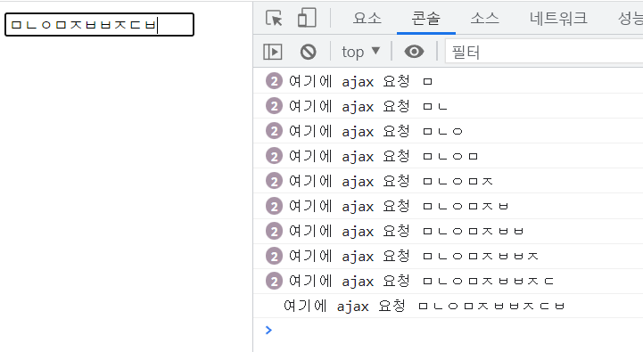
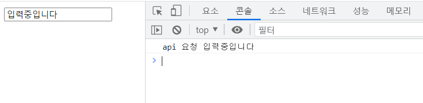

# 🧨 이벤트

이벤트는 말 그대로 `사건`을 의미한다. 언제 어떤 순서로 발생할 지 모르기 때문에 **이벤트를 감지**할 수 있어야 하고, 감지하고 나서 **어떻게 처리 할지**에 대해 정해야 한다. 우리가 사용할 때 브라우저에게 이벤트 핸들러를 등록함으로써 이벤트를 위임해 브라우저가 이벤트를 감지하면 해당 핸들러에 등록한 함수를 실행함으로써 이벤트를 처리할 수 있다. 적절한 이벤트로 더 다양한 기능을 구현하기 위해 이벤트에 대해 정리해 보고자 한다.

## 🙂 이벤트 타입

이벤트는 사용자와 다양한 interaction이 가능하기 때문에 풍부한 사용자 경험을 만들어 줄 수 있다. 하지만 제대로 이해하지 않고 사용한다면 너무 많은 이벤트로 성능을 떨어뜨리거나, 원하지 않은 곳에 이벤트가 발생하기도 한다. 그래서 이벤트 자체에 대해서도 이해가 필요하다.

예를 들어 같은 마우스 이벤트더라도 `mouseenter`와 `mousemove`는 해당 요소에 마우스가 들어갔을 때와 움직일 때로 동작을 보면 크게 다르지 않아 보이지만, 만약 api fetching하는 함수가 등록되어 있다면 `mouseenter` 의 경우 엄청나게 많은 비용이 들게 된다. 그렇기 때문에 목적에 맞게 이벤트와 연결하는 것이 너무나 중요하다.

```html
<!DOCTYPE html>
<html lang="en">
  <head>
    <meta charset="UTF-8" />
    <meta http-equiv="X-UA-Compatible" content="IE=edge" />
    <meta name="viewport" content="width=device-width, initial-scale=1.0" />
    <title>Document</title>
  </head>
  <body>
    <button>sensor</button>

    <script>
      const btn = document.querySelector("button")
      // btn.addEventListener('mousemove', () => {
      //   console.log('move');
      //   console.log('data fetching'); // 센서 안에서 마우스가 움직일 때마다 호출
      // });
      btn.addEventListener("mouseenter", () => {
        console.log("enter")
        console.log("data fetching") // 센서로 마우스가 들어갈 때마다 호출
      })
    </script>
  </body>
</html>
```

적절한 이벤트를 붙여줘서 해결할 수도 있지만 `무한 스크롤`과 스크롤 이벤트에 api 호출을 연결해야 하는 경우도 있다. 이럴 때는 Throttle과 Debounce 두 가지 방법을 이용해 이벤트를 제어할 수 있다.

### Debouncing

디바운싱은 연속적으로 호출되는 이벤트 핸들러 중에서 처음 또는 마지막에 호출되는 함수만 호출되는 것을 의미한다.

예를 들어 검색 창에 사용자가 입력한 결과에 따라 api를 호출해 결과를 받아온다면 input의 `onchange`로 그냥 호출하게 되면 사용자가 입력하는 한 글자, 한 글자 모두에 api 호출이 되기 때문에 불필요한 비용이 발생한다.

```html
<body>
  <input id="input" />
  <script>
    document.querySelector("#input").addEventListener("input", function (e) {
      console.log("여기에 ajax 요청", e.target.value)
    })
  </script>
</body>
```



이것을 막기 위해서 디바운싱을 이용해 입력하는 중에 200ms동안 입력이 없다면 입력이 끝났다고 간주하고 api를 호출하게 한다면, api 호출 비용을 아낄 수 있다. 이벤트 핸들러는 입력이 될 때마다 timer에 함수가 있는지 체크하고, 있다면 초기화 시켜 새롭게 입력한다. 200ms 동안 입력이 없다면 timer의 callback 함수가 실행된다.

```html
<html lang="en">
  <body>
    <input id="input" />
    <script>
      let timer
      document.querySelector("#input").addEventListener("input", function (e) {
        if (timer) {
          clearTimeout(timer)
        }

        timer = setTimeout(function () {
          console.log("api 요청", e.target.value)
        }, 200)
      })
    </script>
  </body>
</html>
```



### Throttling

Throttling은 일정 시간 동안 발생할 수 있는 실행 횟수에 제한을 거는 방식이다. 앞서 언급했던 무한 스크롤과 같이 스크롤 이벤트로 api를 호출해야 한다면 계속해서 내릴 때마다 서버로부터 데이터를 받아 와야 한다. 이때 Throttling을 이용한다면 일정 시간 당 한번만 api가 호출되기 때문에 성능을 개선할 수 있다.

```html
<!DOCTYPE html>
<html lang="en">
  <body style="height: 150vh">
    <script>
      let waiting = false
      document.querySelector("body").addEventListener("wheel", function (e) {
        if (!waiting) {
          console.log("API 호출")
          waiting = true
          setTimeout(() => {
            waiting = false
          }, 200)
        }
      })
    </script>
  </body>
</html>
```

## 📍 이벤트 핸들러 등록과 제거

이벤트 핸들러는 브라우저가 이벤트가 발생했을 때 호출하기 위해 등록해놓은 함수다. 이벤트 핸들러를 등록하는 방법에는 3가지가 존재한다.

### 1. 이벤트 핸들러 attribute

Attribute의 경우 on접두사에 이벤트 타입을 붙여서 등록하는 방식으로 리액트에서 주로 사용한 방법이다. html에서 할당할 때는 함수를 직접 전달해 줄 수 없기 때문에 문자열로 연결하는데 암묵적으로 attribute값을 이벤트 핸들러의 함수 몸체로 파싱해서 할당해준다. vanilla JS에서 프로젝트를 진행한다면 javascript에서 이벤트를 처리하는 게 더 적절하지만 리액트에서는 jsx문법으로 javascript로 html을 만들기 때문에 attribute로 전달해 준다.

```html
<!DOCTYPE html>
<html lang="en">
  <head>
    <meta charset="UTF-8" />
    <meta http-equiv="X-UA-Compatible" content="IE=edge" />
    <meta name="viewport" content="width=device-width, initial-scale=1.0" />
    <title>Document</title>
  </head>
  <body>
    <button onclick="sayhi()">sensor</button>

    <script>
      function sayhi() {
        console.log("hi")
      }
    </script>
  </body>
</html>
```

```javascript
function onclick(event) {
  sayhi() // 할당된 함수
}
```

### 2. 이벤트 핸들러 속성

DOM 노드에는 이벤트 핸들러 속성을 가지고 있다. 앞서 정리한 attribute처럼 on접두사에 이벤트 타입을 붙인 후에 함수를 바인딩 해 이벤트 핸들러를 등록할 수 있다. 이때 속성으로 등록한 이벤트 핸들러는 하나만 등록될 수 있다.

```html
<!DOCTYPE html>
<html lang="en">
  <head>
    <meta charset="UTF-8" />
    <meta http-equiv="X-UA-Compatible" content="IE=edge" />
    <meta name="viewport" content="width=device-width, initial-scale=1.0" />
    <title>Document</title>
  </head>
  <body>
    <button>sensor</button>

    <script>
      const btn = document.querySelector("button")
      btn.onclick = function () {
        console.log("클릭") // 없어져
      }
      btn.onclick = function () {
        console.log("클릭2") // 재할당되어 실행
      }
      btn.onclick = null
    </script>
  </body>
</html>
```

DOM element의 속성이기 때문에 없앨 때는 간단하게 `btn.onclick=null`로 해당 속성을 없애 줄 수 있다.

### 3. addEventListener

addEventListner 메소드는 첫 번째 인자로 이벤트 타입, 두 번째 인자로 이벤트 핸들러, 세 번째 인자로 캡처링단계에서 이벤트를 캐치할 지를 정할 수 있다. 이벤트 핸들러 속성과는 달리 여러 개의 이벤트 핸들러를 연결할 수 있고 순서대로 호출된다.

```html
<!DOCTYPE html>
<html lang="en">
  <head>
    <meta charset="UTF-8" />
    <meta http-equiv="X-UA-Compatible" content="IE=edge" />
    <meta name="viewport" content="width=device-width, initial-scale=1.0" />
    <title>Document</title>
  </head>
  <body>
    <button>sensor</button>

    <script>
      const btn = document.querySelector("button")
      const click = () => {
        console.log("클릭")
      }
      btn.addEventListener("click", click)
      btn.addEventListener("click", () => {
        console.log("클릭2")
      })
      btn.removeEventListner("click", click)
    </script>
  </body>
</html>
```

삭제할 때는 `removeEventListner`를 이용하면 되는데 이때 `addEventListenr`에 등록한 함수와 동일한 함수를 참조하게 해야 한다.

## ✨ 이벤트의 흐름

DOM 요소에 이벤트가 발생하면 DOM 트리를 따라 연쇄적인 반응이 일어나는데 이것을 `event propagation`이라 하고 window에서 event target으로 전파되는 것을 `event capturing`이라 부르고 event target에서 window로 전파되는 것을 `event bubbling`이라고 부른다. 항상 이벤트가 발생했을 때 별도의 처리가 없다면 캡처링과 버블링이 순차적으로 발생한다.


`addEventListener`에서 세번째 인자를 true로 하게 되면 **캡처링**에서 event를 캐치할 수 있고, false거나 생략시에는 **타겟 단계와 버블링**에서 event를 캐치할 수 있다.

```html
<!DOCTYPE html>
<html lang="en">
  <body>
    <p>버블링과 캡처링<button>버튼</button></p>
    <script>
      document.body.addEventListener("click", () => {
        console.log("body")
      })
      document.querySelector("p").addEventListener(
        "click",
        () => {
          console.log("pagragraph")
        },
        true
      )
      document.querySelector("button").addEventListener("click", () => {
        console.log("button")
      })
    </script>
  </body>
</html>

// 결과: // paragraph // button // body
```

위 코드를 보면 두 번째 이벤트 핸들러의 세번째 인자가 true여서 캡처링 과정에서 이벤트를 캐치하고, 나머지는 타겟이나 버블링 과정에서 이벤트를 캐치하는 상황이다. 그렇기 때문에 캡처링에서 이벤트를 캐치하는 `paragraph`가 먼저 호출되고 두 번째로 타겟 단계인 `button`, 마지막으로 버블링 과정에서 `body`가 호출되는 순서로 나타난다.

캡처링, 타겟, 버블링의 이벤트 흐름을 이해하면서 이벤트가 상위 DOM요소에서 캐치될 수 있다는 것을 알 수 있다. 이점을 활용하여 일일이 모든 자식에게 이벤트핸들러를 연결하는 것이 아니라 부모요소에 이벤트 핸들러를 연결하는 `이벤트 위임`에 대해 알아보자.

## 이벤트 위임

```html
<!DOCTYPE html>
<html lang="en">
  <head>
    <style>
      #fruits {
        display: flex;
        list-style-type: none;
        padding: 0;
      }
      #fruits li {
        width: 100px;
        cursor: pointer;
      }
      #fruits .active {
        color: red;
        text-decoration: underline;
      }
    </style>
  </head>
  <body>
    <nav>
      <ul id="fruits">
        <li id="apple" class="active">Apple</li>
        <li id="banana">banana</li>
        <li id="orange">orange</li>
      </ul>
    </nav>
    <div>선택된 아이템: <em class="msg">apple</em></div>
    <script>
      const $fruits = document.getElementById("fruits")
      const $msg = document.querySelector(".msg")

      function activate({ target }) {
        ;[...$fruits.children].forEach($fruit => {
          $fruit.classList.toggle("active", $fruit === target)
          $msg.textContent = target.id
        })
      }

      document.getElementById("apple").onclick = activate
      document.getElementById("banana").onclick = activate
      document.getElementById("orange").onclick = activate
    </script>
  </body>
</html>
```

위 코드를 보면 activate라는 함수를 `li`태그마다 이벤트 핸들러로 연결해주고 있다. 하지만 요소가 동적으로 정해지거나 여러 개가 된다면 일일이 자식 요소에 이벤트 핸들러를 붙여 주는 것은 비효율적이다. 이를 해결하기 위해서 부모인 `ul`에 이벤트 핸들러를 등록해 해결할 수 있다.

```html
<!DOCTYPE html>
<html lang="en">
  <head>
    <style>
      #fruits {
        display: flex;
        list-style-type: none;
        padding: 0;
      }
      #fruits li {
        width: 100px;
        cursor: pointer;
      }
      #fruits .active {
        color: red;
        text-decoration: underline;
      }
    </style>
  </head>
  <body>
    <nav>
      <ul id="fruits">
        <li id="apple" class="active">Apple</li>
        <li id="banana">banana</li>
        <li id="orange">orange</li>
      </ul>
    </nav>
    <div>선택된 아이템: <em class="msg">apple</em></div>
    <script>
      const $fruits = document.getElementById("fruits")
      const $msg = document.querySelector(".msg")

      function activate({ target }) {
        if (!target.matches("#fruits > li")) return

        ;[...$fruits.children].forEach($fruit => {
          $fruit.classList.toggle("active", $fruit === target)
          $msg.textContent = target.id
        })
      }
      $fruits.onclick = activate
    </script>
  </body>
</html>
```

위코드에서는 activate가 `ul`에만 등록이 되었다. 상위 DOM요소에서 자식 요소의 event를 처리하기 위해서는 해당 이벤트가 자식에서 발생한 이벤트가 맞는지 우선 체크해야 하기 때문에 ` if (!target.matches('#fruits > li')) return;`로 먼저 확인하고 각 자식 요소에 처리해 줄 수 있다. 버블링을 이용한 이벤트 위임을 이용하면 코드 중복을 줄일 수 있다.

## 🙅‍♂️ 이벤트 멈춰 PreventDefault()와 StopPropagation()

`preventDefault()`는 이벤트의 메소드로 DOM요소의 기본 동작을 막는 역할을 한다. 주로 form으로 POST요청을 보낼 때 새로 고침이 일어나게 되는데, SPA에서는 새로고침을 할 필요가 없기 때문에 이러한 기본 동작을 막기 위해 `preventDefault()`를 사용한다.

```html
<!DOCTYPE html>
<html lang="en">
  <body>
    <a href="https://google.com">go</a>
    <input type="checkbox" />
    <form><button>제출</button></form>
    <script>
      document.querySelector("a").onclick = e => {
        e.preventDefault()
      }
      document.querySelector("input[type=checkbox]").onclick = e => {
        e.preventDefault()
      }
      document.querySelector("form").onsubmit = e => {
        e.preventDefault()
      }
    </script>
  </body>
</html>
```

위 코드에서 a태그의 기본 동작인 페이지 이동을 막고, checkbox input의 기본 동작인 체크,해제를 막는다.

`stopPropagation`은 이벤트 전파를 중지 시키는 방법으로 해당 이벤트를 부모 요소로 버블링 되지 않게 막는다. 타겟 과정에서만 이벤트를 캐치하고 싶을 때 사용할 수 있지만 이벤트 흐름을 막는 것이기 때문에 예상치 못한 에러가 발생할 수 있어 조심해서 사용해야 한다.

```html
<!DOCTYPE html>
<html lang="en">
  <body>
    <div class="container">
      <button class="btn1">button1</button>
      <button class="btn2">btn2</button>
      <button class="btn3">btn3</button>
    </div>
    <script>
      document.querySelector(".container").onclick = ({ target }) => {
        if (!target.matches(".container>button")) return
        target.style.color = "red"
      }

      document.querySelector(".btn2").onclick = e => {
        e.stopPropagation()
        e.target.style.color = "blue"
      }
    </script>
  </body>
</html>
```

위 코드를 보면 btn1,2,3 모두 클릭 시 글자색이 빨간색으로 변해야 하지만 btn2의 `stopPropagation()`으로 btn2의 이벤트는 부모로 버블링되지 않아 위임이 되지 않고 파란색으로 처리되는 것을 볼 수 있다.

## 💡 Event 핸들러의 this

이벤트 핸들러 속성으로 전달되거나 `addEventListener()`로 등록된 함수 선언식의 this는 이벤트를 바인딩한 요소, `event.currentTarget`와 같다.

```html
<!DOCTYPE html>
<html lang="en">
  <body>
    <button>click me</button>
    <script>
      const btn = document.querySelector("button")
      const handleClick = e => {
        console.log(e.currentTarget) // <button>click me</button>
        console.log(this) // <button>click me</button>
        console.log(this === e.currentTarget) // true
      }
      btn.onclick = handleClick

      btn.addEventListener("click", handleClick)
    </script>
  </body>
</html>
```

하지만 함수 선언식이 아닌 화살표 함수의 this는 화살표 함수 자체적으로 this를 가질 수 없기 때문에 상위스코프의 this를 참조한다.

```html
<!DOCTYPE html>
<html lang="en">
  <body>
    <button>click me</button>
    <script>
      const btn = document.querySelector("button")
      const handleClick = e => {
        console.log(e.currentTarget) // <button>click me</button>
        console.log(this) // Window
        console.log(this === e.currentTarget) // false
      }
      btn.onclick = handleClick
      btn.addEventListener("click", handleClick)
    </script>
  </body>
</html>
```

이러한 차이는 클래스의 이벤트 핸들러에서 this를 바인딩을 할 때 주의해야 할 점이다.

```html
<!DOCTYPE html>
<html lang="en">
  <body>
    <button class="btn">0</button>
    <script>
      class App {
        constructor() {
          this.$btn = document.querySelector(".btn")
          this.count = 0
          // this.$btn.onclick = this.increase.bind(this);
          this.$btn.onclick = this.increase
        }
        increase() {
          console.log(this) // <button class="btn">0</button>
          this.$btn.textContent = ++this.count // Uncaught TypeError: Cannot set properties of undefined (setting 'textContent')
        }
      }
      new App()
    </script>
  </body>
</html>
```

위 코드에서 increase는 이벤트 핸들러로 등록되어있기 때문에 this가 class로 만들어질 instance를 가리키는 게 아니라 이벤트를 바인딩한 DOM 요소 ``this.$btn`를 가리킨다. 그렇기 때문에 ` this.$btn.textContent`는 `this.$btn.$btn.textContent`와 같아서 에러가 발생한다.

this를 인스턴스로 바인딩 시켜주기 위해서는 함수에 직접 bind로 명시적으로 정해주거나 arrow function을 이용해서 class field의 this를 메소드에 참조하게 할 수 있다.

[bind로 this 바인딩]

```html
<!DOCTYPE html>
<html lang="en">
  <body>
    <button class="btn">0</button>
    <script>
      class App {
        constructor() {
          this.$btn = document.querySelector(".btn")
          this.count = 0
          this.$btn.onclick = this.increase.bind(this)
        }
        increase() {
          console.log(this) // App
          this.$btn.textContent = ++this.count
        }
      }
      new App()
    </script>
  </body>
</html>
```

[arrow function]

```html
<!DOCTYPE html>
<html lang="en">
  <body>
    <button class="btn">0</button>
    <script>
      class App {
        constructor() {
          this.$btn = document.querySelector(".btn")
          this.count = 0
          this.$btn.onclick = this.increase
        }
        increase = () => (this.$btn.textContent = ++this.count)
      }
      new App()
    </script>
  </body>
</html>
```

## 마치며

이벤트를 공부하면서 이전에 마주했던 이벤트 핸들러 내부의 this 바인딩 문제를 제대로 이해할 수 있었고, 이벤트 전파와 위임에 대해서도 바르게 알 수 있는 시간이었다.

[참조]

- [Throttling과 debouncing](https://www.zerocho.com/category/JavaScript/post/59a8e9cb15ac0000182794fa)

- [모던 자바스크립트 딥다이브](http://www.yes24.com/Product/Goods/92742567)

- [이벤트](https://poiemaweb.com/js-event)
