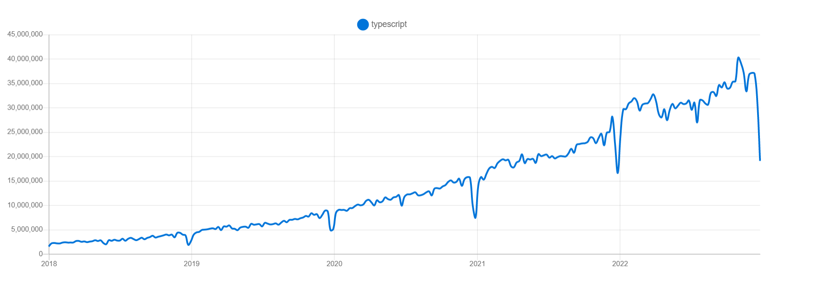
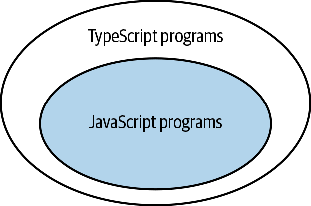
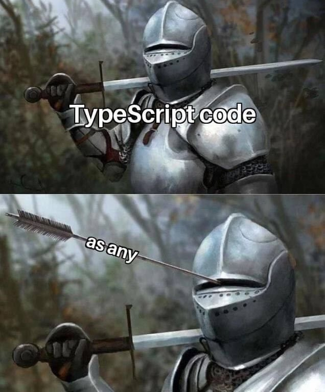

타입스크립트로 기본적인 타입을 정하고 사용하고 있지만, 매번 막히는 문제들과 잘 사용하는 기준을 세우기 위해  [이펙티브 타입스크립트](https://search.shopping.naver.com/book/catalog/32473346832)를 읽고 정리해나가려 한다.

# 🙄 타입 스크립트란

타입스크립트의 인기는 갈수록 증가하고 있다. 왜 타입스크립트가 인기가 높아지고 있는지에 개인적으로 생각해보면 `타입체크를 통한 안정성`과 `자동완성을 통한 효율성`과 `타입스크립트 자체의 문법` 총 세 가지라고 생각한다. 타입스크립트란 어떤 언어인지, 왜 써야 하는 지에 대해 알아보자.

[npm trends의 typescript 다운로드 수]



먼저 타입스크립트를 정의해보면 `자바스크립트의 superset`이라고 할 수 있다. superset이란 말은 상위 집합으로 타입스크립트가 자바스크립트를 감싸고 있는 것을 떠올릴 수 있는데, 자바스크립트의 문법들 뿐 아니라 Typescript는 타입문법을 포함하고 있기 때문이다. 이러한 특징으로 자바스크립트와 타입 스크립트는 서로 뗄 수 없는 관계고 타입스크립트를 이용해 보다 쉽게 자바스크립트에 타입을 추가할 수 있다.

하지만 우리가 타입 스크립트로 작성하더라도 브라우저가 이해할 수 있는 언어는 여전히 `자바스크립트`이기 때문에 타입스크립트로 작성된 코드를 자바스크립트로 변환하는 과정을 거친다. 어차피 다시 `자바스크립트`로 변환을 해야 하는데 왜 자바스크립트 대신 타입스크립트를 사용하는 걸까?


먼저 자바스크립트에 없는 `타입`을 정해 줄 수 있다. `타입`을 정해 준다는 것은 어떻게 코드가 진행될 지에 대한 큰 힌트가 되며, 가독성을 높여 준다.

```typescript
let city = 'new york city';
console.log(city.toUppercase()); //Property 'toUppercase' does not exist on type 'string'. Did you mean 'toUpperCase'?
```

위 예제를 보면 자바스크립트로 작성 시에는 city에 어떤 타입이 와도 되기 때문에 알 수 없지만, 타입스크립트로 작성하면 자동으로 city가 string으로 `타입추론`이 되어 오타가 났을 때 string타입이 가지고 있는 메소드로 알려 주는 것을 볼 수 있다.

타입스크립트를 편리하게 사용하려면 타입스크립트에게 개발자의 `의도`를 전달해줘야 한다. 단순히 any로만 전달된 변수보다 string로 구체적으로 전달된 변수일때 어떤 속성과 메소드를 사용할 수 있는지 정확하게 알려줄 수 있다. 다음 예시를 보자.

```typescript
// 의도를 전달해주기 전
const countries = [
  { name: 'korea', capitol: 'seoul' },
  { name: 'japan', capital: 'tokyo' },
];

for (const state of countries) {
  console.log(state.capitol); //seoul undefined
}

// 의도를 전달해준 후
interface Countries {
  name: string;
  capital: string;
}

const countries: Countries[] = [
  { name: 'korea', capitol: 'seoul' }, // Property 'capitol' does not exist on type 'Countries'. Did you mean 'capital'?
  { name: 'japan', capital: 'tokyo' },
];

for (const state of countries) {
  console.log(state.capitol);
}
```

위 코드를 보면 어떤 타입을 가지고 있어야 하는지를 정해주면서 이전에 찾을 수 없던 문제를 미리 알 수 있고, 어떻게 수정하면 될지 알려 주는 도움을 받을 수 있다.

타입스크립트는 자바스크립트 런타임 동작을 모델링한다. 쉽게 표현하면 **자바스크립트 런타임의 오류를 찾으려 한다**는 뜻이다. 하지만 타입 체크로써 모든 런타임에러를 찾을 수는 없다.

```typescript
const names = ['Alice', 'Bob'];
console.log(names[2].toUpperCase()); // TypeError: Cannot read properties of undefined (reading 'toUpperCase')
```

모든 에러를 다 찾아 줄 수는 없지만 그럼에도 불구하고 코드를 작성하는 과정에서 미리 에러를 알려줘, 안정성과 효율성을 높여 주는 큰 장점으로 타입스크립트의 인기가 늘어나고 있다.

# 😁 타입스크립트의 설정

아마 내가 타입스크립트로 코드를 작성하면서 가장 많이 본 에러는 `암시적 any`가 아닐까. 가장 먼저 마주한 타입스크립트의 벽과 같았다. 자바스크립트에서는 당연히 되던 코드가 자세히 써주지 않으면 바로 에러가 나타나고, 이러한 설정을 해결하기 위해 변수마다, 인자마다 타입을 맞게 써 주는 연습을 가장 먼저 했다.

```typescript
function add(a, b) {
  return a + b;
}
add(10, null); // Parameter 'a' implicitly has an 'any' type.
```

위 코드를 자바스크립트로 동작 시키면 아무 문제가 없지만 타입스크립트에는 `noImplicitAny`라는 설정이 있어 매개변수로 정확한 타입을 전달해줘야 한다. 타입을 정해주지 않으면 암시적으로 `any`로 정해지게 되기 때문에 타입 체크의 의미가 없어진다. 함수 작성 시에는 인자의 타입에 대해 자세하게 타입을 정해줘야 한다.

두 번째로 실제 사용하면서 많이 마주하는 에러는 `null체크`다. 비동기로 데이터를 불러오더라도 데이터가 받아오지 못하는 경우나 조건에 따라 값이 들어오는 경우에 꼭 마주하는 에러다.

```typescript
const el = document.getElementById('status');
el.textContent = 'read'; // 'el' is possibly 'null'
```

위 코드에서 `el`이 `null`이 될 수 있기 때문에 에러를 던져주고 이러한 `null 체크`를 해주기 위해서 타입스크립트에는 `strictNullChecks`라는 설정이 있다.

처음 타입스크립트를 사용할 때는 허들과 같지만 두 가지 설정을 통해 더 안정적으로 작성할 수 있다는 점을 느끼고 나서는 허들보다 도와주는 도우미와 같이 느껴졌다.

# 💻 타입스크립트 컴파일러의 역할

타입스크립트 컴파일러는 두 가지 역할을 한다.

- 최신버전 타입스크립트/ 자바스크립트를 구버전 자바스크립트로 트랜스파일

- 타입 오류 체크

두 가지 역할을 할 때 각각 독립적으로 처리되기 때문에 타입오류가 있어도 컴파일이 가능하다. 이러한 타입스크립트 컴파일러의 특징에 대해서 예시로 알아보자.

### 런타임에서 타입체크

```typescript
interface Square {
  width: number;
}

interface Rectangle extends Square {
  height: number;
}

type Shape = Square | Rectangle;

function calculateArea(shape: Shape) {
  if (shape instanceof Rectangle) {
    // 'Rectangle' only refers to a type, but is being used as a value here.
    return shape.width * shape.height; // Property 'height' does not exist on type 'Shape'.
  } else {
    return shape.width * shape.width;
  }
}
```

위 예시 코드를 보면 `Rectangle`은 `interface`로 선언되어 있다. 런타임에서 `instanceof`로 값을 체크할 때 Rectangle은 타입이기 때문에 비교할 수 없다.

위의 코드를 개선하기 위해서는 런타임에 타입정보를 유지 시켜줘야 한다.

```typescript
// 개선 코드 1
interface Square {
  width: number;
}

interface Rectangle extends Square {
  height: number;
}

type Shape = Square | Rectangle;

function calculateArea(shape: Shape) {
  if ('height' in shape) {
    // height이 있으므로 Rectangle로 결정
    return shape.width * shape.height;
  } else {
    return shape.width * shape.width;
  }
}
```

개선한 코드를 보면 타입을 이용하는 것이 아니라 `shape`이 가지고 있는 속성을 통해 타입을 유지시켜 줄 수 있다.

```typescript
// 개선 코드 2

interface Square {
  kind: 'square';
  width: number;
}

interface Rectangle {
  kind: 'rectangle';
  height: number;
  width: number;
}

type Shape = Square | Rectangle;

function calculateArea(shape: Shape) {
  if (shape.kind === 'rectangle') {
    shape;
    return shape.width * shape.height;
  } else {
    shape;
    return shape.width * shape.width;
  }
}
```

두 번째 개선 방법은 interface에 구분될 수 있는 key값을 주는 `tag`기법이다. `kind`값에 따라 shape의 타입을 결정할 수 있기 때문에 런타임에서 타입정보를 유지할 수 있다.

```typescript
// 개선 코드 3
class Square {
  constructor(public width: number) {}
}

class Rectangle extends Square {
  constructor(public width: number, public height: number) {
    super(width);
  }
}

type Shape = Square | Rectangle;

function calculateArea(shape: Shape) {
  if (shape instanceof Rectangle) {
    shape;
    return shape.width * shape.height;
  } else {
    shape;
    return shape.width * shape.width;
  }
}
```

세 번째 개선방법은 클래스를 이용하는 방법으로 클래스는 `타입`과 `값`으로 모두 사용할 수 있는 특징이 있다. interface에서 클래스로 바꿔 타입 정보를 유지해할 수있다.

### 타입연산과 런타임

타입연산은 런타임에 영향을 주지 않는다. 런타임은 타입스크립트 코드에서 컴파일된 자바스크립트 코드로 변환되어 실행되기 때문에 이때 코드 자체에서 타입을 정제하지 않으면 아무런 영향을 주지 못한다.

```typescript
// typescript 코드
function asNumber(val: number | string): number {
  return val as number;
}

// javascript 코드
function asNumber(val) {
  return val;
}
```

타입연산 코드는 모두 제거되기 때문에 단순히 받은 인자를 반환해 주는 목적과 다른 함수가 되어버린다. 이점을 개선하기 위해서는 런타임 타입을 체크해 자바스크립트 코드 자체에서도 숫자형으로 바꿔주는 코드를 작성해야 한다.

```typescript
// typescript 코드
function asNumber(val: number | string): number {
  return typeof val === 'string' ? Number(val) : val;
}
```

이렇게 타입스크립트 컴파일러는 개발할 때는 **타입체크**를 하고 컴파일을 통해 **타입이 제거된 자바스크립트 코드**로 변환해준다. 런타임에는 타입이 없기 때문에 런타임 성능에 영향을 끼치지 않는다.

## 🎭 구조적 타이핑

자바스크립트는 `duck typing`기반으로 전달된 인자가 올바르다면 타입을 신경 쓰지 않는 특징을 가진다. 다음 예시를 보자.

```typescript
interface Vector2D {
  x: number;
  y: number;
}

function calculateLength(v: Vector2D) {
  return Math.sqrt(v.x ** 2 + v.y ** 2);
}

interface NamedVector {
  name: string;
  x: number;
  y: number;
}

const v: NamedVector = { x: 3, y: 4, name: 'zee' };

calculateLength(v);
```

예시를 보면 `calculateLength`함수 자체는 `Vector2D`타입을 가지는 인자로 정의되어있다. 하지만 `NamedVector`도 `Vector2D`와 같이 x, y 속성을 가지기 때문에 에러없이 호출되는 것을 볼 수 있다. `vector2D`타입인지를 체크하는 것이 아니라 x, y 키를 가지고 있는 객체가 전달되었는지만 체크한다.

이러한 점은 오류를 만들기도 하는데 다음 예제를 보자.

```typescript
interface Vector3D {
  x: number;
  y: number;
  z: number;
}

function normalize(v: Vector3D) {
  const length = calculateLength(v);
  return {
    x: v.x / length,
    y: v.y / length,
    z: v.z / length,
  };
}

console.log(normalize({ x: 3, y: 4, z: 5 })); // { x: 0.6, y: 0.8, z: 1 }
```

위 예제는 length를 계산할 때 z를 고려하지 않고 길이를 계산해 생긴 문제다. length를 계산할 때 전달 받은 인자의 z속성까지 고려하는 것이 아니라 `Vector2D`로 정의된 x, y 속성만으로 타입 체크를 해 연산을 진행했다. 이러한 특징을 알고 타입 체크에서 오류가 발생할 것이라고 예상하기 보다, 인자로 전달할 때 필요한 속성에 대해 이해하고 전달해야 한다.

구조적 타이핑은 위와 같은 문제가 발생할 수 있지만 테스트와 같이 추상화된 인터페이스를 이용할 수 있는 장점을 가진다.

```typescript
interface DB {
  runQuery: (sql: string) => any[];
}

function getAuthors(database: DB): Author[] {
  const authorRows = database.runQuery(`Authors`);
  return authorRows.map((row) => ({ first: row[0], last: row[1] }));
}
```

위 코드에서 database로 전달될 DB는 runQuery를 가지고 있으면 된다. 어떤 DB가 올 지를 정해 의존성을 높이기 보다 구조적 타이핑을 통해 추상화된 인터페이스를 가지는 것을 볼 수 있다.

# 🤔 any에 대해

any는 말그대로 어떤 것이든 될 수 있는 타입이다. 자바스크립트에 익숙해 지스트 청원서비스를 만들면서 처음 타입스크립트를 사용할 때 홧김에 많이 사용했던 any... 왜 any를 쓰면 안되는지 알아보자.

[볼때마다 공감되는 any 밈..]



**안정성**

```typescript
function calculateAge(birthDate: Date): number {
  //
  return 30;
}

let birthDate = '1000';
calculateAge(birthDate); // Argument of type 'string' is not assignable to parameter of type 'Date'.

function calculateAge(birthDate: Date): number {
  //
  return 30;
}

let birthDate: any = '1000';
calculateAge(birthDate);
```

위 함수를 보면 `Date`타입을 인자로 받아야 하지만 `string`타입 변수를 전달해 에러가 발생했다. 이때 `any`로 타입을 바꿔주게 된다면 우리가 신경써서 타입을 정해놓은 함수가 `string`인자가 들어오는데도 오류로 알려주지 못하고 정상 처리되는 것을 볼 수 있다.

any로 인해 타입 체크의 안정성을 놓쳐버렸다.

**효율성**

```typescript
let me = { first: 'YJ' };
//person.  first를 알려줘

let me: any = { first: 'YJ' };
// person. 아무것도 알려줄 수 없어
```

위 객체는 first라는 속성을 가지는 것을 알 수 있지만, any로 타입을 정한 후로는 어떤 속성과 메소드를 가지는 지 타입스크립트는 알려 줄 수 없다. 속성과 메소드를 맞게 썼는지 다시 체크해 코드 작성시 효율성을 떨어뜨리고 없는 속성과 메소드를 사용할 수도 있는 위험성을 가진다.

내가 생각하는 타입스크립트의 장점 안정성과 효율성을 모두 놓칠 수 있기 때문에 `any는 꼭 지양하도록 하자`.


[참조]

- [기술서적 리뷰, 이펙티브 타입스크립트 - 1. 타입스크립트 알아보기](https://yhancsx.github.io/js/effective-typescript-ch1/)
- [이펙티브 타입스크립트](https://search.shopping.naver.com/book/catalog/32473346832)
