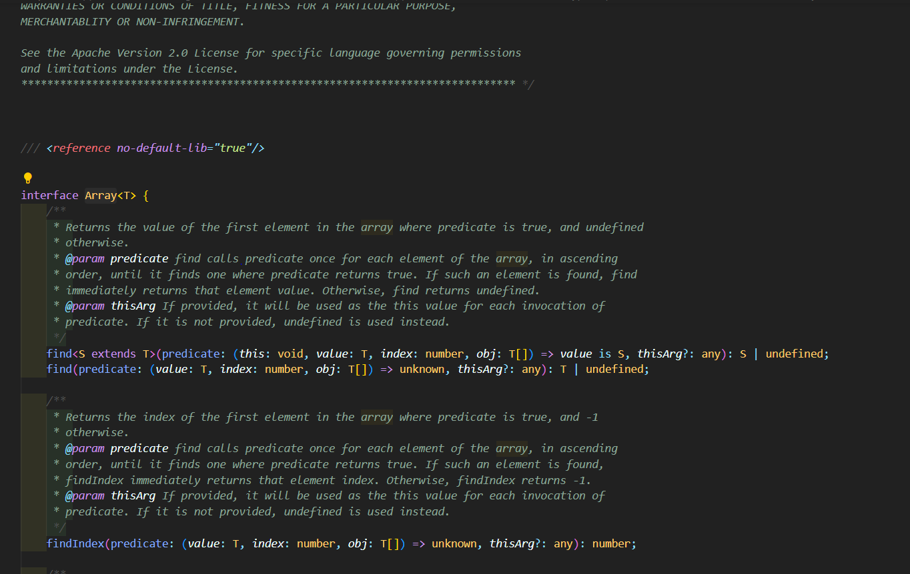
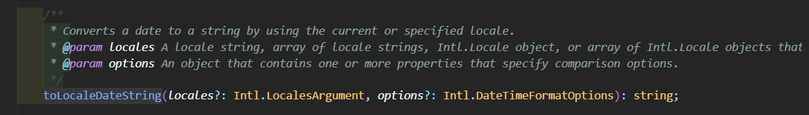

# 🎚 타입시스템

타입 시스템은 타입스크립트를 사용하는 큰 이유 중 하나다. 타입을 통해 안전하고 효율적으로 코드를 작성할 수 있게 도와주기 때문에 타입스크립트를 잘한다는 것의 의미가 현재 `얼마나 타입을 잘 정의하냐`에 있다. 그렇기 때문에 최대한 구체적으로 타입을 `잘`정의하기 위해 **타입시스템**에 대해 알아보자

## 🤔 타입 추론

타입스크립트는 똑똑하기 때문에 우리가 작성한 코드에 명시적으로 전달하지 않아도 코드의 흐름을 통해 추론해준다. `const s="string"`이라는 코드를 작성하면 자동으로 `s`에는 `string`타입이 할당된다.

```typescript
const foo = {
  x: [1, 2, 3], // number[]
  bar: {
    name: "fred",
  },
}
```

위 예제의 x는 `[1,2,3]`을 보고 `number[]`을 타입으로 추론했다. 하지만 만약에 배열의 길이가 정해져 있는 `Tuple`이었다면 위의 타입은 이후에 에러를 만들 수 있는 코드가 된다.

그래서 최대한 **구체적으로** 타입을 정해주는 것이 중요하며 대부분의 라이브러리에는 사용하는 속성과 메소드에 대한 정보들이 `d.ts`로 끝나는 파일에 정리되어 있기 때문에 참고할 수 있다.

[`lib.es2015.core.d.ts`의 Array interface]



## 🗂타입과 집합의 관계

아래 그림을 통해 엄청나게 다양한 타입이 존재하는 것을 알 수 있다. 이러한 타입시스템을 이해하기 위해서 타입을 `집합`으로 이해해야 한다.


타입과 집합이라니... 관련이 없어 보이지만, 자바스크립트에서 프로토타입의 부모 자식 관계가 있듯이, 타입들에도 집합 관계가 있다. `unknown` type은 알 수 없기 때문에 어떤 것이든 다 될 수 있는 가장 큰 집합으로 `never`는 어떤 요소도 포함하지 않는 가장 작은 집합으로 이해할 수 있다.

```typescript
const x: never = 12 //Type 'number' is not assignable to type 'never'.
```

### unit type

하나의 값을 가리키는 타입은 `unit type` 또는 `literal type`이라고 불리는 타입이다. 값을 직접 type에 명시한다.

```typescript
type A = "A"
```

### Union Type

하나가 아니라 타입에 여러 값을 함께 나타내기 위해서 `union type`이 존재한다. `union type`은 여러 개의 타입을 합한 `합집합`으로 `|`으로 나타낸다.


```typescript
type AB = "A" | "B"
const ab: AB = Math.random() < 0.5 ? "A" : "B"
const c: AB = "C" // Type '"C"' is not assignable to type 'AB'
```

위 예제에서 `ab`는 `AB` 유니온 타입으로 되어 있어 `"A"`나 `"B"`가 할당될 수 있다. `c`는 `AB`타입에 정의한 `"A"` 또는 `"B"`의 부분집합이 아니기 때문에 에러가 발생한다. 즉 타입 체크를 한다는 것은 **어떤 집합이 다른 집합의 부분집합이 될 수 있는지** 를 확인하는 것이다.

### Intersection Type

여러 개 타입을 동시에 만족하는 부분 집합, `교집합`을 `Intersection Type`이라고 하며 `&`으로 나타낸다.


여기서 이해하기 어려웠던 부분이 "둘 다 만족한다"고만 생각해 `Union type`와 차이가 이해되지 않았지만 집합으로 생각해보니 이해가 쉬웠다. 동시에 만족한다는 것은 `두 집합의 조건을 모두 만족한다는 의미`를 가진다.

```typescript
interface dogPerson {
  loveDog: true
}

interface catPerson {
  loveCat: true
}

type Both = dogPerson & catPerson
const person1: Both = {
  loveDog: true,
  loveCat: true,
}
```

위 예제에서 강아지와 고양이를 모두 좋아하는 person1은 `loveDog`과 `loveCat`을 모두 true로 가지고 있어야 한다. 둘 다 만족한다는 것은 두 가지 type을 모두 만족해야 하는 것을 알 수 있다.

집합 관계를 다양한 예제를 통해 좀 더 알아보자.

#### keyof와 함께 사용하는 union type과 intersection type

```typescript
interface dogPerson {
  loveDog: true;
}

interface catPerson {
  loveCat: true;
}

interface Both = dogPerson & catPerson;

type K = keyof (dogPerson | catPerson); //  (keyof A) & (keyof B)
type T= keyof(dogPerson & catPerson) //  (keyof A) | (keyof B)

const a: K = "loveDog"; // Type 'string' is not assignable to type 'never'.
const b: T = 'loveDog';
```

`K`는 합집합의 key로 교집합인 `never` type이 되고, T는 교집합의 key이기 때문에 A의 key와 B의 key의 `"loveDog"|'loveDog'`가 된다. 이부분은 아직 와닿지 않아서 계속해서 공부가 필요한 부분인 것 같다.

#### extends

```typescript
interface dogPerson {
  loveDog: true
}

interface catPerson {
  loveCat: true
}

interface Both extends dogPerson {
  loveCat: true
}
```

앞서 `intersection type`으로 정의했던 관계를 extends를 이용해 상속 관계로도 이해할 수 있다. 부모의 속성을 자식이 전달 받기 때문에 자식을 subset 부모를 superset이라고 부르는 집합 관계와 상속 관계가 일치하는 것을 알 수 있다.

```typescript
interface Point {
  x: number
  y: number
}

type PointKeys = keyof Point // "x"|"y"

function sortBy<K extends keyof T, T>(vals: T[], key: K): T[] {
  // ..
  return []
}

const pts: Point[] = [{ x: 1, y: 1 }]
sortBy(pts, "x") // T: Point[] K:"x"
sortBy(pts, "y") // T: Point[] K:"y"
sortBy(pts, "z") // T: Point[] K:"z" // Argument of type '"z"' is not assignable to parameter of type 'keyof Point'.
```

위의 `generic`을 이용한 예시를 보면 T에는 `point[]`타입이 K에는 "x", "y", "z"가 들어간다. K는 K의 key의 부분집합이어야하므로 "z"는 point의 `"x"|"y"` 집합에 속하지 않기 때문에 에러가 발생하는 것을 볼 수 있다.

## ⁉ 값과 타입 구분하기

자바스크립트에서는 값만 신경써서 이름을 정하면 됐지만 타입스크립트를 사용하면서 type에도 네이밍이 필요해졌다. 내가 정의한 것이 `값`인지 `타입`인지를 이해할 필요가 있다.

```typescript
interface Cylinder {
  radius: number
  height: number
}

const Cylinder = (radius: number, height: number) => ({ radius, height })
// Cannot redeclare block-scoped variable 'Cylinder'.
```

같은 이름으로 타입과 값 모두 정의할 수 있기 때문에 구분할 수 있는 네이밍이 필요하다.

```typescript
interface Cylinder {
  radius: number
  height: number
}

function calculateVolume(shape: unknown) {
  if (shape instanceof Cylinder) {
    // 'Cylinder' only refers to a type, but is being used as a value here.
    shape.radius
  }
}
```

네이밍 문제 뿐 아니라 타입을 값처럼 사용해 오류를 만들기도 한다. `instanceof`는 런타임 연산자로 값을 확인한다. Cylinder가 타입이기 때문에 에러가 난 것을 볼 수 있다.

이러한 문제를 해결할 수 있는 방법으로는 값과 타입 모두 될 수 있는 `class` 를 사용해 해결할 수 있다.

```typescript
class Cylinder {
  radius: number
  height: number
}

function calculateVolume(shape: unknown) {
  if (shape instanceof Cylinder) {
    // 'Cylinder' only refers to a type, but is being used as a value here.
    shape.radius
  }
}
```

### typeof

`typeof`는 class처럼 타입과 값의 의미를 모두 가진다. 타입으로 쓰일 때는 해당 값의 타입을 읽고, 값으로 쓰일 때는 해당 값의 타입을 문자열로 반환한다.

```typescript
const v = typeof Cylinder
console.log(v) // function

type C = InstanceType<typeof Cylinder> // Cylinder

// type InstanceType<T extends abstract new (...args: any) => any> =
//   T extends abstract new (...args: any) => infer R ? R : any;
```

위 예제에서 typeof가 값으로 쓰여 v가 `"function"`문자열 값으로 반환되었고, 타입으로 쓰일 경우 Generic과 함께 쓰여 `C`의 타입이 Cylinder로 나온 것을 볼 수 있었다. 여기에 쓰인 `InstanceType`은 유틸리티 타입으로 생성자 함수 T의 instance type을 의미한다.

### Branket 접근자

오브젝트의 속성 접근자인 `[]`는 타입에서도 동일하게 `타입의 속성의 타입정보`를 얻을 수 있다.

```typescript
interface Person {
  first: string
  last: string
}

type PersonEl = Person["first" | "last"]
type Person2 = Person.first // Cannot access 'Person.first' because 'Person' is a type, but not a namespace.

type Tuple = [string, number, Date]
type TupleEl = Tuple[number]
```

### 구조 분해 할당

구조 분해 할당으로 자주 사용하는 경우는 react에서 전달 받은 props를 구조 할당 분해로 타입을 명시해 줄 때였다. 길어질 수 있기 때문에 type을 따로 빼서 정의하는 게 가독성에 좋았다.

```tsx
type AdminDescriptionItemType = {
  item: DescriptionType
  name: DescriptionNameType
  onDelete: (name: DescriptionNameType, id: string) => void
  onChange: (name: DescriptionNameType, value: string, id: string) => void
}

export default function AdminDescriptionItem({
  item,
  name,
  onDelete,
  onChange,
}: AdminDescriptionItemType) {
  // ...생략
}
```

## 😁 타입 단언 보다 타입선언

타입 단언 (type assertion)은 추론한 타입과 상관없이 개발자가 정의한 타입을 우선순위로 두기 때문에 오류가 발생할 확률이 높아진다.

```typescript
interface Person {
  name: string
}

const alice: Person = { name: "Alice" }
const bob = {} as Person
```

`alice`의 경우 타입 선언을 이용해 타입 체크하기 때문에 명시된 값의 타입이 맞는 지를 보지만, `bob`은 내가 정의한 Person이라고 지정하게 되어 오류를 던지지 않는다.

```typescript
const alice: Person = {
  name: "Alice",
  occupation: "td",
} // Type '{ name: string; occupation: string; }' is not assignable to type 'Person'.

const bob = {
  name: "bob",
  occupation: "js",
} as Person
```

이번에는 `Person`에서 정의한 속성 외의 추가 속성이 있을 때로 `alice`의 경우 기존 정의한 속성외의 다른 속성이 있음을 오류로 알려 주지만, `bob`은 Person으로 이미 타입체크를 했다고 전달하는 것과 같아 오류가 없는 것을 볼 수 있다.

### 타입 선언 시 주의할 점

```typescript
const people = ["alice", "bob", "jan"].map(name => ({ name })) // {name:string}[]
```

위의 경우 타입이 `Person[]`이 되기를 기대했지만 `{name:string}[]`로 type이 정해진다. 이러한 경우는 체이닝을 이어나갈 때 type 에러를 만들기 때문에 항상 예상하는 타입과 같게 만들기 위해 <u>중간 단계의 예측한 타입을 명시함</u>으로써 오류가 발생한 곳을 빠르게 찾아나갈 수 있다.

```typescript
const people: Person[] = ["alice", "bob", "jan"].map(
  (name): Person => ({ name })
)
```

## 🙄 타입 단언은 언제 쓸까?

타입 단언이 필요한 경우는 **내가 정의하는 타입이 추론하는 타입보다 더 정확할 때**다. 당연히 타입스크립트가 더 똑똑한데 내가 맞다고 할 수 있을까 싶기도 하지만 런타임에서 결정되는 경우 타입 스크립트가 접근할 수 없고, 이미 정해져 있지만 타입이 반영되어있지 않은 경우에도 사용할 수 있을 것 같다.

```typescript
document.querySelector("#myButton")?.addEventListener("click", e => {
  e.currentTarget
  const button = e.currentTarget as HTMLButtonElement
  button
})
```

event의 currentTarget은 런타임에서 결정되므로 `null|HTMLButtonElement`중에서 `HTMLButtonElement`로 정해줘야 한다.

최근 과제를 하면서 타입단언이 필요한 경우가 있었다. 영어로 오늘의 요일을 가져와야 할 때 `toLocaleDateString()`를 이용해서 사용하려 했지만 타입 정의가 `string`으로 되어있어 타입에러가 발생했다.



이점을 해결하기 위해서 고민을 하다가 정의 되어있는 타입보다 더 자세히 정해줘야 하는 상황이므로 타입단언을 사용해서 해결할 수 있었다.

```typescript
const today = new Date()
const day = today.toLocaleDateString("en", {
  weekday: "short",
}) as EnKeys

const Days = {
  Mon: "월",
  Tue: "화",
  Wed: "수",
  Thu: "목",
  Fri: "금",
  Sat: "토",
  Sun: "일",
  Temp: "당일",
} as const

export type EnKeys = keyof typeof Days
```

타입 단언을 항상 사용할 수 있는 것은 아니다. `A|B type`에서 A가 B의 부분 집합일 때만 사용할 수 있다.

```typescript
interface Person {
  name: string
}
const body = document.body
const el = body as Person
// Conversion of type 'HTMLElement' to type 'Person' may be a mistake because neither type sufficiently overlaps with the other. // If this was intentional, convert the expression to 'unknown' first.
const el = body as unkown as Person
```

Person으로 타입 단언을 통해 타입을 정하려 했지만 body가 가지는 type인 `HTMLElement`와 `Person`은 서로 관계가 없기 때문에 에러가 발생한다. 하지만 `unknown`은 가장 큰 타입의 집합이므로 타입 단언이 가능한 것을 볼 수 있다.

# 마치며

타입 시스템을 공부하면서 타입을 `집합`이라는 시점으로 보니 좀 더 이해가 잘 되었다. 하지만 여전히 부족한 점이 많아서 여러 번 읽어야 할 부분이라 생각된다.

[참조]
[이펙티브 타입스크립트](https://search.shopping.naver.com/book/catalog/32473346832)
