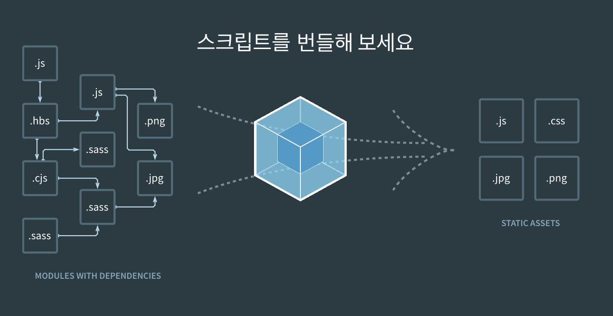
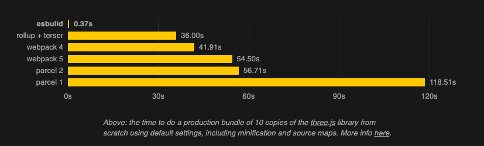
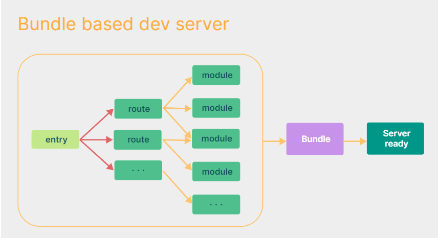
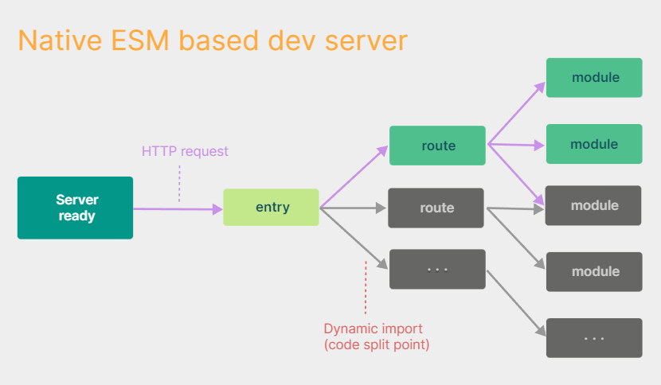

## 🙄 Vite를 사용한 계기

CRA(Create React App)는 리액트에서 공식적으로 밀어주는(?) 보일러 플레이트이다. 기존에 잘 사용해왔기 때문에 기업 과제들을 수행하면서 사용하려 했지만, 원티드 프리온보딩 교육을 받으며 CRA보다 속도가 훨씬 빠른 `Vite`라는 게 있다는 멘토님의 이야기가 떠올라 사용해보았다. Vite를 사용하면서 실제 빌드속도와 dev 서버가 켜지는 속도가 너무 빠르다는 것을 직접 느낄 수 있었는데, **어떻게 Vite가 기존의 CRA보다 빠를 수 있을지** 이해하기 위해 `번들러`에 대해서 먼저 알아보게 되었다.

## ❓ 자바스크립트가 없는 것

자바스크립트는 **자체적인 모듈 시스템이 없다**. 당시에 작은 프로젝트에 테스트 용으로 사용될 자바스크립트였기 때문에 여러 개의 파일들을 만들고 불러오는 모듈 문법이 없었다. 이러한 점을 해결하기 위해 가장 먼저 나왔던 모듈 문법이 `Common JS`방식으로 `require`과 `module.export`로 파일을 불러오고 전달할 수 있게 연결했고, `npm`을 통해서 미리 만들어 모듈로 자바스크립트 코드들을 받아 올 수 있었다. 하지만 전체 모듈의 많은 양의 코드들을 받아오다 보니 자바스크립트 파일 자체의 크기가 커지는 어려움이 생기게 되었고, 언제 어떤 모듈을 불러와야 할 지에 따른 시점의 문제점도 발생했다.

### ❗ 번들러 등장

두 가지 문제점을 한번에 해결하기 위한 방법으로 나온 것이 바로 `번들러`다. 번들러를 이용하게 되면 모듈 내부에서 **필요한 부분 만**을 가져와 기존의 전체를 가져왔던 용량 문제를 해결할 수 있으며, 여러 개의 파일이 아니라 하나의 JS 파일로 만들기 때문에 모듈의 순서와 언제 불러와야 할 지에 대한 고민도 동시에 해결할 수 있었다.

이러한 번들러로 가장 유명한 것은 아마 `Webpack`이라 할 수 있을 것 같다. 기존에 내가 사용하던 CRA는 바로 이 `Webpack`을 번들러로 사용한다. `Webpack`은 단순히 번들러의 역할 뿐 아니라 HMR (Hot module Replacement), code splitting, CSS, HTML, asset 등 종합적으로 지원해주는 tool로 현재까지 안정적인 번들러로 사용되고 있다. CRA로 리액트 프로젝트를 실행할 때 새로 고침 없이도 코드가 반영되는 점이 webpack의 HMR 기능 덕분이라는 것을 공부하며 Webpack의 기능을 좀 더 이해하게 되었다.

### 📌 번들러의 문제점과 ES Build의 등장

`Webpack`과 같은 번들러의 등장은 JS에 존재하지 않는 모듈 시스템의 문제점을 해결했지만 **속도**의 문제점을 가지게 되었다. 그 이유는 여러 JS파일을 하나로 항상 만들어줘야 하기 때문에 코드 수정이 있을 때마다 새롭게 빌드가 필요했고 프로젝트가 커지면 커질수록 자바스크립트 파일이 많아져 빌드에 필요한 시간이 오래 걸리게 되었다. 

이러한 문제점을 해결하기 위해 새로운 도구로 `ES Build`가 등장하게 된다. `ES Build`는 기존 번들러들의 속도보다 100배 이상 빠른 빌드 속도를 가졌다. 이렇게 빠른 속도를 가지고 있는 이유는 JS를 기반으로 만들어진 기존 번들러들과 달리 Go 언어로 작성되어 빠른 빌드가 가능했기 때문이었다. 하지만 번들러로써만 사용되는 것이 아니라 HMR, code splitting과 같은 기능들이 종합적으로 제공되던 `Webpack`이었기 때문에 복잡한 어플리케이션에서 ES Build가 대체할 수는 없었다.

### ✨Vite의 등장

웹이 발전하면서 브라우저 자체에서 **ESM(**ES Modules)이 추가된다. `import`와 `export`로 작성된 자바스크립트 모듈화 방식을 번들러 없이 `<script type="module">`을 이용할 수 있게 된다. Go 언어의 병렬 처리로 높은 성능을 가진 **ES Build**와 브라우저에서 지원해주는 **ESM**을 이용해 `Vite`가 탄생하게 된다. 

Vite는 개발할 때 사용하는 개발 서버를 구동할 때 빠르게 반영하기 위해 크게 `dependencies`와 `source code`로 구분해, 개발 시에 내용이 바뀌지 않을 `dependency`의 코드는 **ES Build**로 사전 번들링을 하고, 계속해서 수정해야 하는 `source code` 는 **브라우저의 ESM**을 이용해서 반영할 수 있게 처리했다. ESM은 요청받은 모듈만 전달하기 때문에 훨씬 빠르게 개발 서버에 반영이 가능하다.

배포 시에는 ESM이 동작해야 하기 때문에 모던 JS를 지원하는 버전을 타겟으로 한다. 빌드 시에 아직 ESBuild가 Code splitting, CSS처리 관련 기능이 부족하기 때문에 ES Build 대신에 `Rollup`을 이용한다고 한다.

## 😁 정리하기

Vite를 사용해서 제출한 한 기업의 면접에서 `CRA 대신 Vite를 이용해서 과제를 하셨네요. Vite가 왜 CRA보다 빠른지 아시나요? `라는 질문에 답하지 못했다... 기술을 알고 사용한다고 생각했었는데 그냥 도입한 모습이 되어버렸다. 이제는 `ES Build와 브라우저의 ESM을 이용한 번들링으로 기존 CRA의 WebPack보다 빠른 성능을 가집니다`라고 대답할 수 있었다.  앞으로도 어떠한 기술을 사용할 때 항상 `왜`를 더 고민해보자.

[참조]

- [Evan You와 함께 Vite 배우기 - Vue ministry]( https://www.youtube.com/watch?v=DkGV5F4XnfQ)
- [Vite 이야기 (feat. Svelte)](https://velog.io/@teo/vite)
- [와 Vite 쓰면 리액트 10배 빨라짐 (과장아님)](https://www.youtube.com/watch?v=iX3Nu1FcZKA)

