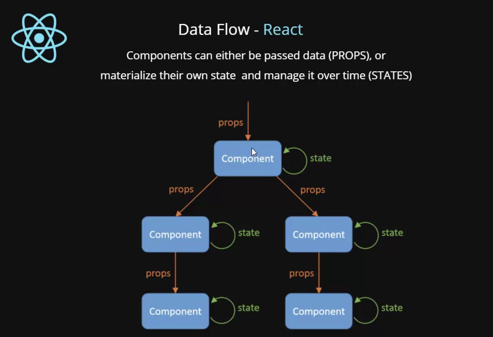

# 😋 리액트의 기본 원리

면접을 통해 리액트의 기본되는 질문들을 받았을 때 `안다`라고 자신했었지만, 제대로 답변을 하지 못하는 경우도 많았다. 면접을 기회로 리액트를 더 깊이 있게 이해할 수 있도록 기본부터 다시 정리해보려 한다.

## 🎆 리액트란

리액트란 `UI를 위한 자바스크립트 라이브러리`라고 정의할 수 있다. 또 다르게 설명하자면 `컴포넌트들의 집합`으로도 말할 수 있다. 그렇기 때문에 컴포넌트의 데이터인 **Props와 state에 대한 질문**과 컴포넌트를 **어떻게 설계하는 지**에 대해 질문을 받았었다.

### ♟ 컴포넌트의 데이터: Props와 State

컴포넌트는 부모로 부터 전달받아 수정할 수 없는 데이터인 **Props**와 자체적으로 가지며 업데이트 할 수 있는 데이터인 **State**가 있다. 두 가지 데이터의 변화는 **리랜더링의 Trigger**가 되어 해당 컴포넌트를 리렌더링하게 된다. 이때 중요한 것이 두 데이터의 변화를 알려주기 위해 **불변성**을 지켜야 한다는 점이다.



원시형 타입의 경우 값이 변하면 새로운 메모리 주소에 값을 할당하기 때문에 `값의 변화 = 메모리 주소의 변화`로 볼 수 있다. 하지만 객체 타입인 객체, 배열, 함수 등은 실제 값이 아닌 객체를 저장하고 있는 메모리 힙의 참조값을 값에 할당하고, 속성 값이 변화한다고 해서 새로운 주소로 할당하지 않는다. 그렇기 때문에 객체 타입에서 `값의 변화 != 메모리 주소의 변화`가 된다.

이점이 리액트에서 중요한 이유는 데이터 변화를 확인하기 위해 `얕은 비교`를 수행하는데, 얕은 비교는 메모리 주소에 할당된 값을 비교해 업데이트해야 할 지를 확인하기 때문이다. 원시형 타입의 경우 값의 변화가 곧 메모리 주소 값의 변화가 되지만 객체 타입은 속성 값이 변한다고 해서 메모리 주소 값의 변화가 되는 것이 아니기 때문에 직접 state를 수정해서는 안된다.

객체의 속성이 바뀌면 객체 자체의 참조 값을 바꿔주기 위해서 spread operator, map, filter와 같이 원본 데이터를 수정하는 것이 아니라 새로운 객체를 만드는 방식으로 상태를 변화시켜, 리액트의 효율적인 상태 업데이트가 가능하게 된다.

## 😀 제어 컴포넌트와 비제어 컴포넌트

`제어 컴포넌트`와 `비제어 컴포넌트`는 면접에서 처음들은 단어였다. 각각에 대해 설명해 보라는 질문에 바로 잘 모르겠다 했지만 input과 form을 생각하면 답할 수 있을 것 같다고 힌트를 주셔서 `제어 컴포넌트`에 대해서 만 설명할 수 있었다.

#### 제어 컴포넌트

제어 컴포넌트는 model에 해당하는 data, 즉 상태와 바인딩되어 상태에 따라 값이 바뀌는 컴포넌트라고 할 수 있다. 예로 `input`의 경우 사용자의 입력을 통해 상태를 업데이트하고 업데이트한 상태를 `value`속성으로 전달해줘 **상태와 항상 동기화될 수 있게** 한다.

```jsx
import { useState } from "react"

const App = () => {
  const [value, setValue] = useState("")
  const handleChange = e => {
    setName(e.target.value)
  }

  return (
    <form onSubmit={handleSubmit}>
      <input
        type="text"
        placeholder="Enter Name"
        value={value}
        onChange={handleChange}
      />
      <button>Add</button>
    </form>
  )
}

export default App
```

익숙한 위 코드 모습에서 과정을 정리해보면 1) 사용자가 입력한다. 2) 입력된 값을 `onChange`함수를 통해 상태를 변경한다. 3) 상태를 value로 반영한다 로 세가지 step으로 볼 수 있다.

### 비제어 컴포넌트

비제어 컴포넌트는 제어 컴포넌트와 달리 입력에 따라 상태를 업데이트 시키고 상태와 컴포넌트를 바인딩하는 것이 아니라, DOM요소에 접근해 입력된 값을 받아오는 방식이다.

```jsx
import { useRef } from "react"

const App = () => {
  const inputRef = useRef()

  const handleSubmit = event => {
    event.preventDefault()
    const name = inputRef.current.value
    console.log("Input value - ", this.inputRef.current.value)
  }

  return (
    <form onSubmit={handleSubmit}>
      <div>
        <label>Uncontrolled input </label>
        <input type="date" name="data" id="date-input" ref={this.inputRef} />
      </div>

      <button type="submit">Submit</button>
    </form>
  )
}

export default App
```

위 코드에서 과정을 정리해보면 1) 사용자가 입력한다 2) 버튼을 누른다 3) `submit`이벤트가 발생하고 DOM요소에 접근해 값을 콘솔로 호출한다로 정리할 수 있다.

이렇게 두 가지 과정을 비교해 보았을 때 가장 큰 차이점은 **상태와 동기화가되냐 안되냐**라는 점이다. 제어 컴포넌트의 경우 state가 바뀔 때마다 값이 바뀌기 때문에 리랜더링이 계속해서 일어나게 되는 반면 비제어 컴포넌트는 state와 상관없이 이벤트가 발생했을 때만 값을 참조한다. 그렇기 때문에 둘 중에 어떤 것을 사용할 지는 **데이터를 실시간에 맞게 UI를 보여줘야하냐 아니냐**로 구분해서 사용할 수 있다.

### 🧨 리액트의 re-rendering 조건과 불필요한 re-rendering 막기

Re-rendering의 조건은 크게 2가지로 볼 수 있다.

- Props와 State의 변화
- 부모 컴포넌트의 re-rendering

앞서 설명한 Props는 부모로 부터 전달받은 데이터이기 때문에 전달하는 데이터가 객체타입일 경우에 부모가 re-rendering되었을 때 항상 새롭게 데이터가 만들어져 전달된다. 왜냐하면 `{}!=={}`로 자바스크립트에서 객체는 항상 새로운 값이기 때문이다. 새로운 값이 props로 전달되므로 자식 컴포넌트의 re-rendering으로 이어진다.

`리액트가 성능 보장하는 방법`에 대해 정리한 이전 글처럼 불필요한 자식의 re-rendering을 막기 위해서는 props로 전달하는 변수,함수가 항상 새롭게 만들어지지 않아도 된다면 `useMemo`와 `useCallback`을 통해 메모이제이션을 하고 dependency가 바뀔 때만 새롭게 전달하는 방식을 사용할 수 있다. 또한 `Memo`를 이용해 컴포넌트로 전달되는 Props의 변화가 없다면 re-rendering을 하지 않게 성능을 개선할 수 있다.

## 🕶 리액트의 데이터 바인딩과 Flux 패턴

`데이터 바인딩`이란 단어는 최근 면접을 통해 처음 듣게 되었다. 처음 듣고 당황해서 `혹시 데이터 바인딩에 대해 조금만 더 알려주실 수 있을까요?`라고 다시 여쭤봤고, 면접관님께서 친절하셔서`리액트는 단방향 데이터 바인딩일까요 양방향 데이터 바인딩일까요`라고 풀어서 설명해주셨다. 데이터바인딩에 대해서 처음 들어보지는 않았지만 분명 잘 몰라서 생긴 해프닝이었다.

데이터 바인딩이란 페이지에 보여질 **View와 데이터를 연결하는 것**을 의미한다. 데이터 바인딩은 단방향과 양방향으로 나뉠 수 있는데 단방향의 경우 데이터가 변경되면 템플릿과 함께 결합해 뷰를 만드는 것을 의미하고, 양방향의 경우 단뱡향과 같이 데이터의 변경을 템플릿과 함쳐 view로 반영하는 것과 함께 View 변화를 데이터에 반영하는 것을 의미한다.


리액트는 **단방향 데이터 바인딩**을 이용한다. 컴포넌트 내부의 단방향 데이터 바인딩은 useState를 통해 상태를 만들고, 만든 상태를 JSX를 통해 HTML(View)로 반영한다. UI를 통해 데이터를 갱신하기 위해서는 이벤트를 이용해 데이터를 업데이트 할 수 있다.

컴포넌트 간의 단방향 데이터 바인딩은 부모 컴포넌트에서 자식 컴포넌트로 데이터가 **props**를 통해 전달되는 구조를 가지고 있다. 이때 부모의 상태를 자식 컴포넌트에서 변화시키기 위해서는 props로 부모 상태를 업데이트할 수 있는 setState를 props로 전달해 해결할 수 있다.

이러한 구조를 통해 가지는 장점은 하나의 방향으로 데이터가 진행되기 때문에 코드 이해가 쉽고 디버깅이 쉬운 장점을 가진다. 단점은 변화를 감지하고 업데이트하는 코드를 항상 작성해야하는 것으로 `<input value={name}/>`에서 `onChange` 이벤트 함수를 항상 전달해줘야하는 이유를 알 수 있었다.

단방향 데이터 바인딩으로 리액트가 이루어져있는 것을 이해하면서 이러한 데이터와 View를 어떻게 관리할 건지에 대해 정리한 것이 바로 `디자인 패턴`이라는 것을 깨닫게 되었다. 최근 면접에서도 디자인패턴에 대해 물어보았지만 아는게 `MVC`밖에 없어... 그것밖에 설명할 수 없었다.


양방향 데이터바인딩으로 MVC패턴을 사용하던 Facebook은 점점 복잡해지고 예측하지 못하는 단점을 해결하기 위해 단방향 아키택처인 **Flux 패턴**을 도입한다.


### Flux 패턴

Flux 패턴은 사용자가 View에서 `Action`을 발생시키면 `Dispatcher`를 통해 데이터가 저장되어있는 `Store`로 전달되어 데이터가 변경되고, `View`를 업데이트하게 된다. 이러한 Flux 패턴은 당시에는 개념적인 아키텍처였지만 곧이어 이것을 구현한 **Redux**가 등장하게 된다.


### Redux

Redux는 자바스크립트 라이브러리로 Flux 패턴에 **Reducer**를 더해 구현했다. Redux는 Flux와 같이 단방향 데이터 흐름을 가져가며, 하나의 `store`에 상태를 보관하고 `Reducer`를 통해 전달받은 Action에 따라 어떻게 상태를 업데이트 할지 처리한다. 각각에 대해서 좀 더 자세히 정리해보자.


- Action: 액션은 상태에 어떤 변화가 필요할 때 발생시키는 것으로 예를 들면 버튼 클릭 시 새로운 Todo를 추가하기 위해 다음과 같은 Action을 만들 수 있다. 주로 Action을 만들 때 객체 내 type 속성이 반복되서 사용되기 때문에 액션 객체를 반환하는 `Action Creator` 함수를 이용한다.

```javascript
export function addTodo(data) {
  return {
    type: "ADD_TODO",
    data,
  }
}
```

- Reducer: Reducer는 Action과 현재 상태를 인자로 받아 새로운 상태로 반환하는 **순수 함수**다. 직접 상태를 변경하는 것이 아니라 useState와 같이 불변성을 지켜 수정된 복사본으로 상태를 업데이트 한다. 위 예제의 "ADD_TODO" action이 전달되었다면 Todo[]에 새로운 Todo를 추가하는 로직을 작성할 수 있다. 이렇게 Reducer를 작성하다보면 엄청나게 길어질 것이 예상된다. sub-Reducer를 만들어 각 도메인별로 구분해서 처리 로직을 작성하고 Root-reducer로 합쳐서 반영하게 할 수 있다.

  ```javascript
  function Todo(state, action) {
    switch (action.type) {
      case "ADD_TODO":
        return [...state, action.data]
      default:
        return state
    }
  }
  ```

- Store: Store는 하나만을 가지고 Reducer를 전달해 reducer로 변경된 상태를 보관하는 역할을 한다.

Redux에는 중요한 세가지 원칙이 있는데, 먼저 **Store는 단 하나**여야하며, 두 번째로 상태는 **불변성**을 지켜야한다는 점, 마지막으로 Reducer는 **순수함수**여야한다. 이중에서 순수함수라는 점은 인자를 수정하거나, 외부의 변수를 변경하거나 참조하지 않아야한다는 것을 의미한다. 이것은 불변성을 지켜야하는 것과 동일하게 state 변경 시 state의 참조값만 비교해서 업데이트하기 때문에 반환된 상태 값을 직접 변경하지 않아야 한다.

## 🙄 정리하며

리액트 관련된 면접 질문들을 한번에 정리하면서 여전히 모르는 점이 많지만 항상 기술은 문제를 해결하기 위해 발전되었다는 것을 느낄 수 있었다. 보다 명확하게 이야기할 수 있게 계속해서 업데이트하고 다시 작성해나갈 예정이다.

[참조]

- [adjh54님의 티스토리 글](https://adjh54.tistory.com/49)

- [hyunmin님의 글](https://blog.hyunmin.dev/15)

- [tabnine](https://www.tabnine.com/blog/angular-vs-react/)

- [테오님의 글](https://velog.io/@teo/%ED%94%84%EB%A1%A0%ED%8A%B8%EC%97%94%EB%93%9C%EC%97%90%EC%84%9C-MV-%EC%95%84%ED%82%A4%ED%85%8D%EC%B3%90%EB%9E%80-%EB%AC%B4%EC%97%87%EC%9D%B8%EA%B0%80%EC%9A%94#%EA%B3%A0%EC%A0%84-%EC%A4%91%EC%9D%98-%EA%B3%A0%EC%A0%84-mvc-%EC%95%84%ED%82%A4%ED%85%8D%EC%B2%98)
