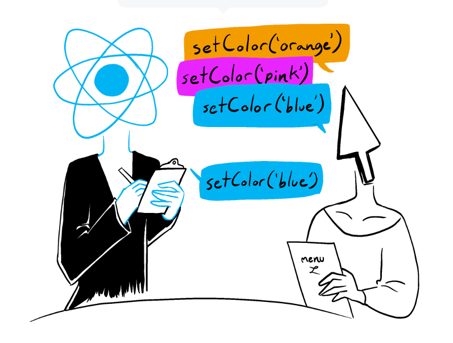

## ❤ React hooks

**React hooks**는 리액트가 사랑 받게 된 큰 이유 중 하나로 생각된다. 기존의 주로 사용되던 `class component`에서 `funtional Component`로 흐름을 바꿀 수 있었던 가장 큰 계기가 hooks의 도입이었다. 베타버전으로 나온 공식 문서를 읽고 그중 가장 자주 사용하는 hooks들의 역할과 내부 동작에 대해 정리해보려 한다.


### 😁 Rule of Hooks

각각의 Hooks에 대해 정리하기 전에 Hooks들이 지켜야 하는 규칙에 대해 먼저 정리하려 한다. 이 부분도 면접에서 질문받았던 부분으로 스코프에 대해서 쉐도잉과 오버 라이팅으로 이야기 했었는데 틀렸던 부분이라 새롭게 정리했다.


#### Only Call Hooks at the Top Level

hooks들은 항상 React fuction의 상위 level에서 사용되어야 한다. 규칙의 장점은 React가 hooks의 작동 순서에 대해서 보장해 줄 수 있다는 점이다.

```jsx
function Form() {
  // 1. Use the name state variable
  const [name, setName] = useState('Mary');

  // 2. Use an effect for persisting the form
  useEffect(function persistForm() {
    localStorage.setItem('formData', name);
  });
    
  // 3. Use the surname state variable
  const [surname, setSurname] = useState('Poppins');

  // 4. Use an effect for updating the title
  useEffect(function updateTitle() {
    document.title = name + ' ' + surname;
  });

  // ...
}
```

위 예제에서 hooks들이 총 네 개의 hooks가 매 렌더링 때마다 순서대로 진행되게 된다. 여기에 만약 조건문으로 `useEffect(persistForm)`으로 감싼다면 어떻게 될까?

```jsx
function Form() {
  // 1. Use the name state variable
  const [name, setName] = useState('Mary');

  // 2. Use an effect for persisting the form
 if (name !== '') {
    useEffect(function persistForm() {
      localStorage.setItem('formData', name);
    });
  }
  // 3. Use the surname state variable
  const [surname, setSurname] = useState('Poppins');

  // 4. Use an effect for updating the title
  useEffect(function updateTitle() {
    document.title = name + ' ' + surname;
  });

  // ...
}
```

`name`이 처음에 'Mary'기 때문에 `useEffect(persistForm)`은 무시된다. 그로 인해 hooks들의 순서가 바뀌게 되고 이전 렌더링과 다른 결과를 만들어 예상치 못하는 버그가 만들어 질 수 있다고 한다. 그러면 어떤 버그가 만들어 질 수 있을까? 이 부분을 이해하기 위해서는 Hook들이 어떻게 만들어졌는지를 구현해야 한다. 


### useState와 useEffect 구현해보기

hook들이 클로저를 이용해서 구현되어 있다는 사실은 알고 있었지만, 실제로 구현해보지는 못했다. 이번 기회에 실제로 구현하는 예제 코드들을 찾아봤고 그중 가장 잘되어있는 [황준일님 블로그](https://junilhwang.github.io/TIL/Javascript/Design/Vanilla-JS-Make-useSate-hook/#_2-bottom-up-%E1%84%87%E1%85%AE%E1%86%AB%E1%84%89%E1%85%A5%E1%86%A8)와 [Philip Fabianek의 영상](https://www.youtube.com/watch?v=1VVfMVQabx0) 속 코드를 참조해서 구현했다.

먼저 **useState** 를 구현해보자. `render()`함수 구현은 제외했다.

```jsx
const React = (() => {
  const useState = (initialValue) => {
    let state = initialValue;
    const setterFn = (newValue) => {
      state = newValue; // 새로운 state를 할당한다
      // render(); // 리랜더링
    };
    return [state, setterFn];
  };
  return {
    useState,
  };
})();

const { useState } = ReactX;
const Component = () => {
  const [count, setCount] = useState(1);
  console.log(count); 
};
Component(); // 1
Component(); // 1
```

위 예제에서 React 내부의 `useState`를 구현했지만 Component를 리랜더링 하게 되면 이전 값에서 불러오는 것이 아니라 초기값 1을 다시 가져오는 것을 볼 수 있다.

문제를 해결하기 위해서는 state를 `useState`함수 내부에 두는 것이 아니라 상위에서 참조하는 형식으로 **클로저**를 이용해야 한다. 이때 초기 값은 처음에만 할당할 수 있게 state가 undefined일 때만 할당하게 한다.

```jsx
const React = (() => {
  let state;
  const useState = (initialValue) => {
    if (state === undefined) {
      state = initialValue;
    }
    const setterFn = (newValue) => {
      state = newValue; // 새로운 state를 할당한다
      // render(); // 리랜더링
    };
    return [state, setterFn];
  };
  return {
    useState,
  };
})();

const { useState } = ReactX;
const Component = () => {
  const [count, setCount] = useState(1);
  const [count2, setCount2] = useState(5);
  console.log(count, count2);

};
Component(); // 1,1

```

다음으로 해결해야 할 문제는 여러 개의 state를 다룰 때다. count2의 초기 값을 5로 정했지만 React 함수 내부의 같은 `state`를 참조하고 있기 때문에 새로운 초기 값이 할당되지 않고 `count`에 저장된 1에서 시작하는 것을 볼 수 있다.

이점을 해결하기 위해서는 state를 **배열**로 둔다. 배열로 두게 되면 state가 여러 개가 되어도 해당 index를 통해 접근하고 값을 변경할 수 있게 된다. 리랜더링 시에는 다시 처음부터 state들을 확인해야 하므로 `resetIndex`함수를 추가했다.

```jsx
const React = (() => {
  let state = [];
  let index = 0;
  const useState = (initialValue) => {
    const localIndex = index;
    index++;
    if (state[localIndex] === undefined) {
      state[localIndex] = initialValue;
    }
    const setterFn = (newValue) => {
      state[localIndex] = newValue;
      // render(); // 리랜더링
    };
    return [state[localIndex], setterFn];
  };

  const resetIndex = () => {
    index = 0;
  };

  return {
    useState,
    resetIndex,
  };
})();

const { useState, resetIndex } = ReactX;
const Component = () => {
  const [count, setCount] = useState(1);
  const [count2, setCount2] = useState(5);

  console.log(count, count2); // 1 5
};
Component();
resetIndex();
Component();

```


이제는 useState에 이어 **useEffect**를 구현해보자. useEffect는 callback 함수와 dependency 배열을 인자로 받는 특징이 있다. 

```jsx
const React = (() => {
  let state = [];
  let index = 0;
  const useState = (initialValue) => {
    const localIndex = index;
    index++;
    if (state[localIndex] === undefined) {
      state[localIndex] = initialValue;
    }
    const setterFn = (newValue) => {
      state[localIndex] = newValue;
      // render(); // 리랜더링
    };
    return [state[localIndex], setterFn];
  };

  const resetIndex = () => {
    index = 0;
  };

  const useEffect = (callback, dependencyArray) => {
    let hasChanged = true;
    if (hasChanged) {
      callback();
    }
  }

  return {
    useState,
    resetIndex,
  };
})();

```

위 코드에서 useEffect는 변화가 있으면 callback함수를 수행하는데 만약 dependencyArray가 없다면 항상 hasChanged가 true기 때문에 항상 수행되게 된다. 이제 dependency 비교하는 코드를 넣어보자. 

```jsx
const React = (() => {
  let hooks = [];
  let index = 0;
  const useState = (initialValue) => {
    const localIndex = index;
    index++;
    if (hooks[localIndex] === undefined) {
      hooks[localIndex] = initialValue;
    }
    const setterFn = (newValue) => {
      hooks[localIndex] = newValue;
    };
    return [hooks[localIndex], setterFn];
  };
  const resetIndex = () => {
    index = 0;
  };

  const useEffect = (callback, dependencyArray) => {
    let hasChanged = true;
    const oldDependencies = hooks[index];
    if (oldDependencies) {
      hasChanged = false;
      dependencyArray.forEach((dependency, index) => {
        const oldDependency = oldDependencies[index];
        const areTheSame = Object.is(dependency, oldDependency);
        if (!areTheSame) {
          hasChanged = true;
        }
      });
    }
    if (hasChanged) {
      callback();
    }
    hooks[index] = dependencyArray;
    index++;
  };
  return {
    useState,
    resetIndex,
    useEffect,
  };
})();

const { useState, resetIndex, useEffect } = React;
const Component = () => {
  const [count, setCount] = useState(1);
  useEffect(() => {
    console.log(count);
  }, [count]);
  setCount(2);
};
Component(); // 1
resetIndex();
Component(); // 2
resetIndex();
Component(); // 3


```

dependency를 비교하기 위해서는 이전 dependency에 대한 정보를 저장하고 있어야 한다. 저장하기 위해 useState에서 사용했던 state를 hooks로 바꾸고 배열에 이전 dependency 정보를 저장한다. 저장한 dependency 값이 있다면 전달 받은 새로운 dependency와 비교를 하는데 이때 `Object.is()`를 이용한 얕은 비교를 수행한다. 

비교 시에 하나라도 바뀌었을 때 `hasChanged`를 true로 바꾸고 callback()을 실행하며 새롭게 전달받은 dependency를 **hooks배열에 저장한다.** 

useState와 useEffect를 구현하면서 hooks 배열에 관련 정보들이 저장되는 것을 보았다. 이점은 앞선 hooks의 규칙 조건문이나 반복문에서 hook이 사용되지 못하는 이유와 연결되는데, 조건문에서 사용되게 되면 **조건에 따라 hooks의 정보가 이전 순서와 다르게 저장되기 때문에** 해당하는 hook에 접근하는 게 아니라 다른 index로 접근해 버그가 발생하게 된다.

직접 구현해보면서 왜 react hook이 조건문에 사용되면 안되는지 이해할 수 있었고 클로저가 어떻게 활용되어 있는지 이해할 수 있었다.


## useState

useState는 **컴포넌트 내의 상태관리**를 위한 hook이다. 리액트 컴포넌트가 기본적으로 리렌더링되는 기준은 `state와 props`가 바뀌었을 때이다. 그중 state는 컴포넌트 내부에서 **변하는 데이터**로 설명할 수 있다. 단순히 변하는 값을 다룬다면 `let`으로 변수에 할당하면 되지 않을까 생각할 수 있지만, `useState`는 (1)데이터를 바꾸고 (2)컴포넌트를 리렌더링하는 두 가지 step으로 이루어져 있다.  

상태를 업데이트 하는 방법에는 setFunction에 (1) 값을 바로 할당하는 방법, (2)인자로 updater function을 이용하는 방법 두 가지가 있다. 

```jsx
const [name, setName] = useState('Edward');

function handleClick() {
  setName('Taylor');
  setAge(a => a + 1);
  // ...
```


#### 리액트의 상태 업데이트 방식: Batching

상태를 업데이트할 때 주의할 점은 **상태 변화는 UI의 변화로 이어진다** 라는 점이다. 이점이 중요한 이유는 리액트의 상태를 반영하는 방식인  `batching`과 관련되어있다.

`batching`은 UI를 업데이트할 때 setFunction이 실행될 때마다 업데이트를 하는 것이 아니라 **모든 event handler가 동작했을 때** 일어나는 것을 의미한다. 매번 setFunction을 실행할 때마다 바로 바로 변하면 동기적으로 일어나는 workflow로 더 직관적이겠지만, setFunction마다 리랜더링 할 시에는 성능 문제가 발생할 수 있기 때문에 setFunction들을 `React queue`에 모아서 순서대로 실행하고, 실제로 변해야 하는 DOM요소들을 반영한다. 이러한 동작은 마치 useState가 비동기적으로 처리되는 것처럼 느껴지게 한다.

주의할 점은 같은 상태를 업데이트하는 setFunction을 여러 번 호출했을 때다.

 ```jsx
 import { useState } from 'react';
 
 export default function Counter() {
   const [number, setNumber] = useState(0);
 
   return (
     <>
       <h1>{number}</h1>
       <button onClick={() => {
         setNumber(number + 1);
         setNumber(number + 1);
         setNumber(number + 1);
       }}>+3</button>
     </>
   )
 }
 ```


위 코드에서 버튼을 클릭하면 state가 0에서 3으로 업데이트될 것을 기대하고 작성했지만 마지막으로 전달한 setFunction만 수행해 `number`는 1이 된다. 

리액트 공식 문서는 이러한 동작 방식을 같은 상태의 여러 개의 업데이트를 요구하는 고객이 있고, 고객의 마지막 주문만 받는 것과 같다고 설명한다. 

[React 공식 문서 사진]



이러한 모습은 마치 `debouncing`을 해 마지막 호출만 받는 것과 같이 생각되었다. 검색 API로 관련검색어를 호출할 때 매번 input에 사용자가 작성할 때마다 수행해 불필요한 API 비용을 만드는 것이 아니라 일정 시간 내의 처음과 끝의 요청만 수행하는 모습인 `debouncing`으로 원하는 시점에 맞게 해당 함수를 수행해 비용을 절약하고 있다고 생각했다.

그러면 같은 상태를 업데이트하는 여러 번의 setFunction을 처리할 방법은 없을까?

이 문제를 해결하기 위해서는 앞서 설명한 **updater function**을 이용할 수 있다.

```jsx
import { useState } from 'react';

export default function Counter() {
  const [number, setNumber] = useState(0);

  return (
    <>
      <h1>{number}</h1>
      <button onClick={() => {
        setNumber(n => n + 1);
        setNumber(n => n + 1);
        setNumber(n => n + 1);
      }}>+3</button>
    </>
  )
}
```

**updater function** 방식은 앞서 직접 값을 할당하는 방식과 달리 이전 값을 참조해 함수의 인자로 전달해 함수를 실행한 다음 반환 값을 다시 인자로 사용해 우리가 원하는 상태 업데이트를 할 수 있다.

| queued update | `n`  | returns     |
| ------------- | ---- | ----------- |
| `n => n + 1`  | `0`  | `0 + 1 = 1` |
| `n => n + 1`  | `1`  | `1 + 1 = 2` |
| `n => n + 1`  | `2`  | `2 + 1 = 3` |

그렇다면 이제 조금 더 복잡한 상황의 코드를 보자.

```jsx
import { useState } from 'react';

export default function Counter() {
  const [number, setNumber] = useState(0);

  return (
    <>
      <h1>{number}</h1>
      <button onClick={() => {
        setNumber(number + 5);
        setNumber(n => n + 1);
        setNumber(42);
      }}>Increase the number</button>
    </>
  )
}
```

위 코드는 (1) 0+5를 할당하는 setFunction, (2) 5=>5+1을 할당하는 setFunction (3) 42를 할당하는 setFunction이 있다. 결과적으로 버튼을 클릭하면 42가 되는 것을 볼 수 있는데 이러한 흐름은 다음 표로 정리할 수 있다.

| queued update       | `n`          | returns     |
| ------------------- | ------------ | ----------- |
| “replace with `5`”  | `0` (unused) | `5`         |
| `n => n + 1`        | `5`          | `5 + 1 = 6` |
| “replace with `42`” | `6` (unused) | `42`        |

정리된 표를 보면 사실 값을 할당하는 방식도 결국 함수를 전달하는데 이때 이전 값을 참조하지 않고 전달하는 **setState(prev=>x)**로 진행되는 것을 새롭게 알 수 있었다.

#### 함수로 초기 값 설정

useState의 초기 값을 설정할 때 값을 전달할 수도 있지만 함수를 전달할 수도 있다. 실제로 사용한 예로는 localStorage의 토큰을 initialValue로 state에 전달해야하는 상황이 있었다.

```jsx
const getToken=()=>{
   return localStorage.getItem("access_token")
}
function TodoList() {
  const [token, setToken] = useState(getToken());
  // ...
```

위 코드의 문제점은 함수의 실행 후 반환 값을 useState에 전달해 useState(prev=>getToken())이 되어 컴포넌트가 리랜더링 시 매번 수행된다. 이점을 막기 위해서는 함수를 실행하게 하는 것이 아니라 함수 자체를 전달해 **초기 값**으로 반환된 값을 받아오게 할 수 있다. 위에서 봤던 updaterFunction 방식이 고차 함수로 수행된다.

```jsx
const getToken=()=>{
   return localStorage.getItem("access_token")
}
function TodoList() {
  const [token, setToken] = useState(getToken); // useState(prev=>()=>getToken())
  // ...
```

#### key로 컴포넌트 바꾸기

특정 컴포넌트를 새롭게 만들게 하고 싶을 때 key를 이용해서 react에게 알려 줄 수 있는데, key값이 바뀌면 리액트에서 DOM요소가 바뀌었다고 이해하기 때문에 key값에 상태를 전달해 컴포넌트를 새롭게 만들게 할 수 있다.

```jsx
import { useState } from 'react';

export default function App() {
  const [version, setVersion] = useState(0);

  function handleReset() {
    setVersion(version + 1);
  }

  return (
    <>
      <button onClick={handleReset}>Reset</button>
      <Form key={version} />
    </>
  );
}

function Form() {
  const [name, setName] = useState('Taylor');

  return (
    <>
      <input
        value={name}
        onChange={e => setName(e.target.value)}
      />
      <p>Hello, {name}.</p>
    </>
  );
}
```

만약 내가 코드를 작성했다면 컴포넌트 밖에 `const initialValue="taylor"`를 만들고 App 컴포넌트에서  `handleReset`함수에서 값을 initialValue로 초기화시키는 방식으로 진행했겠지만, 상태를 key로 컴포넌트에 전달함으로써 상태가 달라지면 key가 달라져 새롭게 Form 컴포넌트가 리랜더링 되어 `name`의 초기 값인 `Taylor`로 리셋된 것을 볼 수 있었다.  


### useEffect

useEffect는 리액트 공식문서에서 `외부 system에 따라 컴포넌트를 동기화 시키는 hook`이라고 표현하고 있다. **외부 system**의 예로는 `setInterval`과 같은 timer, `window.addEventListener`와 같은 event subscription이 있다.

useEffect hook은 크게 세가지 파트로 구분된다. (1) hook을 이용해 수행할 동작을 담은 `Setup 함수`, (2) 언제 수행할 지를 담는 `Dependencies`, (3) 수행하던 함수를 멈추기 위한 `cleanup`함수다.  

```jsx
import { useEffect } from 'react';
import { createConnection } from './chat.js';

function ChatRoom({ roomId }) {
  const [serverUrl, setServerUrl] = useState('https://localhost:1234');

  useEffect(() => {
  	const connection = createConnection(serverUrl, roomId); // (1)
    connection.connect(); // (1)
  	return () => connection.disconnect(); // (2) 
  }, [serverUrl, roomId]);
  // ...
}
```

위 예제를 보면 props로 `roomId`를, state로 `serverUrl`를 참조하고 있어 랜더링 이후 connection이 일어난다. dependency로 두 가지 데이터를 참조하고 있기 때문에의 변화가 있을 때, 리랜더링이 되는데 이때 기존에 connection을 하던 것을 끊고 새로운 connection과 연결해 외부와의 연결을 동기화 한다. 


면접에서 질문 받았던 질문 중 기억 남는 문제가 바로 `useEffect`와 관련되어 있었다. **컴포넌트 무한 랜더링** 문제를 어떻게 해결할 지에 대한 질문이었고 처음에 이해하지 못해 브라우저에서 무한 랜더링이 일어날 수 있는 상황에 대해 얘기했던 기억이 있다. 면접관님께서 친절하게 컴포넌트 **무한 랜더링** 상황을 설명해 주셨는데 다음 예제와 유사했다.


```jsx
function App() {
  const [count, setCount] = useState(0);

  useEffect(() => {
    setCount(count + 1) // infinite loop
  }, [count])

  return ...
}
```

위 코드에서 무한 렌더링이 일어나는 이유는 랜더링 이후 useEffect로 `count` 업데이트 *→* dependency의 `count`가 업데이트를 감지*→*  useEffect로 `count`업데이트 ... 가 반복되기 때문이다. 

[codesandbox로 실행했을 때 나온 에러]


이러한 문제를 해결하기 위해서는 `count`를 useEffect의 dependency로 전달해 업데이트 하는 것이 아니라 useState의 functional Update를 이용해 해결할 수 있다.

```jsx
function App() {
  const [count, setCount] = useState(0);

  useEffect(() => {
    setCount(previousCount => previousCount + 1)
  }, [])

  return ...
}
```


### useRef

`useRef`는 리액트 공식문서에서 `랜더링이 되지 않을 값을 참조하는 hook`으로 소개하고 있다. 다양한 타입의 값을 할당할 수 있고 변경 가능한 값이다. 컴포넌트 내부에서 변경이 가능한 데이터로 state가 있는데 state와 구분되는 점은 값의 변경으로 인해 리랜더링이 되지 않는다는 점이다. 또한 일반 변수와 다른 점은 useRef로 저장된 값을 리랜더링 이후에도 같은 값을 가질 수 있다.

`useRef`로 저장한 값을 변경할 때는 객체의 `current`속성을 직접 변경해야 한다.

```jsx
import { useState, useEffect } from 'react';
import { createConnection } from './chat.js';

function ChatRoom({ roomId }) {
  const [serverUrl, setServerUrl] = useState('https://localhost:1234');

  useEffect(() => {
    const connection = createConnection(serverUrl, roomId);
    connection.connect();
    return () => {
      connection.disconnect();
    };
  }, [roomId, serverUrl]);

  return (
    <>
      <label>
        Server URL:{' '}
        <input
          value={serverUrl}
          onChange={e => setServerUrl(e.target.value)}
        />
      </label>
      <h1>Welcome to the {roomId} room!</h1>
    </>
  );
}

export default function App() {
  const [roomId, setRoomId] = useState('general');
  const [show, setShow] = useState(false);
  return (
    <>
      <label>
        Choose the chat room:{' '}
        <select
          value={roomId}
          onChange={e => setRoomId(e.target.value)}
        >
          <option value="general">general</option>
          <option value="travel">travel</option>
          <option value="music">music</option>
        </select>
      </label>
      <button onClick={() => setShow(!show)}>
        {show ? 'Close chat' : 'Open chat'}
      </button>
      {show && <hr />}
      {show && <ChatRoom roomId={roomId} />}
    </>
  );
}

```


`useRef`를 사용하면서 주의해야 할 점은 **rendering과정에 ref 값을 쓰고 읽어서는 안된다**는 점이다. 

```jsx
function MyComponent() {
  // ...
  // 🚩 Don't write a ref during rendering
  myRef.current = 123;
  // ...
  // 🚩 Don't read a ref during rendering
  return <h1>{myOtherRef.current}</h1>;
}
```


`useRef`가 가장 많이 사용되는 경우는 react에서 **DOM요소를 참조할 때**다. DOM Node의 `ref` 속성으로 `useRef`로 선언한 변수를 연결하면 `useRef`객체의 `current`속성에 해당 DOM node를 참조할 수 있고, Node가 가지는 속성과 method를 사용할 수 있다.

```jsx
import { useRef } from 'react';

export default function CatFriends() {
  const listRef = useRef(null);

  function scrollToIndex(index) {
    const listNode = listRef.current;
    // This line assumes a particular DOM structure:
    const imgNode = listNode.querySelectorAll('li > img')[index];
    imgNode.scrollIntoView({
      behavior: 'smooth',
      block: 'nearest',
      inline: 'center'
    });
  }

  return (
    <>
      <nav>
        <button onClick={() => scrollToIndex(0)}>
          Tom
        </button>
        <button onClick={() => scrollToIndex(1)}>
          Maru
        </button>
        <button onClick={() => scrollToIndex(2)}>
          Jellylorum
        </button>
      </nav>
      <div>
        <ul ref={listRef}>
          <li>
            
          </li>
          <li>
            
          </li>
          <li>
            
          </li>
        </ul>
      </div>
    </>
  );
}


```


### Memo

memo는 부모로 전달받은 props가 변하지 않으면 컴포넌트의 리랜더링을 막는 방법이다. props만을 비교하기 때문에  컴포넌트 내부의 state 변화나 context API로 감싸져 있을 때 전달되는 값이 변할 때는 리랜더링이 된다. 

props를 비교할 때 사용하는 방법이 `Object.is(a,b)`로 **얕은 비교**를 하기 때문에 object를 전달할 때는 useMemo나 useCallback와 같은 hook을 통해 memoization을 통해 저장해 같은 값을 전달하거나 필요한 props를 원시값 속성으로 전달할 수 있다.

```jsx
function Page() {
  const [name, setName] = useState('Taylor');
  const [age, setAge] = useState(42);

  const person = useMemo(
    () => ({ name, age }),
    [name, age]
  );

  return <Profile person={person} />;
}

const Profile = memo(function Profile({ person }) {
  // ...
});
```


면접을 통해 또 배웠던 부분은 memo를 사용 시에 두 번째 인자로 **custom comparison function**을 전달해 사용할 수 있다는 점이다. 이때 주의할 점은 모든 props들에 대해서 알고 있어야 하고 기존 얕은 복사보다 성능이 더 개선될 수 있을 때 사용해야 한다. 

```jsx
const Chart = memo(function Chart({ dataPoints }) {
  // ...
}, arePropsEqual);

function arePropsEqual(oldProps, newProps) {
  return (
    oldProps.dataPoints.length === newProps.dataPoints.length &&
    oldProps.dataPoints.every((oldPoint, index) => {
      const newPoint = newProps.dataPoints[index];
      return oldPoint.x === newPoint.x && oldPoint.y === newPoint.y;
    })
  );
}
```


### 마무리

면접을 진행하면서 대답하지 못했던 부분들, 이상하게 답했던 부분들을 정리하면서 내가 아직 많이 부족하구나 더 많이 공부하고 더 빨리 성장하자는 맘이 생길 수 있었다. 특히 직접 react Hook 구현 코드를 따라 쳐보면서 만들자 react hook에 왜 클로저가 도입되었는지 이해할 수 있어 너무 좋은 공부가 되었다.


[참조]

- [황준일님 블로그: Vanilla Javascript로 React UseState Hook 만들기](https://junilhwang.github.io/TIL/Javascript/Design/Vanilla-JS-Make-useSate-hook/#_2-bottom-up-%E1%84%87%E1%85%AE%E1%86%AB%E1%84%89%E1%85%A5%E1%86%A8)
- [리액트 공식문서](https://beta.reactjs.org/)
