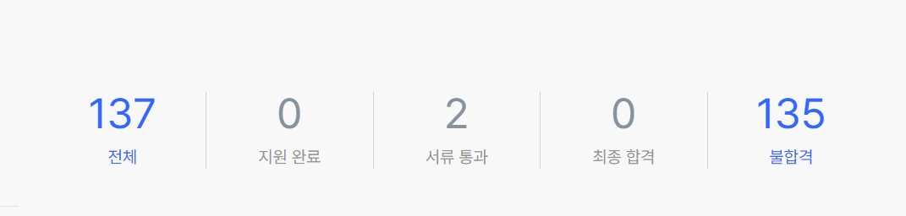
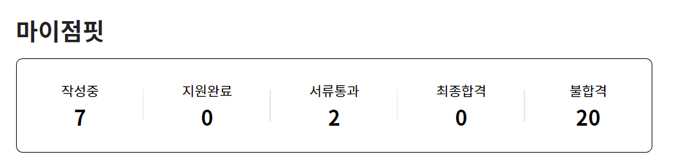
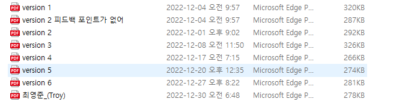

개발자가 되기로 마음먹은 2021년 5월부터 HTML, CSS를 시작해 2023년 2월까지 프론트엔드 개발자가 되기 위해 약 1년 반 가량 준비 끝에 드디어 내 자신을 **개발자**라고 소개할 수 있게 되었다. 1년 반 동안 정말 많은 일이 함께 했다. 22년 2월 대학을 졸업하고, 서울로 올라올 것을 준비해 6개월 간 학원에서 풀타임 강사로 돈을 벌고, 지금까지 계속 공부했던 시간들에 대해 드디어 보상을 받는 기분을 누리고 있다.

처음 개발자로 취업을 준비하면서 이력서와 자기 소개서를 작성하며, 면접을 보고, 합격 전화를 받기까지 과정을 기록해두고, 언젠가 또 다시 갖게 될 이 기간에 시행착오 없이 보낼 수 있기를, 또 내가 많은 분들의 도움을 받았듯 누군가에게 내 글이 도움과 힘이 되기를 바라며 취준 회고를 작성해보려 한다.

### 😅 겁 없이 지원하는 신입의 패기...

원티드 프리온보딩 코스를 끝낸 11월 말에 이력서를 작성하고, 12월 2일부터 원티드 프리온보딩 코스에 취업설명회를 했던 회사들부터 지원하기 시작했다. 12월 2일부터 1월 30일까지 원티드는 137개 회사, 점핏은 22개 회사, 프로그래머스와 자체 채용 플랫폼에 지원한 회사는 적어도 10개 정도라 생각되어 **약 170개** 정도의 회사를 한 달 반 동안 지원했다. (우리나라에 이렇게 스타트업이 많습니다... 😂)

우선 내가 지원하는 회사들은 대기업보다는 **스타트업**이었다. 그러다 보니 스타트업씬에 대해 이해가 필요했고 **유튜브 EO채널**과 같은 스타트업 전문 소개 채널과, **Plantum, 아웃스탠딩**과 같은 스타트업 전문 저널의 기사를 보며 어떤 스타트 업들이 있는지 조사하고, 투자를 받은 금액에 따라 나뉘는 시리즈, 회사 규모에 대해서도 이해할 수 있었다.

스타트업 씬의 흐름을 이해하자 회사의 규모에 따라 달라지는 개발자 채용 과정에 대해서도 이해할 수 있었다. 대체로 규모가 작은 회사일 경우 바로 면접을 보는 곳도 있었고, 규모가 시리즈 B이상의 회사들은 코테나 과제를 주어 일차적으로 거르는 듯 했다. 또, 지방러인 나에게 시리즈 후반의 회사일수록 강남에 위치하는 것도 새롭게 알 수 있었다. (서울 아직 어려워..)

하지만 이러한 규모 자체가 나에게 큰 기준이 되지는 않았다. 나에게 가장 중요했던 회사를 지원하는 기준은 회사가 **어떤 문제를 풀려고 하느냐, 또 어떤 서비스를 만들고 있느냐**였기 때문에 회사 서비스가 맘에 들면 무조건 지원했다. 스타트업은 신입을 잘 뽑지 않는다는 말도, 채용 시장이 얼어붙어 사람을 잘 뽑지 않는다는 말도 많이 들었지만 `내가 가능성이 보이면 무조건 나를 뽑을 것이다`는 마음으로 마음에 드는 회사들에 겁 없이 `인턴, 신입, 1년~ 3년 주니어`까지 모두 지원했다.

이렇게 공격적으로 지원한 결과를 정리해보면 **서류 합격 총 17개**, **과제 4번과 코딩테스트 5번**을 봤고, **7개의 회사의 기술 면접**을 봤다. 기술 면접까지 통과해 **최종 면접에 간 회사는 5개의 회사** 그중에서도 감사하게 **4개의 회사의 최종 오퍼**를 받았다.

최종 오퍼를 받은 곳들 중 한 개의 회사는 프론트엔드 인턴, 다른 하나는 프론트엔드 개발자로 지원했지만 프론트엔드는 부족해 보이지만 신입으로써 좋게봐주셔서 AI/ML 인턴을 제안해 주셨다. 두 개의 회사는 시리즈 B 회사의 1년차 React Native 개발자 포지션과 시리즈 C회사의 3년차 프론트엔드 개발자 포지션의 오퍼를 받았다.

어쩌면 무모하게, 또는 찌라시(?)처럼 이력서를 지원하다 보니 초반에 지원했던 가고 싶었던 회사들을 놓친 게 후회가 되었다. "좀 더 준비되었을 때 지원하면 좋았을텐데" 라고 후회되는 회사들도 있었지만, 이런 공격적으로 이력서를 넣은 덕분일까 이제는 진짜 넣을 회사가 없어 쫄릴 때 즈음에 (진짜 무서웠다...😓) 드디어 합격 소식이 하나 둘 씩 들려왔고, 원하던 회사에 합격해 현재 열심히 온보딩을 하고 있다.

### 😁 어딜 봐야 좋은 회사가 있을까?

취업을 준비하면서 가장 먼저 들었던 조언중 하나가 **내가 관심있는 채용공고들을 보고 어필해야할 포인트를 찾아라**였다. **그럼 그 채용공고들은 어디서 봐야 할까**에 대해 알기 위해 채용 플랫폼들을 조사했다. 내가 가장 많이 지원한 원티드와 점핏과 더불어 생각보다 많은 HR 플랫폼들이 있었다. 각각에 대해 경험을 토대로 정리해보았다.

#### 1. 원티드

원티드는 스타트업에서 일하고 싶은 나에게 가장 최적의 HR 플랫폼이었다. 원티드 프리온보딩 코스에 참여했기 때문도 있지만 내가 느낀 장점들로 정리해보면 다음과 같다

- **다양하고 많은 스타트업의 채용공고**

130개가 넘는 회사에 지원한 만큼 프론트엔드 직무만 해도 엄청나게 많은 회사들의 채용공고들을 볼 수 있었고, 스타트업을 목표로 한 나에게 너무 좋은 HR플랫폼이었고, 개별 회사들에 대한 투자 규모, 연봉 정보도 알 수 있었다.

- **기본적인 UI와 사용자를 배려하는 UX**

UI가 기본적으로 잘 정리되어 있고, 각종 이력서, 자소서, 면접 관련 컨텐츠 아티클과 이벤트도 많아 좋은 정보를 얻을 수 있었다. 원티드 자체 이력서 형식만 지원하는 것이 아니라 PDF형식으로 노션 이력서, 자기소개서, 포트폴리오를 올릴 수 있어서 가장 많이 활용했다. 그리고 사용자로써 느낀 가장 큰 장점은 **채용 담당자가 이력서를 열람했는지**를 확인할 수 있어서 과정이 어떻게 진행되고 있는지 알 수 있었다. ( 덕분에 5분마다 계속 확인하게 되는 건 함정... 🤣)

추가로 단점은 아니지만 AI로 이력서를 평가해 합격률을 봐주고 회사들을 추천해 주는데 크게 도움을 받지 못했다.

#### 2. 프로그래머스

프로그래머스는 코딩 테스트와 과제 연습 콘텐츠와 함께 다양한 채용공고들이 올라오기 때문에 많이 지원을 해보려 했다.

- 코딩 테스트와 과제 테스트를 이용한 데브 매칭

아쉽게 내가 지원하는 시기 막바지에 열리게 되어서 참여하지 못했지만 실력 적으로 자신 있고 프로그래머스 자체적으로 제공하는 문제들을 통해 준비한다면 너무 좋은 기회가 되겠다는 생각이 들었다.

- 깃허브와 연동가능한 이력서

이력서에 깃허브 계정과 연동해 내가 한 프로젝트의 기여도와 코드들에 대해 이력서에 담기는 게 다른 플랫폼들과 다른 큰 장점이라 생각되었다.

내가 느낀 아쉬운 점은 열람 여부를 확인하기 위해서는 일일이 확인해야 하고, 한달 넘게 기다려도 답이 없는 회사가 많아 어느 순간 사용하지 않았다. 이러한 이유는 한 회사의 면접에서 대표님과 면접을 보다 요즘 가장 많이 이용하는 채용 플랫폼들에 대한 이야기를 하게 되면서, 프로그래머스는 회사에서도 이력서가 들어왔는지 알림이 오지 않아서 확인하기 어려운 점이 있다고 듣게 되었다. 진실인지 아닌지는 알 수 없지만 답이 없는 회사들에 대한 이유를 유추할 수 있게 되었다.

#### 3. 점핏

점핏은 개발자 전용 채용 플랫폼으로 개발자에 특화된 컨텐츠들이 잘 담겨있는 플랫폼이다.

- 이력서와 자기소개서에 대한 팁

점핏은 원티드와 같이 커스텀된 이력서를 첨부할 수는 없지만 작성 화면에 나와있는 꿀팁들이 많은 도움이 되어서 이력서 수정할 때 참고할 수 있었다.

- 주니어 개발자들 채용을 위한 개별 페이지, 더 루키

다른 HR 플랫폼들과 다르게 주니어 개발자들을 위한 페이지가 따로 있어서, 일일이 필터링 하지 않고 주니어 개발자 공고를 볼 수 있게 좋은 UX를 가지고 있었다.

내가 느낀 단점이라면 페이지 접속시 마다 로그인 유지가 되지 않아 매번 새로 로그인해야 하는 부분이 개발자로써 조금 불편한 부분이 있었다.

#### 4. 인디스워크

인턴 포지션이 열린 회사들을 찾는 과정에서 발견한 플랫폼이다.

- 오픈 카톡방을 이용한 알림

인디스워크는 직무별 오픈카톡방을 운영하고 있어서 페이지에 올라온 공고들을 카톡으로 쉽게 확인할 수 있었다.

- 인턴 포지션 공고

앞서 설명했던 플랫폼들은 인턴 포지션에 대한 공고가 적지만, 인디스워크는 신입, 인턴에 대해서도 많은 공고를 제공한다.

사용하면서 아쉬웠던 점은 개발자 오픈 카톡방이 따로 있는 게 아니라 이공계 직무로 묶여 있다 보니 다른 직무 공고들에 묻혀서 확인을 잘 못하는 경우도 있었다.

직접 사용하지는 않았지만 이외에도 [랠릿](https://www.rallit.com/positions?job=FRONTEND_DEVELOPER&jobGroup=DEVELOPER&jobLevel=IRRELEVANT,INTERN,BEGINNER,JUNIOR&pageNumber=1), [더 팀스](https://www.theteams.kr/recruit?o%5B%5D=1&o%5B%5D=2&o%5B%5D=3&o%5B%5D=5&o%5B%5D=6&o%5B%5D=7&o%5B%5D=8&o%5B%5D=9&o%5B%5D=10&o%5B%5D=44&o%5B%5D=45&o%5B%5D=11), [그룹바이](https://groupby.kr/positions), [잡플래닛](https://www.jobplanet.co.kr/job), [블라인드 하이어](https://www.blindhire.co.kr/job?jobFunctionId=4&yearOfExperience=1to2,3to5,6to9,10plus&orderBy=popularity) 등 많은 HR 플랫폼 속에서 인턴, 신입, 주니어 개발자 채용공고에 대해서 알아보려 노력했다.

채용공고를 위와 같은 플랫폼에 올리지는 않았지만 그리팅과 같은 서비스를 이용한 자체 채용 사이트를 운영하는 경우도 많아서 좋은 회사들을 찾으려 노력했다. **유튜브 EO채널**과 **Plantum**과 같은 스타트업 전문 저널도 찾아보면서 소개된 회사들에 대해 검색해보고 채용 포지션이 열려 있다면 지원했다.

### 🙄 글쓰기가 제일 어려워

취업 준비 과정에서 가장 어려웠던 것은 어떤 이력서가 좋은 이력서인지, 어떤 포트폴리오가 좋은 포트폴리오인지 깨닫는 것이었다. 그래서 처음엔 이력서를 무작정 작성해서 제출했다. 지원하고 결과가 나오는 사이에 좋은 이력서들에 대해서 검색하고 보는데 대부분 경력자 이력서다 보니 나와 같은 신입 개발자 분들이 작성한 이력서에 대해서 찾기가 어려웠다. 그래도 좋은 이력서들과 이력서 관련 강의들을 많이 찾아보면서 어떤 점을 중요하게 어필해야 하는지 큰 그림을 이해할 수 있었다. 공개되어 있어 내가 참고한 이력서와 이력서 강의는 다음과 같다.

(혹시 이 글을 보신다면 너무 많은 도움이 되었다고 감사하다고 말씀드리고 싶다.😆)

#### 이력서 예시

- [워니님의 이력서](https://wonny.oopy.io/)

- [이동욱의 이력서](https://jojoldu.github.io/)

- [김찬연님의 이력서](https://resume.chayeoi.site/_)

- [김효재님의 이력서](https://www.hyojae.info/)

- [오준상님의 이력서](https://www.notion.so/choi2021/Oh-Jun-Sang-cb560e11bf1742e5bfdbc00f6c4b8a35?pvs=4)

- [안수진님의 이력서](https://www.notion.so/choi2021/c3e146341daf412ea4a1a19c650804c3?pvs=4)

- [이건님의 이력서](https://www.notion.so/choi2021/Geon-Lee-0a2ead807ec24791b5f75a5d0974fca8?pvs=4)

- [yukina1418님의 이력서 작성팁](https://velog.io/@yukina1418/%EC%A3%BC%EB%8B%88%EC%96%B4-%EA%B0%9C%EB%B0%9C%EC%9E%90-%EC%9D%B4%EB%A0%A5%EC%84%9C-%EC%93%B0%EB%8A%94-%EB%B2%95)

#### 이력서 강의

- [포트폴리오를 부탁해 (원티드, 메이커 준님의 강의)](https://www.wanted.co.kr/events/vod/talk82)
- [워니님의 인프런 이력서 강의](https://www.inflearn.com/course/%ED%95%A9%EA%B2%A9%ED%95%98%EB%8A%94-%EC%9D%B4%EB%A0%A5%EC%84%9C-%EC%9E%91%EC%84%B1-%EA%B0%80%EC%9D%B4%EB%93%9C/dashboard)

- [원티드 커리어 챌린지](https://www.wanted.co.kr/events/pre_challenge_career_1?utm_source=wanted&utm_medium=share)

이력서들을 많이 보면서 어떻게 작성해야 할지, 어떤 점을 어필해야 할 지를 조금씩 알아갔지만, 실제로 내가 작성하는 것은 전혀 다른 문제였다. 운이 좋아 주변에 현직에서 일하고 있는 선배들과 친구들이 있어 좋은 피드백들을 받을 수 있었지만, 내가 부족해 말해준 여러 부분들을 직접 적용하고 어떤 것을 어필해야 하는지 100% 다 받아 들이지 못했다.

이력서에서 받았던 피드백 중 중요했던 부분은 이력서가 **매력적이어야 한다**는 점이었다. 매력적이지 않은 이력서는 하루에도 수십 개의 이력서를 보는 채용 담당자 분들과 개발자 분들의 눈에 들어오지 않을 것이라는 뜻이었다. 물론 회사 기술 스택과 잘 맞아서 당장 사람을 뽑아야 하는 회사에서 뽑힐 수 있지만 좋은 회사일수록 기준이 높고, 우선 서류 전형에서 통과하기 위한 **내가 어필할 수 있는 이력서의 매력**은 무엇인지 고민이 필요했다.

#### 🤔 내가 어필할 수 있는, 어필해야 하는 내 이력서의 매력

내가 어필할 수 있는, 어필해야 하는 매력 포인트를 찾기 위해서는 다른 어떤 것보다 **경험 정리**가 필요했다.

##### 1. 어떤 프로젝트를 담을까

먼저 경험 정리에서는 **나의 어떤 프로젝트**를 이력서에 담을지 정해야 했다. 나는 내가 만들었던 프로젝트들 중에서 대학생 시절, 친구들과 함께 만들어 현재도 실 사용이 되고 있는 `지스트 청원서비스`와 9월부터 혼자 서비스에 대해 기획하고 만들고 있던 개인 프로젝트 서비스 `모으잡` 두 가지 프로젝트를 이력서에 담기로 결정했다.

이렇게 두 가지 프로젝트를 선택했던 이유는 두 가지 프로젝트가 각각 다른 경험 포인트를 갖는다는 점과 비교적 높은 완성도 때문이었다.

`지스트 청원서비스`는 프론트엔드 4명, 백엔드 4명에서 진행한 프로젝트로, 학교에서 현재도 운영하면서 피드백을 받아 반영하는 등의 협업과 하나의 서비스를 실제 배포, 운영까지 이어진 경험을 한 점을 어필할 수 있었다.

`모으잡`의 경우는 직접 전체 서비스를 기획하면서 필요한 부분들을 찾아서 개발하는 과정을 하나 하나 기록으로 남겼고, Next JS를 이용해 회원 인증, CSR과 SSR, SEO, 성능에 대한 고민했던 부분들을 어필할 수 있었다.

##### 2. 이력서와 포트폴리오는 다르다

위의 정리한 프로젝트 별 각각의 포인트만 정리해서 이력서를 우선 작성했다. 작성한 이력서를 이용해 50개 정도 회사에 지원하고 단 한 곳의 회사의 서류 합격을 하면서 이력서가 잘못되었다고 느꼈고, 내 나름 수정하고 다시 80개 회사에 지원하고 2~3개의 회사의 서류 합격을 할 때 즈음에 신입 지원자 분들 이력서와 포트폴리오를 보면서 **이력서 만으로는 안된다**는 생각을 했다.

앞서 말한 대로 채용 담당자 분들과 개발자 분들은 바쁘시다... 하루에도 몇십 개의 이력서와 포트폴리오를 봐야 한다. 그러기 위해서는 먼저 이력서에서 관심 있는 지원자를 분류하고, 이후에 프로젝트들에 대해 자세히 살펴보게 된다고 한다. 이러한 이해가 부족했던 나는 그저 내가 `뭘 했는지`에 대해서 만 줄줄이 적어 다섯 페이지나 되는 양을 채우고 있었다. 그리고 관심을 가져 주셔서 프로젝트에 대해 확인하시려 해도, 프로젝트 전체에 대해 정리된 글이 없어 불편함을 주고 있다는 것을 깨달았다.

글은 읽는 사람 기준에서 작성해야 하는 점을 다시 깨닫고, 프로젝트에 **README**와 **포트폴리오**에 프로젝트 별로 이해를 도울 수 있게 전체적인 서비스 흐름, 서비스 타겟, 내가 고민한 부분들과 기술 선정 이유, 문제와 해결한 방식 등에 대해서 새롭게 작성하기 시작했다.

포트폴리오를 작성하면서 가장 크게 느낀 점은 전체적인 프로젝트 흐름을 되돌아보면서 **내가 놓쳤던 경험**들에 대해 되돌아 볼 수 있었고, 각각에 페이지에 대해 설명하면서 `진짜 고민했던 부분`들을 다시 글로 담아내 풀어내면서 기존에 이력서에 축약되게 표현했던 문장들을 좀 더 배경을 담아서 설명할 수 있었다. 풀어쓴 글을 다시 이력서에 요약해서 작성하면서 좀 더 잘 `원인과 결과`를 정리해서 작성할 수 있었다. 그리고 이렇게 작성한 부분들에 대해서 프로젝트 회고와 하루하루 개발 경험을 작성한 **블로그의 글과 연결해** 신빙성을 높이고 더 많은 고민들에 대해 담아낼 수 있었다.

이렇게 수정해서 제출하면서 이전과는 달리 30개 중 적어도 5개에서 7개의 회사의 서류 합격을 하게 되며 급격하게 합격률이 올라갈 수 있었고, 신기하게 원티드에 첨부해 놓은 이력서를 보시고 직접 제안을 주신 회사도 한 곳 있었다.

##### 3. 숫자로 표현하면 좋다던데...

많은 강의와 이력서들을 보면서 경험에 대해 `숫자로 표현해라`, `데이터로 표현해라`라는 말을 많이 들을 수 있었지만, 내가 한 경험에서 **어떤 걸 숫자로 나타낼 수 있을까** 고민이 되었다. 내가 가진 어필할 수 있었던 포인트 중 하나는 열심히 작성해 놓은 블로그 글이었다. 단순히 블로그에 글을 작성하고 있다고 표현할 수도 있지만 **총 80 여 개의 글**을 작성했다고 자기소개에 담아 표현할 수 있었다.

협업 경험으로는 원티드 프리온보딩 과정에서 husky를 이용해 ESLint와 Prettier 설정을 자동화해 코드 스타일을 통일했던 적이 있었는데, 단순히 적용했다라고 할 수 있지만 결과적으로 **코드 리뷰 시간을 1시간 정도 절약**할 수 있었다고 작성했다. 이 부분은 면접에서도 어떻게 한 시간을 단축했다고 생각하는 지 질문을 받을 수도 있었다.

프로젝트에서는 주로 성능 측정했던 부분에서 숫자로 표현할 수 있었다. 모으잡의 경우, Next JS를 이용해 SEO와 CSR에서 SSR로 채용공고 리스트를 받아오게 수정했었다. 이 부분도 단순히 한 일로 작성할 수도 있지만, light house를 이용해서 SEO와 SSR 적용 전의 성능을 측정하고, 각각을 적용했을 때 성능을 측정해 LCP를 **1.7초에서 0.3초로 **page 성능 점수를 **94점에서 99점** 개선한 내용을 데이터로 표현했다. 성능을 측정한 부분은 실제 면접에서 어떻게 개선했는지, 확인한 방법 등에 대해 질문을 받고 이야기할 수 있었다.

데이터로 작성하라는 말에 도대체 어떻게 하는 거지라고 생각했지만 돌아보니 설명할 수 있는 포인트들이 많았다. 데이터로 표현하고 정리하는 것은 현업으로 일할 때 객관적인 지표가 되기 때문에 중요한 부분이라 생각되어, 계속해서 고민해야 할 포인트라 생각되었다.

##### 4. 이력서와 포트폴리오 형식에 대한 깨알 팁

각 플랫폼 별로 이력서 형식을 지원하지만, 커스텀하고 싶은 마음에 노션 이력서와 포트폴리오 형식을 사용했다. 제출 형식을 PDF로 추출할 수 있는데 글자 크기, 줄 간격 등을 고려해 이력서는 `70%`, 포트폴리오는 `60%`정도로 맞춰서 추출했다.

이력서 형식의 경우 검색 시에 많이 나와 참고할 게 많았지만 포트폴리오의 경우 노션의 갤러리를 이용해 첨부하는 경우가 많았는데, 그럴 경우에 또 다른 페이지로 연결되어야 하고 해당 페이지를 PDF로 추출하게 될 때 표로 변환되어 보기 좋지 않은 문제가 있었다.

그래서 포트폴리오를 위한 노션 페이지를 만들고 프로젝트들에 대한 설명과 사진을 첨부해 프로젝트의 상세 내용을 담아 제출했다. 다른 분들 중에는 노션외에 PPT로 작성하는 경우도 있다고 한다.

### 😎 기본부터 챙기자 기술 면접

서류 전형에서 어느 정도 통과하고 기술 면접이 관건이 되기 시작했다. 면접을 준비하면서 세 가지를 명심하고 준비하려 했다.

#### 1. **최대한 많은 면접에 직접 참여하자**

이력서 피드백을 해준 선배들의 이야기 중 나에게 와닿았던 말은 `첫 면접이 가장 가고 싶은 회사일 때가 가장 무서운 것`이란 말이었다. 그만큼 면접장에서 경험이 중요하다는 것을 의미하는 말이었다. 광주에서 살고 있었기 때문에 면접을 참여하기 위해 교통비, 숙박비 등의 부담이 있었지만 기회가 주어지면 최대한 많이 참여하려 했다. 서류 합격한 회사 중 처음부터 많은 관심을 갖고 지원하지는 않은 회사였지만, 이후 내가 정말 가고 싶은 회사에서 면접을 잘 보기 위해, 경험을 위해서 참여한 회사들도 있었다.

상대방에게 나의 이야기를 하는 것도 어려운데, 나를 평가하는 자리에서 올바르게 내 이야기를 할 수 있게 되는 데에는 당연히 많은 시간이 걸린다. 특히 개발자 직군은 기술 면접에서 지원자의 경험 뿐 아니라, 직무 관련 지식들을 직접 물어보고 어디까지 알고 있는지 확인하는 자리이기 때문에, 받은 질문들 하나 하나가 나만의 족보가 되는 기회가 되었다. `현업에서 일하기에 내가 이런 부분이 부족하구나`, `이 회사는 이런 부분을 중요하게 생각하구나` 등을 배울 수 있었고, 초기에는 다른 분들이 정리해 주신 면접 질문들을 이용해서 공부를 했지만, 이후에는 면접 때 받았던 질문들 위주로 복기해 **나만의 면접 질문 리스트**를 만들었다.

정리한 질문들은 스터디 시간의 주제로 정하고 발표하며 말하는 연습을 하고, 블로그 글로 작성하면서 완전히 이해하려 했다. 말하기 연습과 학습 경험이 쌓이면서 후반에 갈수록 기술 면접에서 최종 면접으로 이어져 갈 수 있었다.

##### 😊 면접 초반 참고한 블로그

- [sylagape1231님의 FE 취준생을 위한 포스트/자료모음](https://velog.io/@sylagape1231/%ED%94%84%EB%A1%A0%ED%8A%B8%EC%97%94%EB%93%9C-%EC%B7%A8%EC%A4%80%EC%83%9D%EC%9D%84-%EC%9C%84%ED%95%9C-%EA%B2%8C%EC%8B%9C%EA%B8%80%EC%9E%90%EB%A3%8C-%EB%AA%A8%EC%9D%8C#-%EC%B7%A8%EC%97%85-%EB%B0%8F-%EC%9D%B4%EB%A0%A5%EC%84%9C--%ED%8F%AC%ED%8A%B8%ED%8F%B4%EB%A6%AC%EC%98%A4-%EC%A4%80%EB%B9%84)

- [realmojo님의 프론트엔드 개발자 기술면접 인터뷰 질문 모음](https://realmojo.tistory.com/300)

##### 📃 내가 받았던 면접 문제

내가 정리한 면접 질문 리스트는 다음과 같다. 괄호 안의 숫자는 같은 질문을 받았던 경우를 의미한다.

- 인성

  - 자기소개 (6)
  - 지원 동기 또는 저희 회사를 어떻게 알게 되셨나요? (5)
  - 화학 전공에서 개발자가 되기로 선택한 이유 (4)
  - 프론트엔드 개발자가 되기로 선택한 이유 (3)
  - 현재 그리는 로드맵과 방향 (2)
  - 주변에서 말하는 나의 장점과 단점, 장점이 내가 바라는 방향인지 (2)
  - 어떻게 공부하고 있는지 최근 본 블로그나 책 (3)
  - 프로그래밍 언어별 차이를 느낀점
  - 어느 정도 경력이라 생각하는지
  - 다른 사람들로부터 영향을 받아서 바뀐 경험 또는 내가 영향을 준 경험
  - 개발에서 내가 생각하는 중요한 3가지
  - 어떻게 온보딩할 건지, 어려움이 발생했을 때 어떻게 해결할 지
  - 완성도와 기간 내 마무리 중 어떤 걸 중요시 할지

- 프로젝트

  - 프로젝트 공통 질문
    - 기술적으로 가장 어려웠던 부분
    - 의도하지 않게 동작했던 경험
    - 실제로 사용자의 피드백을 들었던 경험
  - 모으잡
    - Next JS와 SSR 언제 왜 썼는지
    - Authentication 과정에 대한 설명
    - 모으잡을 왜 기획했는지, 누굴 타겟으로 하는지
  - 지스트 청원
    - 프로젝트에서 가장 어려웠던 문제
    - 현재 사용되고 있는 서비스인지 (4)
    - authentication설계를 했다고 했는데 어떻게 보관을 했는지
    - 지스트 청원서비스에서 인증 flow와 예외처리 방식
    - 왜 학교 이메일을 기준으로 설계했는지
    - 협업 과정에 대한 설명, 협업에서 맡았던 역할
    - 협업에서 느낀 어려움과 해결해나간 방향 (3)
    - Git flow 전략과 왜 develop브랜치만 남아있는지

- 자바스크립트

  - Callback, Promise Async-await 에 대해
  - 자바스크립트가 멀티 스레드로 보이는 이유
  - setTimeOut(callback,0)로 했을 때 처리 과정
  - 함수에서 전달받은 인자를 왜 변경하면 안되는지
    - call by reference, call by value
  - 깊은 복사와 얕은 복사 (3)
  - 오래된 라이브러리가 callback으로 되어있을 때, 어떻게 async-await으로 사용할 수 있을지
  - 이벤트 버블링과 캡처링 (3)
  - 함수 선언문과 arrow 함수의 차이점
  - 클로저란
  - 에러 처리를 어떻게 하는지

- CS

  - 브라우저 랜더링 과정에서 js의 역할은?

  - 퍼블리싱이란

  - Http/https의 차이점(3)

    - 대칭키와 비대칭키 flow 과정 설명

  - CORS가 뭔지, 해결 방법 (2)

  - 브라우저 스토리지에 대한 설명

    - Cookie, localstorage, session storage

  - JWT가 어떻게 이루어져 있고 암호화 되어있는지

  - RESTful API

  - stack과 queue의 특징과 브라우저에서의 예

  - CDN에 대해서 알고 있는지

  - 렌더링 과정과 JS가 참여하는 시점은? reflow와 repaint

  - 어제까지 잘되다가 갑자기 흰 화면이 나왔을 때 어떻게 해결할지

  - 디자인 패턴에 대한 설명

- 라이브러리, 프레임워크

  - 리액트

    - 리액트 성능 보장 과정, Vdom의 역할과 실제로 성능이 더 좋을까
    - 불변성을 지켜야 하는 이유
    - Props와 state의 차이
    - 컴포넌트 설계 방식
    - React 컴포넌트 업데이트 방식
    - Data binding, 단방향과 양방향 바인딩의 차이
    - 상태 관리의 기준,전역 상태는 어떤 걸 하는지 (3)
    - Redux를 사용하다가 React Query와 Context API로 바꾼 이유는? (2)
    - Dependency Array에 대한 질문
    - React.memo, useCallback, useMemo의 역할
    - Hook에 대한 설명
    - useState에서 상태를 참조할 수 있는 방법
    - Hook을 왜 조건문이나 반복문 내부에 사용할 수 없는지

  - Next JS

    - SEO와 CSR과 SSR의 차이, 직접 사용한 경험
    - 왜 구글 엔진은 CSR에서도 가져갈 수 있을까

  - Vite

    - 왜 vite가 빠른지 (사전과제를 CRA가 아니라 Vite로 진행해서 받은 질문)

#### 2. 기본에 충실하자

대답하지 못해 후회되는 질문들을 복기하며 **기본에 충실하지 못 했구나**라는 생각이 많이 들었다. 위의 질문 리스트들을 보면, 개발을 하면서 마주칠 수 밖에 없는 문제들이지만, 어떤 라이브러리가 `마법처럼` 해줘서, 또는 그냥 `아무 생각 없이 사용해서` 대답할 수 없었다. 특히 이런 생각이 많이 든 부분은 리액트에 대한 질문이었다. VDOM이 뭔지, 왜 사용되는지나 useState, useEffect와 같은 hook에 대한 설명해달라는 기본적인 질문에도 당황하고 말하지 못했었다.

대답하지 못했던 질문들에 대해 부끄럽고, 후회가 되서 하나,하나 주제를 잡고 블로그에 정리하거나 스터디에 발표하며 정리하기 시작했다. 이렇게 부족한 모습들을 부족한 것에 그치는 것이 아니라 정리하고 나니, 유사한 질문에도 잘 대답할 수 있었다. 더 좋았던 점은 이렇게 면접에서 부족해서 정리한 블로그 글을 면접관 분들이 읽으시고 `블로그 글을 읽었다. 최근에 받은 질문들 중에 기억남는 질문은 어떤 게 있는지` 물어보시기도 하고 블로그로 부족한 부분들에 대해 글로 정리하고 있다는 말에`부족한 부분을 채우려하는 게 신입에게 제일 중요하다`고 조언해 주시는 CTO님도 계셨다.

면접에 엄청 어려운 문제들은 `정말 어디까지 알고 있는지 ` 궁금해서 물어볼 수도 있지만, 대부분 내가 경험한 것에서 대답할 수 있는 질문이었기 때문에, 이런 기본을 챙기는 게 가장 중요하다고 생각했다.

#### 3. 나도 회사를 평가해야 한다

최종 합격을 하고 어디를 갈 지 고민을 하면서 들었던 부분은 면접이 나만 평가 받는 자리가 아니다 라는 점이다. 어느 회사로 갈 지 고민할 때 연봉도 중요하지만, **함께 일할 사람들**이 나에게 더 중요했다. 그렇기 때문에 면접에서 나를 평가하기 위해 질문 속에서 느껴지는 함께 할 팀의 분위기와 면접관 분들의 모습, CTO님과의 면접 경험이 나에게 너무 중요한 기준이 되었다. `나라는 사람`을 궁금해 하는 회사인지 면접의 질문 속에서 느껴졌다. 정말 안 좋았던 면접 경험은 내가 한 프로젝트에 대해서 아무 질문도 없이 그저 시험 치듯 기술 질문만 1시간 동안 받았던 적도 있었다. 사람들이 왜 면접 과정이 **소개팅과 같다**고 하는지 이해가 되었다.

### 🎈 마치며

이제 회사를 다닌 지 3일 차가 되었다. 아직 온보딩 기간이라 어떻게 회사가 돌아가는 지 완전히 이해하지 못했고, 사수 분께 이것 저것 물어보면서 열심히 배우는 과정이지만, 내가 기대했던 모습 이상의 회사라 느껴져 더 열심히 배우고 기여하고 싶은 마음이 든다. 최근 카카오에서 채용 과정을 중단하는 사태도 발생하면서 정말 나는 `운이 좋아서` 좋은 회사와 좋은 사람들을 만나서 시작할 수 있었구나 생각이 많이 들었다. `무조건 난 개발자가 될거니까`라는 무대포로 시작했지만 여러 노력과 운이 합쳐져 좋은 결과를 만들어진 것 같다. 이제 지원을 시작하시는 분들에게 조금이라도 내 글이 도움이 될 수 있기를, 나와 같은 시행착오를 겪지 않기를 바라며 글을 마무리한다.

(혹시 궁금한 부분 댓글로 달아 주시면 업데이트 하겠습니다)
