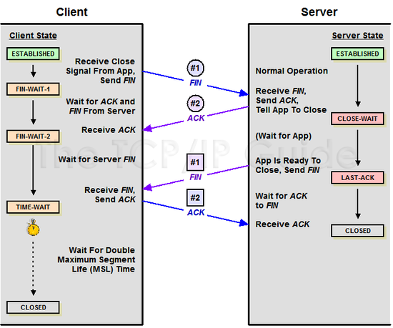

## 😁 Google.com 또는 naver.com을 브라우저에 검색했을 때 일어나는 일

면접 단골 질문 중 하나인 **Google.com 또는 naver.com을 브라우저에 검색했을 때 일어나는 일**은 우리가 서버에 요청을 보내고 응답을 단순히 받는 데에서 그치는 것이 아니라 그 사이에 숨어있는 네트워크 통신과 관련된 과정을 물어보는 질문이다. 면접 과정에서 한번도 질문을 받아본 적은 없지만, 네트워크에 대해서 이해할 필요가 있을 것 같아 각 과정에 대해서 이해한 만큼 정리해보려 한다.

### 🙄용어 정리

하나의 질문이지만 관련된 내용에는 다양한 네트워크 관련 지식들이 연관되어 있기 때문에 먼저 용어를 정리해보려 한다.

- Protocol: 정보를 주고 받는데 필요한 형식, 대표적으로 HTTP, SSH와 같은 프로토콜이 있다.
- 패킷: 네트워크를 통해 데이터를 주고 받기 위해 형식에 맞게 쪼개진 데이터 조각
- TCP/IP: 컴퓨터들이 네트워크로 정보를 주고 받는데 필요한 프로토콜의 집합
- TCP (Transmission Contorl Protocol): 연결 지향 방식으로 신뢰성 보장이 필요한 데이터를 주고 받기 위한 프로토콜
- IP (Internet Protocol): 네트워크에서 정보의 송수신에 대한 프로토콜
- DNS (Domain Name System): 도메인과 관련된 시스템, google.com을 해당 서버의 IP주소로 mapping하기 위한 시스템
- ARP (Address Resolution Protocol): IP주소를 물리적 네트워크 주소(MAC 주소)로 매칭하기 위한 프로토콜
- MAC 주소: 우리가 사용하는 기기의 고유한 네트워크 주소, 물리적 주소를 의미한다.

그러면 위의 용어들을 네트워크 통신 과정을 따라가며 더 자세히 알아보자.

### 🎈TCP/IP 4계층

우리가 보내는 요청과 서버의 응답을 받는 데에는 TCP/IP라는 **여러 개의 프로토콜에 각각의 형식에 맞는 데이터**들을 담아 주고 받게 된다. TCP/IP는 4개의 층/ 프로토콜로 구성되는데 각각에 대해 먼저 정리해보자.

#### Application Layer

어플리케이션끼리 주고 받을 데이터를 담는 계층으로, HTTP 프로토콜과 메일을 보낼 수 있는 SMTP 프로토콜 등이 사용된다.

#### Transport Layer

데이터를 보내는 송신 호스트와 데이터를 수신하는 수신 호스트 사이에 데이터가 신뢰성 있게 전달될 수 있게 하는 계층으로 포트 번호를 이용하고 TCP, UDP와 같은 프로토콜이 사용된다.

Transport Layer에서 송신자 입장과 수신자의 입장에서 Transport Layer의 처리가 다르게 되는데 각각에 대해 정리하면 다음과 같다.

- 송신자는 Application layer에서 전달 받은 메세지를 segment로 쪼개고, segment의 헤더에 출발지와 도착지의 포트 번호를 추가한 후 전송한다.

- 수신자는 segment로 나뉜 데이터를 다시 합친 후에 header를 읽고 포트 번호를 확인해 application layer로 메세지를 전달한다.

#### Internet Layer

송신한 데이터를 수신할 호스트까지 전달하기 위해 사용되는 계층으로 IP 프로토콜과 ARP 프로토콜을 이용해 데이터를 전달한다.

#### Network Access Layer

네트워크에 직접 연결된 기기 간 전송을 할 수 있게 하는 계층으로, Ethernet 프로토콜이 이용된다.

이제 실제 브라우저에 주소를 입력했을 때 과정을 쫓아 가보자

### 📡 TCP/IP의 흐름

먼저 `http://www.google.com`을 브라우저에 입력하는 것은 우리가 해당 주소의 구글 서버의 80포트에 HTTP Request를 보내는 것이다. 이러한 요청을 처리하기 위해서는 우리의 데이터가 패킷에 담겨져야 하는데 이때 TCP/IP 4 계층에 맞게 데이터를 담아서 보내게 된다. 간략하게 정리하면 다음과 같다.

- Application Layer: 우리가 요청할 HTTP Request 내용을 담는다.
- Transport Layer: 내 컴퓨터의 포트 번호와 구글 서버의 80 포트 번호를 담는다. (TCP이기 때문에 더 많은 내용이 담긴다)
- Internet Layer: 내 컴퓨터의 IP주소와 구글 서버의 IP주소를 담는다.
- Network Access Layer: 내 컴퓨터의 MAC주소와 구글 서버의 MAC주소로 물리적 연결을 위한 정보를 담는다.

여기서 중요한 점은 Internet Layer와 Network Access Layer에서 **구글 서버의 IP주소**와 **구글 서버의 MAC주소**를 알아내야 한다는 점이다. 여기서 필요한 것이 바로 **DNS**와 **ARP 프로토콜**이다. 각각에 대해서 조금 더 알아보자.

#### 👉 DNS (Domain Name System)

DNS는 우리가 입력한 domain주소를 이용해서 해당 서버의 IP주소를 알아내는 방법이다. 그래서 DNS는 흔히 **전화번호 북**에 많이 비유되는데 예를 들어 "청룡반점"이라는 중국집에 짜장면을 주문하고 싶다면 "청룡반점"만 알아서는 전화(네트워크 연결)를 할 수가 없기 때문에 청룡반점의 **전화번호**를 알아야 하고 이러한 전화번호가 기록되어있는 전화번호부를 이용해서 전화번호를 찾을 수 있다.

위 예제에서 청룡반점을 구글 서버로, 짜장면 주문을 요청, 청룡반점이란 가게 이름을 도메인, 전화번호를 IP주소, 전화번호부를 DNS로 각각 매칭 시킬 수 있다. 이렇게 도메인을 사용하는 이유는 숫자로만 이루어진 IP 주소를 직접 입력해도 되지만, IP 주소가 바뀌는 경우가 생기고 (AWS 인스턴스를 탄력적 IP를 사용하지 않았을 때 매번 달라지는 IP주소와 도메인 주소) 숫자보다 google.come이 훨씬 기억하기 쉽기 때문이다.

그러면 이제 DNS를 이용해서 도메인을 IP로 바꾸는 과정에 대해 알아보자.

1. DNS를 찾는 과정에서 가장 먼저 확인하는 곳은 `로컬 DNS 서버 `로 로컬 DNS 서버에 캐싱된 정보를 확인한다. 이때 정보가 없다면 `Root DNS 서버`에 요청을 보낸다.

2. Root DNS 서버는 전달받은 도메인 정보 중에서 가장 마지막 부분인 `.com`에 해당하는 DNS 서버의 IP주소를 로컬 DNS서버에 반환한다.
3. 로컬 DNS 서버는 전달받은 IP주소로 `.com DNS 서버`에 요청을 보내면 `google.com`의 DNS 서버의 IP주소를 반환한다.
4. 로컬 DNS 서버는 전달받은 `google.com DNS 서버`에 요청을 보내면 `google.com DNS 서버`가 가진 여러 개의 호스트 네임별 IP주소 중에서 `www.`에 해당하는 IP 주소를 반환한다.
5. 마지막으로 전달받은 IP 주소를 로컬 DNS 서버가 브라우저에 전달한다.

위와 같은 방법을 통해서 IP주소를 알아내 Internet Layer에 요청을 받을 `www.google.com`의 IP주소를 담는다.

[AWS의 DNS 이미지]

#### 🙂 ARP (Address Resolution Protocol)

ARP는 DNS를 이용해 찾아낸 IP주소를 물리적인 기기의 MAC 주소로 바꾸는 프로토콜로, 호스트, 라우팅을 해주는 장비가 가지는 논리적 주소인 IP 주소와 하드웨어, 기기별로 할당된 고유한 MAC주소를 Mapping하는 방법이다.

이때 들 수 있는 의문은 **왜 IP주소를 아는데 MAC 주소까지 필요로 할까**이다. 이점을 이해할 때 중요한 것은 우리가 찾아낸 구글의 IP 주소가 구글 서버 기기가 사용하는 `Private IP`가 아니라 공유기와 같은 네트워크 주소에서 사용되는 `Public IP`였다는 점이다.

예를 들어 택배를 받는데 주소까지 입력해서 우리집 건물 주소까지는 입력했지만 상세주소로 몇 호인지를 적지 않아 택배를 받을 수 없는 상황이 되는 것이다.

TCP/IP 4 계층의 기준으로 보면 IP주소와 MAC 주소에 대한 정보를 **입력해야 하는 계층이 다르기 때문에** 필요하다고 할 수 있다.

이렇게 각각의 IP주소와 MAC주소를 알아와 TCP/IP 계층 별 필요한 정보를 채웠으니 이제 요청을 보낼 수 있겠다라고 생각했지만, 여기서 끝나는 것이 아니라 TCP의 handShaking 과정이 필요하다.

#### ✨ TCP의 3-way Handshaking과 4-way Handshaking

TCP에 대해 설명하면서 데이터가 신뢰성 있게 전달될 수 있게 한다라고 설명했는데, 이러한 신뢰성을 보장할 수 있는 것은 바로 이러한 Hand-shaking과정 덕분이다. 정확하게 데이터를 전송하기 위해서 client와 server 간의 데이터 전송이 가능한 상태인지 확인이 필요하다. 이러한 과정을 `3-way Handshaking`이라고 한다. 이러한 handshaking 과정을 위해 Transport Layer에 포트정보 뿐 아니라 flag정보들을 패킷에 담아 주고 받는다. 3-way Handshaking 과정은 다음과 같다.

- client에서 SYN flag를 담은 패킷을 server로 보낸다.
- server 는 전달 받은 SYN 패킷을 받고 요청을 수락하는 ACK과 SYN flag를 담은 패킷을 client에 보낸다.
- client는 SYN과 ACK flag를 담은 패킷을 받고 다시 ACK flag를 담은 패킷을 보낸 후에 서로 데이터를 주고 받는다.

데이터 전송이 끝날 때에도 handShaking이 필요한데 이때 사용되는 것을 `4-way Handshaking`이라 한다. 4-way Handshaking 과정은 다음과 같다.

- client에서 FIN flag를 담은 패킷을 보낸다.
- server는 ACK flag를 담은 패킷을 보내고 Client는 server의 Fin flag를 받고도 늦게 오는 패킷을 기다리는데 이때를 `TIME_WAIT`상태라 한다.
- server에서 통신이 끝난 후에 FIN flag를 담은 패킷을 client에 보낸다.
- client는 ACK flag를 담은 패킷을 보내면 연결이 종료된다.

### 마치며

네트워크 단에서 이렇게 복잡한 과정들을 통해서 이루어지고 있다는 것을 처음 알게 되었다. 사실 정리하지 못한 깊은 내용이 엄청 많지만 우선은 현재 이해한 만큼만 이라도 정리하고 싶어 작성하게 되었다. 브라우저에 전달 받은 HTML 페이지가 렌더링 되는 과정에 대해서는 이미 다른 글에서 다루었기 때문에 생략했다. 이 글도 공부해서 더 알게 되는 만큼 계속해서 수정하고 업데이트 해나가야 할 것 같다.

[참조]

- [수리의 TCP/IP (우아한 테코톡)](https://www.youtube.com/watch?v=BEK354TRgZ8&t=85s)

- [DNS가 뭔가요? + 도메인, A Record, CName (얄코)](https://www.youtube.com/watch?v=6fc9NAQkcv0)

- [Transport Layer responsibilities](https://www.geeksforgeeks.org/transport-layer-responsibilities/)

- [DNS란 무엇입니까? (AWS)](https://aws.amazon.com/ko/route53/what-is-dns/)

- [서브웨이의 ARP (우아한 테크톡)](https://www.youtube.com/watch?v=KMEPEdsK71I)

- [ 네트워크 쉽게 이해하기 22편- TCP 3 Way-Handshake & 4 Way-Handshake (Mind Net)](https://mindnet.tistory.com/entry/%EB%84%A4%ED%8A%B8%EC%9B%8C%ED%81%AC-%EC%89%BD%EA%B2%8C-%EC%9D%B4%ED%95%B4%ED%95%98%EA%B8%B0-22%ED%8E%B8-TCP-3-WayHandshake-4-WayHandshake)
