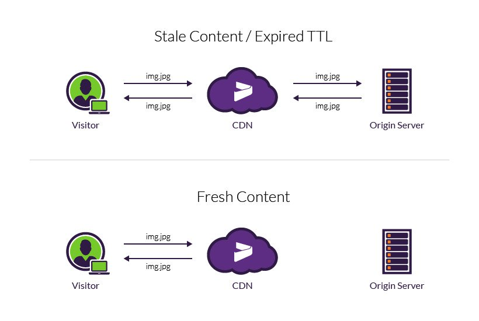

## 🙄 CDN이란

CDN은 Contents Delivery Network의 약자로 웹페이지, 사진, 데이터를 사용자에게 전달하는 것을 의미한다. 그렇다면 기존 서버가 있는데 왜 CDN이 필요할까?

### CDN의 필요성

 클라이언트가 특정 페이지나 API를 요청하면 서버는 받은 요청에 알맞은 응답을 보내주는 것이 기본적인 네트워크 흐름이다. 결국은 하나의 요청당 하나의 응답을 받게 되는데, 만약 서비스가 엄청나게 커졌다고 가정하면, 전세계 수천만명이 동시에 요청을 하는 경우에 서버는 수천만개의 요청에 따라 응답을 해줘야하는 상황이 된다. 이렇게 될 경우 서버의 입장과 클라이언트 입장에 따라 각각의 문제가 존재하게 된다.

 먼저 클라이언트 입장에서 **물리적 거리**에 따른 응답속도가 느리게 된다. 요즘 네트워크가 얼마나 빠른데 물리적 거리가 중요하냐고 할 수도 있지만, 당장 외국 사이트에 접속시에 느리게 화면이 뜨고, 사진이 뜨지 않는 문제를 볼 수 있다. 네트워크 송수신 과정을 거칠 때 우리나라와 같이 네트워크 속도가 빠르다면 문제가 없지만, 우리가 접속하는 모든 사이트 지역이 빠르게 처리할 수 있는 것이 아니기 때문에, 응답속도의 문제가 생길 수 있다. 말하자면 항상 부산에 있는 본점에서 서울로 배달을 시킬 때 생길 수 있는 배달 문제와 같다.

 두번째로 서버의 입장에서 보면 정말 많은 요청을 받아서 처리한다고 했을 때, 당연 서버 자체의 부담이 늘어나게 된다. 하나의 요리사가 요리하는 것보다 여러 요리사를 고용해 한꺼번에 많은 주문을 처리할 수 있게 하는 것이 훨씬 효율적이고 혼자서 모든 주문을 다 처리하던 기존 요리사의 부담을 줄여줄 수 있다. 기존 서버를 본점, CDN을 체인점으로 생각해, 본점의 요리사 수를 적게 (대역폭을 적게) 유지할 수 있어 비용을 줄일 수 있는 장점을 가진다.

이러한 두가지 측면의 고민을 한번에 해결할 수 있는 방법이 **CDN**이다. 클라이언트 입장에서는 실제 위치한 서버까지 요청을 전달하지 않고, 현재 위치한 지역의 CDN을 이용해 빠르게 필요한 컨텐츠를 받아올 수 있고, 서버 입장에서는 지역마다 서버를 둠으로써 컨텐츠 요청에 대한 응답을 하지 않아도 되니까 부담이 줄게 된다. 이렇게 지역마다 둔 서버를 **Edge**라고 부르는데, 모든 서버의 기능을 다 처리하는 것이 아니라 웹페이지, 이미지, 동영상과 같은 컨텐츠에 대해 캐싱하고 있다. 

[Cloudflare의 CDN 사진]

그렇다면 클라이언트는 분명 **같은 도메인 주소로 요청을 보내게 될텐데**, 어떤 것은 직접 서버에 요청이 가야하고, 어떤 것은 CDN에서 처리할 수 있을텐데 이러한 요청에 대한 분리는 어떻게 처리되어져 있는걸까?

### 다시 나오는 DNS와 발전된 GSLB

클라이언트가 요청을 보내고 요청에 알맞은 응답을 받기 위해서는 해당 서버의 IP주소를 가져와야한다. 우리가 알고있는 도메인 주소를 IP주소로 매핑해주는 것을 DNS (Domain Namve System)가 담당해주는 것을 [저번 글](https://choi2021.github.io/web/google.com-%EC%9E%85%EB%A0%A5%ED%95%98%EA%B8%B0/)을 작성하며 알 수 있었다. 여기서 CDN이 추가되면서 단순히 도메인의 서버의 IP주소를 찾는게 아니라 해당 요청이 캐싱되어 있는 콘텐츠일 경우나 지역별로 가까운 CDN에 요청할 수 있게 연결하는 일이  필요하게 되었다. 

 DNS를 기반으로 이런 복잡한 일을 해주는 것이 바로 **GSLB** **(Global Server Load Banlancing)** 이다. GSLB는 요청하는 사용자의 위치에 따라 `알맞은 서버`를 찾아서 연결해주는데, 이때 알맞은 서버는 GSLB의 Load Balancing이란 단어가 담겨있듯, 현재 위치와 가까운 거리의 서버만을 고려하는 것이 아니라 해당 서버에 현재 사용자가 몰릴 경우 등의 서버의 상태를 고려해서 적절한 서버로 연결해준다.

 이렇게 서버 상태까지 고려하기 때문에 DDoS와 같은 공격으로 갑자기 많은 요청이 몰려와 해당 서버를 사용할 수 없게 되는 경우에, CDN으로 연결해두었다면 그 지역의 CDN만 공격당하고, 이후 같은 지역의 요청은 다른 서버로 자동으로 요청하게 연결해줘서 서비스 자체의 장애 대응에도 강점을 가질 수 있다. 

그러면 이러한 CDN에 저장할 데이터는 어떤 시점에 가져와야 할까? 또 얼마나 보관해야 할까?

### 캐싱과 TTL

 데이터를 얼마나 오래 존재하도록 할지에 대한 용어는 TTL (Time To Live)로 서버에 캐싱할 데이터의 유효시간을 정하는 것으로 마치 React-query에서 cache-Time을 정하고, 시간이 지나면 새롭게 요청을 보내서 데이터를 가져오는 것과 같다. 이러한 TTL설정은 브라우저에서 할 경우에는 HTTP헤더의 `Cache-Control`부분을 통해 지정해줄 수 있고, CDN을 이용한다면 해당 업체에서 알맞은 TTL을 자동화해주거나 각각 캐싱된 데이터에 알맞게 설정이 가능하다.

### 마치며

간단하게 CDN이 어떤 문제를 해결하기 위한 기술인지, 어떻게 CDN이 동작할 수 있는지 간단하게 정리해봤다. 정리하면서 Edge 컴퓨팅에 대해서 웹개발에서 많은 관심을 가지고, CDN 서버에서 페이지를 만들 수 있게 하려는 노력이 발전되고 있는 것을 새롭게 알 수 있었다. 그래서 조금씩 Edge 컴퓨팅에 대해서도 공부하면서 해당 내용을 추가적으로 작성해 글을 업데이트하면 좋을 것 같다.

[참고 자료]

- Cloudfare의 CDN 소개: https://www.cloudflare.com/ko-kr/learning/cdn/what-is-a-cdn/
- 웹서비스의 필수! CDN이 뭔가요? (얄팍한 코딩사전):  https://www.youtube.com/watch?v=_kcoeK0ITkQ

- Time To Live (TTL) (imperva): https://www.imperva.com/learn/performance/time-to-live-ttl/
