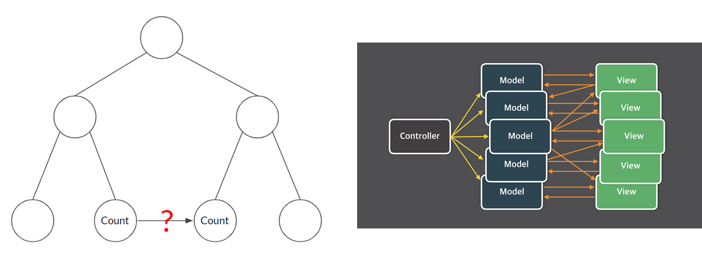

면접에서 디자인 패턴에 대해서 설명해 보라는 질문에 당황한 기억이 있다. 이후 디자인 패턴에 대해서 알아야겠다고 생각했고, 리액트 이전 글에서 MVC와 Flux패턴에 대해서 정리를 했지만, 아직 명확하지 않은 부분이 있었다. 그리고 기존에 개인 프로젝트와 다른 거대한 사이즈의 회사 프로젝트를 다루면서 Repository 패턴에 대해 새롭게 알게 되면서 이러한 아키텍처들에 대해 관심이 생기게 되었다. 아직 깊이 있게 이해하지 못하지만 각각에 대해서 작성하며 정리해보려 한다.

## 🙄 아키텍처 패턴? 디자인 패턴?

아키텍처 패턴과 디자인 패턴, 두 가지 용어 모두 패턴 (pattern)이란 단어가 들어있는 것을 통해, 반복되는 것을 정해둔 규칙 또는 방법을 떠올릴 수 있다. 두 가지에 대해서 모호함이 있는 것 같아 각각 용어에 대한 차이에 대해 먼저 알아보자.

먼저 **아키텍처 패턴**이란 프로그램을 설계할 때 시스템의 구조를 어떻게 가져갈 지에 대한 청사진, 모범 예시로 설명할 수 있다. 각 시스템 별로 어떤 역할을 할 지를 정하고 시스템 간의 관계, 환경, 규칙 등이 포함되어 있다. **디자인 패턴**은 아키텍처 패턴보다는 좁은 개념으로 특정 유형의 문제를 해결하는 방법을 의미한다. 둘을 정리해보면 `아키텍처 패턴은 프로그램의 요약본, 청사진을 작성하는 것`이라고 한다면 `디자인 패턴은 아이디어를 어떻게 실행할 지 구체적인 방안`을 작성하는 것으로 볼 수 있다. 그렇기 때문에 디자인 패턴으로는 하나의 아키텍처에 여러 개의 디자인 패턴이 적용될 수 있고, 두 가지 프로젝트가 다른 디자인 패턴을 가지고 있지만 같은 아키텍처 패턴을 가질 수 있다.

이러한 차이점에 대해서 알아보면서 내가 디자인 패턴으로 알고 있었던 MVC, MVP, MVVM 패턴은 엄격하게 말하면 디자인 패턴이 아니라 아키텍처 패턴에 해당되었고 디자인 패턴에는 Gang of Four로 불리는 패턴들이 존재한다는 것을 새롭게 알게 되었다.

### 🔎 MVC 패턴

MVC 패턴은 아키택처 패턴 중 하나로 시스템을 Model-View-Controller 세가지 역할로 구분한 개발 방법론을 의미한다. Model과 View의 결합도를 낮춤으로써 유지보수의 장점을 가지게 된다.


#### Model

데이터와 데이터와 관련된 로직으로 웹에서 API로부터 받는 데이터, 서버에 있는 데이터 등을 포함할 수 있다. Model은 다른 컴포넌트들에 대해 알지 못하고 자기 자신의 일만 알고 있다.

#### View

프로그램의 UI 부분으로 웹에서 HTML, CSS 통해 만들어지는 화면을 의미한다. 모델이 처리한 데이터를 보여주기만 할 뿐 다른 컴포넌트에 대해서는 알지 못한다.

#### Controller

Model에게 데이터를 어떻게 처리할 지 알려 주거나, Model이 변경되면 결과를 다시 화면에 반영할 수 있게 View에 전달하는 Bridge 역할을 한다. 웹에서 데이터를 받아서 View에 나타내고, 화면의 이벤트가 발생하면 발생된 이벤트에 따라 Model을 변경하게 연결해주는 역할을 한다.

프론트엔드가 발전하기 전의 MVC에서 각각에 대해 정의하면 데이터베이스를 **Model**, HTML, CSS, javascript로 만든 화면을 **View**, 라우터에 따라 데이터를 처리하고 페이지를 만들어주는 것을 **Controller**로 정의했다.

이렇게 잘 나뉘어 있어서 백엔드에서 유용했던 MVC패턴은 웹이 발전함에 따라 문제점이 발생하게 된다.

### 😎 프론트엔드에서 MVC의 문제점과 MVVM 패턴의 등장

웹이 발전하면서 서버에서 HTML을 만들지 않게 되고, 이에 따라 MVC의 세가지 컴포넌트에 대한 적용이 달라지게 된다.

서버에서 받아오는 데이터를 **Model**로 정의하고, 서버의 데이터에 따라 화면을 어떻게 바꿀지 View에서 발생한 이벤트에 따라 어떻게 데이터를 처리할 지를 **Controller**로 정의한다. 역할이 달라짐에 따라 View에 따라 Model을 바꿔야 하고 (이벤트), Model이 달라질 때 다시 View에 반영하기 위해 DOM을 업데이트 해야 하는 (서버의 데이터가 변경), View와 Model이 양방향 데이터 처리가 필요해지게 된다.



기존의 MVC 패턴을 사용해서 Model과 View의 양방향 데이터 바인딩의 문제를 해결하기 위해서는 Controller의 부담이 커지고 복잡해져 유지 보수가 어려워지게 된다.

이러한 View와 Model의 양방향 데이터 처리를 해결하기 위해서 기존 서버에서 페이지를 만들 때처럼 `ejs`나 `pug`와 같이 필요한 부분에 데이터를 **템플릿에 선언적으로** 넣고 데이터가 바뀌면 바로 DOM에 반영할 수 없을까라는 고민이 시작된다. 이러한 고민들을 해결하기 위해 Angular, Vue, React와 같은 프레임워크, 라이브러리들이 나오게 된다.

[React가 사용하는 단방향 데이터 바인딩, Angular가 사용하는 양방향 데이터 바인딩]


이러한 라이브러리와 프레임워크를 통해서 DOM을 직접 조작할 필요 없이 데이터의 변화를 감지해 DOM에 반영해주게 되고, View가 주축이 되어서 화면마다 필요한 **ViewModel**을 가져오는 MVVM 패턴이 나오게 된다. ViewModel은 기존의 Controller와 달리 **View에 대해서 알지 못하고**, **View에 필요한 데이터만** 다루기 때문에 ViewModel로 불리게 된다.

[MVVM 아키텍처]


```typescript
// Model
class Contact {
  name: string
  email: string
  phone: string
}

// ViewModel
class ContactListViewModel {
  contacts: Contact[]

  constructor() {
    this.contacts = []
  }

  addContact(contact: Contact) {
    this.contacts.push(contact)
  }

  removeContact(index: number) {
    this.contacts.splice(index, 1)
  }

  editContact(index: number, contact: Contact) {
    this.contacts[index] = contact
  }
}

// View
class ContactListView {
  viewModel: ContactListViewModel
  contactListElement: HTMLElement

  constructor(viewModel: ContactListViewModel) {
    this.viewModel = viewModel
    this.contactListElement = document.getElementById("contact-list")
  }

  render() {
    // clear existing contacts
    this.contactListElement.innerHTML = ""

    // render each contact
    this.viewModel.contacts.forEach((contact, index) => {
      const contactElement = document.createElement("div")
      contactElement.innerHTML = `
        <div>Name: ${contact.name}</div>
        <div>Email: ${contact.email}</div>
        <div>Phone: ${contact.phone}</div>
        <button class="delete-btn" data-index="${index}">Delete</button>
        <button class="edit-btn" data-index="${index}">Edit</button>
      `

      const deleteButton = contactElement.querySelector(".delete-btn")
      deleteButton.addEventListener("click", () => {
        this.viewModel.removeContact(index)
        this.render()
      })

      const editButton = contactElement.querySelector(".edit-btn")
      editButton.addEventListener("click", () => {
        // show edit form
      })

      this.contactListElement.appendChild(contactElement)
    })
  }

  showEditForm(index: number) {
    // render edit form
  }
}
```

위는 ChatGPT를 통해 작성한 간단한 MVVM 패턴을 이용해 만든 간단한 연락처 앱 코드 예제로 각각에 대해 살펴보자.

##### Model

Model의 데이터는 ViewModel과 View를 모르게 분리가 된 상태로 name, email, phone에 대한 정보를 가지고 있다.

##### ViewModel

ViewModel은 Model에 대해 알고 있지만 Controller와 달리 View에 대해서 알지 못한다. 어플에 필요한 addContact, removeContact와 같은 메소드를 가지고 있다.

##### View

ViewModel을 통해서 데이터를 전달 받아 DOM에 반영한다. event를 통해 변경된 데이터를 ViewModel의 메소드를 통해 Model로 전달하고, 변경된 결과를 다시 DOM에 반영한다.

### 😎 단방향 데이터 바인딩과 Flux 패턴

이렇게 복잡해져 가면서 기존 MVC 패턴에서 벗어나려는 움직임이 생기게 된다. 기존의 페이지 단위에서 컴포넌트 단위로 개발하려는 **Component 패턴**이 생기면서 컴포넌트 간의 데이터를 주고 받기에 어려운 **Props Driling** 문제가 생기게 된다. 각각의 컴포넌트가 다루는 데이터가 파편화 되면서 같은 레벨이지만 다른 부모 컴포넌트를 가질 경우 같은 데이터를 공유하기 어려운 문제가 생기게 된다.

[ Props drilling 문제와 페이스북의 MVC 패턴 ]

이러한 문제를 해결하기 위해 페이스북이 제시한 방법은 단방향 아키텍처인 **Flux 패턴**으로 Action, Dispatcher, Store, View로 구성된다.

#### Action

Action은 상태 변경 요청을 담은 객체로 Action의 이름(type)과 데이터(payload)를 담고 있다. Action creator함수로 같은 이름을 가지는 Action들을 편하게 추가할 수 있게 사용한다.

#### Dispatcher

Dispatcher는 View로 부터 발생한 Action을 담아서 Store에 전달하는 역할로 Dispatcher 내부에는 상태 변경 로직을 가지고 있지 않다.

#### Store

Store는 전역 저장소로 Dispatcher에서 전달된 Action에 따라 상태를 변경하고 변경된 상태를 View에 반영한다. 여러 개의 Store가 존재할 수 있다.

**View**

View는 MVVM의 ViewModel과 같이 store로부터 변경된 데이터를 전달받아 새롭게 DOM을 렌더링하고 이벤트를 통해 Action을 발생시킨다.

[Flux 패턴]

.png>)

이러한 Flux 패턴을 통해서 로직을 담당하는 부분과 View를 분리하면서 하나의 큰 View를 위한 **상태관리**라는 개념이 생기게 되고 Redux와 같은 라이브러리가 나와 현재도 많은 기업에서 사용되고 있다.

### 📃 Service 패턴

Service 패턴은 이름은 몰랐지만 주로 사용했던 디자인 패턴 중 하나로 비즈니스 로직을 위한 독립적인 Layer를 만드는 패턴이다. UI와 Data Access 계층 사이에 정의해 둠으로써 해당 서비스와 관련된 비즈니스 로직을 여러 컴포넌트에서 재사용될 수 있게 하고 한 곳에 같은 수준의 로직을 모아둠으로써 유지 보수성을 향상 시킨다.

```typescript
import { User } from "./Authtypes"
import { Jobs, Job } from "./Jobtype"

export interface DBService {
  addOrUpdateJob: (job: Job, user?: User) => Promise<void>
  getJobs: (user?: User) => Promise<Jobs>
  removeJob: (job: Job, user?: User) => Promise<void>
}

export class DBServiceImpl implements DBService {
  db: Database
  constructor(private app: FirebaseApp) {
    this.db = getDatabase(this.app)
  }

  async getJobs(user?: User): Promise<Jobs> {
    const dbRef = ref(this.db)
    const query = user ? `users/${user?.id}/` : ""
    return get(child(dbRef, `${query}jobs`))
      .then(snapshot => {
        if (snapshot.exists()) {
          return snapshot.val()
        } else {
          return {}
        }
      })
      .catch(error => {
        console.error(error)
      })
  }

  async addOrUpdateJob(job: Job, user?: User) {
    const query = user ? `users/${user?.id}/` : ""
    return set(ref(this.db, `${query}jobs/${job.id}`), job)
  }

  async removeJob(job: Job, user?: User) {
    const query = user ? `users/${user?.id}/` : ""
    return remove(ref(this.db, `${query}jobs/${job.id}`))
  }
}
```

위 코드는 모으잡 프로젝트을 하면서 내가 작성한 DBService 코드로 firebase를 이용해 데이터를 저장하고 수정하고 삭제하는 일을 위해 Service 층을 만들었다. 한곳에 데이터 조회, 삭제, 수정에 대한 모든 메소드를 한 곳에 정의해둠으로써 유지보수의 장점과, 코드 중복을 막을 수 있는 장점이 있다.

코드를 보면 구체적으로 Firebase에 접근하는 코드가 강하게 결합되어 있기 때문에, Mocking이나 Test의 어려움이 있다. 이러한 문제를 해결하기 위한 방법이 다음 패턴인 **Repository 패턴**을 이용할 수 있다.

### 🎈 Repository 패턴

Repository 패턴은 데이터베이스나 API와 어플리케이션 사이에 Layer를 두는 패턴으로 Data Access Layer를 추상화함으로써 구체적으로 어떤 저장소인지, 어떤 API를 사용하는 지를 몰라도 정상 동작할 수 있게 한다. Repository 패턴의 장점은 Interface를 만족한다면 Mocking 데이터를 만들어서 적용할 수 있고 테스트를 하는데 장점을 가진다.


```typescript
export interface JobRepository {
  getAllJobs: (user?: User) => Promise<Jobs>
  saveJob: (job: Job, user?: User) => Promise<void>
  deleteJob: (job: Job, user?: User) => Promise<void>
}

export class JobRepositoryImpl implements JobRepository {
  db: Database
  constructor(private app: FirebaseApp) {
    this.db = getDatabase(this.app)
  }

  async getAllJobs(user?: User): Promise<Jobs> {
    const dbRef = ref(this.db)
    const query = user ? `users/${user?.id}/` : ""
    return get(child(dbRef, `${query}jobs`))
      .then(snapshot => {
        if (snapshot.exists()) {
          return snapshot.val()
        } else {
          return {}
        }
      })
      .catch(error => {
        console.error(error)
      })
  }

  async saveJob(job: Job, user?: User) {
    const query = user ? `users/${user?.id}/` : ""
    return set(ref(this.db, `${query}jobs/${job.id}`), job)
  }

  async deleteJob(job: Job, user?: User) {
    const query = user ? `users/${user?.id}/` : ""
    return remove(ref(this.db, `${query}jobs/${job.id}`))
  }
}

//DBService

export interface DBService {
  addOrUpdateJob: (job: Job, user?: User) => Promise<void>
  getJobs: (user?: User) => Promise<Jobs>
  removeJob: (job: Job, user?: User) => Promise<void>
}

export class DBServiceImpl implements DBService {
  constructor(private repository: JobRepository) {}
  async getJobs(user?: User): Promise<Jobs> {
    return await repository.getAllJobs(user)
  }

  async addOrUpdateJob(job: Job, user?: User) {
    await repository.saveJob(job, user)
  }

  async removeJob(job: Job, user?: User) {
    await repository.deleteJob(job, user)
  }
}
```

Service 패턴의 코드에 Repository 패턴을 적용한 코드로 DBService는 더 이상 Firebase 데이터 저장소에 대해 알지 못하게 된다. 이렇게 나눈 덕분에 Firebase 저장소뿐 아니라 다른 저장소를 이용해서 데이터를 전달이 가능하게 되었다.

### 마치며

회사 생활을 하면서 큰 프로젝트의 코드 베이스들에 대해서 공부해 가면서 새롭게 알게된 내용이 참 많다. 그중 가장 많이 느꼈던 아키텍처 부분에 대해 정리하고 싶어 한번 정리해보았다. 공부하면서 아키텍처의 중요성과 어떤 문제를 해결하기 위해 만들어 진 것인지 이해할 수 있었고, 기존 내 코드에 새로운 패턴을 적용해보는 경험이 너무 즐거웠다.

[참조]

- [김주엽님의 SW 아키텍처와 디자인 패턴의 차이](https://juyeop.tistory.com/28)
- [엔디엘님의 아키텍처 패턴과 디자인 패턴의 차이점](https://dongmindevloper.tistory.com/46)
- [Architectural Pattern vs Design Pattern](https://www.linkedin.com/pulse/architectural-pattern-vs-design-praveen-kumar-kushwaha/)
- [테오님의 프론트엔드에서 MV\* 아키텍쳐란 무엇인가요? ](https://velog.io/@teo/%ED%94%84%EB%A1%A0%ED%8A%B8%EC%97%94%EB%93%9C%EC%97%90%EC%84%9C-MV-%EC%95%84%ED%82%A4%ED%85%8D%EC%B3%90%EB%9E%80-%EB%AC%B4%EC%97%87%EC%9D%B8%EA%B0%80%EC%9A%94)
- [Tecoble의 웹 MVC 각 컴포넌트 역할](https://tecoble.techcourse.co.kr/post/2021-04-26-mvc/)
- [yunyezl님의 MVVM-패턴-이해해보기](https://velog.io/@yunyezl/MVVM-%ED%8C%A8%ED%84%B4-%EC%9D%B4%ED%95%B4%ED%95%B4%EB%B3%B4%EA%B8%B0#%EC%A0%95%EB%A6%AC)
