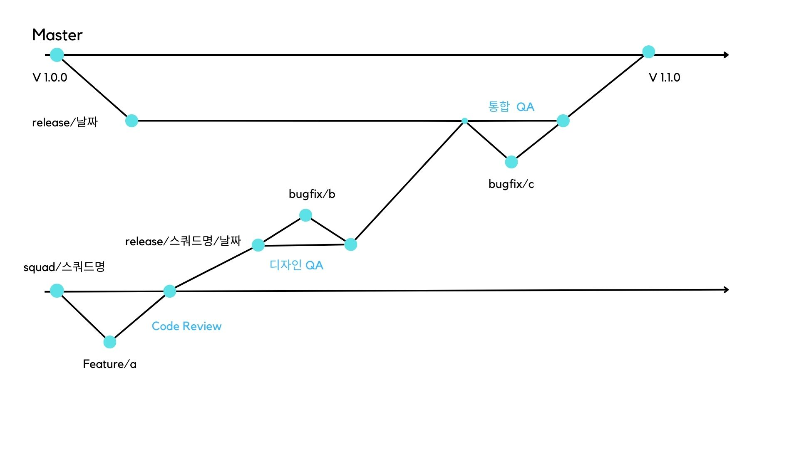
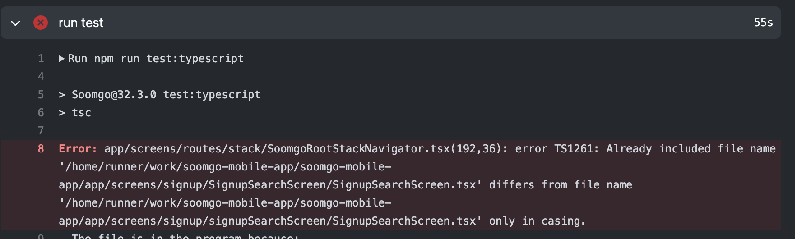

회사에 입사하고 일한 지 한 달이 되었다. 입사일 기준으로 하면 한 달을 넘었지만 3월에 운 좋게 포상휴가를 받아서, 이참에 지금까지 일하면서 배울 수 있었던 부분들을 정리하면 좋겠다고 생각되었다. 회사의 코드에 적응하고, 스쿼드로 함께 일하는 법을 배우고, 챕터의 코드 리뷰를 주고 받으면서 하루 하루 배워나가는 게 너무 많았다. 취업을 준비하면서 단순히 공부할 때는 보지 못했던 것과 중요하다 듣기만 했던 부분들에 대해 정리해보고 다음 한 달은 좀 더 개발자다울 수 있기를 바라며 회고를 써보려 한다.

### 😂 Git, 너 좋은 녀석이었구나

혼자서 개인 프로젝트만 하다가 회사에 들어가 누군가와 함께 협업한다는 것은 생각보다 큰 두려움으로 다가왔다. 내가 작성한 코드나 내가 잘못해서 누군가의 작업을 망치지는 않을까라는 막연한 두려움이 있었다. 온보딩 기간 동안 여러 도움을 받고, 스쿼드 업무를 하면서 모바일 챕터의 브랜치 전략에 대해 이해하고 어떻게 작업하면 될지 조금씩 감을 잡아가고 있다.

#### 우리는 변형된 Git flow 전략

숨고 모바일 챕터에서 사용하는 협업 전략은 변형된 `Git flow`전략으로 기존의 git flow전략을 우리팀의 배포 전략에 맞게 변형해서 사용하고 있다. 이에 대한 내용은 우리팀 테크 리더인 Jimmy가 작성해주신 글을 참고해 정리해 보고자 한다.

기존 **Git flow**전략의 경우 Production에 해당하는 `Main 또는 Master 브랜치`, 개발을 위한 `Develop 브랜치` 두 가지로 크게 나뉘는 전략이다. 두 가지 주요 브랜치에 하위 브랜치로 Develop 브랜치에서 여러 개발자가 함께 일하기 위해 각자가 맡은 기능 개발을 위한 `feature 브랜치`, Production에 내보내기 전 QA나 Test를 위한 `release 브랜치`, 배포한 후에 급한 버그를 수정하기 위한 `hotfix 브랜치` 하위 브랜치들이 있다.

[기존 Git Flow 전략]


우리 모바일 팀은 스쿼드 별로 작업한 내용을 반영할 수 있게 하기 위해서 기존 Git flow 전략에서 develop 브랜치를 스쿼드 별 develop 브랜치로 `squad/스쿼드` 브랜치를 추가해 사용하고 있다. 각 스쿼드 별로 develop 브랜치를 구분함으로써 특정 스쿼드의 작업의 배포를 연기해야 하는 경우 해당 squad의 배포 내용만을 제외할 수 있는 장점을 갖게 되었다.

이러한 배포 전략에 대해서는 어느정도 이해했지만 한주간 돌아가는 배포 사이클 전체에 대해서 이해하는 데에는 좀 더 오래걸렸다. 그이유는 과정마다 `테스트`가 중간 중간에 함께 들어있기 때문이었다. 숨고의 배포 사이클에는 내가 만든 feature에 대해서 테스트 빌드 버전을 통해 PO분과 디자이너 분께서 봐주시는 `스쿼드 내부 디자인 QA`, 배포에 나가기 위한 release 버전을 다양한 테스트 기기를 통해서 QA분께서 봐주시는 `통합 QA`과정이 있다. 이러한 QA를 통해 발견된 버그나 에러 등은 다시 해당 스텝의 브랜치에서 `bugfix`브랜치를 만들어 작업을 하게 된다.

앞서 설명한 변형된 Git flow 전략과 QA과정을 함께 정리해 다음과 같이 배포 사이클을 나타낼 수 있다. Jimmy가 작성해주신 글의 그림을 참고해서 좀 더 간단하게 만들어 보았다. 그림에 설명을 스텝별로 덧붙여보면 다음과 같다.

1. 스쿼드 별 브랜치에 feature 브랜치을 만들어 작업하고 스쿼드 브랜치로 병합한다. 이때 챕터 내의 **코드리뷰**를 거친다.
2. 스쿼드 브랜치에서 목표 배포 날짜에 맞는 `release/스쿼드명/날짜 브랜치`를 만든다.
3. 만들어진 브랜치를 App center를 이용해 앱을 빌드하는데 이때 버전을 `Test 빌드`버전이라고 부르고 배포 일자의 전 주 수요일까지 이과정을 완료해야 배포에 포함될 수 있다.
4. 해당 앱 버전을 다운받아 PO와 디자이너 분들께서 디자인 QA를 진행한다. QA과정에서 수정할 부분이 발생하면 `release/스쿼드명/날짜 브랜치`에서 bugfix 브랜치를 만들어 다시 작업하고 병합한다.
5. 디자인 QA를 거치고 통합 QA를 위해 `release/날짜 브랜치`로 `release/스쿼드명/날짜 브랜치`를 병합한다.
6. `release/날짜`브랜치로 병합된 버전의 앱을 빌드하고, 이때 버전을 `Staging 빌드`버전이라 부른다. 배포 일자의 전 주 금요일까지 이 과정을 완료한다.
7. 병합 후에는 배포 주 월요일 화요일에는 통합 QA를 진행하는데 QA과정에서 수정할 부분이 발생하면 `release/날짜 브랜치`에서 bugfix 브랜치를 만들어 다시 작업한다.
8. 이과정이 완료되면 배포일자에 작업한 내용이 배포된다.

[모바일 팀의 배포 사이클을 정리한 그림 ]



부족한 그림과 설명이지만 내가 한달동안 이해한 배포 사이클을 정리해보았다. 여기에 비정기배포나 hotfix가 나가야하는 경우는 아직 겪어보지 않아 따로 정리하지 않았다.

#### Git에서는 폴더명을 함부로 바꾸면 안돼...

고수 회원가입 부분을 작업하는 과정에서 폴더명의 대소문자를 변경했다. 처음에는 아무 생각 없이 작업했지만 이부분 때문에 Git이 기존에 추적하고 있던 파일들의 경로명이 달라져 에러가 나기 시작했다. 이럴 때 해결방법으로 몇 가지를 찾아보았는데 가장 좋은 방법은 **git 명령어**를 이용해서 폴더명을 변경하는 것이다.

```bash
git mv oldName newName
```

명령어를 이용하지 않고 그냥 폴더명만 변경해버리면 버전이 없는 파일로 기존 파일이 변경되면서 충돌이 발생했다. 단순히 대소문자가 변경되었기 때문에 git뿐 아니라 tsc에서도 에러가 발생하는 것을 볼 수 있었다.

아무것도 몰랐던 나는 이미 엎질러지고 해결법을 찾아야했는데 그 방법으로는 먼저 시도했던 방법은 git의 설정을 변경하는 것이었다. git 자체는 대소문자를 구분하지 않기 때문에 git config의 설정에 구분할 수 있게 추가해줘야 했다.

```bash
git config core.ignorecase false
```

커밋을 정상적으로 했지만 여전히 에러가 발생했기 때문에 **git의 캐싱된 파일들에서 기존 파일을 삭제하는 방법**을 추가적으로 진행했다.

```bash
git rm -r --cached filename
```

덕분에 git자체는 병합에러 없이 정상적으로 처리가 되었지만 이번에는 tsc에서 에러가 발생하기 시작했다.

[당시 발생했던 tsc 에러]


tsc 에러가 더 어려웠던 것은 나와 유사한 에러를 경험한 사람을 찾을 수가 없었기 때문이었다. 그나마 찾아낸 방법은 tsconfig.json에 옵션을 추가하는 방법이었는데 이렇게 해도 해결이 되지 않았다.

```json
{
  "forceConsistentCasingInFileNames": false
}
```

막막했지만 기존 파일의 경로로 tsc가 돌아가서 생기는 에러인 것 같아 코드내용이 동일한 임시파일을 만들어 경로를 돌려서 커밋했더니 다행히 tsc가 정상작동했다.

이후에 Jessie가 감사하게 알려준 방법은 마지막에 시도했던 방법처럼 임시파일로 점진적으로 바꾼 후에 다시 변경하는 방법으로 하면 옵션을 추가하거나 하지 않아도 되었다. 다음에 이런 일이 일어났을 때 기억하고 좀 더 빨리 해결할 수 있기를...

이외에도 여러 작업을 동시에 하기 위해서 현재 작업하던 내용을 저장하기 위해서 `stash`를 자주 사용하는 등의 혼자 작업할 때보다 훨씬 다양한 명령어와 상황에서 작업하고 있다. 앞으로 익숙해져서 두려워하고 어려워하기 보다는 정말 좋은 도구로써 사용할 수 있게 노력할 필요를 느꼈던 한달이었다.

### 😎 코드 리뷰와 지속적 통합

팀으로 일하면서 아마 가장 많이 배울 수 있었던 포인트들은 대부분 **코드 리뷰**를 통해서 얻을 수 있었다. 간단한 건 기존 컨벤션에 대해서 알려주시는 부분이나 컴포넌트의 default로 설정되어있어 전달하지 않아도 되는 props에 대해서 알려주시는 부분부터 어려운 부분은 어떤 게 더 좋은 방식일지 내가 고민하고 있는 방식의 trade-off에 대해 같이 고민해주셨다.

#### 코드 컨벤션

이번에 배울 수 있었던 우리팀의 컨벤션에 대해 몇가지 정리해보면 다음과 같다.

##### 이벤트 핸들러 함수 네이밍

```javascript
// 컨벤션 적용 전

const handleArrowPress = () => {
  navigation.navigate(ScreenKeyEnum.Store, { location: "pro_main" })
}

// 컨벤션 적용 후

const handlePressArrow = () => {
  navigation.navigate(ScreenKeyEnum.Store, { location: "pro_main" })
}
```

이벤트 핸들러 함수를 네이밍 할 때 **handle+동사+타겟** 로 컨벤션으로 작성한다.

##### 클래스 컴포넌트 내의 Render함수 방식 지양하기

```tsx
...
 renderSignupWithSearch(): ReactElement {
        return (
            <>
              ...
            </>
        );
    }
```

코드중에 레거시로써 클래스 컴포넌트로 작성되어 있는 부분들이 있다. 클래스 컴포넌트는 `render()`메소드를 이용해서 렌더링할 부분을 작성하는데, 내부에서만 사용할 것 같아 `renderSignupWithSearch`라는 메소드로 만들었지만 이러한 방식을 **render 함수**방식으로 우리팀 내의 안티 패턴으로 지정했다. 컴포넌트로 분리해서 사용하는 것이 컨벤션이다.

#### 고민했던 Screen간의 상태변화

이번 달에 혼자 스쿼드 업무를 담당하면서 가장 어려웠던 부분은 `스크린간의 상태변화`였다. A 스크린의 상태를 B 스크린에서 변화시키기 위해 set함수를 전달해야 했는데 우리가 사용하고 있는 `React Navigation`은 함수를 param으로 전달하는 것을 지양한다. 그 이유는 스크린 간에 param이 전달될 때 **Serialize**되기 때문인데 이로인해 참조관계가 깨져버릴 수 있어 이벤트를 이용하기를 추천한다. 이부분에 대해서는 챕터 위클리 미팅에서도 논의된 부분으로 고민했던 부분에 대해 공유했다. 논의에서 이야기 되었던 대안으로 **Global Event bus**와 **전역상태**에 대해 이야기했다.

[React Navigation 공식 문서]


**Global event bus**를 이용하면 param으로 전달하려 해 변경하려 했던 로직을 event로 등록하고 필요한 스크린에서 사용하는 event를 발생시킴으로써 스크린 간 상태 변경에 사용할 수 있었다. Global event bus의 단점으로는 `언제 event listener를 삭제해야하는 지에 대한 시점 문제`가 제기 되었고, 기존의 함수로 전달되던 모든 방식을 다 이벤트 버스로 바꾸는 것은 너무 많은 이벤트가 등록될 것 같다는 의견이 제시 되었다.

**전역상태**방식은 내가 제시한 방식으로 스크린 간의 상태를 변경이 필요하다면 사용하는 게 맞지 않을까라는 고민이 되었다고 이야기 했다. 여기에 대해서 내가 합류하기 이전의 논의에서 고민했던 이야기들을 들을 수 있었는데, 모바일 특성상 같은 스크린이 stack으로 쌓이게 될 경우의 영향을 전역상태 변경으로 영향을 받는 화면이 많아지고, redux의 많은 보일러플레이트 문제도 있었다고 말씀해주셨다.

- 결론은, 상태와 관련이 없는 경우에는 함수를 param으로 전달하는 방식을 유지하고, 상태 변경이 필요할 시에는 global event bus를 이용하는 것으로 이야기가 되었다.

이렇게 더 좋은 방향을 고민하고 얻는 장점과 잃을 수 있는 단점에 대해 같이 고민하고 의논할 수 있는 팀이라는 점이 너무 좋았던 부분이었다.

#### 내가 놓쳤던 리뷰 반영과 호되게 배운 CI

내가 만든 가장 큰 사고(?) 였던 부분에 대해 이야기 해보려 한다. 기간이 긴 큰 작업을 혼자 맡게 된 것에 대한 부담 때문이었을까 기존의 작업한 부분을 수정하기 보다 기능 개발에만 너무 몰두해 7개의 PR들이 받은 리뷰를 수정하지 않은 채 병합되지 못하고 브랜치에 남아만 있게 되었다.

이것의 큰 문제점은 앞서 정리한 배포 사이클에서 master는 매주 변경되고 변경된 내용들은 squad 브랜치로 당겨오게 된다. 이때 이전에 작업한 브랜치들은 변경 전 스쿼드 브랜치를 바라보고 있기 때문에 conflict이 날 수 밖에 없다. 연쇄적으로 이어지는 PR이었기 때문에 변경사항 또한 계속해서 이어졌고 기존에 예상하지 못한 conflict을 해결하는 작업으로 인해 기한 내에 병합하지 못하게 되었다. 결국 스쿼드 일정이 나로 인해 밀리게 되버렸고 내가 한 작업이 나가지 못하게 되었다.

**왜 CI(Continuous Integration)가 중요한 지** 배울 수 있었고, 리뷰를 받고 다시 응답하는 과정이 얼마나 중요한 것인지 배울 수 있었다.

#### let 지양과 즉시실행 함수 활용하기

마지막으로 기억에 남는 부분은 let을 지양하고 즉시 실행 함수를 활용하는 부분이었다. 여러가지 조건에 맞게 다른 값을 반환해줘야할 때 단순히 let을 이용해 선언한 변수에 조건에 맞는 값을 대입해 마지막에 return하려 했다.

```tsx
const BASE_POSTION = 16
function getBottomPosition(
  location: Location,
  buttonHeight: number,
  keyboardHeight: number
) {
  let position = BASE_POSTION
  if (location === ScreenKeyEnum.SignUpSearchService && keyboardHeight > 0) {
    position = keyboardHeight
  }
  if (location === ScreenKeyEnum.SignupGosu) {
    position = buttonHeight
  }
  return position
}
```

let을 지양하고 내가 필요한 부분이 단 한번만 조건에 맞게 값을 받으면 되는 것이기 때문에 `즉시실행함수`를 사용할 수 있다. 리뷰를 통해 개선한 코드는 다음과 같다.

```tsx
const bottomPosition = (() => {
  const BASE_POSTION = 16
  if (location === ScreenKeyEnum.SignUpSearchService && keyboardHeight > 0) {
    return keyboardHeight
  }
  if (location === ScreenKeyEnum.SignupGosu) {
    return buttonHeight
  }
  return BASE_POSTION
})()

return <View style={{ bottom: bottomPosition }}> ... </View>
```

즉시 실행함수를 사용함으로써 함수 내에서만 사용한 변수들이 선언되어 불필요한 전역변수를 줄일 수 있고, 실제 사용할 때도 함수로 사용하는 것이 아니라 값으로 사용할 수 있었다. IIFE는 클로저와 함께 사용될 수 있는 부분으로 함수형 프로그래밍에 대해 더 공부하면서 적용하면 좋을 것 같다고 생각되었다.

### 😉 마치며

이번 한달 동안 많은 내용을 배울 수 있었다. 아직 소화하지 못해서 적지 못한 내용 중에는 **명령형과 선언형으로 코드를 작성하는 방법의 차이**, class component에서 **set함수에 콜백함수를 전달하는 것을 대체하는 방법**이 있다. 이부분들에 대해서 4월 한달 동안 또 고민하면서 더 나은 코드를 작성하고, 내가 하는 리뷰가 우리 팀에 또 도움이 될 수 있게 역량을 키워나가야겠다.

[참고]

- [Jimmy Lee 블로그](https://medium.com/@jimmy_58380/%EB%AA%A8%EB%B0%94%EC%9D%BC-%EC%95%B1-%EB%A7%A4%EC%A3%BC-%EB%B0%B0%ED%8F%AC%ED%95%98%EA%B8%B0-%EA%B7%9C%EC%B9%99-%EC%A0%95%ED%95%98%EA%B8%B0-2fd03c65484)
